<div align="center">
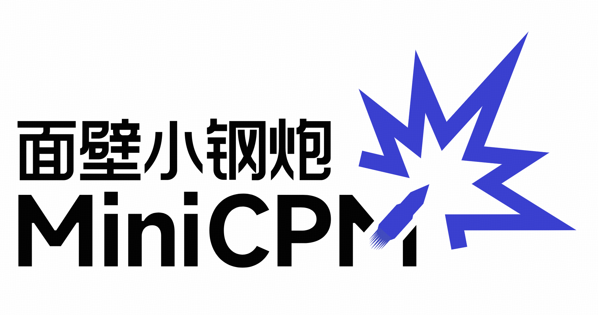</img> 
</div>

<h4 align="center">
    <p>
        <b>中文</b> | <a href="https://github.com/OpenBMB/MiniCPM/blob/minicpm5/README.md">English</a>
    <p>
</h4>


<p align="center">
<a href="https://arxiv.org/pdf/2506.07900" target="_blank">MiniCPM 论文</a> |
<a href="https://modelbest.feishu.cn/wiki/D2tFw8Pcsi5CIzkaHNacLK64npg" target="_blank">MiniCPM 知识库</a> |
<a href="https://github.com/OpenBMB/MiniCPM-V/" target="_blank">MiniCPM-V 仓库</a> |
加入我们的 <a href="https://discord.gg/3cGQn9b3YM" target="_blank">discord</a> 和 <a href="https://github.com/OpenBMB/MiniCPM/blob/main/assets/wechat.jpg" target="_blank">微信群</a> |
<a href="https://mp.weixin.qq.com/s/KIhH2nCURBXuFXAtYRpuXg?poc_token=HBIsUWijxino8oJ5s6HcjcfXFRi0Xj2LJlxPYD9c">加入我们</a>
</p>

> [!NOTE]
> ### 🐱 MiniCPM5-1B 桌宠 · 视频 Demo
>
> **即将上线：** 视频演示 MiniCPM5-1B 本地驱动的桌宠交互。
>
> <!-- TODO: 视频 / GIF / YouTube / Bilibili 链接就绪后替换此处占位 -->
>
> 👉 **项目仓库：** [OpenBMB/MiniCPM-Desk-Pet](https://github.com/OpenBMB/MiniCPM-Desk-Pet)

## Highlights

我们正式开启 **MiniCPM5** 系列 —— 面壁智能新一代端侧模型家族。首发版本 **MiniCPM5-1B** 是一款紧凑稠密的 1B Transformer，面向端侧与资源受限场景，并配套 RL + OPD 后训练、单页 cookbook 与面向 coding agent 的部署 / 微调 Skill。

🏆 **公开评测**：在推理 / 知识 / 代码 / 指令跟随 / 数学 / 逻辑 / Agentic 评测中，MiniCPM5-1B 平均分 42.57；优势主要体现在 Agentic 工具调用、代码和竞赛数学。

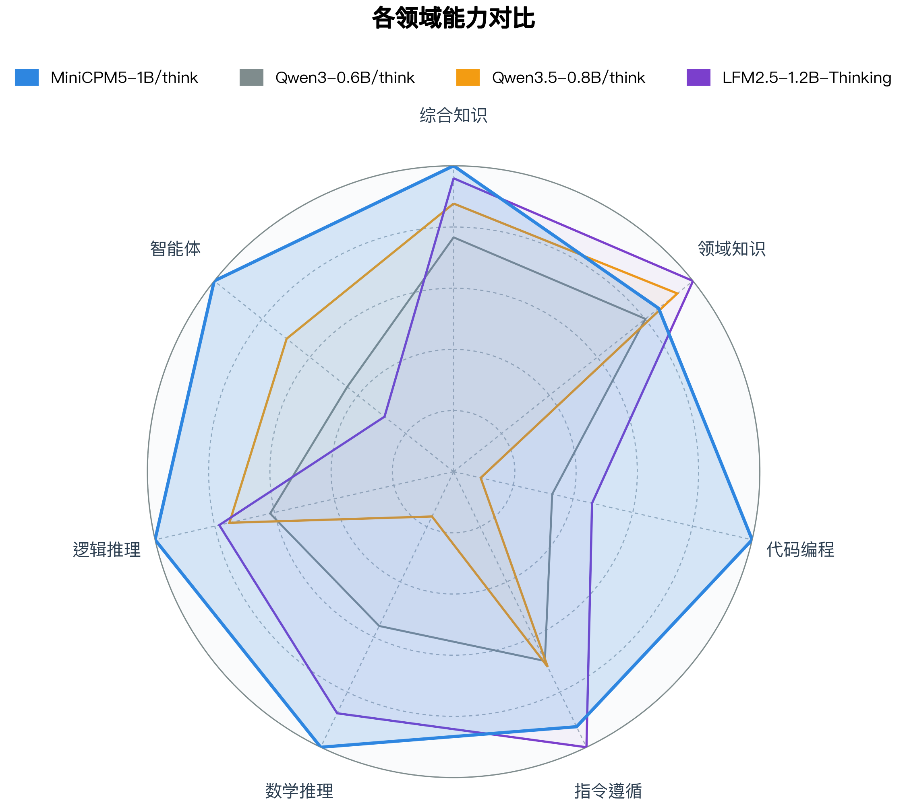

🧩 **标准架构**：标准 `LlamaForCausalLM`，使用 **GQA (16 Q / 2 KV)** 与 **SwiGLU**。所有主流推理引擎开箱即用，无需自定义算子。

📚 **原生 128K 上下文**：`max_position_embeddings = 131,072`、`rope_theta = 5e6`，无需 RoPE scaling。

🧠 **双模式推理**：内置 `<think>` chat template，通过 `enable_thinking` 切换思考 / 非思考模式，同一份权重既能做快速助手，也能做深度推理。

🛠️ **部署 / 微调 Agent Skills**：仓库里每条推理 / 微调路径都配有一份单页 cookbook，并提供一一对应的 [Agent Skill](./skills/)，方便 LLM 编码 agent 按目标后端或框架选择执行路线。

🐱 **MiniCPM5 应用**：提供现成应用示例，包括以 MiniCPM5-1B 作为本地大脑的桌宠。详见 [MiniCPM5 应用](#minicpm5-应用)。

## 更新日志🔥
- 📌 [2026.05.19] **[MiniCPM5-1B](https://huggingface.co/openbmb/MiniCPM5-1B)** 发布：面向端侧与资源受限场景的 1B 稠密模型，并配套部署 / 微调 [Agent Skills](./skills/)。
- [2026.02.11] **[MiniCPM-SALA](https://huggingface.co/openbmb/MiniCPM-SALA)** 发布：稀疏与线性混合注意力模型，支持百万词元上下文和高效推理。
- [2025.09.05] **[MiniCPM4.1](https://huggingface.co/collections/openbmb/minicpm-4-6841ab29d180257e940baa9b)** 发布：基于原生稀疏注意力架构（InfLLM-V2），支持混合思考。
- [2025.06.06] [MiniCPM4](https://huggingface.co/collections/openbmb/minicpm-4-6841ab29d180257e940baa9b) 发布：面向端侧场景，在典型端侧芯片上提供 5 倍以上生成加速。

<details>
<summary>更早的发布（2024 + InfLLM-V2 论文）</summary>

- [2025.09.29] **发布 [InfLLM-V2 详细技术论文](https://arxiv.org/abs/2509.24663)!** 仅需 5B 长文本词元，即可完成稀疏注意力能力的训练。
- [2024.09.05] 发布 [MiniCPM3-4B](https://huggingface.co/openbmb/MiniCPM3-4B)！该模型的表现超越 Phi-3.5-mini-instruct 和 GPT-3.5-Turbo-0125，并且能够比肩 Llama3.1-8B-Instruct、Qwen2-7B-Instruct、GLM-4-9B-Chat 等多个 7B-9B 参数量的模型。
- [2024.07.05] 发布 [MiniCPM-S-1B](https://huggingface.co/openbmb/MiniCPM-S-1B-sft)！该模型在保持下游任务性能无损的前提下，FFN 层实现了 87.89% 的平均稀疏度，将 FFN FLOPs 降低了 84%。
- [2024.04.11] 发布 [MiniCPM-2B-128k](https://huggingface.co/openbmb/MiniCPM-2B-128k)、[MiniCPM-MoE-8x2B](https://huggingface.co/openbmb/MiniCPM-MoE-8x2B) 和 [MiniCPM-1B](https://huggingface.co/openbmb/MiniCPM-1B-sft-bf16)！点击[这里](https://openbmb.vercel.app/?category=Chinese+Blog)查看技术博客。
- [2024.02.01] 发布 [MiniCPM-2B](https://huggingface.co/openbmb/MiniCPM-2B-sft-bf16)！该模型在公开评测集上与 Mistral-7B 表现相近（中文、数学、代码能力更优），整体性能超越 Llama2-13B、MPT-30B、Falcon-40B 等模型。

</details>

## 目录

- [亮点](#亮点)
- [更新日志🔥](#更新日志)
- [模型下载](#模型下载)
- [MiniCPM5-1B](#minicpm5-1b)
  - [简介](#简介)
  - [评测结果](#评测结果)
  - [训练流程](#训练流程)
    - [RL + OPD 后训练提升](#rl--opd-后训练提升)
  - [一行命令快速上手](#一行命令快速上手)
  - [Agent Skills: 部署与微调入口](#agent-skills-部署与微调入口)
  - [部署与微调 Cookbook](#部署与微调-cookbook)
  - [MiniCPM5 应用](#minicpm5-应用)
    - [桌宠](#桌宠)
- [MiniCPM-SALA](#minicpm-sala)
- [MiniCPM4 和 MiniCPM4.1 系列](#minicpm4-和-minicpm41-系列)
- [历史专题 →](./docs/README-legacy-cn.md)：BitCPM4 量化、MiniCPM4 应用
- [开源协议](#开源协议) · [开发机构](#开发机构) · [工作引用](#工作引用)


## 模型下载

**当前主推版本：MiniCPM5-1B**（BF16 / GGUF / MLX / AWQ / GPTQ）：

| HuggingFace | ModelScope |
|---|---|
| [MiniCPM5-1B](https://huggingface.co/openbmb/MiniCPM5-1B) | [MiniCPM5-1B](https://www.modelscope.cn/models/OpenBMB/MiniCPM5-1B) |
| [MiniCPM5-1B-GGUF](https://huggingface.co/openbmb/MiniCPM5-1B-GGUF) | [MiniCPM5-1B-GGUF](https://www.modelscope.cn/models/OpenBMB/MiniCPM5-1B-GGUF) |
| [MiniCPM5-1B-MLX](https://huggingface.co/openbmb/MiniCPM5-1B-MLX) | [MiniCPM5-1B-MLX](https://www.modelscope.cn/models/OpenBMB/MiniCPM5-1B-MLX) |
| [MiniCPM5-1B-AWQ](https://huggingface.co/openbmb/MiniCPM5-1B-AWQ) | [MiniCPM5-1B-AWQ](https://www.modelscope.cn/models/OpenBMB/MiniCPM5-1B-AWQ) |
| [MiniCPM5-1B-GPTQ](https://huggingface.co/openbmb/MiniCPM5-1B-GPTQ) | [MiniCPM5-1B-GPTQ](https://www.modelscope.cn/models/OpenBMB/MiniCPM5-1B-GPTQ) |

**其他重点版本：**

| HuggingFace | ModelScope |
|---|---|
| [MiniCPM-SALA](https://huggingface.co/openbmb/MiniCPM-SALA) | [MiniCPM-SALA](https://www.modelscope.cn/models/OpenBMB/MiniCPM-SALA) |
| [MiniCPM4.1-8B](https://huggingface.co/openbmb/MiniCPM4.1-8B) | [MiniCPM4.1-8B](https://www.modelscope.cn/models/OpenBMB/MiniCPM4.1-8B) |
| [MiniCPM4-0.5B](https://huggingface.co/openbmb/MiniCPM4-0.5B) | [MiniCPM4-0.5B](https://www.modelscope.cn/models/OpenBMB/MiniCPM4-0.5B) |

<details>
<summary>📋 点击查看早期 MiniCPM 版本：4、BitCPM、应用模型、MiniCPM3 / 2B / 1B</summary>

**早期主力型号：**

| HuggingFace | ModelScope |
|---|---|
| [MiniCPM4-8B](https://huggingface.co/openbmb/MiniCPM4-8B) | [MiniCPM4-8B](https://www.modelscope.cn/models/OpenBMB/MiniCPM4-8B) |

**MiniCPM4.1 量化与投机变体：**

| HuggingFace | ModelScope |
|---|---|
| [MiniCPM4.1-8B-GPTQ](https://huggingface.co/openbmb/MiniCPM4.1-8B-GPTQ) | [MiniCPM4.1-8B-GPTQ](https://www.modelscope.cn/openbmb/MiniCPM4.1-8B-GPTQ) |
| [MiniCPM4.1-8B-AutoAWQ](https://huggingface.co/openbmb/MiniCPM4.1-8B-AutoAWQ) | [MiniCPM4.1-8B-AutoAWQ](https://www.modelscope.cn/openbmb/MiniCPM4.1-8B-AutoAWQ) |
| [MiniCPM-4.1-8B-Marlin](https://huggingface.co/openbmb/MiniCPM-4.1-8B-Marlin) | [MiniCPM-4.1-8B-Marlin](https://www.modelscope.cn/openbmb/MiniCPM-4.1-8B-Marlin) |
| [MiniCPM4.1-8B-GGUF](https://huggingface.co/openbmb/MiniCPM4.1-8B-GGUF) | [MiniCPM4.1-8B-GGUF](https://www.modelscope.cn/openbmb/MiniCPM4.1-8B-GGUF) |
| [MiniCPM4.1-8B-MLX](https://huggingface.co/openbmb/MiniCPM4.1-8B-MLX) | [MiniCPM4.1-8B-MLX](https://www.modelscope.cn/openbmb/MiniCPM4.1-8B-MLX) |
| [MiniCPM4.1-8B-Eagle3](https://huggingface.co/openbmb/MiniCPM4.1-8B-Eagle3) | [MiniCPM4.1-8B-Eagle3](https://www.modelscope.cn/openbmb/MiniCPM4.1-8B-Eagle3) |

**BitCPM4 三值量化 + MiniCPM4 应用：**

| HuggingFace | ModelScope |
|---|---|
| [BitCPM4-1B](https://huggingface.co/openbmb/BitCPM4-1B) | [BitCPM4-1B](https://www.modelscope.cn/models/OpenBMB/BitCPM4-1B) |
| [BitCPM4-0.5B](https://huggingface.co/openbmb/BitCPM4-0.5B) | [BitCPM4-0.5B](https://www.modelscope.cn/models/OpenBMB/BitCPM4-0.5B) |
| [MiniCPM4-Survey](https://huggingface.co/openbmb/MiniCPM4-Survey) | [MiniCPM4-Survey](https://www.modelscope.cn/models/OpenBMB/MiniCPM4-Survey) |
| [MiniCPM4-MCP](https://huggingface.co/openbmb/MiniCPM4-MCP) | [MiniCPM4-MCP](https://www.modelscope.cn/models/OpenBMB/MiniCPM4-MCP) |

**MiniCPM4 Eagle 投机解码、QAT 以及 2025 年之前的发布：**

| HuggingFace | ModelScope |
|---|---|
| [MiniCPM4-8B-Eagle-FRSpec](https://huggingface.co/openbmb/MiniCPM4-8B-Eagle-FRSpec) | [MiniCPM4-8B-Eagle-FRSpec](https://www.modelscope.cn/models/OpenBMB/MiniCPM4-8B-Eagle-FRSpec) |
| [MiniCPM4-8B-Eagle-FRSpec-QAT](https://huggingface.co/openbmb/MiniCPM4-8B-Eagle-FRSpec-QAT) | [MiniCPM4-8B-Eagle-FRSpec-QAT](https://www.modelscope.cn/models/OpenBMB/MiniCPM4-8B-Eagle-FRSpec-QAT) |
| [MiniCPM4-8B-Eagle-vLLM](https://huggingface.co/openbmb/MiniCPM4-8B-Eagle-vLLM) | [MiniCPM4-8B-Eagle-vLLM](https://www.modelscope.cn/models/OpenBMB/MiniCPM4-8B-Eagle-vLLM) |
| [MiniCPM4-8B-marlin-Eagle-vLLM](https://huggingface.co/openbmb/MiniCPM4-8B-marlin-Eagle-vLLM) | [MiniCPM4-8B-marlin-Eagle-vLLM](https://www.modelscope.cn/models/OpenBMB/MiniCPM4-8B-marlin-Eagle-vLLM) |
| [MiniCPM4-0.5B-QAT-Int4-unquantized](https://huggingface.co/openbmb/MiniCPM4-0.5B-QAT-Int4-unquantized) | [MiniCPM4-0.5B-QAT-Int4-unquantized](https://modelscope.cn/models/OpenBMB/MiniCPM4-0.5B-QAT-Int4-unquantized) |
| [MiniCPM4-0.5B-QAT-Int4-GPTQ-format](https://huggingface.co/openbmb/MiniCPM4-0.5B-QAT-Int4-GPTQ-format) | [MiniCPM4-0.5B-QAT-Int4-GPTQ-format](https://modelscope.cn/models/OpenBMB/MiniCPM4-0.5B-QAT-Int4-GPTQ-format) |
| [MiniCPM3-4B](https://huggingface.co/openbmb/MiniCPM3-4B) | [MiniCPM3-4B](https://www.modelscope.cn/models/OpenBMB/MiniCPM3-4B) |
| [MiniCPM-2B-sft](https://huggingface.co/openbmb/MiniCPM-2B-sft-bf16) | [MiniCPM-2B-sft](https://modelscope.cn/models/OpenBMB/miniCPM-bf16) |
| [MiniCPM-2B-dpo](https://huggingface.co/openbmb/MiniCPM-2B-dpo-bf16) | [MiniCPM-2B-dpo](https://modelscope.cn/models/OpenBMB/MiniCPM-2B-dpo-bf16/summary) |
| [MiniCPM-2B-128k](https://huggingface.co/openbmb/MiniCPM-2B-128k) | [MiniCPM-2B-128k](https://modelscope.cn/models/openbmb/MiniCPM-2B-128k/summary) |
| [MiniCPM-MoE-8x2B](https://huggingface.co/openbmb/MiniCPM-MoE-8x2B) | [MiniCPM-MoE-8x2B](https://modelscope.cn/models/OpenBMB/MiniCPM-MoE-8x2B) |
| [MiniCPM-1B](https://huggingface.co/openbmb/MiniCPM-1B-sft-bf16) | [MiniCPM-1B](https://modelscope.cn/models/OpenBMB/MiniCPM-1B-sft-bf16) |
| [MiniCPM-S-1B](https://huggingface.co/openbmb/MiniCPM-S-1B-sft) | [MiniCPM-S-1B](https://modelscope.cn/models/OpenBMB/MiniCPM-S-1B-sft) |

</details>

## MiniCPM5-1B

### 简介

MiniCPM5-1B 是一款 decoder-only Transformer，训练目标是提升 1B 参数量下的输出质量。它沿用标准 `LlamaForCausalLM` 架构（24 层、GQA 8:1、原生 128K 上下文、~1.0B 总参数），可以在主流推理引擎（Transformers、vLLM、SGLang、llama.cpp、MLX、Ollama、LM Studio…）上直接使用，无需自定义算子。

完整架构细节与按组件参数拆解见 [`docs/deployment/transformers.md`](./docs/deployment/transformers.md)。

### 评测结果

我们将 MiniCPM5-1B 与同尺寸 SOTA 开源模型 **LFM2.5-1.2B-Thinking**、**Qwen3-0.6B/think**、**Qwen3.5-0.8B/think** 在公开评测上做了对比。MiniCPM5-1B 平均分为 **42.57**，比对照模型中的最高平均分 **35.61** 高约 7 分。分数提升主要来自三类能力：Agentic 工具调用上 τ²-Bench Telecom-AA 达到 **79.53**；代码任务上 LCB-Pro **22.68**、LCB-v6 **33.52**、OJBench **7.33**；竞赛数学上 AIME-2025 / 2026 约 **40**，MATH-500 为 **91.6**。这些结果对应到端侧助手场景，主要价值在工具调用、代码生成和高难推理。

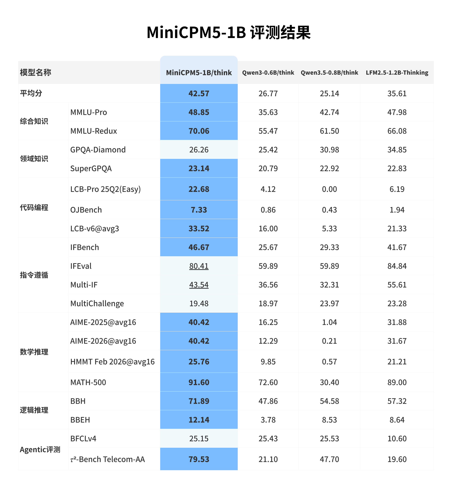

### 训练流程

MiniCPM5-1B 的训练过程是 **UltraData 分级治理体系**的一次完整实践，覆盖分阶段预训练与后训练两个部分。

**预训练阶段**采用逐级推进的训练配方：首先进行两阶段 stable training，各使用 **1T tokens**；随后进入 **200B tokens decay training**，再通过 **200B tokens mid-training** 强化目标能力与数据分布适配。预训练所用的语料来自我们同步开源的 [Ultra-FineWeb-L3](https://huggingface.co/datasets/openbmb/Ultra-FineWeb-L3)。

**后训练阶段**继续使用 **200B tokens deep-thinking SFT** 与 **200B tokens hybrid-thinking SFT** 打磨推理与通用对话能力，SFT 数据来自同步开源的 [UltraData-SFT-2605](https://huggingface.co/datasets/openbmb/UltraData-SFT-2605)。在此基础上，我们引入领域强化学习（Reinforcement Learning, RL）与 **On-Policy Distillation (OPD)**，将多个专用 RL teacher 的能力统一到最终发布模型中，实现能力增强与版本融合。

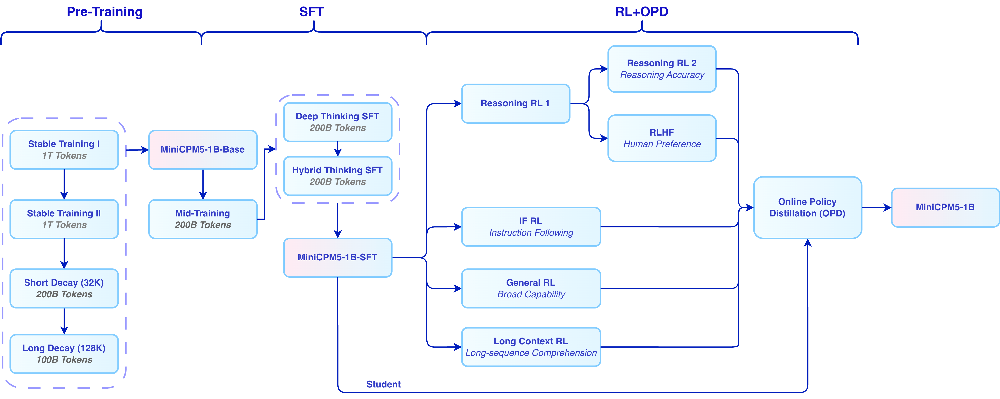

#### RL + OPD 后训练提升

**RL + OPD** 带来了显著提升。在数学、代码、指令跟随三类工作负载上，RL + OPD 将平均分提升 **↑16 分**，同时将回复触顶 max-tokens 预算的比例降低 **↓29 个百分点**。这说明后训练同时改善了任务得分和回复长度控制，使深度推理更适合在 1B 端侧模型上使用；下方图示展示 Reasoning RL 两阶段流程、分数提升和超长率下降。

RL 阶段组合了多类互补训练信号。Reasoning RL 使用 [DAPO-Math-17k](https://huggingface.co/datasets/BytedTsinghua-SIA/DAPO-Math-17k)，回答错误或超长的 rollout 会收到负向奖励。闭卷问答使用 [TriviaQA](https://huggingface.co/datasets/mandarjoshi/trivia_qa) 和 [NQ-Open](https://huggingface.co/datasets/google-research-datasets/nq_open)，并在每条样本前加入系统提示，引导模型在不确定时承认不知道，而不是随机猜测；奖励由 Generative Reward Model 判定，答对为 +1，诚实回答“不知道”为 0，答错为 -1。我们还使用 [LongWriter-Zero-RLData](https://huggingface.co/datasets/THU-KEG/LongWriter-Zero-RLData) 提升写作能力，从通用语料合成可验证数据用于 RLVR 训练，覆盖指令跟随、身份识别和长上下文理解，并基于通用对话查询构造 anchor responses，用 Generative Reward Model 支持 pair-wise RLHF，提升通用对话体验。

OPD 部分参考了 Thinking Machines Lab 的 [On-Policy Distillation](https://thinkingmachines.ai/blog/on-policy-distillation/) 思路，并结合 [Rethinking On-Policy Distillation](https://arxiv.org/pdf/2604.13016) 做了实现改进：我们在强化学习框架中使用反向 KL 散度作为优势估计值，替代原有的 verification-based advantage；同时在 response 序列的每个位置分别对学生模型和教师模型 logits 做双边 top-k 采样，取并集后计算反向 KL 散度，在监督信号准确性和训练效率之间取得平衡。OPD 阶段直接复用各 RL teacher 训练时所用的同分布 prompt 作为蒸馏数据，无需额外构造语料。

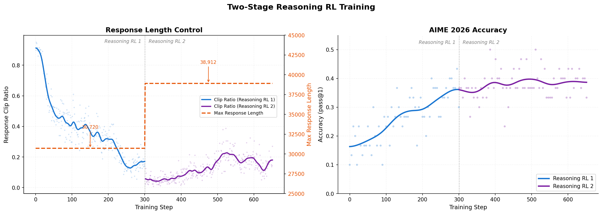

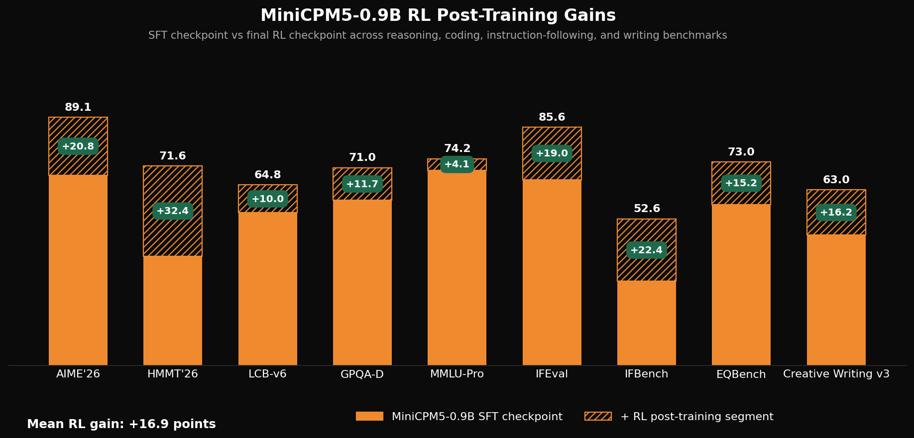

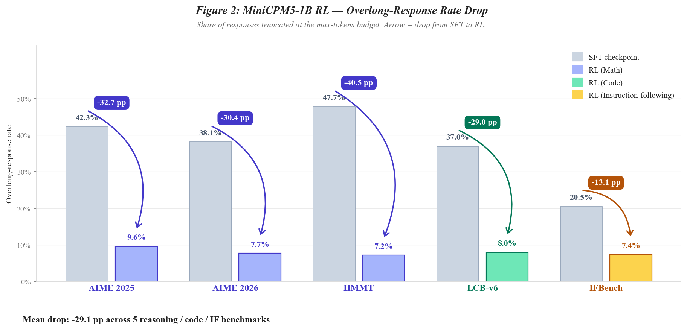

### 一行命令快速上手

对三种最常用的推理路径，一行命令就能把 MiniCPM5-1B 跑起来：

**vLLM**（OpenAI 兼容服务，NVIDIA GPU）：

```bash
pip install "vllm>=0.21" && vllm serve openbmb/MiniCPM5-1B --port 8000
```

**SGLang**（OpenAI 兼容服务，NVIDIA GPU）：

```bash
pip install "sglang[srt]>=0.5.12" && python -m sglang.launch_server --model-path openbmb/MiniCPM5-1B --port 30000
```

**Transformers**（Python，CPU 或 GPU）：

```bash
pip install -U "transformers>=5.6" && python -c "from transformers import pipeline; print(pipeline('text-generation', 'openbmb/MiniCPM5-1B', device_map='auto')('1+1=?', max_new_tokens=64)[0]['generated_text'])"
```

推荐的 chat template 采样参数：

| 模式 | 推荐采样参数 | 启用方式 |
| --- | --- | --- |
| **Think** | `temperature=0.9, top_p=0.95` | `enable_thinking=True` |
| **No Think** | `temperature=0.7, top_p=0.95` | `enable_thinking=False` |

其余后端（AWQ / GPTQ / llama.cpp / Ollama / LM Studio / MLX）见下方 cookbook 表格。

#### 带工具调用（tool calling）

工具调用 / function calling **推荐使用 SGLang**：MiniCPM5-1B 以 XML 格式产出工具调用，SGLang 原生内置的 `minicpm5` parser 会自动把它转成 OpenAI 兼容的 `tool_calls` 字段。

```bash
python -m sglang.launch_server --model-path openbmb/MiniCPM5-1B --port 30000 \
    --tool-call-parser minicpm5      # 或：--tool-call-parser auto
```

### Agent Skills: 部署与微调入口

MiniCPM5-1B 使用**标准 `LlamaForCausalLM` 架构**，所有主流引擎开箱即用，**无需自定义算子，也无模型代码 fork**。围绕这个标准架构，我们提供两个顶层 [Cursor Agent Skill](https://docs.cursor.com/agent/skills)：`minicpm5-deploy` 负责把部署需求路由到 **9 个推理后端**，`minicpm5-finetune` 负责把训练需求路由到 **5 个微调框架**。

| 顶层 Skill | 作用 | 路由到 |
| --- | --- | --- |
| **[`minicpm5-deploy`](./skills/minicpm5-deploy/SKILL.md)** | 推理路由 | `transformers` · `vllm` · `sglang` · `awq` · `gptq` · `llama-cpp` · `ollama` · `lmstudio` · `mlx` |
| **[`minicpm5-finetune`](./skills/minicpm5-finetune/SKILL.md)** | 微调路由 | `trl` · `llamafactory` · `ms-swift` · `unsloth` · `xtuner` |

在 Cursor / Claude Code 中可以这样调用：agent 会读取顶层 Skill，根据你的目标后端、硬件和数据路径选择对应的子 Skill 与 cookbook，再执行命令并回报结果。

```
@minicpm5-deploy   用 vLLM 在 8000 端口起 openbmb/MiniCPM5-1B
@minicpm5-finetune 用 unsloth + LoRA 微调 /data/my_chat.jsonl，输出到 ./out
```

### 部署与微调 Cookbook

更想自己手动跑、或想看清每个 Agent Skill 在底下做了什么？每个后端 / 框架都配有一份单页 cookbook，里面有精确的命令和实际输出，并对应一个具体的子 skill。

**部署**（9 个后端）

| 后端 | Cookbook | 对应 Agent Skill |
| --- | --- | --- |
| [Transformers](https://github.com/huggingface/transformers) (GPU + CPU) | [`docs/deployment/transformers.md`](./docs/deployment/transformers.md) | [`minicpm5-deploy-transformers`](./skills/minicpm5-deploy-transformers/SKILL.md) |
| [vLLM](https://github.com/vllm-project/vllm) (OpenAI server) | [`docs/deployment/vllm.md`](./docs/deployment/vllm.md) | [`minicpm5-deploy-vllm`](./skills/minicpm5-deploy-vllm/SKILL.md) |
| [SGLang](https://github.com/sgl-project/sglang) (OpenAI server) | [`docs/deployment/sglang.md`](./docs/deployment/sglang.md) | [`minicpm5-deploy-sglang`](./skills/minicpm5-deploy-sglang/SKILL.md) |
| [AWQ](https://github.com/mit-han-lab/llm-awq)-Marlin Int4 (vLLM) | [`docs/deployment/awq.md`](./docs/deployment/awq.md) | [`minicpm5-deploy-awq`](./skills/minicpm5-deploy-awq/SKILL.md) |
| [GPTQ](https://github.com/AutoGPTQ/AutoGPTQ)-Marlin Int4 (vLLM) | [`docs/deployment/gptq.md`](./docs/deployment/gptq.md) | [`minicpm5-deploy-gptq`](./skills/minicpm5-deploy-gptq/SKILL.md) |
| [llama.cpp](https://github.com/ggml-org/llama.cpp) (GGUF, CPU/GPU) | [`docs/deployment/llama_cpp.md`](./docs/deployment/llama_cpp.md) | [`minicpm5-deploy-llama-cpp`](./skills/minicpm5-deploy-llama-cpp/SKILL.md) |
| [Ollama](https://github.com/ollama/ollama) (GGUF, 端侧) | [`docs/deployment/ollama.md`](./docs/deployment/ollama.md) | [`minicpm5-deploy-ollama`](./skills/minicpm5-deploy-ollama/SKILL.md) |
| [LM Studio](https://lmstudio.ai) (Mac, OpenAI server) | [`docs/deployment/lmstudio.md`](./docs/deployment/lmstudio.md) | [`minicpm5-deploy-lmstudio`](./skills/minicpm5-deploy-lmstudio/SKILL.md) |
| [MLX](https://github.com/ml-explore/mlx-lm) (Apple Silicon) | [`docs/deployment/mlx.md`](./docs/deployment/mlx.md) | [`minicpm5-deploy-mlx`](./skills/minicpm5-deploy-mlx/SKILL.md) |

**微调**（5 个框架）

| 框架 | Cookbook | 对应 Agent Skill |
| --- | --- | --- |
| [TRL](https://github.com/huggingface/trl) + [PEFT](https://github.com/huggingface/peft) | [`docs/finetune/trl.md`](./docs/finetune/trl.md) | [`minicpm5-finetune-trl`](./skills/minicpm5-finetune-trl/SKILL.md) |
| [LLaMA-Factory](https://github.com/hiyouga/LLaMA-Factory) | [`docs/finetune/llamafactory.md`](./docs/finetune/llamafactory.md) | [`minicpm5-finetune-llamafactory`](./skills/minicpm5-finetune-llamafactory/SKILL.md) |
| [ms-swift](https://github.com/modelscope/ms-swift) | [`docs/finetune/ms_swift.md`](./docs/finetune/ms_swift.md) | [`minicpm5-finetune-ms-swift`](./skills/minicpm5-finetune-ms-swift/SKILL.md) |
| [unsloth](https://github.com/unslothai/unsloth) | [`docs/finetune/unsloth.md`](./docs/finetune/unsloth.md) | [`minicpm5-finetune-unsloth`](./skills/minicpm5-finetune-unsloth/SKILL.md) |
| [xtuner](https://github.com/InternLM/xtuner) | [`docs/finetune/xtuner.md`](./docs/finetune/xtuner.md) | [`minicpm5-finetune-xtuner`](./skills/minicpm5-finetune-xtuner/SKILL.md) |

### MiniCPM5 应用

构建在 MiniCPM5-1B 上的参考应用，直观展示 1B 端侧模型在真实场景下能做什么。

#### 桌宠

我们发布了 **[OpenBMB/MiniCPM-Desk-Pet](https://github.com/OpenBMB/MiniCPM-Desk-Pet)**，一个面向最终用户的桌宠应用，**本地**用 MiniCPM5-1B 驱动。瘦版 `llama.cpp` `llama-server` sidecar 加载 GGUF（Apple Silicon → Metal · NVIDIA → CUDA · 通用 → CPU），通过 OpenAI 兼容本地端点喂给 Electron 桌宠 UI；桌宠可以实时响应你的 AI 编码 agent（Cursor / Claude Code / Codex），并支持 LoRA 人格切换。

- **最终用户路径**（不需要装 Python / conda / PyTorch）：从 [Releases](https://github.com/OpenBMB/MiniCPM-Desk-Pet/releases) 下载 `Clawd-on-Desk-*-arm64.dmg`，跟随 5 步 Onboarding（环境检查 → 加速器探测 → GGUF 下载 → sidecar warmup → 就绪）。
- **开发者路径**：`git clone git@github.com:OpenBMB/MiniCPM-Desk-Pet.git && ./go.sh`，详见 [`MiniCPM-Desk-Pet/README.md`](https://github.com/OpenBMB/MiniCPM-Desk-Pet#给开发者)。

> 桌宠 UI 层 **fork 自 [@rullerzhou-afk/clawd-on-desk](https://github.com/rullerzhou-afk/clawd-on-desk)**（AGPL-3.0）。桌宠运行时、动画包、多 agent 集成都是上游的工作；我们在其之上集成了本地 MiniCPM5-1B sidecar、5 步 Onboarding 和 LoRA 人格切换。完整致谢见 [`NOTICE.md`](https://github.com/OpenBMB/MiniCPM-Desk-Pet/blob/main/NOTICE.md)。

## MiniCPM-SALA

> 首个大规模 **稀疏 + 线性注意力混合** 模型，原生支持百万 token 上下文（2026-02）。[HuggingFace](https://huggingface.co/openbmb/MiniCPM-SALA) · [ModelScope](https://www.modelscope.cn/models/OpenBMB/MiniCPM-SALA)

<details>
<summary>点击展开：亮点、评测、推理</summary>

#### 亮点

MiniCPM-SALA（稀疏注意力与线性注意力）是首个高效融合稀疏与线性注意力机制、支持百万令牌上下文建模的大规模混合模型

✅ 混合架构：融合 25% 稀疏注意力（InfLLM-v2）进行长文本建模，搭配 75% 线性注意力（Lightning Attention）提升全局处理效率。

✅ 推理效率：相比密集注意力基线实现 3.5 倍推理加速，并降低 KV 缓存开销。

✅ 百万令牌上下文：依托长上下文感知位置编码技术 HyPE，可扩展至 100 万+ 令牌容量，并保持长文本泛化能力。

✅ HALO 适应机制：采用 HALO 分层优化混合注意力技术，通过蒸馏方案将密集注意力能力迁移至混合架构，缓解纯线性模型常见的性能衰减问题。

#### 简介

MiniCPM-SALA 是一种高效的混合模型，其中 25% 的层采用 [InfLLM-V2](https://arxiv.org/abs/2509.24663)，其余 75% 使用 Lightning Attention。这种架构能在 NVIDIA RTX 5090 等消费级 GPU 上进行一百万令牌（tokens）的推理。

- **SALA 混合注意力机制**
  - 整合了 25% 的 InfLLM-V2 和 75% 的 Lightning Attention，有效地利用了稀疏注意力对局部细节的细粒度聚焦，以及线性注意力对广泛上下文的高效率。

- **Transformer 到混合架构的持续训练**
  - 通过对预训练权重进行架构转换，规避了冷启动训练的低效性，从而将总训练预算降至从头训练同类模型的约 25%。

- **[HyPE](https://arxiv.org/abs/2601.22156) (混合位置编码)**
  - 协调短上下文和长上下文性能，能够保持与 Qwen3-8B 等全注意力模型相近的通用能力（如知识、数学和编程），并在多个长上下文基准测试中取得更高分数。

- **长序列的高效推理**
  - 在 NVIDIA A6000D 上、序列长度为 256K 令牌时，推理速度达到 Qwen3-8B 的 3.5 倍；支持在 NVIDIA A6000D 和 RTX 5090 GPU 上进行高达 1M 令牌的上下文长度推理，而 Qwen3-8B 在此长度下因显存溢出（OOM）而失败。

### 评测结果

#### 效率评测

我们针对 MiniCPM-SALA (9B) 与 Qwen3-8B 在 NVIDIA A6000D 和 RTX 5090 GPU 上的表现进行了推理效率测试。MiniCPM-SALA 在首字响应时间（TTFT）上实现了高达 2.5 倍的加速，并降低了全注意力架构在超长上下文下的显存压力。在测试设置中，Qwen3-8B 在更长上下文上出现显存溢出（OOM），MiniCPM-SALA 可在单块消费级 RTX 5090 显卡上处理一百万词元上下文。

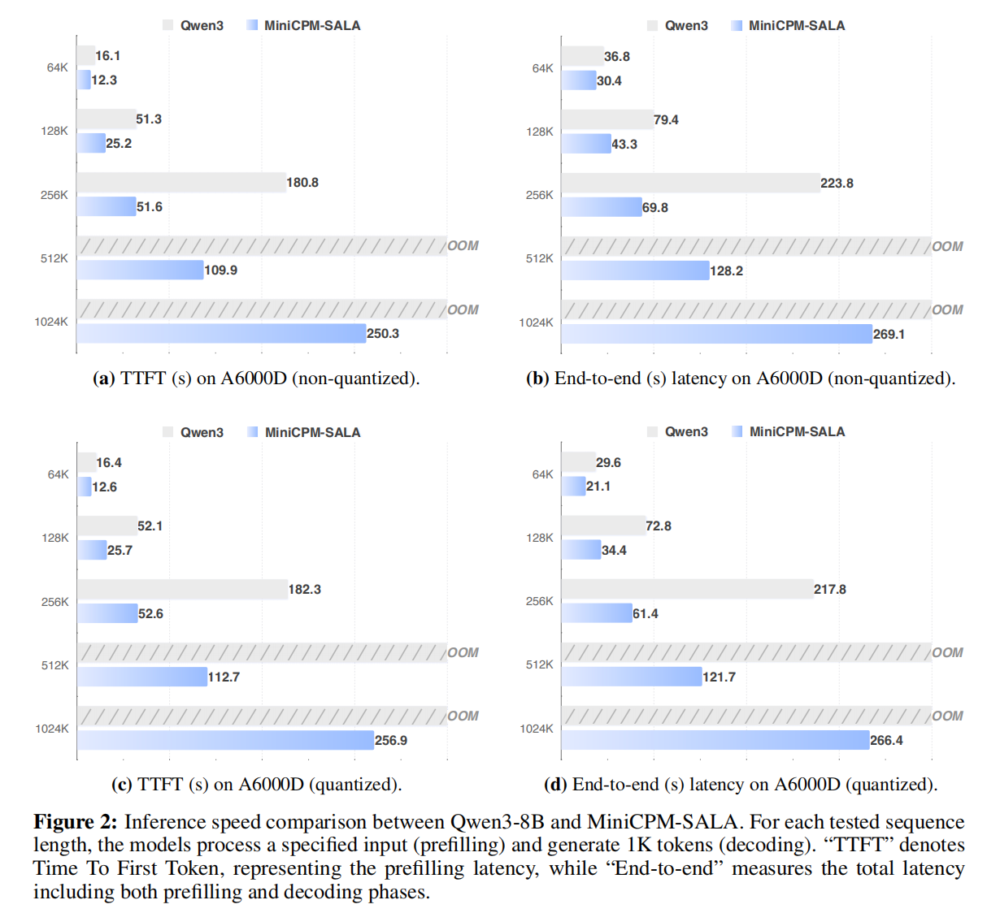

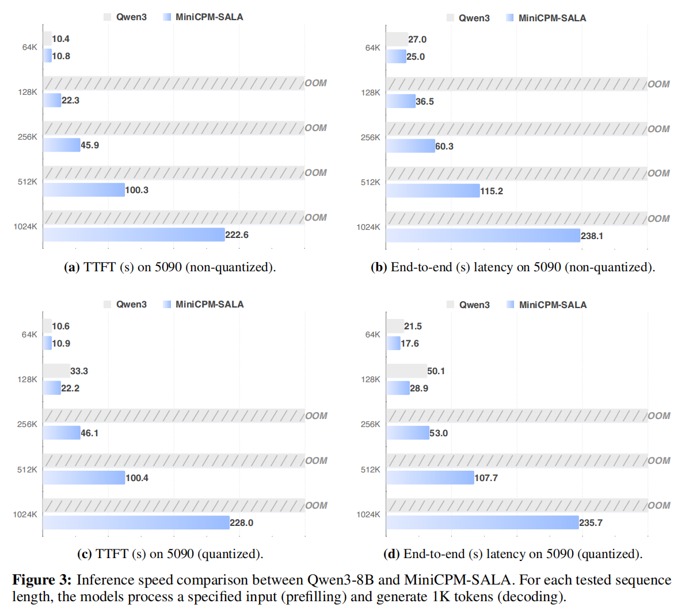

#### 长文本评测

在大多数长上下文基准测试中，MiniCPM-SALA 的表现高于所测试的其他同等规模开源模型。MiniCPM-SALA 在 RULER 和 NoLiMa 测试的所有长度范围（最高 128K）内取得最高分，综合平均分为 38.97。

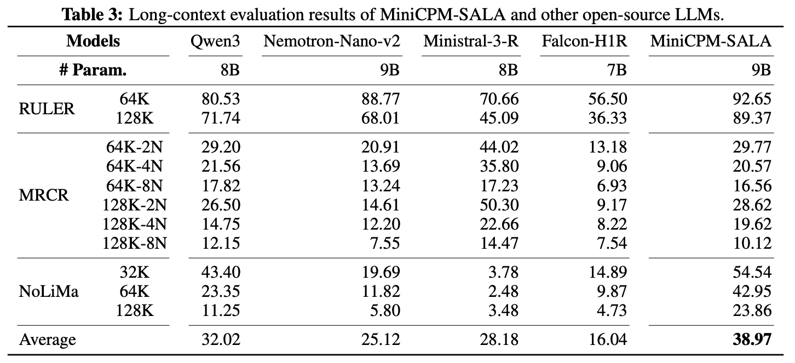

#### 超长文本评测

MiniCPM-SALA 具备长度外推能力。尽管其训练长度最长为 520K 词元，在 2048K 的上下文长度下仍取得 81.6 分。该模型未使用 YaRN 等辅助技术，这可能与其在稀疏注意力层中采用的无位置编码（NoPE）配置有关。

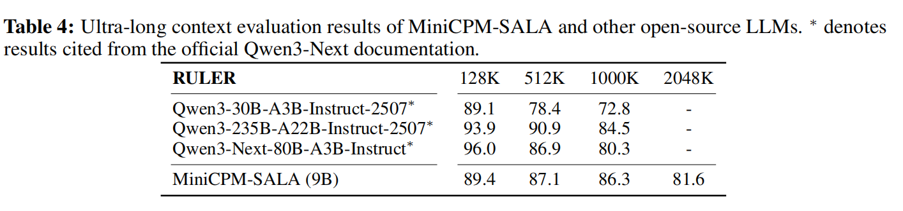

#### 综合评测

MiniCPM-SALA 在多项标准基准测试中的平均得分为 76.53，优于 Qwen3-8B 和 Falcon-H1R-7B 等同类模型。该架构在常识知识、代码生成及数学逻辑等维度均保持了稳健的性能表现。

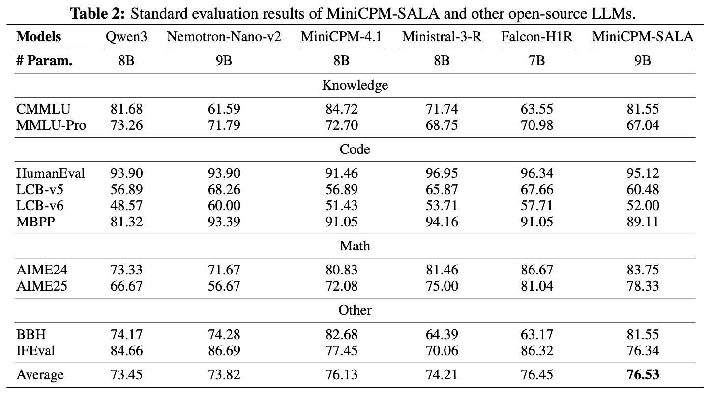

### 推理

推荐推理时使用 `Temperature=0.9`。

#### HuggingFace

我们的模型与 🤗 Hugging Face transformers 完全兼容。你可以通过以下代码进行推理：

```python
import torch
from transformers import AutoModelForCausalLM, AutoTokenizer

model_path = "openbmb/MiniCPM-SALA"
tokenizer = AutoTokenizer.from_pretrained(model_path)
model = AutoModelForCausalLM.from_pretrained(model_path, trust_remote_code=True, device_map="auto")
model.eval()

prompts = ["My name is", "The capital of China is"]
with torch.no_grad():
    inputs = tokenizer(prompts, return_tensors="pt").to(model.device)
    outputs = model.generate(**inputs)
output_texts = tokenizer.batch_decode(outputs)
print(output_texts)
```

#### SGLang

##### 环境要求

- CUDA 12.x 或更高版本
- `gcc` / `g++` 编译器
- `uv` 包管理器（脚本会自动检测）

##### 安装

```bash
# 克隆仓库
git clone -b minicpm_sala https://github.com/OpenBMB/sglang.git
cd sglang

# 一键安装（自动创建虚拟环境并编译所有依赖）
bash install_minicpm_sala.sh

# 或指定 PyPI 镜像源
bash install_minicpm_sala.sh https://mirrors.tuna.tsinghua.edu.cn/pypi/web/simple
```

安装脚本会自动完成以下步骤：

1. 创建 `sglang_minicpm_sala_env` 虚拟环境（Python 3.12）
2. 克隆依赖到 `3rdparty/` 目录 (infllmv2) 并初始化子模块 (sparse_kernel)
3. 安装 MiniCPM-SALA (当前仓库)
4. 编译安装 `infllmv2_cuda_impl`
5. 编译安装 `sparse_kernel`
6. 安装 `tilelang` 和 `flash-linear-attention`

##### 使用

```bash
# 激活环境
source sglang_minicpm_sala_env/bin/activate

# 启动推理服务（将 MODEL_PATH 替换为实际模型路径）
MODEL_PATH=/path/to/your/model

python3 -m sglang.launch_server \
    --model ${MODEL_PATH} \
    --trust-remote-code \
    --disable-radix-cache \
    --attention-backend minicpm_flashinfer \
    --chunked-prefill-size 8192 \
    --max-running-requests 32 \
    --skip-server-warmup \
    --port 31111 \
    --dense-as-sparse
```

| 参数 | 说明 |
|------|------|
| `--trust-remote-code` | 允许加载模型自带的自定义代码 |
| `--disable-radix-cache` | 禁用 RadixAttention 前缀缓存 |
| `--attention-backend minicpm_flashinfer` | 使用 MiniCPM FlashInfer 注意力后端 |
| `--chunked-prefill-size 8192` | chunked prefill 大小 |
| `--max-running-requests 32` | 最大并发推理请求数 |
| `--skip-server-warmup` | 跳过服务预热 |
| `--port 31111` | 服务端口 |
| `--dense-as-sparse` | 使用 dense-as-sparse 模式 |

##### 手动安装

如果一键脚本不满足需求，可以分步执行：

```bash
# 0. 确保 uv 可用
pip install uv

# 1. 创建虚拟环境
uv venv --python 3.12 sglang_minicpm_sala_env
source sglang_minicpm_sala_env/bin/activate

# 2. 安装 SGLang
uv pip install --upgrade pip setuptools wheel
uv pip install -e ./python[all]

# 3. 编译安装 CUDA 扩展
# (确保依赖已克隆到 3rdparty/ 目录)
cd 3rdparty/infllmv2_cuda_impl && python setup.py install && cd ../..
cd 3rdparty/sparse_kernel && python setup.py install && cd ../..

# 4. 安装额外依赖
uv pip install tilelang flash-linear-attention
```

##### Q&A

**Q: CUDA 扩展编译失败怎么办？**

- 确保系统安装了 CUDA 12 以上（`nvcc --version` 检查）。
- 确保 `gcc` / `g++` 可用。
- 如果 `CXX` 环境变量被设为 `clang++ -pthread`，手动 `export CXX=g++`。

</details>

## MiniCPM4 和 MiniCPM4.1 系列

> 8B 级 **可训练稀疏注意力** + 混合思考（2025-09 / 2025-06）。[MiniCPM4.1-8B](https://huggingface.co/openbmb/MiniCPM4.1-8B) · [MiniCPM4-8B](https://huggingface.co/openbmb/MiniCPM4-8B) · [ModelScope](https://www.modelscope.cn/models/OpenBMB/MiniCPM4.1-8B)

<details>
<summary>点击展开：亮点、评测、推理（HF / vLLM / SGLang / CPM.cu / llama.cpp / Ollama）、微调</summary>

<div align="center">
  <a href="https://www.youtube.com/watch?v=VouXjLHKDUY"></a>
</div>

#### 亮点
MiniCPM4.1具有如下亮点：

✅ 推理能力：在 15 项任务中高于同等规模模型。

✅ 快速生成：相比同等规模模型，推理解码速度提升3倍！

✅ 高效架构：使用可训练的稀疏注意力机制、高效投机解码加速生成！

#### 简介
MiniCPM4 和 MiniCPM4.1 系列是面向端侧的大语言模型，从模型架构、学习算法、训练数据与推理系统四个层面进行效率优化。
- 🏗️ 高效模型架构：
  - InfLLM-V2 -- 可训练的稀疏注意力机制：采用可训练的稀疏注意力机制架构，在 128K 长文本处理中，每个词元仅需与不足 5% 的词元进行相关性计算，显著降低长文本的计算开销 （[训练算子](https://github.com/OpenBMB/infllmv2_cuda_impl)）
- 🧠 高效学习算法：
  - 模型风洞 2.0 -- 高效 Predictable Scaling：引入下游任务的 Scaling 预测方法，实现更精准的模型训练配置搜索
  - BitCPM -- 三值量化：将模型参数位宽压缩至 3 值，实现模型位宽 90% 压缩
  - 高效训练工程优化：采用 FP8 低精度计算技术，结合多词元预测（Multi-token Prediction）训练策略
- 📚 高知识密度训练数据：
  - UltraClean -- 高质量预训练数据的清洗与合成：构建基于高效验证的迭代式数据清洗策略，开源高质量中英文预训练数据集 [UltraFineweb](https://huggingface.co/datasets/openbmb/Ultra-FineWeb)
  - UltraChat v2 -- 高质量有监督微调数据合成：构建大规模高质量有监督微调数据集，涵盖知识密集型数据、推理密集型数据、指令遵循数据、长文本理解数据、工具调用数据等多个维度
- ⚡ 高效推理系统：
  - CPM.cu -- 轻量级的高效CUDA推理框架：融合了稀疏注意力机制、模型量化与投机采样，充分体现MiniCPM4/MiniCPM4.1的效率优势 （[推理算子与框架](https://github.com/openbmb/cpm.cu)）
  - ArkInfer -- 跨平台部署系统：支持多后端环境的一键部署，提供灵活的跨平台适配能力

### 评测结果
#### 效率评测
在 Jetson AGX Orin 和 RTX 4090 两款典型端侧芯片上，MiniCPM4 和 MiniCPM4.1 在长文本处理任务中有更高处理速度。随着文本长度增加，两者的速度收益更明显。在 Jetson AGX Orin 平台上，相较于 Qwen3-8B，MiniCPM4 实现了约 7 倍的生成速度提升。

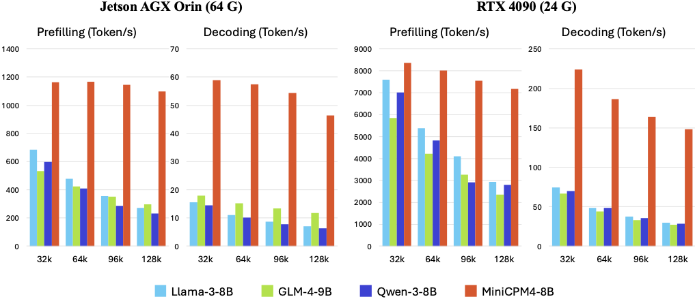

MiniCPM4.1 在推理速度上实现了 3 倍的生成速度提升。

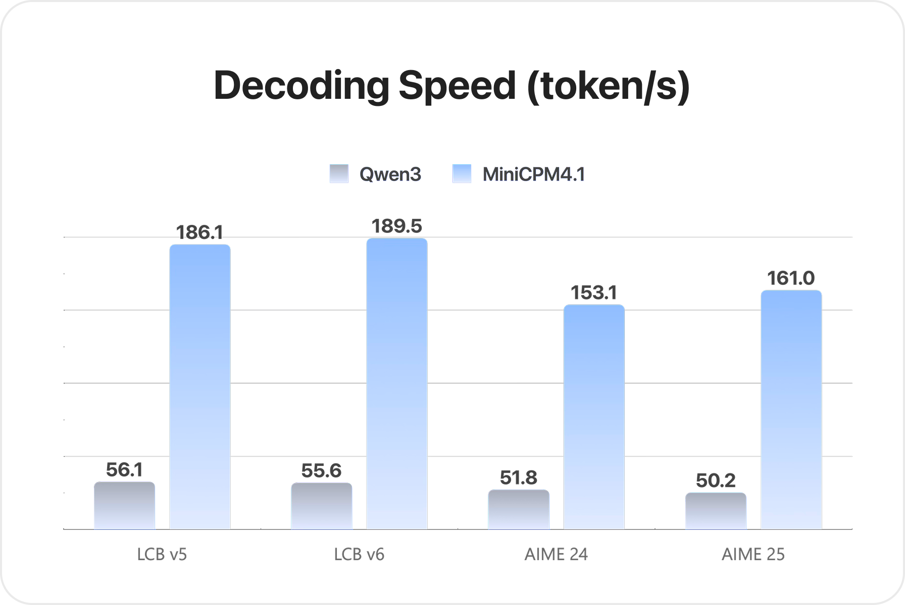

#### 综合评测
MiniCPM4.1 推出端侧 8B 参数规模版本，深思考模式在同级别模型中表现较好。
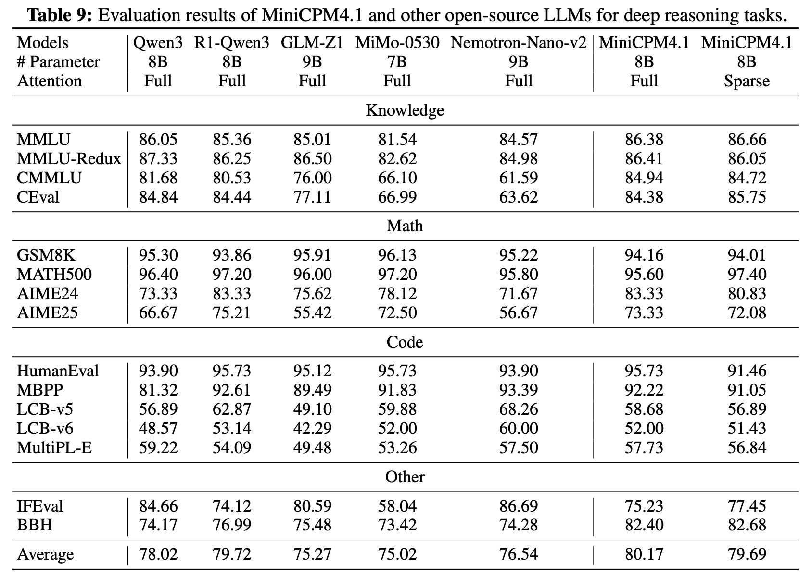

MiniCPM4 推出端侧 8B、0.5B 两种参数规模版本，在同级别模型中表现较好。
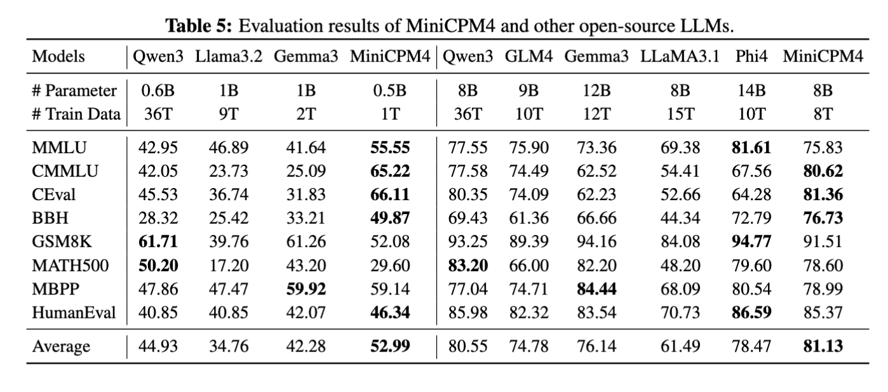


#### 长文本评测
MiniCPM4 基于 32K 长文本进行预训练，并通过 YaRN 技术实现长度扩展。在 128K 长文本的大海捞针任务中，MiniCPM4 保持了稳定表现。MiniCPM4.1 基于 64K 长文本进行预训练，并通过 YaRN 技术实现长度扩展，在 128K 长文本的大海捞针任务中同样保持稳定表现。

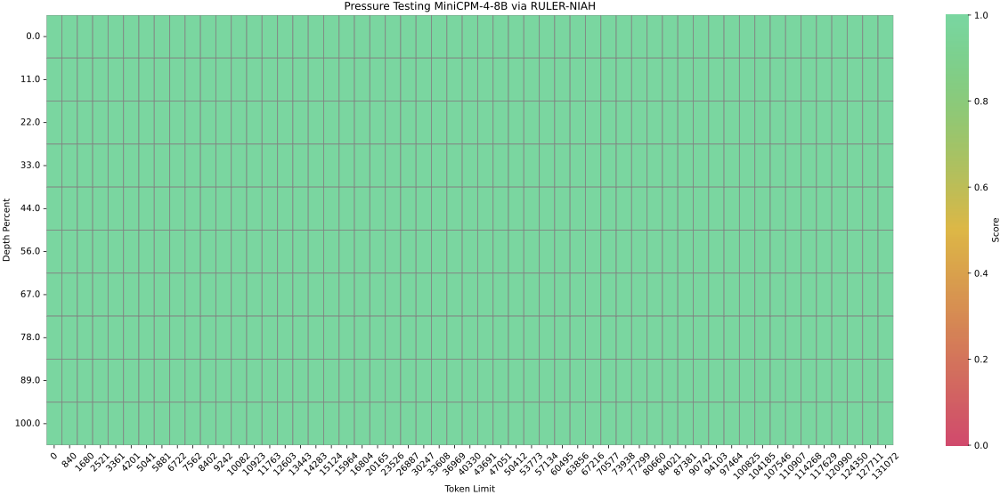


### 模型推理
你可以使用Huggingface Transformers、vLLM、SGLang、CPM.cu对模型进行推理。若关注推理效率，可以优先尝试 CPM.cu。

MiniCPM4/MiniCPM4.1 支持稠密推理与稀疏推理两种模式，其中vLLM与SGLang目前只支持了稠密推理模式。如果想要使用稀疏推理模式，请使用Huggingface Transformers及CPM.cu。

- 稠密注意力推理：vLLM、SGLang、Huggingface Transformers
- 稀疏注意力推理：Huggingface Transformers、CPM.cu


#### 混合思考

MiniCPM4.1 支持混合思考模式，可以用于深度思考和非思考模式。用户可以通过设置 `enable_thinking=True` 来启用混合思考模式，设置 `enable_thinking=False` 来启用非思考模式。同样，用户可以直接在查询末尾添加 `/no_think` 来启用非思考模式。如果未添加任何特殊标记或在查询末尾添加 `/think`，模型将启用思考模式。

```python
# Enable reasoning mode
prompt_text = tokenizer.apply_chat_template(
    messages,
    tokenize=False,
    add_generation_prompt=True,
    enable_thinking=True
)
# Enable non-reasoning mode
prompt_text = tokenizer.apply_chat_template(
    messages,
    tokenize=False,
    add_generation_prompt=True,
    enable_thinking=False
)
```


#### HuggingFace

- **稠密注意力推理**
```python
from transformers import AutoModelForCausalLM, AutoTokenizer
import torch
torch.manual_seed(0)

path = 'openbmb/MiniCPM4.1-8B'
device = "cuda"
tokenizer = AutoTokenizer.from_pretrained(path)
model = AutoModelForCausalLM.from_pretrained(path, torch_dtype=torch.bfloat16, device_map=device, trust_remote_code=True)

# User can directly use the chat interface
# responds, history = model.chat(tokenizer, "Write an article about Artificial Intelligence.", temperature=0.7, top_p=0.7)
# print(responds)

# User can also use the generate interface
messages = [
    {"role": "user", "content": "Write an article about Artificial Intelligence."},
]
prompt_text = tokenizer.apply_chat_template(
    messages,
    tokenize=False,
    add_generation_prompt=True,
)
model_inputs = tokenizer([prompt_text], return_tensors="pt").to(device)

model_outputs = model.generate(
    **model_inputs,
    max_new_tokens=32768,
    top_p=0.95,
    temperature=0.6
)
output_token_ids = [
    model_outputs[i][len(model_inputs[i]):] for i in range(len(model_inputs['input_ids']))
]

responses = tokenizer.batch_decode(output_token_ids, skip_special_tokens=True)[0]
print(responses)
```

- **稀疏注意力推理**
本模型支持稀疏注意力机制 InfLLM v2，可高效处理长序列推理。如需启用该功能，请先安装依赖库 [infllmv2_cuda_impl](https://github.com/OpenBMB/infllmv2_cuda_impl)


运行以下命令即可安装：

```bash
git clone -b feature_infer https://github.com/OpenBMB/infllmv2_cuda_impl.git
cd infllmv2_cuda_impl
git submodule update --init --recursive
pip install -e . # or python setup.py install 
```

启用 InfLLM v2 需在 `config.json` 配置文件中添加 `sparse_config` 字段：

```json
{
    ...,
    "sparse_config": {
        "kernel_size": 32,
        "kernel_stride": 16,
        "init_blocks": 1,
        "block_size": 64,
        "window_size": 2048,
        "topk": 64,
        "use_nope": false,
        "dense_len": 8192
    }
}
```

这些参数控制 InfLLM v2 的行为:

* `kernel_size`（默认值：32）：语义核的大小。  
* `kernel_stride`（默认值：16）：相邻语义核的步长。  
* `init_blocks`（默认值：1）：每个 query token 关注的初始的块数量，用于确保关注序列开头部分。  
* `block_size`（默认值：64）：key-value blocks 的块大小。  
* `window_size`（默认值：2048）：局部滑动窗口大小。  
* `topk`（默认值：64）：每个 token 仅与最相关的 top-k 个 key-value blocks 计算注意力。  
* `use_nope`（默认值：false）：是否在块选择中使用NOPE技术以提升性能。  
* `dense_len`（默认值：8192）：稀疏注意力对短序列收益有限，当 token 长度低于此阈值时自动切换为标准注意力。设为 `-1` 则强制始终使用稀疏注意力。

- **长度扩展**
Minicpm4.1 原生支持 65,536 tokens 的上下文长度。若对话总长度（输入 + 输出）远超此限制，建议通过 RoPE 缩放技术扩展上下文。通过调整 LongRoPE 因子，模型可稳定支持 131,072 tokens 的超长上下文。

修改方法：在 `config.json` 文件中调整 `rope_scaling` 字段参数即可。

```json
{
    ...,
    "rope_scaling": {
        "rope_type": "longrope", 
        "long_factor": [0.9982316082870437, 1.033048153422584, 1.0749920956484724, 1.1255096879436193, 1.1863348602111476, 1.259543828902579, 1.3476188888731149, 1.4535223827776373, 1.5807816745852985, 1.7335856049489526, 1.9168922912975785, 2.1365471404135326, 2.3994084200118646, 2.713475511863602, 3.0880118452194134, 3.533650295140154, 4.062463396503134, 4.687974098908333, 5.425075306704039, 6.289818967956352, 7.29902962722721, 8.6357018163639, 10.210822723989212, 12.053807765671676, 14.193944598909404, 16.65780676784363, 19.463620727694074, 22.628311203524586, 26.150106147261315, 30.02526691405111, 34.23183327975347, 38.73811934094828, 43.502489489729555, 48.47627117965394, 53.61139491762471, 58.857366522037935, 64.16798299215064, 69.51359464319125, 74.86555458220285, 80.21497790341579, 85.55322183307433, 90.89611806932027, 96.26245306514224, 101.68269304046481, 107.18619510219668, 112.82253283014026, 118.63764063163615, 119.88866203644656, 120.9462882391725, 121.837565139014, 122.58663780572562, 123.2147719894291, 123.74049454862576, 124.17980424685767, 124.54641761955492, 124.85202548028222, 125.10654406389756, 125.31835105170659, 125.49450117164764, 125.64091910903052, 125.76256945356558, 125.86360463815589, 125.94749252260765, 126.01712561287873],
        "short_factor": [0.9982316082870437, 1.033048153422584, 1.0749920956484724, 1.1255096879436193, 1.1863348602111476, 1.259543828902579, 1.3476188888731149, 1.4535223827776373, 1.5807816745852985, 1.7335856049489526, 1.9168922912975785, 2.1365471404135326, 2.3994084200118646, 2.713475511863602, 3.0880118452194134, 3.533650295140154, 4.062463396503134, 4.687974098908333, 5.425075306704039, 6.289818967956352, 7.29902962722721, 8.6357018163639, 10.210822723989212, 12.053807765671676, 14.193944598909404, 16.65780676784363, 19.463620727694074, 22.628311203524586, 26.150106147261315, 30.02526691405111, 34.23183327975347, 38.73811934094828, 43.502489489729555, 48.47627117965394, 53.61139491762471, 58.857366522037935, 64.16798299215064, 69.51359464319125, 74.86555458220285, 80.21497790341579, 85.55322183307433, 90.89611806932027, 96.26245306514224, 101.68269304046481, 107.18619510219668, 112.82253283014026, 118.63764063163615, 119.88866203644656, 120.9462882391725, 121.837565139014, 122.58663780572562, 123.2147719894291, 123.74049454862576, 124.17980424685767, 124.54641761955492, 124.85202548028222, 125.10654406389756, 125.31835105170659, 125.49450117164764, 125.64091910903052, 125.76256945356558, 125.86360463815589, 125.94749252260765, 126.01712561287873],
        "original_max_position_embeddings": 65536
    }
}
```

#### vLLM

你可以使用投机采样加速模型生成，也可以使用标准模式部署模型。
##### 投机采样

使用 vLLM 进行加速推理的投机采样步骤如下：

###### 1. 下载 MiniCPM4.1 草稿模型

首先，下载 MiniCPM4.1 草稿模型：

```bash
cd /your_path
git clone https://huggingface.co/openbmb/MiniCPM4.1-8B-Eagle3
```

###### 2. 安装 EAGLE3 兼容的 vLLM

EAGLE3 的 vLLM PR 已经提交。目前请使用我们的仓库进行安装：

```bash
git clone https://github.com/LDLINGLINGLING/vllm.git
cd vllm 
pip install -e .
```

###### 3. 启动带有投机采样的 vLLM 服务

启动启用了投机采样的 vLLM 推理服务。请确保在 speculative-config 中将模型路径更新为下载的 MiniCPM4_1-8B-Eagle3-bf16 文件夹：

```bash
VLLM_USE_V1=1 \
vllm serve openbmb/MiniCPM4.1-8B \
--seed 42 \
--trust-remote-code \
--speculative-config '{
  "model": "your/path/MiniCPM4_1-8B-Eagle3-bf16",
  "num_speculative_tokens": 3,
  "method": "eagle3",
  "draft_tensor_parallel_size": 1
}'
```

###### 4. 客户端使用示例

客户端使用方式在标准解码和投机采样下保持一致：

```python
import openai

client = openai.Client(base_url="http://localhost:8000/v1", api_key="EMPTY")

response = client.chat.completions.create(
    model="openbmb/MiniCPM4.1-8B",
    messages=[
        {"role": "user", "content": "Write an article about Artificial Intelligence."},
    ],
    temperature=0.6,
    max_tokens=32768,
    extra_body=dict(add_special_tokens=True),  # 确保在聊天模板中加入特殊符号
    
)

print(response.choices[0].message.content)
```

###### vLLM 配置参数说明

-	`VLLM_USE_V1=1`: 启用 vLLM v1 API
-	`--speculative-config`: 投机采样的 JSON 配置
  -	`model`: 草稿模型的路径
  -	`num_speculative_tokens`: 推测的 token 数量（默认：3）
  -	`method`: 投机采样方法（eagle3）
  -	`draft_tensor_parallel_size`: 草稿模型的张量并行大小（默认：1）
-	`--seed`: 随机种子，用于可复现性
-	`--trust-remote-code`: 允许执行远程代码以支持自定义模型

##### 标准推理（不使用投机采样）

目前你需要安装最新版本的 vLLM。

```bash
pip install -U vllm \
    --pre \
    --extra-index-url https://wheels.vllm.ai/nightly
```

然后可以用 vLLM 推理 MiniCPM4.1-8B：

```python
from transformers import AutoTokenizer
from vllm import LLM, SamplingParams

model_name = "openbmb/MiniCPM4.1-8B"
prompt = [{"role": "user", "content": "Write an article about Artificial Intelligence."}]

tokenizer = AutoTokenizer.from_pretrained(model_name, trust_remote_code=True)
input_text = tokenizer.apply_chat_template(prompt, tokenize=False, add_generation_prompt=True)

llm = LLM(
    model=model_name,
    trust_remote_code=True,
    max_num_batched_tokens=65536,
    dtype="bfloat16", 
    gpu_memory_utilization=0.8, 
)
sampling_params = SamplingParams(top_p=0.95, temperature=0.6, max_tokens=32768)

outputs = llm.generate(prompts=input_text, sampling_params=sampling_params)

print(outputs[0].outputs[0].text)
```

你也可以通过以下命令启动推理服务：

> 注意: 在 vLLM 的 chat API 中，add_special_tokens 默认是 False。这意味着重要的特殊符号——比如序列开始符（BOS token）——不会被自动加入。为了确保输入提示对模型格式正确，建议显式设置 extra_body={"add_special_tokens": True}。

```bash
vllm serve openbmb/MiniCPM4.1-8B --trust-remote-code
```

然后可以通过以下代码使用聊天接口：

```python
import openai

client = openai.Client(base_url="http://localhost:8000/v1", api_key="EMPTY")

response = client.chat.completions.create(
    model="openbmb/MiniCPM4.1-8B",
    messages=[
        {"role": "user", "content": "Write an article about Artificial Intelligence."},
    ],
    temperature=0.6,
    max_tokens=32768,
    extra_body=dict(add_special_tokens=True),  # 确保在聊天模板中加入特殊符号
)

print(response.choices[0].message.content)
```

#### SGLang

你可以使用投机采样加速模型生成，也可以使用标准模式部署模型。

##### 投机采样

使用投机采样进行加速推理的步骤如下：

###### 1. 下载 MiniCPM4.1 草稿模型

首先，下载 MiniCPM4.1 草稿模型：

```bash
cd /your_path
git clone https://huggingface.co/openbmb/MiniCPM4.1-8B-Eagle3
```

###### 2. 安装 EAGLE3 兼容的 SGLang

EAGLE3 的适配 PR 已经提交。目前请使用我们的仓库进行安装：

```bash
git clone https://github.com/LDLINGLINGLING/sglang.git
cd sglang
pip install -e .
```

###### 3. 启动带有投机采样的 SGLang 服务

启动启用了投机采样的 SGLang 服务：

```bash
python -m sglang.launch_server \
  --model-path "openbmb/MiniCPM4.1-8B" \
  --host "127.0.0.1" \
  --port 30002 \
  --mem-fraction-static 0.9 \
  --speculative-algorithm EAGLE3 \
  --speculative-draft-model-path "your/path/MiniCPM4_1-8B-Eagle3-bf16" \
  --speculative-num-steps 3 \
  --speculative-eagle-topk 1 \
  --speculative-num-draft-tokens 32 \
  --temperature 0.7
```

###### 4. 客户端使用

客户端使用方式在标准解码和投机采样下保持一致：

```python
import openai

client = openai.Client(base_url=f"http://localhost:30002/v1", api_key="None")

response = client.chat.completions.create(
    model="openbmb/MiniCPM4.1-8B",
    messages=[
        {"role": "user", "content": "Write an article about Artificial Intelligence."},
    ],
    temperature=0.6,
    max_tokens=32768,
)

print(response.choices[0].message.content)
```

> 注意：请确保在客户端代码中更新端口号，以匹配服务端端口（在投机采样示例中为 30002）。

###### 配置参数说明
-	`--speculative-algorithm EAGLE3`: 启用 EAGLE3 投机采样
-	`--speculative-draft-model-path`: 草稿模型路径
-	`--speculative-num-steps`: 推测步数（默认：3）
-	`--speculative-eagle-topk`: EAGLE 的 top-k 参数（默认：1）
-	`--speculative-num-draft-tokens`: 草稿 token 数量（默认：32）
-	`--mem-fraction-static`: 静态分配的显存比例（默认：0.9）

##### 标准推理（不使用投机采样）

目前你需要安装我们 fork 的 SGLang 版本。

```bash
git clone -b openbmb https://github.com/OpenBMB/sglang.git
cd sglang

pip install --upgrade pip
pip install -e "python[all]"
```

你可以通过以下命令启动推理服务：

```bash
python -m sglang.launch_server --model openbmb/MiniCPM4.1-8B --trust-remote-code --port 30000 --chat-template chatml
```

然后可以通过以下代码使用聊天接口：

```python
import openai

client = openai.Client(base_url=f"http://localhost:30000/v1", api_key="None")

response = client.chat.completions.create(
    model="openbmb/MiniCPM4.1-8B",
    messages=[
        {"role": "user", "content": "Write an article about Artificial Intelligence."},
    ],
    temperature=0.6,
    max_tokens=32768,
)

print(response.choices[0].message.content)
```


#### CPM.cu

我们**推荐**使用 [CPM.cu](https://github.com/OpenBMB/CPM.cu) 对 MiniCPM4 和 MiniCPM4.1 模型进行推理。CPM.cu 是面壁开发的一个集合了高效稀疏、投机采样、量化等技术的 CUDA 推理框架，能够完全发挥 MiniCPM4 和 MiniCPM4.1 的效率优势。

你可以通过以下脚本安装 CPM.cu 并进行推理：

```bash
git clone https://github.com/OpenBMB/CPM.cu.git --recursive
cd CPM.cu
python3 setup.py install
```

你可以通过以下命令进行推理并查看模型的运行速度。

```bash
python3 tests/long_prompt_gen.py # 生成 prompt.txt
python3 tests/test_generate.py --prompt-file prompt.txt
```

你可以通过一下命令使用 EAGLE3 进行投机推理。

```bash
python3 -m cpmcu.cli \
    --model-path $BASE_MODEL_PATH \
    --draft-model-path $EAGLE3_DRAFT_MODEL_PATH \
    --prompt-text "Tell me about Tsinghua University" \
    --use-eagle3 true
```

更多关于 CPM.cu 的细节，请参考 [CPM.cu 仓库](https://github.com/OpenBMB/CPM.cu)。


#### llama.cpp and Ollama

我们同样支持使用 [llama.cpp](https://github.com/ggml-org/llama.cpp) 和 [Ollama](https://ollama.com/) 进行模型推理。

#### llama.cpp

你可以从 [huggingface](https://huggingface.co/openbmb/MiniCPM4.1-8B-GGUF) 下载 MiniCPM4.1-8B 的 GGUF 格式模型，并使用 llama.cpp 进行推理。
```
# case 1: main-cli
./build/bin/llama-cli -m MiniCPM4.1-8B-Q4_K_M.gguf -p "Write an article about Artificial 
Intelligence." -n 1500

# case 2: server
## launch server
./build/bin/llama-server -m MiniCPM4.1-8B-Q4_K_M.gguf --host 127.0.0.1 --port 8080 -c 
4096 -fa on &

## send request
curl -X POST http://127.0.0.1:8080/v1/chat/completions \
  -H "Content-Type: application/json" \
  -d '{
    "model": "gpt-3.5-turbo",
    "messages": [{"role": "user", "content": "Write an article about Artificial 
    Intelligence."}],
    "max_tokens": 1500
  }'
```

#### Ollama
请前往 [模型库](https://ollama.com/openbmb/minicpm4.1) 下载模型。安装好 Ollama 后，可以通过以下命令使用 MiniCPM4.1：
```
ollama run openbmb/minicpm4.1
```

### 模型微调
#### LLaMA-Factory
目前模型微调支持 [LLaMA-Factory](https://github.com/hiyouga/LLaMA-Factory)，使用方法参考 [LLaMA-Factory 微调](https://t0mvtyikswc.feishu.cn/docx/Gv6ld1yCTodckBxysKgcpepJnKg?from=from_copylink)

</details>

> 模型量化（**BitCPM4**）与 MiniCPM4 应用（**Survey** / **MCP** / **Intel AIPC Client**）：见 [`docs/README-legacy-cn.md`](./docs/README-legacy-cn.md)。


## 开源协议

#### 模型协议

* 本仓库中代码与 MiniCPM 模型权重依照 [Apache-2.0](https://github.com/OpenBMB/MiniCPM/blob/main/LICENSE) 协议开源

#### 声明

* 作为一个语言模型，MiniCPM 通过学习大量的文本来生成内容，但它无法理解、表达个人观点或价值判断，它所输出的任何内容都不代表模型开发者的观点和立场。
* 因此用户在使用 MiniCPM 生成的内容时，应自行负责对其进行评估和验证。
* 如果由于使用 MiniCPM 开源模型而导致的任何问题，包括但不限于数据安全问题、公共舆论风险，或模型被误导、滥用、传播或不当利用所带来的任何风险和问题，我们将不承担任何责任。

## 开发机构

本项目由以下机构共同开发：

-  [面壁智能](https://modelbest.cn/)
-  [清华大学自然语言处理实验室](https://nlp.csai.tsinghua.edu.cn/)
-  [人大高瓴人工智能学院](https://linyankai.github.io/)

## 工作引用

* 如果觉得 MiniCPM 有助于您的工作，请引用我们的论文：[MiniCPM4](https://arxiv.org/abs/2506.07900)

```
@article{minicpm4,
  title={Minicpm4: Ultra-efficient llms on end devices},
  author={MiniCPM, Team},
  journal={arXiv preprint arXiv:2506.07900},
  year={2025}
}
```
