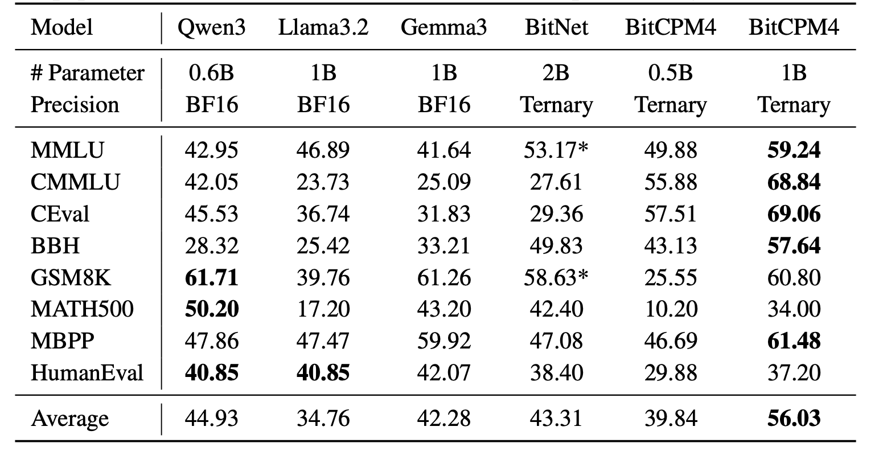

<div align="center">
</img> 
</div>

<h4 align="center">
    <p>
        <b>中文</b> | <a href="https://github.com/OpenBMB/MiniCPM/blob/main/README.md">English</a>
    <p>
</h4>


<p align="center">
<a href="https://arxiv.org/pdf/2506.07900" target="_blank">MiniCPM 论文</a> |
<a href="https://modelbest.feishu.cn/wiki/D2tFw8Pcsi5CIzkaHNacLK64npg" target="_blank">MiniCPM 知识库</a> |
<a href="https://github.com/OpenBMB/MiniCPM-V/" target="_blank">MiniCPM-V 仓库</a> |
加入我们的 <a href="https://discord.gg/3cGQn9b3YM" target="_blank">discord</a> 和 <a href="https://github.com/OpenBMB/MiniCPM/blob/main/assets/wechat.jpg" target="_blank">微信群</a> |
<a href="https://mp.weixin.qq.com/s/KIhH2nCURBXuFXAtYRpuXg?poc_token=HBIsUWijxino8oJ5s6HcjcfXFRi0Xj2LJlxPYD9c">加入我们</a>
</p>

<div align="center">
  <a href="https://www.youtube.com/watch?v=VouXjLHKDUY"></a>
</div>

## 更新日志🔥
- [2025.09.29] **发布 [InfLLM-V2详细技术论文](https://arxiv.org/abs/2509.24663)!**仅需5B长文本词元，即可完成稀疏注意力能力的训练🔥🔥🔥
- [2025.09.05] **发布 [MiniCPM4.1](https://huggingface.co/collections/openbmb/minicpm-4-6841ab29d180257e940baa9b)！该模型基于原生稀疏注意力架构（InfLLM-V2），支持混合思考。🔥🔥🔥**
- [2025.06.06] 发布 [MiniCPM4](https://huggingface.co/collections/openbmb/minicpm-4-6841ab29d180257e940baa9b)！该模型在保持同等规模最优性能的同时，实现了极致的效率提升！在典型端侧芯片上能够实现 5 倍以上生成加速！
- [2024.09.05] 发布 [MiniCPM3-4B](https://huggingface.co/openbmb/MiniCPM3-4B)！该模型的表现超越 Phi-3.5-mini-instruct 和 GPT-3.5-Turbo-0125，并且能够比肩 Llama3.1-8B-Instruct、Qwen2-7B-Instruct、GLM-4-9B-Chat 等多个 7B-9B 参数量的模型。
- [2024.07.05] 发布 [MiniCPM-S-1B](https://huggingface.co/openbmb/MiniCPM-S-1B-sft)！该模型在保持下游任务性能无损的前提下，FFN 层实现了 87.89% 的平均稀疏度，将 FFN FLOPs 降低了 84%。
- [2024.04.11] 发布 [MiniCPM-2B-128k](https://huggingface.co/openbmb/MiniCPM-2B-128k)、[MiniCPM-MoE-8x2B](https://huggingface.co/openbmb/MiniCPM-MoE-8x2B) 和 [MiniCPM-1B](https://huggingface.co/openbmb/MiniCPM-1B-sft-bf16)！点击[这里](https://openbmb.vercel.app/?category=Chinese+Blog)查看技术博客。
- [2024.02.01] 发布 [MiniCPM-2B](https://huggingface.co/openbmb/MiniCPM-2B-sft-bf16)！该模型在公开评测集上与 Mistral-7B 表现相近（中文、数学、代码能力更优），整体性能超越 Llama2-13B、MPT-30B、Falcon-40B 等模型。

## 目录

- [更新日志🔥](#更新日志)
- [目录](#目录)
- [模型下载](#模型下载)
- [MiniCPM-SALA](#minicpm-sala)
- [MiniCPM4 和 MiniCPM4.1 系列](#minicpm4-和-minicpm41-系列)
    - [亮点](#亮点)
    - [简介](#简介)
  - [评测结果](#评测结果)
    - [效率评测](#效率评测)
    - [综合评测](#综合评测)
    - [长文本评测](#长文本评测)
  - [模型推理](#模型推理)
    - [混合思考](#混合思考)
    - [HuggingFace](#huggingface)
    - [vLLM](#vllm)
      - [投机采样](#投机采样)
        - [1. 下载 MiniCPM4.1 草稿模型](#1-下载-minicpm41-草稿模型)
        - [2. 安装 EAGLE3 兼容的 vLLM](#2-安装-eagle3-兼容的-vllm)
        - [3. 启动带有投机采样的 vLLM 服务](#3-启动带有投机采样的-vllm-服务)
        - [4. 客户端使用示例](#4-客户端使用示例)
        - [vLLM 配置参数说明](#vllm-配置参数说明)
      - [标准推理（不使用投机采样）](#标准推理不使用投机采样)
    - [SGLang](#sglang)
      - [投机采样](#投机采样-1)
        - [1. 下载 MiniCPM4.1 草稿模型](#1-下载-minicpm41-草稿模型-1)
        - [2. 安装 EAGLE3 兼容的 SGLang](#2-安装-eagle3-兼容的-sglang)
        - [3. 启动带有投机采样的 SGLang 服务](#3-启动带有投机采样的-sglang-服务)
        - [4. 客户端使用](#4-客户端使用)
        - [配置参数说明](#配置参数说明)
      - [标准推理（不使用投机采样）](#标准推理不使用投机采样-1)
    - [CPM.cu](#cpmcu)
    - [llama.cpp and Ollama](#llamacpp-and-ollama)
    - [llama.cpp](#llamacpp)
    - [Ollama](#ollama)
  - [模型微调](#模型微调)
    - [LLaMA-Factory](#llama-factory)
  - [BitCPM4: 模型量化](#bitcpm4-模型量化)
    - [BitCPM4 评测](#bitcpm4-评测)
    - [BitCPM4 模型推理](#bitcpm4-模型推理)
  - [模型应用](#模型应用)
    - [MiniCPM4-Survey: 综述生成](#minicpm4-survey-综述生成)
      - [使用与演示案例](#使用与演示案例)
      - [评估](#评估)
    - [MiniCPM4-MCP: MCP增强的工具调用](#minicpm4-mcp-mcp增强的工具调用)
      - [使用与演示案例](#使用与演示案例-1)
      - [评估](#评估-1)
    - [MiniCPM Intel AIPC Client: 端侧大模型客户端](#minicpm-intel-aipc-client-端侧大模型客户端)
- [开源协议](#开源协议)
    - [模型协议](#模型协议)
    - [声明](#声明)
- [开发机构](#开发机构)
- [工作引用](#工作引用)


## 模型下载

  | HuggingFace | ModelScope |
  |-------------|------------|
  | [MiniCPM-SALA](https://huggingface.co/openbmb/MiniCPM-SALA) | [MiniCPM-SALA](https://www.modelscope.cn/models/OpenBMB/MiniCPM-SALA) |
  | [MiniCPM4.1-8B](https://huggingface.co/openbmb/MiniCPM4.1-8B) | [MiniCPM4.1-8B](https://www.modelscope.cn/models/OpenBMB/MiniCPM4.1-8B) |
  | [MiniCPM4.1-8B-GPTQ](https://huggingface.co/openbmb/MiniCPM4.1-8B-GPTQ) | [MiniCPM4.1-8B-GPTQ](https://www.modelscope.cn/openbmb/MiniCPM4.1-8B-GPTQ) | 
  | [MiniCPM4.1-8B-AutoAWQ](https://huggingface.co/openbmb/MiniCPM4.1-8B-AutoAWQ) | [MiniCPM4.1-8B-AutoAWQ](https://www.modelscope.cn/openbmb/MiniCPM4.1-8B-AutoAWQ) | 
  | [MiniCPM-4.1-8B-Marlin](https://huggingface.co/openbmb/MiniCPM-4.1-8B-Marlin) | [MiniCPM-4.1-8B-Marlin](https://www.modelscope.cn/openbmb/MiniCPM-4.1-8B-Marlin) | 
  | [MiniCPM4.1-8B-GGUF](https://huggingface.co/openbmb/MiniCPM4.1-8B-GGUF) | [MiniCPM4.1-8B-GGUF](https://www.modelscope.cn/openbmb/MiniCPM4.1-8B-GGUF) | 
  | [MiniCPM4.1-8B-MLX](https://huggingface.co/openbmb/MiniCPM4.1-8B-MLX) | [MiniCPM4.1-8B-MLX](https://www.modelscope.cn/openbmb/MiniCPM4.1-8B-MLX) | 
  | [MiniCPM4.1-8B-Eagle3](https://huggingface.co/openbmb/MiniCPM4.1-8B-Eagle3) | [MiniCPM4.1-8B-Eagle3](https://www.modelscope.cn/openbmb/MiniCPM4.1-8B-Eagle3) | 
  | [MiniCPM4-8B](https://huggingface.co/openbmb/MiniCPM4-8B)    | [MiniCPM4-8B](https://www.modelscope.cn/models/OpenBMB/MiniCPM4-8B) |
  | [MiniCPM4-0.5B](https://huggingface.co/openbmb/MiniCPM4-0.5B) | [MiniCPM4-0.5B](https://www.modelscope.cn/models/OpenBMB/MiniCPM4-0.5B) |
  | [BitCPM4-1B](https://huggingface.co/openbmb/BitCPM4-1B)        | [BitCPM4-1B](https://www.modelscope.cn/models/OpenBMB/BitCPM4-1B) |
  | [BitCPM4-0.5B](https://huggingface.co/openbmb/BitCPM4-0.5B)    | [BitCPM4-0.5B](https://www.modelscope.cn/models/OpenBMB/BitCPM4-0.5B) |
  | [MiniCPM4-Survey](https://huggingface.co/openbmb/MiniCPM4-Survey) | [MiniCPM4-Survey](https://www.modelscope.cn/models/OpenBMB/MiniCPM4-Survey) |
  | [MiniCPM4-MCP](https://huggingface.co/openbmb/MiniCPM4-MCP)  | [MiniCPM4-MCP](https://www.modelscope.cn/models/OpenBMB/MiniCPM4-MCP) |


<details>
<summary>📋 点击展开查看所有 MiniCPM 系列模型</summary>

  | HuggingFace | ModelScope |
  |-------------|------------|
  | [MiniCPM4-8B-Eagle-FRSpec](https://huggingface.co/openbmb/MiniCPM4-8B-Eagle-FRSpec) | [MiniCPM4-8B-Eagle-FRSpec](https://www.modelscope.cn/models/OpenBMB/MiniCPM4-8B-Eagle-FRSpec) |
  | [MiniCPM4-8B-Eagle-FRSpec-QAT](https://huggingface.co/openbmb/MiniCPM4-8B-Eagle-FRSpec-QAT) | [MiniCPM4-8B-Eagle-FRSpec-QAT](https://www.modelscope.cn/models/OpenBMB/MiniCPM4-8B-Eagle-FRSpec-QAT) |
  | [MiniCPM4-8B-Eagle-vLLM](https://huggingface.co/openbmb/MiniCPM4-8B-Eagle-vLLM) | [MiniCPM4-8B-Eagle-vLLM](https://www.modelscope.cn/models/OpenBMB/MiniCPM4-8B-Eagle-vLLM) |
  | [MiniCPM4-8B-marlin-Eagle-vLLM](https://huggingface.co/openbmb/MiniCPM4-8B-marlin-Eagle-vLLM) | [MiniCPM4-8B-marlin-Eagle-vLLM](https://www.modelscope.cn/models/OpenBMB/MiniCPM4-8B-marlin-Eagle-vLLM) |
  | [MiniCPM4-0.5B-QAT-Int4-unquantized](https://huggingface.co/openbmb/MiniCPM4-0.5B-QAT-Int4-unquantized) | [MiniCPM4-0.5B-QAT-Int4-unquantized](https://modelscope.cn/models/OpenBMB/MiniCPM4-0.5B-QAT-Int4-unquantized) |
  | [MiniCPM4-0.5B-QAT-Int4-GPTQ-format](https://huggingface.co/openbmb/MiniCPM4-0.5B-QAT-Int4-GPTQ-format) | [MiniCPM4-0.5B-QAT-Int4-GPTQ-format](https://modelscope.cn/models/OpenBMB/MiniCPM4-0.5B-QAT-Int4-GPTQ-format) |
  | [MiniCPM3-4B](https://huggingface.co/openbmb/MiniCPM3-4B) | [MiniCPM3-4B](https://www.modelscope.cn/models/OpenBMB/MiniCPM3-4B) |
  | [MiniCPM-2B-sft](https://huggingface.co/openbmb/MiniCPM-2B-sft-bf16) | [MiniCPM-2B-sft](https://modelscope.cn/models/OpenBMB/miniCPM-bf16)|
  | [MiniCPM-2B-dpo](https://huggingface.co/openbmb/MiniCPM-2B-dpo-bf16) | [MiniCPM-2B-dpo](https://modelscope.cn/models/OpenBMB/MiniCPM-2B-dpo-bf16/summary) |
  | [MiniCPM-2B-128k](https://huggingface.co/openbmb/MiniCPM-2B-128k) | [MiniCPM-2B-128k](https://modelscope.cn/models/openbmb/MiniCPM-2B-128k/summary) |
  | [MiniCPM-MoE-8x2B](https://huggingface.co/openbmb/MiniCPM-MoE-8x2B) | [MiniCPM-MoE-8x2B](https://modelscope.cn/models/OpenBMB/MiniCPM-MoE-8x2B) |
  | [MiniCPM-1B](https://huggingface.co/openbmb/MiniCPM-1B-sft-bf16) | [MiniCPM-1B](https://modelscope.cn/models/OpenBMB/MiniCPM-1B-sft-bf16) |
  | [MiniCPM-S-1B](https://huggingface.co/openbmb/MiniCPM-S-1B-sft) | [MiniCPM-S-1B](https://modelscope.cn/models/OpenBMB/MiniCPM-S-1B-sft) |
</details>

## MiniCPM-SALA
#### Highlights

MiniCPM-SALA（稀疏注意力与线性注意力）是首个高效融合稀疏与线性注意力机制、支持百万令牌上下文建模的大规模混合模型

✅ 创新混合架构：融合25%稀疏注意力（InfLLM-v2）实现高精度局部聚焦，搭配75%线性注意力（Lightning Attention）保障全局处理效率。

✅ 突破效率壁垒：打破二次方“计算墙”与“内存墙”限制，相比密集注意力基线实现3.5倍推理加速，并显著降低KV缓存开销。

✅ 百万令牌上下文：依托长上下文感知位置编码技术HyPE，可扩展至100万+令牌容量，同时保持优异的长文本泛化能力。

✅ HALO适应机制：采用HALO分层优化混合注意力技术，通过创新的蒸馏方案将密集注意力能力有效迁移至混合架构，规避纯线性模型常见的严重性能衰减问题。

#### Introduction

MiniCPM-SALA 是一种高效的混合模型，其中 25% 的层采用 [InfLLM-V2](https://arxiv.org/abs/2509.24663)，其余 75% 使用 [Lightning Attention](https://arxiv.org/abs/2405.17381)。这种架构能在 NVIDIA RTX 5090 等消费级 GPU 上进行一百万令牌（tokens）的推理。

- **SALA 混合注意力机制**
  - 整合了 25% 的 InfLLM-V2 和 75% 的 Lightning Attention，有效地利用了稀疏注意力对局部细节的细粒度聚焦，以及线性注意力对广泛上下文的高效率。

- **Transformer 到混合架构的持续训练**
  - 通过对预训练权重进行架构转换，规避了冷启动训练的低效性，从而将总训练预算降至从头训练同类模型的约 25%。

- **[HyPE](https://arxiv.org/abs/2601.22156) (混合位置编码)**
  - 协调了短上下文和长上下文的性能，能够保持与 Qwen3-8B 等现代全注意力模型相当的通用能力（如知识、数学和编程），并在多个长上下文基准测试中取得显著优势。

- **长序列的高效推理**
  - 在 NVIDIA A6000D 上、序列长度为 256K 令牌时，推理速度达到 Qwen3-8B 的 3.5 倍；支持在 NVIDIA A6000D 和 RTX 5090 GPU 上进行高达 1M 令牌的上下文长度推理，而 Qwen3-8B 在此长度下因显存溢出（OOM）而失败。

### Evaluation Results

#### Efficiency Evaluation

#### Comprehensive Evaluation

#### Long Text Evaluation

### Inference

#### HuggingFace

我们的模型与 🤗 Hugging Face transformers 完全兼容。你可以通过以下代码进行推理：

```python
import torch
from transformers import AutoModelForCausalLM, AutoTokenizer

model_path = "openbmb/MiniCPM-SALA"
tokenizer = AutoTokenizer.from_pretrained(model_path)
model = AutoModelForCausalLM.from_pretrained(model_path, trust_remote_code=True, device_map="auto")
model.eval()

prompts = ["My name is", "The capital of China is"]
with torch.no_grad():
    inputs = tokenizer(prompts, return_tensors="pt").to(model.device)
    outputs = model.generate(**inputs)
output_texts = tokenizer.batch_decode(outputs)
print(output_texts)
```

#### SGLang

##### 环境要求

- CUDA 12.x 或更高版本
- `gcc` / `g++` 编译器
- `uv` 包管理器（脚本会自动检测）

##### 安装

```bash
# 克隆仓库
git clone -b minicpm_sala https://github.com/OpenBMB/sglang.git
cd sglang

# 一键安装（自动创建虚拟环境并编译所有依赖）
bash install_minicpm_sala.sh

# 或指定 PyPI 镜像源
bash install_minicpm_sala.sh https://mirrors.tuna.tsinghua.edu.cn/pypi/web/simple
```

安装脚本会自动完成以下步骤：

1. 创建 `sglang_minicpm_sala_env` 虚拟环境（Python 3.12）
2. 克隆依赖到 `3rdparty/` 目录 (infllmv2) 并初始化子模块 (sparse_kernel)
3. 安装 MiniCPM-SALA (当前仓库)
4. 编译安装 `infllmv2_cuda_impl`
5. 编译安装 `sparse_kernel`
6. 安装 `tilelang` 和 `flash-linear-attention`

##### 使用

```bash
# 激活环境
source sglang_minicpm_sala_env/bin/activate

# 启动推理服务（将 MODEL_PATH 替换为实际模型路径）
MODEL_PATH=/path/to/your/model

python3 -m sglang.launch_server \
    --model ${MODEL_PATH} \
    --trust-remote-code \
    --disable-radix-cache \
    --attention-backend minicpm_flashinfer \
    --chunked-prefill-size 8192 \
    --max-running-requests 32 \
    --skip-server-warmup \
    --port 31111 \
    --dense-as-sparse
```

| 参数 | 说明 |
|------|------|
| `--trust-remote-code` | 允许加载模型自带的自定义代码 |
| `--disable-radix-cache` | 禁用 RadixAttention 前缀缓存 |
| `--attention-backend minicpm_flashinfer` | 使用 MiniCPM FlashInfer 注意力后端 |
| `--chunked-prefill-size 8192` | chunked prefill 大小 |
| `--max-running-requests 32` | 最大并发推理请求数 |
| `--skip-server-warmup` | 跳过服务预热 |
| `--port 31111` | 服务端口 |
| `--dense-as-sparse` | 使用 dense-as-sparse 模式 |

##### 手动安装

如果一键脚本不满足需求，可以分步执行：

```bash
# 0. 确保 uv 可用
pip install uv

# 1. 创建虚拟环境
uv venv --python 3.12 sglang_minicpm_sala_env
source sglang_minicpm_sala_env/bin/activate

# 2. 安装 SGLang
uv pip install --upgrade pip setuptools wheel
uv pip install -e ./python[all]

# 3. 编译安装 CUDA 扩展
# (确保依赖已克隆到 3rdparty/ 目录)
cd 3rdparty/infllmv2_cuda_impl && python setup.py install && cd ../..
cd 3rdparty/sparse_kernel && python setup.py install && cd ../..

# 4. 安装额外依赖
uv pip install tilelang flash-linear-attention
```

##### Q&A

**Q: CUDA 扩展编译失败怎么办？**

- 确保系统安装了 CUDA 12 以上（`nvcc --version` 检查）。
- 确保 `gcc` / `g++` 可用。
- 如果 `CXX` 环境变量被设为 `clang++ -pthread`，手动 `export CXX=g++`。

## MiniCPM4 和 MiniCPM4.1 系列
#### 亮点
MiniCPM4.1具有如下亮点：

✅ 强大的推理能力：在15项任务中超越同等规模模型！

✅ 快速生成：相比同等规模模型，推理解码速度提升3倍！

✅ 高效架构：使用可训练的稀疏注意力机制、高效投机解码加速生成！

#### 简介
MiniCPM4 和 MiniCPM4.1 系列是一个极致高效的端侧大模型，从模型架构、学习算法、训练数据与推理系统四个层面进行了高效优化，实现了极致的效率提升。
- 🏗️ 高效模型架构：
  - InfLLM-V2 -- 可训练的稀疏注意力机制：采用可训练的稀疏注意力机制架构，在 128K 长文本处理中，每个词元仅需与不足 5% 的词元进行相关性计算，显著降低长文本的计算开销 （[训练算子](https://github.com/OpenBMB/infllmv2_cuda_impl)）
- 🧠 高效学习算法：
  - 模型风洞 2.0 -- 高效 Predictable Scaling：引入下游任务的 Scaling 预测方法，实现更精准的模型训练配置搜索
  - BitCPM -- 极致的三值量化：将模型参数位宽压缩至 3 值，实现模型位宽 90% 的极致瘦身
  - 高效训练工程优化：采用 FP8 低精度计算技术，结合多词元预测（Multi-token Prediction）训练策略
- 📚 高知识密度训练数据：
  - UltraClean -- 高质量预训练数据的清洗与合成：构建基于高效验证的迭代式数据清洗策略，开源高质量中英文预训练数据集 [UltraFineweb](https://huggingface.co/datasets/openbmb/Ultra-FineWeb)
  - UltraChat v2 -- 高质量有监督微调数据合成：构建大规模高质量有监督微调数据集，涵盖知识密集型数据、推理密集型数据、指令遵循数据、长文本理解数据、工具调用数据等多个维度
- ⚡ 高效推理系统：
  - CPM.cu -- 轻量级的高效CUDA推理框架：融合了稀疏注意力机制、模型量化与投机采样，充分体现MiniCPM4/MiniCPM4.1的效率优势 （[推理算子与框架](https://github.com/openbmb/cpm.cu)）
  - ArkInfer -- 跨平台部署系统：支持多后端环境的一键部署，提供灵活的跨平台适配能力

### 评测结果
#### 效率评测
在 Jetson AGX Orin 和 RTX 4090 两款典型端侧芯片上，MiniCPM4 和 MiniCPM4.1 在长文本处理任务中展现出大幅领先同尺寸模型的处理速度。随着文本长度的增加，MiniCPM4 和 MiniCPM4.1 的性能优势愈发显著。在 Jetson AGX Orin 平台上，相较于 Qwen3-8B，MiniCPM4 实现了约 7 倍的生成速度提升。


MiniCPM4.1 在推理速度上实现了 3 倍的生成速度提升。


#### 综合评测
MiniCPM4.1 推出端侧 8B 参数规模版本，深思考模式在同级别模型中实现了最佳性能表现。


MiniCPM4 推出端侧 8B、0.5B 两种参数规模版本，均在同级别模型中实现了最佳性能表现。


#### 长文本评测
MiniCPM4 基于 32K 长文本进行预训练，并通过 YaRN 技术实现长度扩展。在 128K 长文本的大海捞针任务中，MiniCPM4 展现出卓越的性能表现。MiniCPM4.1 基于 64K 长文本进行预训练，并通过 YaRN 技术实现长度扩展。在 128K 长文本的大海捞针任务中，MiniCPM4.1 展现出卓越的性能表现。


### 模型推理
你可以使用Huggingface Transformers、vLLM、SGLang、CPM.cu对模型进行推理。如果想要体验极致的效率优化，我们推荐使用CPM.cu。

MiniCPM4/MiniCPM4.1 支持稠密推理与稀疏推理两种模式，其中vLLM与SGLang目前只支持了稠密推理模式。如果想要使用稀疏推理模式，请使用Huggingface Transformers及CPM.cu。

- 稠密注意力推理：vLLM、SGLang、Huggingface Transformers
- 稀疏注意力推理：Huggingface Transformers、CPM.cu


#### 混合思考

MiniCPM4.1 支持混合思考模式，可以用于深度思考和非思考模式。用户可以通过设置 `enable_thinking=True` 来启用混合思考模式，设置 `enable_thinking=False` 来启用非思考模式。同样，用户可以直接在查询末尾添加 `/no_think` 来启用非思考模式。如果未添加任何特殊标记或在查询末尾添加 `/think`，模型将启用思考模式。

```python
# Enable reasoning mode
prompt_text = tokenizer.apply_chat_template(
    messages,
    tokenize=False,
    add_generation_prompt=True,
    enable_thinking=True
)
# Enable non-reasoning mode
prompt_text = tokenizer.apply_chat_template(
    messages,
    tokenize=False,
    add_generation_prompt=True,
    enable_thinking=False
)
```


#### HuggingFace

- **稠密注意力推理**
```python
from transformers import AutoModelForCausalLM, AutoTokenizer
import torch
torch.manual_seed(0)

path = 'openbmb/MiniCPM4.1-8B'
device = "cuda"
tokenizer = AutoTokenizer.from_pretrained(path)
model = AutoModelForCausalLM.from_pretrained(path, torch_dtype=torch.bfloat16, device_map=device, trust_remote_code=True)

# User can directly use the chat interface
# responds, history = model.chat(tokenizer, "Write an article about Artificial Intelligence.", temperature=0.7, top_p=0.7)
# print(responds)

# User can also use the generate interface
messages = [
    {"role": "user", "content": "Write an article about Artificial Intelligence."},
]
prompt_text = tokenizer.apply_chat_template(
    messages,
    tokenize=False,
    add_generation_prompt=True,
)
model_inputs = tokenizer([prompt_text], return_tensors="pt").to(device)

model_outputs = model.generate(
    **model_inputs,
    max_new_tokens=32768,
    top_p=0.95,
    temperature=0.6
)
output_token_ids = [
    model_outputs[i][len(model_inputs[i]):] for i in range(len(model_inputs['input_ids']))
]

responses = tokenizer.batch_decode(output_token_ids, skip_special_tokens=True)[0]
print(responses)
```

- **稀疏注意力推理**
本模型支持稀疏注意力机制 InfLLM v2，可高效处理长序列推理。如需启用该功能，请先安装依赖库 [infllmv2_cuda_impl](https://github.com/OpenBMB/infllmv2_cuda_impl)


运行以下命令即可安装：

```bash
git clone -b feature_infer https://github.com/OpenBMB/infllmv2_cuda_impl.git
cd infllmv2_cuda_impl
git submodule update --init --recursive
pip install -e . # or python setup.py install 
```

启用 InfLLM v2 需在 `config.json` 配置文件中添加 `sparse_config` 字段：

```json
{
    ...,
    "sparse_config": {
        "kernel_size": 32,
        "kernel_stride": 16,
        "init_blocks": 1,
        "block_size": 64,
        "window_size": 2048,
        "topk": 64,
        "use_nope": false,
        "dense_len": 8192
    }
}
```

这些参数控制 InfLLM v2 的行为:

* `kernel_size`（默认值：32）：语义核的大小。  
* `kernel_stride`（默认值：16）：相邻语义核的步长。  
* `init_blocks`（默认值：1）：每个 query token 关注的初始的块数量，用于确保关注序列开头部分。  
* `block_size`（默认值：64）：key-value blocks 的块大小。  
* `window_size`（默认值：2048）：局部滑动窗口大小。  
* `topk`（默认值：64）：每个 token 仅与最相关的 top-k 个 key-value blocks 计算注意力。  
* `use_nope`（默认值：false）：是否在块选择中使用NOPE技术以提升性能。  
* `dense_len`（默认值：8192）：稀疏注意力对短序列收益有限，当 token 长度低于此阈值时自动切换为标准注意力。设为 `-1` 则强制始终使用稀疏注意力。

- **长度扩展**
Minicpm4.1 原生支持 65,536 tokens 的上下文长度。若对话总长度（输入 + 输出）远超此限制，建议通过 RoPE 缩放技术扩展上下文。我们已验证通过调整 LongRoPE 因子，模型可稳定支持 131,072 tokens 的超长上下文。

修改方法：在 `config.json` 文件中调整 `rope_scaling` 字段参数即可。

```json
{
    ...,
    "rope_scaling": {
        "rope_type": "longrope", 
        "long_factor": [0.9982316082870437, 1.033048153422584, 1.0749920956484724, 1.1255096879436193, 1.1863348602111476, 1.259543828902579, 1.3476188888731149, 1.4535223827776373, 1.5807816745852985, 1.7335856049489526, 1.9168922912975785, 2.1365471404135326, 2.3994084200118646, 2.713475511863602, 3.0880118452194134, 3.533650295140154, 4.062463396503134, 4.687974098908333, 5.425075306704039, 6.289818967956352, 7.29902962722721, 8.6357018163639, 10.210822723989212, 12.053807765671676, 14.193944598909404, 16.65780676784363, 19.463620727694074, 22.628311203524586, 26.150106147261315, 30.02526691405111, 34.23183327975347, 38.73811934094828, 43.502489489729555, 48.47627117965394, 53.61139491762471, 58.857366522037935, 64.16798299215064, 69.51359464319125, 74.86555458220285, 80.21497790341579, 85.55322183307433, 90.89611806932027, 96.26245306514224, 101.68269304046481, 107.18619510219668, 112.82253283014026, 118.63764063163615, 119.88866203644656, 120.9462882391725, 121.837565139014, 122.58663780572562, 123.2147719894291, 123.74049454862576, 124.17980424685767, 124.54641761955492, 124.85202548028222, 125.10654406389756, 125.31835105170659, 125.49450117164764, 125.64091910903052, 125.76256945356558, 125.86360463815589, 125.94749252260765, 126.01712561287873],
        "short_factor": [0.9982316082870437, 1.033048153422584, 1.0749920956484724, 1.1255096879436193, 1.1863348602111476, 1.259543828902579, 1.3476188888731149, 1.4535223827776373, 1.5807816745852985, 1.7335856049489526, 1.9168922912975785, 2.1365471404135326, 2.3994084200118646, 2.713475511863602, 3.0880118452194134, 3.533650295140154, 4.062463396503134, 4.687974098908333, 5.425075306704039, 6.289818967956352, 7.29902962722721, 8.6357018163639, 10.210822723989212, 12.053807765671676, 14.193944598909404, 16.65780676784363, 19.463620727694074, 22.628311203524586, 26.150106147261315, 30.02526691405111, 34.23183327975347, 38.73811934094828, 43.502489489729555, 48.47627117965394, 53.61139491762471, 58.857366522037935, 64.16798299215064, 69.51359464319125, 74.86555458220285, 80.21497790341579, 85.55322183307433, 90.89611806932027, 96.26245306514224, 101.68269304046481, 107.18619510219668, 112.82253283014026, 118.63764063163615, 119.88866203644656, 120.9462882391725, 121.837565139014, 122.58663780572562, 123.2147719894291, 123.74049454862576, 124.17980424685767, 124.54641761955492, 124.85202548028222, 125.10654406389756, 125.31835105170659, 125.49450117164764, 125.64091910903052, 125.76256945356558, 125.86360463815589, 125.94749252260765, 126.01712561287873],
        "original_max_position_embeddings": 65536
    }
}
```

#### vLLM

你可以使用投机采样加速模型生成，也可以使用标准模式部署模型。
##### 投机采样

使用 vLLM 进行加速推理的投机采样步骤如下：

###### 1. 下载 MiniCPM4.1 草稿模型

首先，下载 MiniCPM4.1 草稿模型：

```bash
cd /your_path
git clone https://huggingface.co/openbmb/MiniCPM4.1-8B-Eagle3
```

###### 2. 安装 EAGLE3 兼容的 vLLM

EAGLE3 的 vLLM PR 已经提交。目前请使用我们的仓库进行安装：

```bash
git clone https://github.com/LDLINGLINGLING/vllm.git
cd vllm 
pip install -e .
```

###### 3. 启动带有投机采样的 vLLM 服务

启动启用了投机采样的 vLLM 推理服务。请确保在 speculative-config 中将模型路径更新为下载的 MiniCPM4_1-8B-Eagle3-bf16 文件夹：

```bash
VLLM_USE_V1=1 \
vllm serve openbmb/MiniCPM4.1-8B \
--seed 42 \
--trust-remote-code \
--speculative-config '{
  "model": "your/path/MiniCPM4_1-8B-Eagle3-bf16",
  "num_speculative_tokens": 3,
  "method": "eagle3",
  "draft_tensor_parallel_size": 1
}'
```

###### 4. 客户端使用示例

客户端使用方式在标准解码和投机采样下保持一致：

```python
import openai

client = openai.Client(base_url="http://localhost:8000/v1", api_key="EMPTY")

response = client.chat.completions.create(
    model="openbmb/MiniCPM4.1-8B",
    messages=[
        {"role": "user", "content": "Write an article about Artificial Intelligence."},
    ],
    temperature=0.6,
    max_tokens=32768,
    extra_body=dict(add_special_tokens=True),  # 确保在聊天模板中加入特殊符号
    
)

print(response.choices[0].message.content)
```

###### vLLM 配置参数说明

-	`VLLM_USE_V1=1`: 启用 vLLM v1 API
-	`--speculative-config`: 投机采样的 JSON 配置
  -	`model`: 草稿模型的路径
  -	`num_speculative_tokens`: 推测的 token 数量（默认：3）
  -	`method`: 投机采样方法（eagle3）
  -	`draft_tensor_parallel_size`: 草稿模型的张量并行大小（默认：1）
-	`--seed`: 随机种子，用于可复现性
-	`--trust-remote-code`: 允许执行远程代码以支持自定义模型

##### 标准推理（不使用投机采样）

目前你需要安装最新版本的 vLLM。

```bash
pip install -U vllm \
    --pre \
    --extra-index-url https://wheels.vllm.ai/nightly
```

然后可以用 vLLM 推理 MiniCPM4.1-8B：

```python
from transformers import AutoTokenizer
from vllm import LLM, SamplingParams

model_name = "openbmb/MiniCPM4.1-8B"
prompt = [{"role": "user", "content": "Write an article about Artificial Intelligence."}]

tokenizer = AutoTokenizer.from_pretrained(model_name, trust_remote_code=True)
input_text = tokenizer.apply_chat_template(prompt, tokenize=False, add_generation_prompt=True)

llm = LLM(
    model=model_name,
    trust_remote_code=True,
    max_num_batched_tokens=65536,
    dtype="bfloat16", 
    gpu_memory_utilization=0.8, 
)
sampling_params = SamplingParams(top_p=0.95, temperature=0.6, max_tokens=32768)

outputs = llm.generate(prompts=input_text, sampling_params=sampling_params)

print(outputs[0].outputs[0].text)
```

你也可以通过以下命令启动推理服务：

> 注意: 在 vLLM 的 chat API 中，add_special_tokens 默认是 False。这意味着重要的特殊符号——比如序列开始符（BOS token）——不会被自动加入。为了确保输入提示对模型格式正确，建议显式设置 extra_body={"add_special_tokens": True}。

```bash
vllm serve openbmb/MiniCPM4.1-8B --trust-remote-code
```

然后可以通过以下代码使用聊天接口：

```python
import openai

client = openai.Client(base_url="http://localhost:8000/v1", api_key="EMPTY")

response = client.chat.completions.create(
    model="openbmb/MiniCPM4.1-8B",
    messages=[
        {"role": "user", "content": "Write an article about Artificial Intelligence."},
    ],
    temperature=0.6,
    max_tokens=32768,
    extra_body=dict(add_special_tokens=True),  # 确保在聊天模板中加入特殊符号
)

print(response.choices[0].message.content)
```

#### SGLang

你可以使用投机采样加速模型生成，也可以使用标准模式部署模型。

##### 投机采样

使用投机采样进行加速推理的步骤如下：

###### 1. 下载 MiniCPM4.1 草稿模型

首先，下载 MiniCPM4.1 草稿模型：

```bash
cd /your_path
git clone https://huggingface.co/openbmb/MiniCPM4.1-8B-Eagle3
```

###### 2. 安装 EAGLE3 兼容的 SGLang

EAGLE3 的适配 PR 已经提交。目前请使用我们的仓库进行安装：

```bash
git clone https://github.com/LDLINGLINGLING/sglang.git
cd sglang
pip install -e .
```

###### 3. 启动带有投机采样的 SGLang 服务

启动启用了投机采样的 SGLang 服务：

```bash
python -m sglang.launch_server \
  --model-path "openbmb/MiniCPM4.1-8B" \
  --host "127.0.0.1" \
  --port 30002 \
  --mem-fraction-static 0.9 \
  --speculative-algorithm EAGLE3 \
  --speculative-draft-model-path "your/path/MiniCPM4_1-8B-Eagle3-bf16" \
  --speculative-num-steps 3 \
  --speculative-eagle-topk 1 \
  --speculative-num-draft-tokens 32 \
  --temperature 0.7
```

###### 4. 客户端使用

客户端使用方式在标准解码和投机采样下保持一致：

```python
import openai

client = openai.Client(base_url=f"http://localhost:30002/v1", api_key="None")

response = client.chat.completions.create(
    model="openbmb/MiniCPM4.1-8B",
    messages=[
        {"role": "user", "content": "Write an article about Artificial Intelligence."},
    ],
    temperature=0.6,
    max_tokens=32768,
)

print(response.choices[0].message.content)
```

> 注意：请确保在客户端代码中更新端口号，以匹配服务端端口（在投机采样示例中为 30002）。

###### 配置参数说明
-	`--speculative-algorithm EAGLE3`: 启用 EAGLE3 投机采样
-	`--speculative-draft-model-path`: 草稿模型路径
-	`--speculative-num-steps`: 推测步数（默认：3）
-	`--speculative-eagle-topk`: EAGLE 的 top-k 参数（默认：1）
-	`--speculative-num-draft-tokens`: 草稿 token 数量（默认：32）
-	`--mem-fraction-static`: 静态分配的显存比例（默认：0.9）

##### 标准推理（不使用投机采样）

目前你需要安装我们 fork 的 SGLang 版本。

```bash
git clone -b openbmb https://github.com/OpenBMB/sglang.git
cd sglang

pip install --upgrade pip
pip install -e "python[all]"
```

你可以通过以下命令启动推理服务：

```bash
python -m sglang.launch_server --model openbmb/MiniCPM4.1-8B --trust-remote-code --port 30000 --chat-template chatml
```

然后可以通过以下代码使用聊天接口：

```python
import openai

client = openai.Client(base_url=f"http://localhost:30000/v1", api_key="None")

response = client.chat.completions.create(
    model="openbmb/MiniCPM4.1-8B",
    messages=[
        {"role": "user", "content": "Write an article about Artificial Intelligence."},
    ],
    temperature=0.6,
    max_tokens=32768,
)

print(response.choices[0].message.content)
```


#### CPM.cu

我们**推荐**使用 [CPM.cu](https://github.com/OpenBMB/CPM.cu) 对 MiniCPM4 和 MiniCPM4.1 模型进行推理。CPM.cu 是面壁开发的一个集合了高效稀疏、投机采样、量化等技术的 CUDA 推理框架，能够完全发挥 MiniCPM4 和 MiniCPM4.1 的效率优势。

你可以通过以下脚本安装 CPM.cu 并进行推理：

```bash
git clone https://github.com/OpenBMB/CPM.cu.git --recursive
cd CPM.cu
python3 setup.py install
```

你可以通过以下命令进行推理并查看模型的运行速度。

```bash
python3 tests/long_prompt_gen.py # 生成 prompt.txt
python3 tests/test_generate.py --prompt-file prompt.txt
```

你可以通过一下命令使用 EAGLE3 进行投机推理。

```bash
python3 -m cpmcu.cli \
    --model-path $BASE_MODEL_PATH \
    --draft-model-path $EAGLE3_DRAFT_MODEL_PATH \
    --prompt-text "Tell me about Tsinghua University" \
    --use-eagle3 true
```

更多关于 CPM.cu 的细节，请参考 [CPM.cu 仓库](https://github.com/OpenBMB/CPM.cu)。


#### llama.cpp and Ollama

我们同样支持使用 [llama.cpp](https://github.com/ggml-org/llama.cpp) 和 [Ollama](https://ollama.com/) 进行模型推理。

#### llama.cpp

你可以从 [huggingface](https://huggingface.co/openbmb/MiniCPM4.1-8B-GGUF) 下载 MiniCPM4.1-8B 的 GGUF 格式模型，并使用 llama.cpp 进行推理。
```
# case 1: main-cli
./build/bin/llama-cli -m MiniCPM4.1-8B-Q4_K_M.gguf -p "Write an article about Artificial 
Intelligence." -n 1500

# case 2: server
## launch server
./build/bin/llama-server -m MiniCPM4.1-8B-Q4_K_M.gguf --host 127.0.0.1 --port 8080 -c 
4096 -fa on &

## send request
curl -X POST http://127.0.0.1:8080/v1/chat/completions \
  -H "Content-Type: application/json" \
  -d '{
    "model": "gpt-3.5-turbo",
    "messages": [{"role": "user", "content": "Write an article about Artificial 
    Intelligence."}],
    "max_tokens": 1500
  }'
```

#### Ollama
请前往 [模型库](https://ollama.com/openbmb/minicpm4.1) 下载模型。安装好 Ollama 后，可以通过以下命令使用 MiniCPM4.1：
```
ollama run openbmb/minicpm4.1
```

### 模型微调
#### LLaMA-Factory
目前模型微调支持 [LLaMA-Factory](https://github.com/hiyouga/LLaMA-Factory)，使用方法参考 [LLaMA-Factory 微调](https://t0mvtyikswc.feishu.cn/docx/Gv6ld1yCTodckBxysKgcpepJnKg?from=from_copylink)

### BitCPM4: 模型量化
BitCPM4 是基于 MiniCPM 系列模型进行量化感知训练（QAT）后得到的三值量化模型，在训练效率和模型参数效率实现了有效的提升。
- 训练方法改进
  - 在小规模模型上进行风洞实验，搜索训练所需的训练超参。
  - 通过使用一阶段高精训练+二阶段 QAT 的方法，充分利用已经完成或部分完成训练的高精度模型，极大地压缩了 QAT 阶段所需要的算力。
- 高效参数效率
  - 模型使用 1.58Bit 的位宽达到的性能对标与同参数量级别的全精度模型，模型参数效率高。

#### BitCPM4 评测
BitCPM4 在测试中的表现可以对标同级别的业界主流全精度模型。


#### BitCPM4 模型推理
BitCPM4 开源的模型参数为伪量化形式，可以直接使用 Huggingface 框架进行推理。

### 模型应用
<details>
<summary>查看 MiniCPM4 的应用</summary>
#### MiniCPM4-Survey: 综述生成
MiniCPM4-Survey 是由 [THUNLP](https://nlp.csai.tsinghua.edu.cn)、中国人民大学和 [ModelBest](https://modelbest.cn/en) 联合开发的开源大语言模型智能体。它基于 MiniCPM4-8B 基座模型，接受用户质量作为输入，自主生成可信的长篇综述论文。
主要特性包括：
- 计划-检索-写作生成框架 — 我们提出了一个多智能体生成框架，包含三个核心阶段：计划（定义综述的整体结构）、检索（生成合适的检索关键词）和写作（利用检索到的信息，生成连贯的段落）。
- 高质量数据集构建——我们收集并处理大量人类专家写作的综述论文，构建高质量训练集。同时，我们收集大量研究论文，构建检索数据库。
- 多方面奖励设计 — 我们精心设计了包含结构、内容和引用的奖励，用于评估综述的质量，在强化学习训练阶段作奖励函数。
- 多步强化学习训练策略 — 我们提出了一个上下文管理器，以确保在促进有效推理的同时保留必要的信息，并构建了并行环境，维持强化学习训练高效。
##### 使用与演示案例

详见[此处](./demo/minicpm4/SurveyGeneration/README.md)

##### 评估

| Method                                      | Relevance | Coverage | Depth | Novelty | Avg.  | Fact Score |
|---------------------------------------------|-----------|----------|-------|---------|-------|------------|
| Naive RAG (driven by G2FT)                  | 3.25      | 2.95     | 3.35  | 2.60    | 3.04  | 43.68      |
| AutoSurvey (driven by G2FT)                 | 3.10      | 3.25     | 3.15  | **3.15**| 3.16  | 46.56      |
| Webthinker (driven by WTR1-7B)              | 3.30      | 3.00     | 2.75  | 2.50    | 2.89  | --         |
| Webthinker (driven by QwQ-32B)              | 3.40      | 3.30     | 3.30  | 2.50    | 3.13  | --         |
| OpenAI Deep Research (driven by GPT-4o)     | 3.50      |**3.95**  | 3.55  | 3.00    | **3.50**  | --         |
| MiniCPM4-Survey                            | 3.45      | 3.70     | **3.85** | 3.00    | **3.50**  | **68.73**  |
| &nbsp;&nbsp;&nbsp;*w/o* RL                  | **3.55**  | 3.35     | 3.30  | 2.25    | 3.11  | 50.24      |

*GPT-4o 对综述生成系统的性能比较。“G2FT” 代表 Gemini-2.0-Flash-Thinking，“WTR1-7B” 代表 Webthinker-R1-7B。由于 Webthinker 不包括引用功能，OpenAI Deep Research 在导出结果时不提供引用，因此省略了对它们的 FactScore 评估。我们的技术报告中包含评测的详细信息。*

#### MiniCPM4-MCP: MCP增强的工具调用

MiniCPM4-MCP 是由[清华大学自然语言处理实验室（THUNLP）](https://nlp.csai.tsinghua.edu.cn)、中国人民大学与 [ModelBest](https://modelbest.cn/en) 联合开发的开源本地大语言模型代理，它基于 MiniCPM-4-8B，拥有 80 亿参数。它能够通过 MCP 协议与各种工具和数据资源交互，解决多种真实世界任务。截至目前，MiniCPM4-MCP 已支持：

- 涵盖 16 个 MCP 服务器（servers）中工具的使用：这些服务器所包含的工具横跨了办公类、生活类、通讯类、资讯类、工作管理类等.

- 单工具使用的能力：可使用符合 MCP 协议的工具进行单一工具的一步或多步调用。

- 跨工具组合使用的能力：可组合使用符合 MCP 协议的不同工具。


##### 使用与演示案例

详见[此处](./demo/minicpm4/MCP/README.md)

##### 评估

| MCP 服务器             |          | gpt-4o   |          |          | qwen3    |          |          | minicpm4 |          |
| -------------------- | -------- | -------- | -------- | -------- | -------- | -------- | -------- | -------- | -------- |
|                      | 函数名正确率   | 参数名正确率    | 数值正确率    | 函数名正确率   | 参数名正确率    | 数值正确率    | 函数名正确率   | 参数名正确率    | 数值正确率    |
| Airbnb                | 89.3           | 67.9         | 53.6         | 92.8          | 60.7         | 50.0         | 96.4           | 67.9         | 50.0         |
| Amap-Maps             | 79.8           | 77.5         | 50.0         | 74.4          | 72.0         | 41.0         | 89.3           | 85.7         | 39.9         |
| Arxiv-MCP-Server      | 85.7           | 85.7         | 85.7         | 81.8          | 54.5         | 50.0         | 57.1           | 57.1         | 52.4         |
| Calculator            | 100.0          | 100.0        | 20.0         | 80.0          | 80.0         | 13.3         | 100.0          | 100.0        | 6.67         |
| Computor-Control-MCP  | 90.0           | 90.0         | 90.0         | 90.0          | 90.0         | 90.0         | 90.0           | 90.0         | 86.7         |
| Desktop-Commander     | 100.0          | 100.0        | 100.0        | 100.0         | 100.0        | 100.0        | 100.0          | 100.0        | 100.0        |
| Filesystem            | 63.5           | 63.5         | 31.3         | 69.7          | 69.7         | 26.0         | 83.3           | 83.3         | 42.7         |
|Github | 92.0 | 80.0 | 58.0 | 80.5 | 50.0 | 27.7 | 62.8 | 25.7 | 17.1 |
| Gaode                 | 71.1           | 55.6         | 17.8         | 68.8          | 46.6         | 24.4         | 68.9           | 46.7         | 15.6         |
| MCP-Code-Executor     | 85.0           | 80.0         | 70.0         | 80.0          | 80.0         | 70.0         | 90.0           | 90.0         | 65.0         |
| MCP-Docx              | 95.8           | 86.7         | 67.1         | 94.9          | 81.6         | 60.1         | 95.1           | 86.6         | 76.1         |
| PPT                   | 72.6           | 49.8         | 40.9         | 85.9          | 50.7         | 37.5         | 91.2           | 72.1         | 56.7         |
| PPTx                  | 64.2           | 53.7         | 13.4         | 91.0          | 68.6         | 20.9         | 91.0           | 58.2         | 26.9         |
| Simple-Time-Server    | 90.0           | 70.0         | 70.0         | 90.0          | 90.0         | 90.0         | 90.0           | 60.0         | 60.0         |
| Slack                 | 100.0          | 90.0         | 70.0         | 100.0         | 100.0        | 65.0         | 100.0          | 100.0        | 100.0        |
| Whisper               | 90.0           | 90.0         | 90.0         | 90.0          | 90.0         | 90.0         | 90.0           | 90.0         | 30.0         |
| **平均值**              | **80.2**       | **70.2**     | **49.1**     | **83.5**      | **67.7**     | **43.8**     | **88.3**       | **76.1**     | **51.2**     |

#### MiniCPM Intel AIPC Client: 端侧大模型客户端

MiniCPM Intel AIPC Client 是面壁智能和 Intel 合作推出的端侧大模型客户端，专为搭载 Intel Core Ultra 系列处理器的设备设计，旨在为开发者、研究人员与 AI 爱好者带来低延迟、高效率、高隐私的本地大模型使用体验。其核心特性如下：

- 深度适配 Intel 硬件：全面支持 Intel Core Ultra 系列处理器，实现与硬件的深度融合，充分释放硬件性能，让用户无需依赖云端，在本地设备上就能流畅运行大模型。
- 基于 OpenVINO 的极致优化：基于 OpenVINO 推理框架进行深度优化，大幅提升推理效率，推理速度最高可达每秒 80 tokens，确保模型响应迅速，无论是快速问答还是复杂任务处理，都能高效完成。
- 隐私安全保障：采用本地部署方式，所有数据处理均在本地设备完成，避免数据上传至云端带来的隐私风险，让用户使用更安心，尤其适合对数据隐私要求较高的场景。
- 面向多元用户群体：无论是追求前沿技术的开发者，专注学术研究的科研人员，还是热衷于探索 AI 应用的爱好者，都能通过 MiniCPM Intel AIPC Client，轻松体验本地大模型的强大功能，开启个性化的 AI 探索之旅 。

配置要求：

- 建议使用英特尔酷睿 ultra7 及以上移动端处理器
- 建议运行内存 32GB 及以上  

应用下载：

[下载地址](https://github.com/OpenBMB/MiniCPM/releases/tag/2.4.2)
</details>


## 开源协议

#### 模型协议

* 本仓库中代码与 MiniCPM 模型权重依照 [Apache-2.0](https://github.com/OpenBMB/MiniCPM/blob/main/LICENSE) 协议开源

#### 声明

* 作为一个语言模型，MiniCPM 通过学习大量的文本来生成内容，但它无法理解、表达个人观点或价值判断，它所输出的任何内容都不代表模型开发者的观点和立场。
* 因此用户在使用 MiniCPM 生成的内容时，应自行负责对其进行评估和验证。
* 如果由于使用 MiniCPM 开源模型而导致的任何问题，包括但不限于数据安全问题、公共舆论风险，或模型被误导、滥用、传播或不当利用所带来的任何风险和问题，我们将不承担任何责任。

## 开发机构

本项目由以下机构共同开发：

-  [面壁智能](https://modelbest.cn/)
-  [清华大学自然语言处理实验室](https://nlp.csai.tsinghua.edu.cn/)
-  [人大高瓴人工智能学院](https://linyankai.github.io/)

## 工作引用

* 如果觉得 MiniCPM 有助于您的工作，请引用我们的论文：[MiniCPM4](https://arxiv.org/abs/2506.07900)

```
@article{minicpm4,
  title={Minicpm4: Ultra-efficient llms on end devices},
  author={MiniCPM, Team},
  journal={arXiv preprint arXiv:2506.07900},
  year={2025}
}
```
