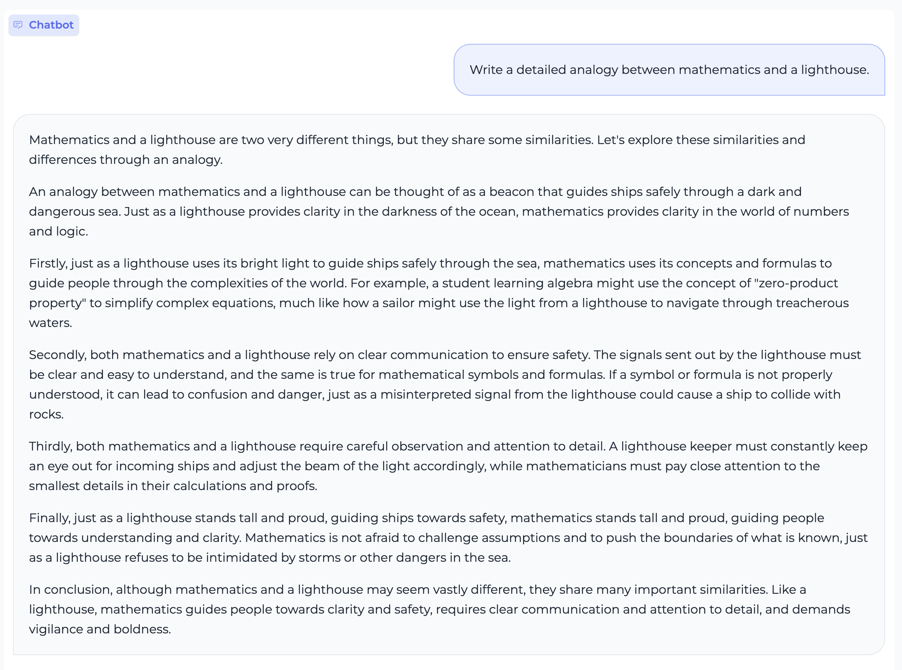
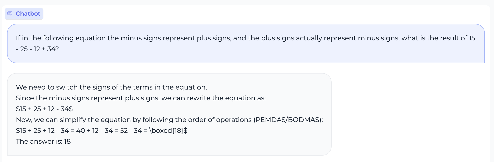
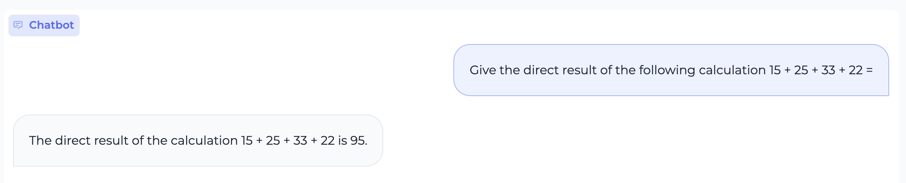
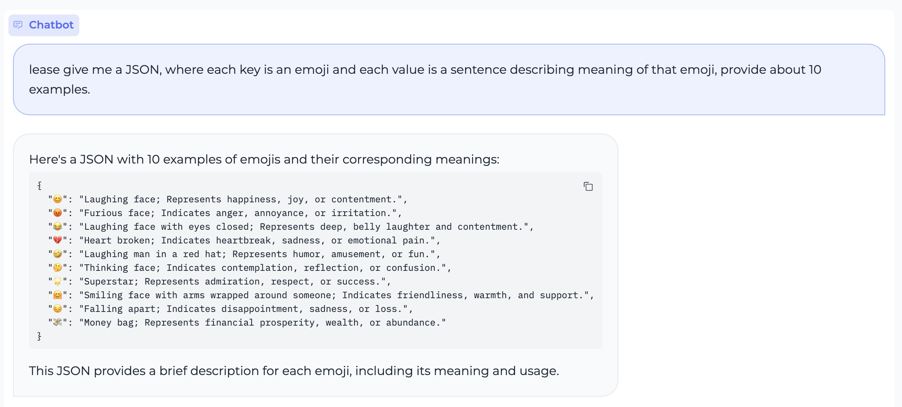

<div align="center">
<h1>
  MiniCPM: Unveiling the Potential of End-side Large Language Models
</h1>
</div>

<h4 align="center">
    <p>
        <a href="https://github.com/OpenBMB/MiniCPM/blob/main/README.md">中文</a> | <b>English</b>
    <p>
</h4>

<p align="center">
<a href="https://openbmb.vercel.app/" target="_blank">Technical Blog</a> |
<a href="https://arxiv.org/abs/2404.06395" target="_blank">MiniCPM Paper</a> |
<a href="https://github.com/OpenBMB/MiniCPM-V/" target="_blank">MiniCPM-V Repo</a> |
Join our <a href="https://discord.gg/3cGQn9b3YM" target="_blank">discord</a> and <a href="https://github.com/OpenBMB/MiniCPM/blob/main/assets/wechat.jpg" target="_blank">WeChat</a>
</p>

MiniCPM is an End-Side LLM developed by ModelBest Inc. and TsinghuaNLP, with only 2.4B parameters excluding embeddings (2.7B in total).

- MiniCPM has very close performance compared with Mistral-7B on open-sourced general benchmarks with better ability on Chinese, Mathematics and Coding after SFT. The overall performance exceeds Llama2-13B, MPT-30B, Falcon-40B, etc.
- After DPO, MiniCPM outperforms Llama2-70B-Chat, Vicuna-33B, Mistral-7B-Instruct-v0.1, Zephyr-7B-alpha, etc. on MTBench.
- MiniCPM-V 2.0, based on MiniCPM-2B, achieves state-of-the-art performance on multiple benchmarks among models under 7B parameters. It even outperforms strong Qwen-VL-Chat 9.6B, CogVLM-Chat 17.4B, and Yi-VL 34B on OpenCompass. MiniCPM-V 2.0 also shows strong OCR capability, achieving comparable performance to Gemini Pro in scene-text understanding.
- MiniCPM can be deployed and infer on smartphones, and the speed of streaming output is relatively higher than human verbal speed. MiniCPM-V has also successfully deployed multi-modal models on smartphones.
- The cost of developing based on MiniCPM is low. Parameter efficient finetuning can be conducted with a single 1080/2080 GPU and full parameter finetuning can be conducted with a 3090/4090 GPU.

We release all model parameters for research and limited commercial use. 

- SFT and DPO version based on MiniCPM-2B: **MiniCPM-2B-SFT/DPO**
- The multi-modal model **MiniCPM-V 2.0** based on MiniCPM-2B.
- The INT4 quantized version **MiniCPM-2B-SFT/DPO-Int4** based on MiniCPM-2B-SFT/DPO
- The 128k long context version of MiniCPM-2B: **MiniCPM-2B-128k**.
- The MoE version of MiniCPM-2B: **MiniCPM-MoE-8x2B**.
- SFT version of MiniCPM-1B, a lighter-weight model: **MiniCPM-1B-SFT**.
- Mobile phone application based on MLC-LLM and LLMFarm. Both language model and multimodel model can conduct inference on smartphones.
- 30 Intermidiate [checkpoints](https://huggingface.co/openbmb/MiniCPM-2B-history) of MiniCPM-2B for academic purpose.

### Limitations

- Due to limitations in model size, the model may experience hallucinatory issues. As DPO model tend to generate longer response, hallucinations are more likely to occur. We will also continue to iterate and improve the MiniCPM model.
- To ensure the generality of the model for academic research purposes, we have not subject it to any identity-specific training. Meanwhile, as we use ShareGPT open-source corpus as part of the training data, the model may output identity-related information similar to the GPT series models.
- Due to the limitation of model size, the output of the model is greatly influenced by prompts, which may result in inconsistent results from multiple attempts.
- Due to limited model capacity, the model's knowledge recall may not be accurate. In the future, we will combine the RAG method to enhance the model's knowledge retention ability.

## Quick Links

- [Updates](#0)
- [Downloading](#1)
- [Quick Start](#2)
- [Community](#community)
- [Benchmark](#3)
- [Deployment on Mobile Phones](#4)
- [Demo & API](#5)
- [Fine-tuning Models](#6)
- [LICENSE](#7)
- [Citation](#8)
- [Show Cases](#9)
- 
<p id="0"></p>

## Common Modules
| [infer](#2) | [finetune](#6) | [deployment](#4) | [quantize](#quantize)
|-------------|------------|-----------|-----------|
|[Transformers](#Huggingface)|[Transformers](#6)|[MLC](#MLC)|[GPTQ](#gptq)|
|[vLLM](#vLLM)|[mlx_finetune](#mlx_finetune)|[llama.cpp](#llama.cpp)|[AWQ](#awq)|
|[llama.cpp](#llama.cpp)|[llama_factory](./finetune/llama_factory_example/README.md)||[bnb](#bnb)|
|[ollama](#ollama)|||[quantize_test](#quantize_test)|
|[fastllm](#fastllm)||||
|[mlx_lm](#mlx)||||
|[powerinfer](#powerinfer)||||
## Update Log
- **2024/04/11 We release [MiniCPM-V 2.0](https://huggingface.co/openbmb/MiniCPM-V-2.0), [MiniCPM-2B-128k](https://huggingface.co/openbmb/MiniCPM-2B-128k), [MiniCPM-MoE-8x2B](https://huggingface.co/openbmb/MiniCPM-MoE-8x2B) and [MiniCPM-1B](https://huggingface.co/openbmb/MiniCPM-1B-sft-bf16)! Click [here](https://openbmb.vercel.app/) to read our technical blog.**
- 2024/03/16 Intermediate checkpoints were released [here](https://huggingface.co/openbmb/MiniCPM-2B-history)!
- 2024/02/13 We support llama.cpp 
- 2024/02/09 We have included a [Community](#community) section in the README to encourage support for MiniCPM from the open-source community.
- 2024/02/08 We updated the [llama-format model weights](#llamaformat), which can be loaded into LlamaModel directly, making it more convenient for everyone to use our model quickly.
- 2024/02/01 Initial release.

<p id="1"></p>

## Downloading

* Language Model

  | HuggingFace | ModelScope | WiseModel | 
  |-------------|------------|-----------|
  |[MiniCPM-2B-sft-bf16](https://huggingface.co/openbmb/MiniCPM-2B-sft-bf16)|[MiniCPM-2B-sft-bf16](https://modelscope.cn/models/OpenBMB/miniCPM-bf16)|[MiniCPM-2B-sft-bf16](https://wisemodel.cn/models/OpenBMB/miniCPM-bf16)|
  |[MiniCPM-2B-dpo-bf16](https://huggingface.co/openbmb/MiniCPM-2B-dpo-bf16)|[MiniCPM-2B-dpo-bf16](https://modelscope.cn/models/OpenBMB/MiniCPM-2B-dpo-bf16/summary)|[MiniCPM-2B-dpo-bf16](https://wisemodel.cn/models/OpenBMB/MiniCPM-2B-dpo-bf16)|
  |[MiniCPM-2B-128k](https://huggingface.co/openbmb/MiniCPM-2B-128k) |[MiniCPM-2B-128k](https://modelscope.cn/models/openbmb/MiniCPM-2B-128k/summary)| 
  |[MiniCPM-MoE-8x2B](https://huggingface.co/openbmb/MiniCPM-MoE-8x2B) |[MiniCPM-MoE-8x2B](https://modelscope.cn/models/OpenBMB/MiniCPM-MoE-8x2B)| 
  |[MiniCPM-1B-sft-bf16](https://huggingface.co/openbmb/MiniCPM-1B-sft-bf16) | [MiniCPM-1B-sft-bf16](https://modelscope.cn/models/OpenBMB/MiniCPM-1B-sft-bf16) |

  Note: More model versions can be found [here](https://huggingface.co/collections/openbmb/minicpm-2b-65d48bf958302b9fd25b698f).
     
* Multimodel Model

    | HuggingFace | ModelScope | WiseModel |
    |-------------|------------|-----------|
    | [MiniCPM-V 2.0](https://huggingface.co/openbmb/MiniCPM-V-2) | [MiniCPM-V 2.0](https://modelscope.cn/models/OpenBMB/MiniCPM-V-2) |
    | [MiniCPM-V](https://huggingface.co/openbmb/MiniCPM-V) | [MiniCPM-V](https://modelscope.cn/models/OpenBMB/MiniCPM-V/) | [MiniCPM-V](https://wisemodel.cn/models/OpenBMB/MiniCPM-V) |
    | [OmniLMM-12B](https://huggingface.co/openbmb/OmniLMM-12B) | [OmniLMM-12B](https://modelscope.cn/models/OpenBMB/OmniLMM-12B) | [OmniLMM-12B](https://wisemodel.cn/models/OpenBMB/OmniLMM-12B) |


<p id="2"></p>

## Quick Start

#### Online

- [Colab](https://colab.research.google.com/drive/1tJcfPyWGWA5HezO7GKLeyeIso0HyOc0l?usp=sharing)

<p id="Huggingface"></p>

#### Huggingface 

##### MiniCPM-2B

* Install `transformers>=4.36.0` and `accelerate`，run the following python code.

```python
from transformers import AutoModelForCausalLM, AutoTokenizer
import torch
torch.manual_seed(0)

path = 'openbmb/MiniCPM-2B-dpo-bf16'
tokenizer = AutoTokenizer.from_pretrained(path)
model = AutoModelForCausalLM.from_pretrained(path, torch_dtype=torch.bfloat16, device_map='cuda', trust_remote_code=True)

responds, history = model.chat(tokenizer, "Which city is the capital of China?", temperature=0.8, top_p=0.8)
print(responds)
```

* Examples

```shell
The capital city of China is Beijing. Beijing is not only the political center of China but also a cultural and economic hub. It is known for its rich history and numerous landmarks, such as the Great Wall, the Forbidden City, and the Temple of Heaven. The city is also home to the National Stadium, also known as the "Bird's Nest," and the National Aquatics Center, or "Water Cube." Beijing is a significant city in China, with a population of over 21 million people.
```
<p id="llamaformat"></p>

##### MiniCPM-2B (Llama Format)
To facilitate ease of use, we have converted the model weights of MiniCPM to adapt to the structure of the LLaMA model:
```python
import torch
from transformers import LlamaTokenizerFast, LlamaForCausalLM
model_path = "openbmb/MiniCPM-2B-dpo-bf16-llama-format"
tokenizer = LlamaTokenizerFast.from_pretrained(model_path)
model = LlamaForCausalLM.from_pretrained(model_path, torch_dtype=torch.bfloat16, device_map='cuda', trust_remote_code=True)

prompt="Now you act like a terminal situated within a beginner's C++ practice repository folder, please provide the output for the command: `ls -l`"
input_ids = tokenizer.encode("<User>{}<AI>".format(prompt), return_tensors='pt', add_special_tokens=True).cuda()
responses = model.generate(input_ids, temperature=0.3, top_p=0.8, repetition_penalty=1.02, max_length=1024)
responses = tokenizer.decode(responses[0], skip_special_tokens=True)
print(responses)
```


##### MiniCPM-V

```python
import torch
from PIL import Image
from transformers import AutoModel, AutoTokenizer

model = AutoModel.from_pretrained('openbmb/MiniCPM-V', trust_remote_code=True)
tokenizer = AutoTokenizer.from_pretrained('openbmb/MiniCPM-V', trust_remote_code=True)
model.eval().cuda()

image = Image.open('xx.jpg').convert('RGB')
question = 'What is in the image?'
msgs = [{'role': 'user', 'content': question}]

res, context, _ = model.chat(
    image=image,
    msgs=msgs,
    context=None,
    tokenizer=tokenizer,
    sampling=True,
    temperature=0.7
)
print(res)
```
<p id="vLLM"></p>

#### vLLM 

* Install [vLLM](https://github.com/vllm-project/vllm)
  ```shell
  pip install "vllm>=0.4.1"
  ```

* Examples
  ```shell
  python inference/inference_vllm.py --model_path <hf_repo_path> --prompt_path prompts/prompt_demo.txt
  ```


#### llama.cpp, Ollama, fastllm, mlx_lm Inference
We have supported inference with [llama.cpp](https://github.com/ggerganov/llama.cpp/), [ollama](https://github.com/ollama/ollama), [fastllm](https://github.com/ztxz16/fastllm), [mlx_lm](https://github.com/ml-explore/mlx-examples). Thanks to [@runfuture](https://github.com/runfuture) for the adaptation of llama.cpp and ollama.

<p id="llama.cpp"></p>

**llama.cpp**
1. [install llama.cpp](https://github.com/ggerganov/llama.cpp?tab=readme-ov-file#build)
2. download model in gguf format. [link-fp16](https://huggingface.co/runfuture/MiniCPM-2B-dpo-fp16-gguf) [link-q4km](https://huggingface.co/runfuture/MiniCPM-2B-dpo-q4km-gguf)
3. In command line:
```
./main -m ../../model_ckpts/download_from_hf/MiniCPM-2B-dpo-fp16-gguf.gguf --prompt "<用户>Write an acrostic poem with the word MINICPM (One line per letter)<AI>" --temp 0.3 --top-p 0.8 --repeat-penalty 1.05
```
More parameters adjustment [see this](https://github.com/ggerganov/llama.cpp/blob/master/examples/main/README.md)

<p id="ollama"></p>

**ollama run MiniCPM-2B-dpo**
1. [install ollama](https://github.com/ollama/ollama)
2. In command line:
```
ollama run modelbest/minicpm-2b-dpo 
```

**ollama other models**
1. [Install ollama](https://github.com/ollama/ollama)
2. Download models in gguf format. [Download link for 2b-fp16 format](https://huggingface.co/runfuture/MiniCPM-2B-dpo-fp16-gguf) [Download link for 2b-q4km format](https://huggingface.co/runfuture/MiniCPM-2B-dpo-q4km-gguf) [Download link for 1b-fp16 format](https://huggingface.co/linglingdan/MiniCPM-1b-fp16-gguf) [Download link for 1b-qr_1 format](https://huggingface.co/linglingdan/MiniCPM-1b-q4-1)
3. Run the following command in the command line, `model_name` can be customized:：
```
touch model_name.Modelfile
```
4. Edit the content of `model_name.Modelfile` as follows, write the path of the gguf model after the FROM space:
```shell
FROM model_path/model_name.gguf
TEMPLATE """<s><USER>{{ .Prompt }}<AI>{{ .Response }}"""
PARAMETER stop "<\s>"
```
5. Run the following command in the command line to create an ollama model, `ollama_model_name` can be customized, `model_name.Modelfile` should follow the naming from step 3:
```shell
ollama create ollama_model_name -f model_name.Modelfile
```
6. Run the ollama model：
```sehll
ollama run ollama_model_name
```

**fastllm**
1. install [fastllm](https://github.com/ztxz16/fastllm)
2. inference
```python
import torch
from transformers import AutoTokenizer, LlamaTokenizerFast, AutoModelForCausalLM
path = 'openbmb/MiniCPM-2B-dpo-fp16'
tokenizer = AutoTokenizer.from_pretrained(path)
model = AutoModelForCausalLM.from_pretrained(path, torch_dtype=torch.float16, device_map='cuda', trust_remote_code=True)
from fastllm_pytools import llm
llm.set_device_map("cpu")
model = llm.from_hf(model, tokenizer, dtype = "float16") # dtype支持 "float16", "int8", "int4"
print(model.response("<用户>Write an acrostic poem with the word MINICPM (One line per letter)<AI>", top_p=0.8, temperature=0.5, repeat_penalty=1.02))
```
<p id="mlx"></p>

**mlx_lm**

1. install mlx_lm
    ```shell
    pip install mlx_lm
    ```
2. download model weights [MiniCPM-2B-sft-bf16-llama-format-mlx](https://huggingface.co/mlx-community/MiniCPM-2B-sft-bf16-llama-format-mlx)
3. inference
    ```shell
    python -m mlx_lm.generate --model mlx-community/MiniCPM-2B-sft-bf16-llama-format-mlx --prompt "hello, tell me a joke." --trust-remote-code
    ```

#### powerinfer
Currently, PowerInfer is exclusively tailored for the MiniCPM-S-1B model; support for other versions is not yet available, stay tuned.
1. Ensure your cmake version is 3.17 or above. If you have already installed it, you can skip this step.
```bash
    # Download the installation package
    sudo wget https://cmake.org/files/v3.23/cmake-3.23.0.tar.gz
    # Extract the installation package
    sudo tar -zxvf cmake-3.23.0.tar.gz
    # Configure the installation environment
    sudo ./configure
    sudo make -j8
    # Compile and install
    sudo make install
    # Check the version after installation
    cmake --version
    # If the version number is returned, the installation was successful
    # cmake version 3.23.0
```
2. Install PowerInfer:：
```bash
  git clone https://github.com/SJTU-IPADS/PowerInfer
  cd PowerInfer
  pip install -r requirements.txt # install Python helpers' dependencies
```
3. Compile the CPU version of PowerInfer. If your machine only has a CPU, or if you want to perform inference using the CPU, run the following commands:：
```bash
  cmake -S . -B build
  cmake --build build --config Release
```
4. Compile the GPU version of PowerInfer. If your machine has a GPU, you can run the following commands:
```bash
  cmake -S . -B build -DLLAMA_CUBLAS=ON
  cmake --build build --config Release
```
5. Retrieve the sparse model:
```bash
git clone https://huggingface.co/openbmb/MiniCPM-S-1B-sft-gguf/tree/main
#or
git clone https://modelscope.cn/models/OpenBMB/MiniCPM-S-1B-sft-gguf
```
6. Model Inference:
```bash
cd PowerInfer
# Below is the command template. output_token_count refers to the maximum output tokens, thread_num is the number of threads, and prompt is the input prompt text.
#./build/bin/main -m /PATH/TO/MODEL -n $output_token_count -t $thread_num -p $prompt
# Below is an example
./build/bin/main -m /root/ld/ld_model_pretrain/1b-s-minicpm/MiniCPM-S-1B-sft.gguf -n 2048 -t 8 -p '<User>hello,tell me a story please.<AI>'
```

<p id="quantize"></p>

## Quantize
<p id="gptq"></p>

**gptq**
1. Firstly, obtain the[minicpm_gptqd code](https://github.com/LDLINGLINGLING/AutoGPTQ/tree/minicpm_gptq)
2. Navigate to the main directory of minicpm_gptqd ./AutoGPTQ, then in the command line, input:
    ```
    pip install e .
    ```
3. Proceed to [model download] (#1) to download all files from the unquantized MiniCPM repository to a local folder; both 1b and 2b models are acceptable, as well as post-training models.
4. Input the following command in the command line, where `no_quantized_model_path` is the path to the model downloaded in step 3, `save_path` is the path to save the quantized model, and `--bits` is the quantization bit width which can be set to either 4 or 8.
    ```
    cd Minicpm/quantize
    python gptq_quantize.py --pretrained_model_dir no_quant_model_path --quantized_model_dir quant_save_path --bits 4
    ```
5. You can perform inference using ./AutoGPTQ/examples/quantization/inference.py, or refer to the previous section on using vllm with the quantized model. For the minicpm-1b-int4 model, vllm inference on a single 4090 card operates at around 2000 tokens per second

<p id="awq"></p>

**awq**
1. Modify the configuration parameters in the quantize/awq_quantize.py file according to the comments:
```python
  model_path = '/root/ld/ld_model_pretrained/MiniCPM-1B-sft-bf16' # model_path or model_id
  quant_path = '/root/ld/ld_project/pull_request/MiniCPM/quantize/awq_cpm_1b_4bit' # quant_save_path
  quant_data_path='/root/ld/ld_project/pull_request/MiniCPM/quantize/quantize_data/wikitext' # Input the provided quantization dataset, alpaca or wikitext under data
  quant_config = { "zero_point": True, "q_group_size": 128, "w_bit": 4, "version": "GEMM" } # "w_bit":4 or 8
  quant_samples=512 # Number of samples to use for calibration
  custom_data=[{'question':'What is your name.','answer':'I am the open-source mini cannon MiniCPM from OpenMBMB.'}, # Custom dataset is available
                 {'question':'What are your features.','answer':'I am small, but I am strong.'}]
```
2. Under the quantize/quantize_data folder, two datasets, alpaca and wiki_text, are provided as quantization calibration sets. Modify the aforementioned quant_data_path to the path of one of these folders.
3. If you need a custom dataset, modify the custom_data variable in quantize/awq_quantize.py, such as:
    ```python
        custom_data=[{'question':'What symptoms does allergic rhinitis have?','answer':'Allergic rhinitis may cause nasal congestion, runny nose, headache, etc., which recur frequently. It is recommended to seek medical attention in severe cases.'},
                 {'question':'What is 1+1 equal to?','answer':'It equals 2'}]
    ```
4. Based on the selected dataset, choose one of the following lines of code to replace line 38 in quantize/awq_quantize.py:：
  ```python
    # Quantize using wikitext
    model.quantize(tokenizer, quant_config=quant_config, calib_data=load_wikitext(quant_data_path=quant_data_path))
    # Quantize using alpaca
    model.quantize(tokenizer, quant_config=quant_config, calib_data=load_alpaca(quant_data_path=quant_data_path))
    # Quantize using a custom dataset
    model.quantize(tokenizer, quant_config=quant_config, calib_data=load_cust_data(quant_data_path=quant_data_path))
  ```
5. Run the quantize/awq_quantize.py file; the AWQ quantized model will be available in the specified quan_path directory.


<p id="bnb"></p>

**bnb**
1. Modify the configuration parameters in the quantize/bnb_quantize.py file according to the comments:
```python
model_path = "/root/ld/ld_model_pretrain/MiniCPM-1B-sft-bf16"  # Model path
save_path = "/root/ld/ld_model_pretrain/MiniCPM-1B-sft-bf16_int4"  # Path to save the quantized model
```
2. Additional quantization parameters can be modified based on the comments and the llm.int8() algorithm (optional):
```python
quantization_config = BitsAndBytesConfig(
    load_in_4bit=True,  # Whether to perform 4-bit quantization
    load_in_8bit=False,  # Whether to perform 8-bit quantization
    bnb_4bit_compute_dtype=torch.float16,  # Computation precision setting
    bnb_4bit_quant_storage=torch.uint8,  # Storage format for quantized weights
    bnb_4bit_quant_type="nf4",  # Quantization format, Gaussian-distributed int4 used here
    bnb_4bit_use_double_quant=True,  # Whether to use double quantization, i.e., quantizing zeropoint and scaling parameters
    llm_int8_enable_fp32_cpu_offload=False,  # Whether LLM uses int8, parameters saved on the CPU use fp32
    llm_int8_has_fp16_weight=False,  # Whether mixed precision is enabled
    #llm_int8_skip_modules=["out_proj", "kv_proj", "lm_head"],  # Modules that do not undergo quantization
    llm_int8_threshold=6.0,  # Outlier value in the llm.int8() algorithm, determines whether quantization is performed based on this value
)
```
3. Run the quantize/bnb_quantize.py script, and the BNB quantized model will be available in the directory specified by save_path.
```python
cd MiniCPM/quantize
python bnb_quantize.py
```
<p id="quantize_test"></p>

**quantize_test**
1. In the command line, navigate to the MiniCPM/quantize directory.
2. Modify the awq_path, gptq_path, and awq_path in the quantize_eval.sh file. Keep the types you don't want to test as empty strings. The following example indicates testing only the AWQ model:
  ```
    awq_path="/root/ld/ld_project/AutoAWQ/examples/awq_cpm_1b_4bit"
    gptq_path=""
    model_path=""
    bnb_path=""
  ```
3. 3. In the MiniCPM/quantize directory, enter the following command in the command line:
  ```
    bash quantize_eval.sh
  ```
4. The window will display the memory usage and perplexity of the model.

<p id="Community"></p>

## Community

- [ChatLLM](https://github.com/foldl/chatllm.cpp): [Run MiniCPM on CPU](https://huggingface.co/openbmb/MiniCPM-2B-dpo-bf16/discussions/2#65c59c4f27b8c11e43fc8796)


<p id="3"></p>

## Evaluation results

#### Evaluation Settings

* Since it is difficult to standardize the evaluation of LLMs and there is no public prompt and test code for a large number of evaluations, we can only try our best to make it suitable for all types of models in terms of specific evaluation methods.
* Overall, we use a unified prompt input for testing, and adjust the input according to the corresponding template for each model.
* **The evaluation scripts and prompts have been open-sourced in our Github repository, and we welcome more developers to continuously improve our evaluation methods.**
  * For the text evaluation part, we use our open source large model capability evaluation framework [UltraEval](https://github.com/OpenBMB/UltraEval). The following is the open source model reproduction process:
    * install UltraEval
      ```shell
      git clone https://github.com/OpenBMB/UltraEval.git
      cd UltraEval
      pip install -e .
      ```
    * Download the relevant data and unzip it for processing
      ```shell
      wget -O RawData.zip "https://cloud.tsinghua.edu.cn/f/71b5232264ae4833a4d0/?dl=1"
      unzip RawData.zip
      python data_process.py
      ```
    * Execute evaluation scripts (templates are provided and can be customized)
      ```shell
      bash run_eval.sh
      ```

#### Deployment mode

* Because MiniCPM uses the structure of Mup, which is slightly different from existing models in terms of specific computations, we have based the implementation of our model on the vllm=0.2.2 version.
* **For non-MiniCPM models, we directly sampled the latest version of vllm=0.2.7 for inference.**

#### Evaluation method

* For the QA task (multiple-choice task), we chose to test in two ways:
  * PPL: The options are used as a continuation of the question generation and the answer selection is based on the PPL of each option;
  * The second is to generate the answer options directly.
* For different models, the results obtained by these two approaches vary widely. the results on both MiniCPM models are closer, while models such as Mistral-7B-v0.1 perform better on PPL and worse on direct generation.
* In the specific evaluation, we take the higher score of the two evaluation methods as the final result, so as to ensure the fairness of the comparison (* in the following table indicates the PPL).

#### Text evaluation

|Model|Average Score|Average Score in English|Average Score in Chinese|C-Eval|CMMLU|MMLU|HumanEval|MBPP|GSM8K|MATH|BBH|ARC-E|ARC-C|HellaSwag|
|-|-|-|-|-|-|-|-|-|-|-|-|-|-|-|
|Llama2-7B|35.40|36.21|31.765|32.42|31.11|44.32|12.2|27.17|13.57|1.8|33.23|75.25|42.75|75.62*|
|Qwen-7B|49.46|47.19|59.655|58.96|60.35|57.65|17.07|42.15|41.24|5.34|37.75|83.42|64.76|75.32*|
|Deepseek-7B|39.96|39.15|43.635|42.82|44.45|47.82|20.12|41.45|15.85|1.53|33.38|74.58*|42.15*|75.45*|
|Mistral-7B|48.97|49.96|44.54|46.12|42.96|62.69|27.44|45.2|33.13|5.0|41.06|83.92|70.73|80.43*|
|Llama2-13B|41.48|42.44|37.19|37.32|37.06|54.71|17.07|32.55|21.15|2.25|37.92|78.87*|58.19|79.23*|
|MPT-30B|38.17|39.82|30.715|29.34|32.09|46.56|21.95|35.36|10.31|1.56|38.22|78.66*|46.08*|79.72*|
|Falcon-40B|43.62|44.21|40.93|40.29|41.57|53.53|24.39|36.53|22.44|1.92|36.24|81.94*|57.68|83.26*|
|MiniCPM-2B|52.33|52.6|51.1|51.13|51.07|53.46|50.00|47.31|53.83|10.24|36.87|85.44|68.00|68.25|

|Model|Average Score|Average Score in English|Average Score in Chinese|C-Eval|CMMLU|MMLU|HumanEval|MBPP|GSM8K|MATH|BBH|ARC-E|ARC-C|HellaSwag|
|-|-|-|-|-|-|-|-|-|-|-|-|-|-|-|
|TinyLlama-1.1B|25.36|25.55|24.525|25.02|24.03|24.3|6.71|19.91|2.27|0.74|28.78|60.77*|28.15*|58.33*|Qwen-1.8B|34.72|31.87|47.565|49.81|45.32|43.37|7.93|17.8|19.26|2.42|29.07|63.97*|43.69|59.28*|
|Qwen-1.8B|34.72|31.87|47.565|49.81|45.32|43.37|7.93|17.8|19.26|2.42|29.07|63.97*|43.69|59.28*|
|Gemini Nano-3B|-|-|-|-|-|-|-|27.2(report)|22.8(report)|-|42.4(report)|-|-|-|
|StableLM-Zephyr-3B|43.46|46.31|30.615|30.34|30.89|45.9|35.37|31.85|52.54|12.49|37.68|73.78|55.38|71.87*|
|Phi-2-2B|48.84|54.41|23.775|23.37|24.18|52.66|47.56|55.04|57.16|3.5|43.39|86.11|71.25|73.07*|
|MiniCPM-2B|52.33|52.6|51.1|51.13|51.07|53.46|50.00|47.31|53.83|10.24|36.87|85.44|68.00|68.25|

|Model|Average Score|Average Score in English|Average Score in Chinese|C-Eval|CMMLU|MMLU|HumanEval|MBPP|GSM8K|MATH|BBH|ARC-E|ARC-C|HellaSwag|
|-|-|-|-|-|-|-|-|-|-|-|-|-|-|-|
|ChatGLM2-6B|37.98|35.17|50.63|52.05|49.21|45.77|10.37|9.38|22.74|5.96|32.6|74.45|56.82|58.48*|
|Mistral-7B-Instruct-v0.1|44.36|45.89|37.51|38.06|36.96|53.56|29.27|39.34|28.73|3.48|39.52|81.61|63.99|73.47*|
|Mistral-7B-Instruct-v0.2|50.91|52.83|42.235|42.55|41.92|60.51|36.59|48.95|40.49|4.95|39.81|86.28|73.38|84.55*|
|Qwen-7B-Chat|44.93|42.05|57.9|58.57|57.23|56.03|15.85|40.52|42.23|8.3|37.34|64.44*|39.25*|74.52*|
|Yi-6B-Chat|50.46|45.89|70.995|70.88|71.11|62.95|14.02|28.34|36.54|3.88|37.43|84.89|70.39|74.6*|
|Baichuan2-7B-Chat|44.68|42.74|53.39|53.28|53.5|53|21.34|32.32|25.25|6.32|37.46|79.63|60.15|69.23*|
|Deepseek-7B-chat|49.34|49.56|48.335|46.95|49.72|51.67|40.85|48.48|48.52|4.26|35.7|76.85|63.05|76.68*|
|Llama2-7B-Chat|38.16|39.17|33.59|34.54|32.64|47.64|14.02|27.4|21.15|2.08|35.54|74.28|54.78|75.65*|
|MiniCPM-2B|52.33|52.6|51.1|51.13|51.07|53.46|50.00|47.31|53.83|10.24|36.87|85.44|68.00|68.25|

#### MiniCPM-2B-128k Evaluation
| Model                               | avg   | avg w/o code&math | passkey | number_string | kv_retrieval | longbook_choice_eng | longbook_qa_chn | longbook_qa_eng | longbook_sum_eng | longdialogue_qa_eng | math_calc | math_find | code_debug | code_run |
|-------------------------------------|-------|-------------------|---------|---------------|--------------|---------------------|-----------------|-----------------|------------------|---------------------|-----------|-----------|------------|----------|
| LWM-Text-128k                       | 24.45 | 33.62             | 100     | 97.8          | 0.6          | 28.82               | 15.93           | 14.31           | 9.99             | 1.5                 | 0         | 3.43      | 20.05      | 1        |
| Yarn-Mistral-7b-128k                | 19.84 | 27.36             | 92.71   |               | 0            | 27.95               | 15.49           | 9.55            | 9.06             | 7.5                 | 0         | 17.14     | 0.76       | 1.25     |
| Mistral-7B-Instruct-v0.2(ABF 1000w) | 27.75 | 36.9              | 100     | 78.98         | 3.6          | 37.12               | 11.74           | 17.37           | 21.12            | 9.5                 | 0         | 29.43     | 17.51      | 0        |
| Yi-6B-200k                          | 22.15 | 32.54             | 100     | 94.92         | 0            | 36.68               | 15.07           | 9.2             | 0.92             | 3.5                 | 0         | 4.29      | 0.51       | 0.75     |
| chatglm3-6b-128k                    | 25.58 | 36.57             | 89.93   | 99.66         | 5.2          | 46.29               | 10.7            | 8.38            | 25.91            | 6.5                 | 0         | 8         | 5.33       | 1        |
| MiniCPM-2.4B-128k                   | 27.32 | 37.68             | 98.31   | 99.83         | 9            | 29.69               | 23.06           | 16.33           | 15.73            | 9.5                 | 0         | 4.29      | 22.08      | 0        |

#### MiniCPM-MoE-8x2B Evaluation
<div align="left">

<table style="margin: 0px auto;">
<thead>
  <tr>
    <th align="left">Model</th>
    <th nowrap="nowrap" >BBH</th>
    <th nowrap="nowrap" >MMLU</th>
    <th nowrap="nowrap" >CEval</th>
    <th nowrap="nowrap" >CMMLU</th>
    <th nowrap="nowrap" >HumanEval</th>
    <th nowrap="nowrap" >MBPP&dagger;</th>
    <th nowrap="nowrap" >GSM8K</th>
    <th nowrap="nowrap" >MATH</th
  </tr>
</thead>
<tbody align="center">
  <tr>
    <td nowrap="nowrap" align="left">Llama2-34B*</td>
    <td>44.1</td>
    <td>62.6</td>
    <td>-</td>
    <td>-</td>
    <td>22.6</td>
    <td>33.0</td>
    <td>42.2</td>
    <td>6.24</td>
  </tr>
  <tr>
    <td nowrap="nowrap" align="left">Mistral-7B-Instruct-v0.2</td>
    <td>39.81</td>
    <td>60.51</td>
    <td>42.55</td>
    <td>41.92</td>
    <td>36.59</td>
    <td>39.63</td>
    <td>40.49</td>
    <td>4.95</td>
  </tr>
  <tr>
    <td nowrap="nowrap" align="left" >Gemma-7B*</td>
    <td>55.1</td>
    <td>64.3</td>
    <td>-</td>
    <td>-</td>
    <td>32.3</td>
    <td>44.4</td>
    <td>46.4</td>
    <td>24.3</td>
  </tr>
  <tr>
    <td nowrap="nowrap" align="left" >Qwen1.5-7B*</td>
    <td>40.2</td>
    <td>61</td>
    <td>74.1</td>
    <td>73.1</td>
    <td>36</td>
    <td>37.4</td>
    <td>62.5</td>
    <td>20.3</td>
  </tr>
  <tr>
    <td  nowrap="nowrap" align="left" >Deepseek-MoE(16B)*</td>
    <td>-</td>
    <td>45.0</td>
    <td>40.6</td>
    <td>42.5</td>
    <td>26.8</td>
    <td>39.2</td>
    <td>18.8</td>
    <td>4.3</td>
  </tr>
  <tr>
    <td nowrap="nowrap" align="left" ><b>MiniCPM-2.4B</b></td>
    <td>36.87</td>
    <td>53.46</td>
    <td>51.13</td>
    <td>51.07</td>
    <td>50.00</td>
    <td>35.93</td>
    <td>53.83</td>
    <td>10.24</td>
  </tr>
  <tr>
    <td nowrap="nowrap" align="left" ><b>MiniCPM-MoE-8x2B</b></td>
    <td>39.22</td>
    <td>58.90</td>
    <td>58.11</td>
    <td>58.80</td>
    <td>55.49</td>
    <td>41.68</td>
    <td>61.56</td>
    <td>10.52</td>
  </tr>
</tbody>
</table>

</div>

<p id="4"></p>

Note：* means evaluation results are directly taken from their technical reports. &dagger; means evaluation results on the full set of
MBPP, instead of the hand-verified set.


#### Multimodal evaluation

<div align="center">

<table style="margin: 0px auto;">
<thead>
  <tr>
    <th align="left">Model</th>
    <th>Size</th>
    <th>TextVQA val</th>
    <th>DocVQA test</th>
    <th>OCRBench</th>
    <th>OpenCompass</th>
    <th nowrap="nowrap" >MME</th>
    <th>MMB dev(en)</th>
    <th>MMB dev(zh)</th>
    <th>MMMU val</th>
    <th>MathVista</th>
    <th>LLaVA Bench</th>
    <th nowrap="nowrap">Object HalBench</th>
  </tr>
</thead>
<tbody align="center">
  <tr>
    <td colspan="12" align="left"><strong>Proprietary models</strong></td>
  </tr>
  <tr>
    <td nowrap="nowrap" align="left">Gemini Pro Vision</td>
    <td>- </td>
    <td>74.6</td>
    <td>88.1</td>
    <td>680</td>
    <td>63.8</td>
    <td>2148.9</td>
    <td>75.2</td>
    <td>74.0</td>
    <td>48.9</td>
    <td>45.8</td>
    <td>79.9</td>
    <td>- </td>
  </tr>
  <tr>
    <td nowrap="nowrap" align="left">GPT-4V</td>
    <td>- </td>
    <td>78.0</td>
    <td>88.4</td>
    <td>645</td>
    <td>63.2</td>
    <td>1771.5</td>
    <td>75.1</td>
    <td>75.0</td>
    <td>53.8</td>
    <td>47.8</td>
    <td>93.1</td>
    <td>86.4 / 92.7</td>
  </tr>
  <tr>
    <td colspan="12" align="left"><strong>Open-source models 6B~34B</strong></td>
  </tr>
  <tr>
    <td  nowrap="nowrap" align="left" >Yi-VL-6B</td>
    <td align="right" >6.7B</td>
    <td>45.5*</td>
    <td>17.1*</td>
    <td>290</td>
    <td>49.3</td>
    <td>1915.1 </td>
    <td>68.6 </td>
    <td>68.3 </td>
    <td>40.3 </td>
    <td>28.8 </td>
    <td>51.9 </td>
    <td>- </td>
  </tr>
  <tr>
    <td  nowrap="nowrap" align="left" >Qwen-VL-Chat</td>
    <td align="right" >9.6B</td>
    <td>61.5</td>
    <td>62.6</td>
    <td>488 </td>
    <td>52.1 </td>
    <td>1860.0 </td>
    <td>60.6 </td>
    <td>56.7 </td>
    <td>37.0 </td>
    <td>33.8 </td>
    <td>67.7 </td>
    <td>56.2 / 80.0</td>
  </tr>
  <tr>
    <td nowrap="nowrap" align="left" >Yi-VL-34B</td>
    <td align="right" >34B</td>
    <td>43.4*</td>
    <td>16.9*</td>
    <td>290</td>
    <td>52.6 </td>
    <td>2050.2</td>
    <td>71.1</td>
    <td>71.4</td>
    <td>45.1</td>
    <td>30.7</td>
    <td>62.3</td>
    <td>- </td>
  </tr>
  <tr>
    <td  nowrap="nowrap" align="left" >DeepSeek-VL-7B</td>
    <td align="right" >7.3B</td>
    <td>64.7*</td>
    <td>47.0* </td>
    <td>435</td>
    <td>55.6 </td>
    <td>1765.4 </td>
    <td>74.1 </td>
    <td>72.8 </td>
    <td>38.3 </td>
    <td>36.8</td>
    <td>77.8 </td>
    <td>- </td>
  </tr>
  <tr>
    <td  nowrap="nowrap" align="left" >TextMonkey</td>
    <td align="right" >9.7B</td>
    <td>64.3</td>
    <td>66.7 </td>
    <td>558</td>
    <td>- </td>
    <td>- </td>
    <td>- </td>
    <td>- </td>
    <td>- </td>
    <td>-</td>
    <td>- </td>
    <td>- </td>
  </tr>
    <tr>
    <td  nowrap="nowrap" align="left" >CogVLM-Chat</td>
    <td align="right" >17.4B</td>
    <td>70.4</td>
    <td>33.3*</td>
    <td>590 </td>
    <td>52.5 </td>
    <td>1736.6 </td>
    <td>63.7 </td>
    <td>53.8 </td>
    <td>37.3 </td>
    <td>34.7 </td>
    <td>73.9 </td>
    <td>73.6 / 87.4 </td>
  </tr>
  <tr>
    <td colspan="12" align="left"><strong>Open-source models 1B~3B </strong></td>
  </tr>
  <tr>
    <td  nowrap="nowrap" align="left" >DeepSeek-VL-1.3B</td>
    <td align="right" >1.7B</td>
    <td>58.4*</td>
    <td>37.9*</td>
    <td>413</td>
    <td>46.0 </td>
    <td>1531.6 </td>
    <td>64.0 </td>
    <td>61.2 </td>
    <td>33.8 </td>
    <td>29.4 </td>
    <td>51.1 </td>
    <td>- </td>
  </tr>
  <tr>
    <td  nowrap="nowrap" align="left" >MobileVLM V2</td>
    <td align="right" >3.1B</td>
    <td>57.5</td>
    <td>19.4*</td>
    <td>-</td>
    <td>-</td>
    <td>1440.5(P) </td>
    <td>63.2 </td>
    <td>-</td>
    <td>-</td>
    <td>-</td>
    <td>-</td>
    <td>-</td>
  </tr>
  <tr>
    <td  nowrap="nowrap" align="left" >Mini-Gemini</td>
    <td align="right" >2.2B</td>
    <td>56.2</td>
    <td>34.2*</td>
    <td>-</td>
    <td>-</td>
    <td>1653.0 </td>
    <td>59.8 </td>
    <td>- </td>
    <td>31.7 </td>
    <td>-</td>
    <td>- </td>
    <td>- </td>
  </tr>
  <tr>
    <td  nowrap="nowrap" align="left" >MiniCPM-V</td>
    <td align="right" >2.8B </td>
    <td>60.6</td>
    <td>38.2 </td>
    <td>366</td>
    <td>47.6</td>
    <td>1650.2 </td>
    <td>67.9 </td>
    <td>65.3 </td>
    <td><strong>38.3</strong></td>
    <td>28.9</td>
    <td>51.3 </td>
    <td>78.4 / 88.5 </td>
  </tr>
  <tr>
    <td  nowrap="nowrap" align="left" ><strong>MiniCPM-V 2.0</strong></td>
    <td align="right" >2.8B </td>
    <td><strong>74.1</strong></td>
    <td><strong>71.9</strong> </td>
    <td><strong>605</strong></td>
    <td><strong>55.0</strong></td>
    <td><strong>1808.6</strong> </td>
    <td><strong>69.6</strong> </td>
    <td><strong>68.1</strong> </td>
    <td>38.2 </td>
    <td><strong>38.7</strong></td>
    <td><strong>69.2</strong> </td>
    <td><strong>85.5 / 92.2 </strong></td>
  </tr>
</tbody>
</table>

</div>
* We evaluate the officially released checkpoint by ourselves.

#### DPO evaluation

|Model|MT-bench|
|---|---|
|GPT-4-turbo|9.32|
|GPT-3.5-turbo|8.39|
|Mistral-8*7b-Instruct-v0.1|8.30|
|Claude-2.1|8.18|
|Zephyr-7B-beta|7.34|
|**MiniCPM-2B**|**7.25**|
|Vicuna-33B|7.12|
|Zephyr-7B-alpha|6.88|
|LLaMA-2-70B-chat|6.86|
|Mistral-7B-Instruct-v0.1|6.84|
|MPT-34B-instruct|6.39|

<p id="4"></p>

## Deployment on mobile phones

#### Tutorial
<p id="MLC"></p>

* After INT4 quantization, MiniCPM only occupies 2GB of space, meeting the requirements of inference on end devices. 
* We have made different adaptations for different operating systems.
* **Note: The current open-source framework is still improving its support for mobile phones, and not all chips and operating system versions can successfully run MLC-LLM or LLMFarm.**
* Android, HarmonyOS
  * Adapt based on open-source framework MLC-LLM.
  * Adapted for text model MiniCPM, and multimodel model MiniCPM-V.
  * Support MiniCPM-2B-SFT-INT4, MiniCPM-2B-DPO-INT4, and MiniCPM-V.
  * [Compile and Installation Guide](https://github.com/OpenBMB/mlc-MiniCPM/blob/main/README.md) 
* iOS
  * Adapt based on open-source framework LLMFarm.
  * Adapted for text model MiniCPM.
  * Support MiniCPM-2B-SFT-INT4, MiniCPM-2B-DPO-INT4.
  * [Compile and Installation Guide](https://github.com/OpenBMB/LLMFarm)

#### Performance

* We did not conduct in-depth optimization and system testing on the mobile inference model, only verifying the feasibility of MiniCPM using mobile phone chips for inference. **We welcome more developers to continuously improve the inference performance of LLMs on mobile phones and update the test results below.**

| Mobile Phones     | OS            | Processor          | Memory（GB） | Inference Throughput（token/s） |
| ----------------- | ------------- | ------------------ | ------------ | ------------------------------- |
| OPPO Find N3      | Android 13    | snapdragon 8 Gen2  | 12           | 6.5                             |
| Samsung S23 Ultra | Android 14    | snapdragon 8 Gen2  | 12           | 6.4                             |
| Meizu M182Q       | Android 11    | snapdragon 888Plus | 8            | 3.7                             |
| Xiaomi 12 Pro     | Android 13    | snapdragon 8 Gen1  | 8+3          | 3.7                             |
| Xiaomi Redmi K40  | Android 11    | snapdragon 870     | 8            | 3.5                             |
| Oneplus LE 2100   | Android 13    | snapdragon 870     | 12           | 3.5                             |
| Oneplus HD1900    | Android 11    | snapdragon 865     | 8            | 3.2                             |
| Oneplus HD1900    | Android 11    | snapdragon 855     | 8            | 3.0                             |
| Oneplus HD1905    | Android 10    | snapdragon 855     | 8            | 3.0                             |
| Oneplus HD1900    | Android 11    | snapdragon 855     | 8            | 3.0                             |
| Xiaomi MI 8       | Android 9     | snapdragon 845     | 6            | 2.3                             |
| Huawei Nova 11SE  | HarmonyOS 4.0.0 | snapdragon 778     | 12           | 1.9                             |
| Xiaomi MIX 2      | Android 9     | snapdragon 835     | 6            | 1.3                             |
| iPhone 15 Pro     | iOS 17.2.1    | A16                | 8            | 18.0                            |
| iPhone 15         | iOS 17.2.1    | A16                | 6            | 15.0                            |
| iPhone 12 Pro     | iOS 16.5.1    | A14                | 6            | 5.8                             |
| iPhone 12         | iOS 17.2.1    | A14                | 4            | 5.8                             |
| iPhone 11         | iOS 16.6      | A13                | 4            | 4.6                             |
|Xiaomi Redmi K50   | HyperOS 1.0.2 |	MediaTek Dimensity 8100	|12	|3.5|

* We have also verified the feasibility of deploying MiniCPM-V series models on mobile phones based on MLC-LLM, and it can input and output normally. However, there also exist a problem of long image processing time, which needs further optimization. The demo video below is the raw screen recording on a Xiaomi 14 Pro without edition.

<table align="center">
    <p align="center">
      
      
    </p>
</table>


<p id="5"></p>

## Demo & API

#### Web-demo based on Gradio

Using the following command can launch the gradio-based demo. 

```shell
# generation powered by vllm
python demo/vllm_based_demo.py --model_path <vllmcpm_repo_path>
# generation powered by huggingface
python demo/hf_based_demo.py --model_path <hf_repo_path>
```

<p id="6"></p>

## Fine-tuning

* Parameter-efficient Tuning
  * With parameter-efficient tuning, we can tune MiniCPM using one piece of NVIDIA GeForce GTX 1080/2080.
  * [Code for Parameter-efficient Tuning](https://github.com/OpenBMB/MiniCPM/tree/main/finetune)
  
* Full-parameter Tuning
  * Using [BMTrain](https://github.com/OpenBMB/BMTrain)，as well as checkpointing and ZeRO-3 (zero redundancy optimizer)，we can tune all parameters of MiniCPM using one piece of NVIDIA GeForce GTX 3090/4090.
  * This code will be available soon.

<p id="mlx_finetune"></p>

* mlx Parameter-efficient Tuning
  * environment preparation
    ```shell
    pip install -r finetune/requirements_mlx.txt
    ```
  * finetune
    ```shell
    # train
    python mlx_finetune.py --model MiniCPM-2B-sft-bf16-llama-format-mlx  --data data/AdvertiseGen  --train  --seed 2024 --iters 500
    # test
    python mlx_finetune.py --model MiniCPM-2B-sft-bf16-llama-format-mlx  --data data/AdvertiseGen  --test --seed 2024
    ```

<p id="9"></p>

## Show Cases

#### Text Generation




#### Code Generation


#### Reasoning





#### Translation


#### Instruction Following


#### Special characters




<p id="7"></p>

## LICENSE

#### Model LICENSE

* This repository is released under the [Apache-2.0](https://github.com/OpenBMB/MiniCPM/blob/main/LICENSE) License. 
* The usage of MiniCPM model weights must strictly follow [MiniCPM Model License.md](https://github.com/OpenBMB/MiniCPM/blob/main/MiniCPM%20Model%20License.md).
* The models and weights of MiniCPM are completely free for academic research. after filling out a ["questionnaire"](https://modelbest.feishu.cn/share/base/form/shrcnpV5ZT9EJ6xYjh3Kx0J6v8g) for registration, are also available for free commercial use.
  
#### Statement

* As a language model, MiniCPM generates content by learning from a vast amount of text. 
* However, it does not possess the ability to comprehend or express personal opinions or value judgments. 
* Any content generated by MiniCPM does not represent the viewpoints or positions of the model developers. 
* Therefore, when using content generated by MiniCPM, users should take full responsibility for evaluating and verifying it on their own.

<p id="8"></p>

## Citation

* Please cite our [paper](https://arxiv.org/abs/2404.06395) if you find our work valuable.

```
@misc{hu2024minicpm,
      title={MiniCPM: Unveiling the Potential of Small Language Models with Scalable Training Strategies}, 
      author={Shengding Hu and Yuge Tu and Xu Han and Chaoqun He and Ganqu Cui and Xiang Long and Zhi Zheng and Yewei Fang and Yuxiang Huang and Weilin Zhao and Xinrong Zhang and Zheng Leng Thai and Kaihuo Zhang and Chongyi Wang and Yuan Yao and Chenyang Zhao and Jie Zhou and Jie Cai and Zhongwu Zhai and Ning Ding and Chao Jia and Guoyang Zeng and Dahai Li and Zhiyuan Liu and Maosong Sun},
      year={2024},
      eprint={2404.06395},
      archivePrefix={arXiv},
      primaryClass={cs.CL}
}
```
