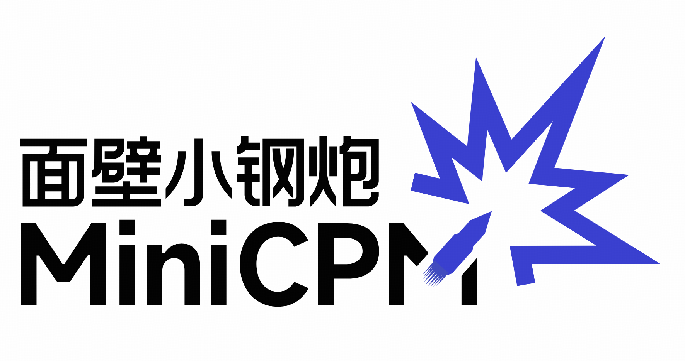

<div align="center">
</img> 
</div>

<h4 align="center">
    <p>
        <a href="https://github.com/OpenBMB/MiniCPM/blob/main/README.md">中文</a> | <b>English</b>
    <p>
</h4>

<p align="center">
<a href="https://openbmb.vercel.app/" target="_blank">Technical Blog</a> |
<a href="https://modelbest.feishu.cn/wiki/D2tFw8Pcsi5CIzkaHNacLK64npg" target="_blank">MiniCPM Wiki (in Chinese)</a> |
<a href="https://arxiv.org/abs/2404.06395" target="_blank">MiniCPM Paper</a> |
<a href="https://github.com/OpenBMB/MiniCPM-V/" target="_blank">MiniCPM-V Repo</a> |
Join our <a href="https://discord.gg/3cGQn9b3YM" target="_blank">discord</a> and <a href="https://github.com/OpenBMB/MiniCPM/blob/main/assets/wechat.jpg" target="_blank">WeChat</a>
</p>

## Changelog🔥

- [2024.09.28] **[LLMxMapReduce](https://github.com/thunlp/LLMxMapReduce) is open source and enables MiniCPM3-4B to process text of any length.** 
- [2024.09.18] **[SGLang](https://github.com/sgl-project/sglang) now supports MiniCPM3-4B. Thanks to inference optimizations made to the MLA structure (used in MiniCPM3) in SGLang v0.3, throughput has improved by 70% compared to vLLM!** [[Usage](#sglang-recommended)]
- [2024.09.16] [llama.cpp](https://github.com/ggerganov/llama.cpp/releases/tag/b3765) now officially supports MiniCPM3-4B! [[GGUF Model](https://huggingface.co/openbmb/MiniCPM3-4B-GGUF) | [Usage](#llamacpp)]
- [2024.09.05] We release [**MiniCPM3-4B**](https://huggingface.co/openbmb/MiniCPM3-4B)! This model outperforms Phi-3.5-mini-instruct and GPT-3.5-Turbo-0125 and is comparable to several models with 7B-9B parameters like Llama3.1-8B-Instruct, Qwen2-7B-Instruct, and GLM-4-9B-Chat.
- [2024.07.09] MiniCPM-2B has been supported by [SGLang](#sglang-inference)!
- [2024.07.05] Released [MiniCPM-S-1B](https://huggingface.co/openbmb/MiniCPM-S-1B-sft)! This model achieves an average sparsity of 87.89% in the FFN layer, reducing FFN FLOPs by 84%, while maintaining downstream task performance.
- [2024.04.11] Released [MiniCPM-2B-128k](https://huggingface.co/openbmb/MiniCPM-2B-128k), [MiniCPM-MoE-8x2B](https://huggingface.co/openbmb/MiniCPM-MoE-8x2B) and [MiniCPM-1B](https://huggingface.co/openbmb/MiniCPM-1B-sft-bf16)! Click [here](https://openbmb.vercel.app/) to read our technical blog.
- [2024.03.16] Intermediate checkpoints of MiniCPM-2B were released [here](https://huggingface.co/openbmb/MiniCPM-2B-history)!
- [2024.02.01] Released [**MiniCPM-2B**](https://huggingface.co/openbmb/MiniCPM-2B-sft-bf16)! This model performs similarly to Mistral-7B on public benchmarks (with better performance in Chinese, math, and code abilities) and overall outperforms models like Llama2-13B, MPT-30B, and Falcon-40B.

## Quick Links

- [Model Downloads](#model-downloads)
- [MiniCPM 3.0](#minicpm-30)
  - [Evaluation Results](#evaluation-results)
    - [Comprehensive Evaluation](#comprehensive-evaluation)
    - [Function Calling](#function-calling)
    - [Long Context](#long-context)
  - [Inference](#inference)
    - [HuggingFace](#huggingface)
    - [vLLM](#vllm)
    - [llama.cpp](#llamacpp)
  - [Fine-Tuning](#fine-tuning)
    - [LLaMA-Factory](#llama-factory)
  - [Advanced Features](#advanced-features)
    - [Function Calling](#function-calling-1)
    - [Code Interpreter](#code-interpreter)
- [MiniCPM 2.0](#minicpm-20)
- [MiniCPM 1.0](#minicpm-10)


## Model Downloads

  | HuggingFace | ModelScope |
  |-------------|------------|
  |[MiniCPM3-4B](https://huggingface.co/openbmb/MiniCPM3-4B)|[MiniCPM3-4B](https://www.modelscope.cn/models/OpenBMB/MiniCPM3-4B)|
  |[MiniCPM-2B-sft](https://huggingface.co/openbmb/MiniCPM-2B-sft-bf16)|[MiniCPM-2B-sft](https://modelscope.cn/models/OpenBMB/miniCPM-bf16)|
  |[MiniCPM-2B-dpo](https://huggingface.co/openbmb/MiniCPM-2B-dpo-bf16)|[MiniCPM-2B-dpo](https://modelscope.cn/models/OpenBMB/MiniCPM-2B-dpo-bf16/summary)|
  |[MiniCPM-2B-128k](https://huggingface.co/openbmb/MiniCPM-2B-128k) |[MiniCPM-2B-128k](https://modelscope.cn/models/openbmb/MiniCPM-2B-128k/summary)| 
  |[MiniCPM-MoE-8x2B](https://huggingface.co/openbmb/MiniCPM-MoE-8x2B) |[MiniCPM-MoE-8x2B](https://modelscope.cn/models/OpenBMB/MiniCPM-MoE-8x2B)| 
  |[MiniCPM-1B](https://huggingface.co/openbmb/MiniCPM-1B-sft-bf16) | [MiniCPM-1B](https://modelscope.cn/models/OpenBMB/MiniCPM-1B-sft-bf16) |
  |[MiniCPM-S-1B](https://huggingface.co/openbmb/MiniCPM-S-1B-sft)|[MiniCPM-S-1B](https://modelscope.cn/models/OpenBMB/MiniCPM-S-1B-sft)|

Note: More model versions can be found [here](https://huggingface.co/collections/openbmb/minicpm-2b-65d48bf958302b9fd25b698f).


## MiniCPM 3.0

MiniCPM 3.0 is a language model with 4 billion parameters. Compared to MiniCPM 1.0/2.0, it offers more comprehensive features and a significant improvement in overall capabilities. Its performance on most evaluation benchmarks rivals or even surpasses many models with 7B-9B parameters.

* **Supports Function Call🛠️ and Code Interpreter💻**: Achieved SOTA among models with fewer than 9B parameters on the [Berkeley Function Calling Leaderboard (BFCL)](https://gorilla.cs.berkeley.edu/leaderboard.html), outperforming GLM-4-9B-Chat and Qwen2-7B-Instruct.
* **Exceptional Reasoning Ability🧮**: In terms of math abilities, it outperforms GPT-3.5-Turbo and several 7B-9B models on [MathBench](https://open-compass.github.io/MathBench/). On the highly challenging [LiveCodeBench](https://livecodebench.github.io/), it surpasses Llama3.1-8B-Instruct.
* **Outstanding Instruction-Following in English and Chinese🤖**: Exceeds GLM-4-9B-Chat and Qwen2-7B-Instruct on English instruction following with [IFEval](https://huggingface.co/datasets/google/IFEval) and on Chinese instruction following with [FollowBench-zh](https://huggingface.co/datasets/YuxinJiang/FollowBench).
* **Long Context Capability**: Natively supports 32k context length, with flawless performance. We introduce the [LLMxMapReduce](https://github.com/thunlp/LLMxMapReduce) framework, theoretically enabling processing of context lengths up to infinity. Enhanced by LLMxMapReduce, MiniCPM3-4B achieves performance comparable to GPT-4 and KimiChat on InfiniteBench.
* **RAG Capability**：We release [MiniCPM RAG Suite](https://huggingface.co/collections/openbmb/minicpm-rag-suite-66d976b4204cd0a4f8beaabb). Based on the MiniCPM series models, [MiniCPM-Embedding](https://huggingface.co/openbmb/MiniCPM-Embedding) and [MiniCPM-Reranker](https://huggingface.co/openbmb/MiniCPM-Reranker) achieve SOTA performance on Chinese and Chinese-English cross-lingual retrieval tests. Specifically designed for the RAG scenario, [MiniCPM3-RAG-LoRA](https://huggingface.co/openbmb/MiniCPM3-RAG-LoRA) outperforms models like Llama3-8B and Baichuan2-13B on multiple tasks, such as open-domain question answering.

## Evaluation Results

### Comprehensive Evaluation

<table>
    <tr>
        <td>Benchmarks</td>
        <td>Qwen2-7B-Instruct</td>
        <td>GLM-4-9B-Chat</td>
        <td>Gemma2-9B-it</td>
        <td>Llama3.1-8B-Instruct</td>
        <td>GPT-3.5-Turbo-0125</td>
        <td>Phi-3.5-mini-Instruct(3.8B)</td>
        <td>MiniCPM3-4B </td>
    </tr>
    <tr>
        <td colspan="15" align="left"><strong>English</strong></td>
    </tr>
    <tr>
        <td>MMLU</td>
        <td>70.5</td>
        <td>72.4</td>
        <td>72.6</td>
        <td>69.4</td>
        <td>69.2</td>
        <td>68.4</td>
        <td>67.2 </td>
    </tr>
    <tr>
        <td>BBH</td>
        <td>64.9</td>
        <td>76.3</td>
        <td>65.2</td>
        <td>67.8</td>
        <td>70.3</td>
        <td>68.6</td>
        <td>70.2 </td>
    </tr>
    <tr>
        <td>MT-Bench</td>
        <td>8.41</td>
        <td>8.35</td>
        <td>7.88</td>
        <td>8.28</td>
        <td>8.17</td>
        <td>8.60</td>
        <td>8.41 </td>
    </tr>
    <tr>
        <td>IFEVAL (Prompt Strict-Acc.)</td>
        <td>51.0</td>
        <td>64.5</td>
        <td>71.9</td>
        <td>71.5</td>
        <td>58.8</td>
        <td>49.4</td>
        <td>68.4 </td>
    </tr>
    <tr>
        <td colspan="15" align="left"><strong>Chinese</strong></td>
    </tr>
    <tr>
        <td>CMMLU</td>
        <td>80.9</td>
        <td>71.5</td>
        <td>59.5</td>
        <td>55.8</td>
        <td>54.5</td>
        <td>46.9</td>
        <td>73.3 </td>
    </tr>
    <tr>
        <td>CEVAL</td>
        <td>77.2</td>
        <td>75.6</td>
        <td>56.7</td>
        <td>55.2</td>
        <td>52.8</td>
        <td>46.1</td>
        <td>73.6 </td>
    </tr>
    <tr>
        <td>AlignBench v1.1</td>
        <td>7.10</td>
        <td>6.61</td>
        <td>7.10</td>
        <td>5.68</td>
        <td>5.82</td>
        <td>5.73</td>
        <td>6.74 </td>
    </tr>
    <tr>
        <td>FollowBench-zh (SSR)</td>
        <td>63.0</td>
        <td>56.4</td>
        <td>57.0</td>
        <td>50.6</td>
        <td>64.6</td>
        <td>58.1</td>
        <td>66.8 </td>
    </tr>
    <tr>
        <td colspan="15" align="left"><strong>Mathematics</strong></td>
    </tr>
    <tr>
        <td>MATH</td>
        <td>49.6</td>
        <td>50.6</td>
        <td>46.0</td>
        <td>51.9</td>
        <td>41.8</td>
        <td>46.4</td>
        <td>46.6 </td>
    </tr>
    <tr>
        <td>GSM8K</td>
        <td>82.3</td>
        <td>79.6</td>
        <td>79.7</td>
        <td>84.5</td>
        <td>76.4</td>
        <td>82.7</td>
        <td>81.1 </td>
    </tr>
    <tr>
        <td>MathBench</td>
        <td>63.4</td>
        <td>59.4</td>
        <td>45.8</td>
        <td>54.3</td>
        <td>48.9</td>
        <td>54.9</td>
        <td>65.6 </td>
    </tr>
    <tr>
        <td colspan="15" align="left"><strong>Coding</strong></td>
    </tr>
    <tr>
        <td>HumanEval+</td>
        <td>70.1</td>
        <td>67.1</td>
        <td>61.6</td>
        <td>62.8</td>
        <td>66.5</td>
        <td>68.9</td>
        <td>68.3 </td>
    </tr>
    <tr>
        <td>MBPP+</td>
        <td>57.1</td>
        <td>62.2</td>
        <td>64.3</td>
        <td>55.3</td>
        <td>71.4</td>
        <td>55.8</td>
        <td>63.2 </td>
    </tr>
    <tr>
        <td>LiveCodeBench v3</td>
        <td>22.2</td>
        <td>20.2</td>
        <td>19.2</td>
        <td>20.4</td>
        <td>24.0</td>
        <td>19.6</td>
        <td>22.6 </td>
    </tr>
    <tr>
        <td colspan="15" align="left"><strong>Tool Use</strong></td>
    </tr>
    <tr>
        <td>BFCL v2</td>
        <td>71.6</td>
        <td>70.1</td>
        <td>19.2</td>
        <td>73.3</td>
        <td>75.4</td>
        <td>48.4</td>
        <td>76.0 </td>
    </tr>
    <tr>
        <td colspan="15" align="left"><strong>Overall</strong></td>
    </tr>
    <tr>
        <td>Average</td>
        <td>65.3</td>
        <td>65.0</td>
        <td>57.9</td>
        <td>60.8</td>
        <td>61.0</td>
        <td>57.2</td>
        <td><strong>66.3</strong></td>
    </tr>
</table>

#### Function Calling

We evaluate the function calling capability of MiniCPM3 on [Berkeley Function Calling Leaderboard (BFCL)](https://gorilla.cs.berkeley.edu/leaderboard.html). MiniCPM3-4B outperforms several models with 7B-9B parameters on this leaderboard, surpassing GPT-3.5-Turbo-0125.

<table>
    <tr>
        <td>Model</td>
        <td>Overall Accuracy</td>
        <td>AST Summary</td>
        <td>Exec Summary</td>
        <td>Irrelevance Detection</td>
        <td>Relevance Detection </td>
    </tr>
    <tr>
        <td>MiniCPM3-4B</td>
        <td>76.03%</td>
        <td>68.55%</td>
        <td>85.54%</td>
        <td>53.71%</td>
        <td>90.24% </td>
    </tr>
    <tr>
        <td>Llama3.1-8B-Instruct</td>
        <td>73.28%</td>
        <td>64.61%</td>
        <td>86.48%</td>
        <td>43.12%</td>
        <td>85.37% </td>
    </tr>
    <tr>
        <td>Qwen2-7B-Instruct</td>
        <td>71.61%</td>
        <td>65.71%</td>
        <td>79.57%</td>
        <td>44.70%</td>
        <td>90.24% </td>
    </tr>
    <tr>
        <td>GLM-4-9B-Chat</td>
        <td>70.08%</td>
        <td>60.69%</td>
        <td>80.02%</td>
        <td>55.02%</td>
        <td>82.93% </td>
    </tr>
    <tr>
        <td>Phi-3.5-mini-instruct</td>
        <td>48.44%</td>
        <td>38.89%</td>
        <td>54.04%</td>
        <td>46.78%</td>
        <td>65.85% </td>
    </tr>
    <tr>
        <td>Gemma2-9B-it</td>
        <td>19.18%</td>
        <td>5.41%</td>
        <td>18.50%</td>
        <td>88.88%</td>
        <td>7.32%</td>
    </tr>
</table>


#### Long Context Capability

In the [Needle in a Haystack](https://github.com/gkamradt/LLMTest_NeedleInAHaystack) test with a context length of 32k, the results are shown as follows:


We also propose a divide-and-conquer long-sequence processing framework [LLMxMapReduce](https://github.com/thunlp/LLMxMapReduce) to support text with any length. MiniCPM3xMapReduce can achieve comparable performance with GPT-4 and KimiChat.

|                               | Context length| Qwen2-70b | Kimi-Chat(2024.06) | GPT-4 (From InfiniteBench) | MiniCPM 3.0 x MR | Qwen2-70b x MR | Llama3-70bx MR |
| ----------------------------- | ---------- | --------- | ------------------ | -------------------------- | --------------- | ------------ | ------------- |
| Math.Find                     | 87.9k      | 59.71%    | 18.57%             | 60.00%                     | 83.43%          | 54.29%       | **91.43%**        |
| Retrieve.KV                   | 89.9k      | 29.00%    | 69.20%             | 89.00%                     | 93.80%          | 98.80%       | **98.89%**        |
| En.Dia                        | 103.6K     | 23.00%    | 23.00%             | 7.50%                      | 12.50%          | **46.50%**       | 17.50%        |
| Code.Debug                    | 114.7k     | 45.43%    | 38.32%             | 54.31%                     | 25.63%          | 54.82%       | **62.94%**       |
| Retrieve.Number               | 122.4k     | **100.00%**  | 97.45%             | **100.00%**                   | 99.32%          | **100.00%**     | 99.79%        |
| Retrieve.PassKey              | 122.4k     | **100.00%**   | 99.32%             | **100.00%**                   | 98.81%          | **100.00%**     | **100.00%**      |
| En.Sum                        | 171.5K     | 31.85%    | 29.94%             | 14.73%                     | 25.89%          | **32.39%**       | 30.63%        |
| En.MC                         | 184.4k     | 81.66%    | 79.91%             | 68.12%                     | 66.38%          |**83.84%**      | 82.10%        |
| En.QA        | 192.6k     | 21.97%    | 18.80%             | 22.44%                     | 28.39%          | 23.13%       | **34.70%**      |
| Zh.QA        | 2068.6k    | 21.40%    | 19.84%             | **25.96%**                    | 23.66%          | 19.10%       | N/A           |
| avg w/o Zh.QA | /          | 51.92%    | 52.96%             | 55.33%                     | 59.29%          | 64.98%       | **68.64%**        |
| avg                           | /          | 48.86%    | 49.65%             | 52.39%                     | 55.55%          | **60.39%**       | N/A           |

### Inference

#### Huggingface
```python
from transformers import AutoModelForCausalLM, AutoTokenizer
import torch
torch.manual_seed(0)

path = 'openbmb/MiniCPM3-4B'
tokenizer = AutoTokenizer.from_pretrained(path)
model = AutoModelForCausalLM.from_pretrained(path, torch_dtype=torch.bfloat16, device_map='cuda', trust_remote_code=True)

responds, history = model.chat(tokenizer, "Write an article about Artificial Intelligence.", temperature=0.7, top_p=0.7)
print(responds)
```

#### SGLang (Recommended)
* Installation

Refer to SGLang [repo](https://github.com/sgl-project/sglang) to install the latest version *via source code*.

* Launch a server
```shell
python -m sglang.launch_server --model openbmb/MiniCPM3-4B --trust-remote-code --port 30000 --chat-template chatml
```

* Example code
```python
from sglang import function, system, user, assistant, gen, set_default_backend, RuntimeEndpoint

@function
def multi_turn_question(s, question_1, question_2):
    s += user(question_1)
    s += assistant(gen("answer_1", max_tokens=1024))
    s += user(question_2)
    s += assistant(gen("answer_2", max_tokens=1024))

set_default_backend(RuntimeEndpoint("http://localhost:30000"))

state = multi_turn_question.run(
    question_1="Introduce artificial intelligence",
    question_2="Write an article about it",
)

for m in state.messages():
    print(m["role"], ":", m["content"])
```


#### vLLM
* Install vllm
  ```shell
  pip install "vllm>=0.6.2"
  ```
* Inference
  ```python
  from transformers import AutoTokenizer
  from vllm import LLM, SamplingParams

  model_name = "openbmb/MiniCPM3-4B"
  prompt = [{"role": "user", "content": "Write an article about Artificial Intelligence."}]

  tokenizer = AutoTokenizer.from_pretrained(model_name, trust_remote_code=True)
  input_text = tokenizer.apply_chat_template(prompt, tokenize=False, add_generation_prompt=True)

  llm = LLM(model=model_name,
      trust_remote_code=True,
      tensor_parallel_size=1
  )
  sampling_params = SamplingParams(top_p=0.7, temperature=0.7, max_tokens=1024)

  outputs = llm.generate(prompts=input_text, sampling_params=sampling_params)

  print(outputs[0].outputs[0].text)
  ```

#### llama.cpp

We have provided the [GGUF formats]((https://huggingface.co/openbmb/MiniCPM3-4B-GGUF)) of MiniCPM3, which can be used in llama.cpp.

* Install llama.cpp
  ```shell
    git clone https://github.com/ggerganov/llama.cpp
    cd llama.cpp
    make
  ```
* Inference
  ```shell
  ./llama-cli -c 1024 -m minicpm3-4b-fp16.gguf -n 1024 --top-p 0.7 --temp 0.7 --prompt "<|im_start|>user\nWrite an article about Artificial Intelligence.<|im_end|>\n<|im_start|>assistant\n"
  ```

### Fine-Tuning

#### LLaMA-Factory

We have supported fine-tuning MiniCPM3 using [LLaMA-Factory](https://github.com/hiyouga/LLaMA-Factory). For usage instructions, refer to [LLaMA-Factory Fine-tuning](https://modelbest.feishu.cn/docx/Z7USdW4lloZzkZxQ14icJ3senjb?from=from_copylink)."

### Advanced Features

We use [vLLM](#vllm) in the example code for the following advanced features.

#### Function calling

We provide example code for using function calls with MiniCPM3:

```bash
cd demo/minicpm3/function_call
python function_call.py
```

If you want to start a function call service, use the following commands:

```bash
cd demo/minicpm3/function_call
pip install -r requirements.txt
python openai_api_server.py \
    --model openbmb/MiniCPM3-4B \
    --served-model-name MiniCPM3-4B \
    --chat-template chatml.jinja \
    --dtype auto \
    --api-key token-abc123 \
    --tensor-parallel-size 1 \
    --trust-remote-code
```

Below is a demo of using a search engine to answer the question:


#### Code Interpreter

We provide example code for using the code interpreter with MiniCPM3:

```bash
cd demo/minicpm3/code_interpreter
pip install -r requirements.txt
python code_interpreter.py openbmb/MiniCPM3-4B
```

Below is an example of using the code interpreter to generate a QR code:


## MiniCPM 2.0
<details>
<summary>Click to view details about MiniCPM2.0</summary>

### Introdution
MiniCPM 2.0 series upgrade MiniCPM in multiple dimensions, including:
- [MiniCPM-2B-128k](https://huggingface.co/openbmb/MiniCPM-2B-128k)：Extend the length of MiniCPM-2B context window to 128k, outperform larger models such as ChatGLM3-6B-128k、Yi-6B-200k on InfiniteBench.
- [MiniCPM-MoE-8x2B](https://huggingface.co/openbmb/MiniCPM-MoE-8x2B)：Upcycling from MiniCPM-2B. Compared to MiniCPM-2B, the overall performance improves by an average of 4.5pp.
- [MiniCPM-1B](https://huggingface.co/openbmb/MiniCPM-1B-sft-bf16): 60% inference cost reduction compared with MiniCPM-2B, while still showing better overall performance than LLaMA2-13B.
- [MiniCPM-S-1B](https://huggingface.co/openbmb/MiniCPM-S-1B-sft): The FFN layer achieves an average sparsity of 87.89% and reduces FFN FLOPs by 84%, while maintaining no performance loss in downstream tasks. Combined with the PowerInfer, MiniCPM-S-1B inferece speed increase is approximately 2.8x.

### Evaluation Results

#### MiniCPM-2B-128k
| Model                               | avg   | avg w/o code&math | passkey | number_string | kv_retrieval | longbook_choice_eng | longbook_qa_chn | longbook_qa_eng | longbook_sum_eng | longdialogue_qa_eng | math_calc | math_find | code_debug | code_run |
|-------------------------------------|-------|-------------------|---------|---------------|--------------|---------------------|-----------------|-----------------|------------------|---------------------|-----------|-----------|------------|----------|
| LWM-Text-128k                       | 24.45 | 33.62             | 100     | 97.8          | 0.6          | 28.82               | 15.93           | 14.31           | 9.99             | 1.5                 | 0         | 3.43      | 20.05      | 1        |
| Yarn-Mistral-7b-128k                | 19.84 | 27.36             | 92.71   |               | 0            | 27.95               | 15.49           | 9.55            | 9.06             | 7.5                 | 0         | 17.14     | 0.76       | 1.25     |
| Mistral-7B-Instruct-v0.2(ABF 1000w) | 27.75 | 36.9              | 100     | 78.98         | 3.6          | 37.12               | 11.74           | 17.37           | 21.12            | 9.5                 | 0         | 29.43     | 17.51      | 0        |
| Yi-6B-200k                          | 22.15 | 32.54             | 100     | 94.92         | 0            | 36.68               | 15.07           | 9.2             | 0.92             | 3.5                 | 0         | 4.29      | 0.51       | 0.75     |
| chatglm3-6b-128k                    | 25.58 | 36.57             | 89.93   | 99.66         | 5.2          | 46.29               | 10.7            | 8.38            | 25.91            | 6.5                 | 0         | 8         | 5.33       | 1        |
| MiniCPM-2.4B-128k                   | 27.32 | 37.68             | 98.31   | 99.83         | 9            | 29.69               | 23.06           | 16.33           | 15.73            | 9.5                 | 0         | 4.29      | 22.08      | 0        |

#### MiniCPM-MoE-8x2B
<div align="left">

<table style="margin: 0px auto;">
<thead>
  <tr>
    <th align="left">Model</th>
    <th nowrap="nowrap" >BBH</th>
    <th nowrap="nowrap" >MMLU</th>
    <th nowrap="nowrap" >CEval</th>
    <th nowrap="nowrap" >CMMLU</th>
    <th nowrap="nowrap" >HumanEval</th>
    <th nowrap="nowrap" >MBPP&dagger;</th>
    <th nowrap="nowrap" >GSM8K</th>
    <th nowrap="nowrap" >MATH</th
  </tr>
</thead>
<tbody align="center">
  <tr>
    <td nowrap="nowrap" align="left">Llama2-34B*</td>
    <td>44.1</td>
    <td>62.6</td>
    <td>-</td>
    <td>-</td>
    <td>22.6</td>
    <td>33.0</td>
    <td>42.2</td>
    <td>6.24</td>
  </tr>
  <tr>
    <td nowrap="nowrap" align="left">Mistral-7B-Instruct-v0.2</td>
    <td>39.81</td>
    <td>60.51</td>
    <td>42.55</td>
    <td>41.92</td>
    <td>36.59</td>
    <td>39.63</td>
    <td>40.49</td>
    <td>4.95</td>
  </tr>
  <tr>
    <td nowrap="nowrap" align="left" >Gemma-7B*</td>
    <td>55.1</td>
    <td>64.3</td>
    <td>-</td>
    <td>-</td>
    <td>32.3</td>
    <td>44.4</td>
    <td>46.4</td>
    <td>24.3</td>
  </tr>
  <tr>
    <td nowrap="nowrap" align="left" >Qwen1.5-7B*</td>
    <td>40.2</td>
    <td>61</td>
    <td>74.1</td>
    <td>73.1</td>
    <td>36</td>
    <td>37.4</td>
    <td>62.5</td>
    <td>20.3</td>
  </tr>
  <tr>
    <td  nowrap="nowrap" align="left" >Deepseek-MoE(16B)*</td>
    <td>-</td>
    <td>45.0</td>
    <td>40.6</td>
    <td>42.5</td>
    <td>26.8</td>
    <td>39.2</td>
    <td>18.8</td>
    <td>4.3</td>
  </tr>
  <tr>
    <td nowrap="nowrap" align="left" ><b>MiniCPM-2.4B</b></td>
    <td>36.87</td>
    <td>53.46</td>
    <td>51.13</td>
    <td>51.07</td>
    <td>50.00</td>
    <td>35.93</td>
    <td>53.83</td>
    <td>10.24</td>
  </tr>
  <tr>
    <td nowrap="nowrap" align="left" ><b>MiniCPM-MoE-8x2B</b></td>
    <td>39.22</td>
    <td>58.90</td>
    <td>58.11</td>
    <td>58.80</td>
    <td>55.49</td>
    <td>41.68</td>
    <td>61.56</td>
    <td>10.52</td>
  </tr>
</tbody>
</table>

</div>

Note：* means evaluation results are directly taken from their technical reports. &dagger; means evaluation results on the full set of
MBPP, instead of the hand-verified set.


#### MiniCPM-S-1B

- Code Generation：Average pass@1 score of HumanEval(0-shot) and MBPP(3-shot).
- Commonsense Reasoning: Average 0-shot accuracy of PIQA, SIQA, HellaSwag, WinoGrande and COPA.
- Reading Comprehension: Average 0-shot accuracy of BoolQ, LAMBADA and TyDi-QA.
- Other Benchmarks: We report average performance of GSM8K(8-shot)、MMLU(5-shot)、BBH(3-shot) and AGI-Eval(0-shot).

|        Setting        | Average<br>Sparsity | Average<br>Performance | Code<br>Generation | Commonsense<br>Reasoning | Reading<br>Comprehension | GSM8K | MMLU  |  BBH  | AGI-Eval |
| :-------------------: | :----------------: | :----------------------: | :----------------------: | :---: | :---: | :---: | :---------: | :-----: | :-----------------: |
| LLaMA2-7B    | - | 37.96 | 16.37 | 69.59 | 61.87 | 12.96 | 44.45 | 32.96 | 27.53 |
| ReluLLaMA-7B | 66.98 | 37.62 | 15.85 | 69.64 | 70.54 |  5.84 | 38.64 | 35.07 | 27.73 |
| **ProSparse-7B**\* | 88.11 | 38.31 | 19.47 | 66.29 | 63.33 | 12.74 | 45.21 | 33.59 | 27.55 |
| **ProSparse-7B**   | **89.32** | **38.46** | 19.42 | 66.27 | 63.50 | 12.13 | 45.48 | 34.99 | 27.46 |
| LLaMA2-13B | - | 44.06 | 20.19 | 72.58 | 71.55 | 22.21 | 54.69 | 37.89 | 29.33 |
| ReluLLaMA-13B | 71.56 | 42.74 | 20.19 | 70.44 | 73.29 | 18.50 | 50.58 | 37.97 | 28.22 |
| **ProSparse-13B**\* | 87.97 | **45.07** | 29.03 | 69.75 | 67.54 | 25.40 | 54.78 | 40.20 | 28.76 |
| **ProSparse-13B**   | **88.80** | 44.90 | 28.42 | 69.76 | 66.91 | 26.31 | 54.35 | 39.90 | 28.67 |
| MiniCPM-1B | - | 44.44 | 36.85 | 63.67 | 60.90 | 35.48 | 50.44 | 35.03 | 28.71 |
| **MiniCPM-S-1B**\*  | 86.25 | **44.72** | 41.38 | 64.55 | 60.69 | 34.72 | 49.36 | 34.04 | 28.27 |
| **MiniCPM-S-1B**    | **87.89** | **44.72** | 42.04 | 64.37 | 60.73 | 34.57 | 49.51 | 34.08 | 27.77 |

Note：
1. [ReluLLaMA-7B](https://huggingface.co/SparseLLM/ReluLLaMA-7B) and [ReluLLaMA-13B](https://huggingface.co/SparseLLM/ReluLLaMA-13B). "ProSparse-7B\*"、"ProSparse-13B\*" and "MiniCPM-S-1B\*" represent ProSparse versions that don't have activation thresholds offset.
2. For PIQA, SIQA, HellaSwag, WinoGrande, COPA, BoolQ, LAMBADA, TyDi QA and AGI-Eval, we adopt ppl-based evalution. For GSM8K, MMLU and BBH, we perform generation-based evalution.


### Inference
#### HuggingFace, vLLM
Please refer to [Inference](#huggingface-inferene) section in MiniCPM1.0.

#### PowerInfer
Currently, PowerInfer is exclusively tailored for the MiniCPM-S-1B model; support for other versions is not yet available, stay tuned.
1. Ensure your cmake version is 3.17 or above. If you have already installed it, you can skip this step.
```bash
    # Download the installation package
    sudo wget https://cmake.org/files/v3.23/cmake-3.23.0.tar.gz
    # Extract the installation package
    sudo tar -zxvf cmake-3.23.0.tar.gz
    # Configure the installation environment
    sudo ./configure
    sudo make -j8
    # Compile and install
    sudo make install
    # Check the version after installation
    cmake --version
    # If the version number is returned, the installation was successful
    # cmake version 3.23.0
```
2. Install PowerInfer:：
```bash
  git clone https://github.com/SJTU-IPADS/PowerInfer
  cd PowerInfer
  pip install -r requirements.txt # install Python helpers' dependencies
```
3. Compile the CPU version of PowerInfer. If your machine only has a CPU, or if you want to perform inference using the CPU, run the following commands:：
```bash
  cmake -S . -B build
  cmake --build build --config Release
```
4. Compile the GPU version of PowerInfer. If your machine has a GPU, you can run the following commands:
```bash
  cmake -S . -B build -DLLAMA_CUBLAS=ON
  cmake --build build --config Release
```
5. Retrieve the sparse model:
```bash
git clone https://huggingface.co/openbmb/MiniCPM-S-1B-sft-gguf/tree/main
#or
git clone https://modelscope.cn/models/OpenBMB/MiniCPM-S-1B-sft-gguf
```
6. Model Inference:
```bash
cd PowerInfer
# Below is the command template. output_token_count refers to the maximum output tokens, thread_num is the number of threads, and prompt is the input prompt text.
#./build/bin/main -m /PATH/TO/MODEL -n $output_token_count -t $thread_num -p $prompt
# Below is an example
./build/bin/main -m /root/ld/ld_model_pretrain/1b-s-minicpm/MiniCPM-S-1B-sft.gguf -n 2048 -t 8 -p '<User>hello,tell me a story please.<AI>'
```

</details>


## MiniCPM 1.0
<details>
<summary>Click to view details about MiniCPM1.0</summary>

### Introduction
MiniCPM-2B is a dense language model with only 2.4B parameters excluding embeddings (2.7B in total). 

- MiniCPM has very close performance compared with Mistral-7B on open-sourced general benchmarks with better ability on Chinese, Mathematics and Coding after SFT. The overall performance exceeds Llama2-13B, MPT-30B, Falcon-40B, etc.

- After DPO, MiniCPM outperforms Llama2-70B-Chat, Vicuna-33B, Mistral-7B-Instruct-v0.1, Zephyr-7B-alpha, etc. on MTBench.

Note: To ensure the generality of the model for academic research purposes, **we have not subject it to any identity-specific training.** Meanwhile, as we use ShareGPT open-source corpus as part of the training data, the model may output identity-related information similar to the GPT series models.

### Evaluation Results

#### Evaluation Settings
* Since it is difficult to standardize the evaluation of LLMs and there is no public prompt and test code for a large number of evaluations, we can only try our best to make it suitable for all types of models in terms of specific evaluation methods.
* Overall, we use a unified prompt input for testing, and adjust the input according to the corresponding template for each model.
* **The evaluation scripts and prompts have been open-sourced in our Github repository, and we welcome more developers to continuously improve our evaluation methods.**
  * For the text evaluation part, we use our open source large model capability evaluation framework [UltraEval](https://github.com/OpenBMB/UltraEval). The following is the open source model reproduction process:
    * install UltraEval
      ```shell
      git clone https://github.com/OpenBMB/UltraEval.git
      cd UltraEval
      pip install -e .
      ```
    * Download the relevant data and unzip it for processing
      ```shell
      wget -O RawData.zip "https://cloud.tsinghua.edu.cn/f/71b5232264ae4833a4d0/?dl=1"
      unzip RawData.zip
      python data_process.py
      ```
    * Execute evaluation scripts (templates are provided and can be customized)
      ```shell
      bash run_eval.sh
      ```

#### Deployment mode

* Because MiniCPM uses the structure of Mup, which is slightly different from existing models in terms of specific computations, we have based the implementation of our model on the vllm=0.2.2 version.
* **For non-MiniCPM models, we directly sampled the latest version of vllm=0.2.7 for inference.**

#### Evaluation method

* For the QA task (multiple-choice task), we chose to test in two ways:
  * PPL: The options are used as a continuation of the question generation and the answer selection is based on the PPL of each option;
  * The second is to generate the answer options directly.
* For different models, the results obtained by these two approaches vary widely. the results on both MiniCPM models are closer, while models such as Mistral-7B-v0.1 perform better on PPL and worse on direct generation.
* In the specific evaluation, we take the higher score of the two evaluation methods as the final result, so as to ensure the fairness of the comparison (* in the following table indicates the PPL).

#### Text evaluation

|Model|Average Score|Average Score in English|Average Score in Chinese|C-Eval|CMMLU|MMLU|HumanEval|MBPP|GSM8K|MATH|BBH|ARC-E|ARC-C|HellaSwag|
|-|-|-|-|-|-|-|-|-|-|-|-|-|-|-|
|Llama2-7B|35.40|36.21|31.765|32.42|31.11|44.32|12.2|27.17|13.57|1.8|33.23|75.25|42.75|75.62*|
|Qwen-7B|49.46|47.19|59.655|58.96|60.35|57.65|17.07|42.15|41.24|5.34|37.75|83.42|64.76|75.32*|
|Deepseek-7B|39.96|39.15|43.635|42.82|44.45|47.82|20.12|41.45|15.85|1.53|33.38|74.58*|42.15*|75.45*|
|Mistral-7B|48.97|49.96|44.54|46.12|42.96|62.69|27.44|45.2|33.13|5.0|41.06|83.92|70.73|80.43*|
|Llama2-13B|41.48|42.44|37.19|37.32|37.06|54.71|17.07|32.55|21.15|2.25|37.92|78.87*|58.19|79.23*|
|MPT-30B|38.17|39.82|30.715|29.34|32.09|46.56|21.95|35.36|10.31|1.56|38.22|78.66*|46.08*|79.72*|
|Falcon-40B|43.62|44.21|40.93|40.29|41.57|53.53|24.39|36.53|22.44|1.92|36.24|81.94*|57.68|83.26*|
|MiniCPM-2B|52.33|52.6|51.1|51.13|51.07|53.46|50.00|47.31|53.83|10.24|36.87|85.44|68.00|68.25|

|Model|Average Score|Average Score in English|Average Score in Chinese|C-Eval|CMMLU|MMLU|HumanEval|MBPP|GSM8K|MATH|BBH|ARC-E|ARC-C|HellaSwag|
|-|-|-|-|-|-|-|-|-|-|-|-|-|-|-|
|TinyLlama-1.1B|25.36|25.55|24.525|25.02|24.03|24.3|6.71|19.91|2.27|0.74|28.78|60.77*|28.15*|58.33*|Qwen-1.8B|34.72|31.87|47.565|49.81|45.32|43.37|7.93|17.8|19.26|2.42|29.07|63.97*|43.69|59.28*|
|Qwen-1.8B|34.72|31.87|47.565|49.81|45.32|43.37|7.93|17.8|19.26|2.42|29.07|63.97*|43.69|59.28*|
|Gemini Nano-3B|-|-|-|-|-|-|-|27.2(report)|22.8(report)|-|42.4(report)|-|-|-|
|StableLM-Zephyr-3B|43.46|46.31|30.615|30.34|30.89|45.9|35.37|31.85|52.54|12.49|37.68|73.78|55.38|71.87*|
|Phi-2-2B|48.84|54.41|23.775|23.37|24.18|52.66|47.56|55.04|57.16|3.5|43.39|86.11|71.25|73.07*|
|MiniCPM-2B|52.33|52.6|51.1|51.13|51.07|53.46|50.00|47.31|53.83|10.24|36.87|85.44|68.00|68.25|

|Model|Average Score|Average Score in English|Average Score in Chinese|C-Eval|CMMLU|MMLU|HumanEval|MBPP|GSM8K|MATH|BBH|ARC-E|ARC-C|HellaSwag|
|-|-|-|-|-|-|-|-|-|-|-|-|-|-|-|
|ChatGLM2-6B|37.98|35.17|50.63|52.05|49.21|45.77|10.37|9.38|22.74|5.96|32.6|74.45|56.82|58.48*|
|Mistral-7B-Instruct-v0.1|44.36|45.89|37.51|38.06|36.96|53.56|29.27|39.34|28.73|3.48|39.52|81.61|63.99|73.47*|
|Mistral-7B-Instruct-v0.2|50.91|52.83|42.235|42.55|41.92|60.51|36.59|48.95|40.49|4.95|39.81|86.28|73.38|84.55*|
|Qwen-7B-Chat|44.93|42.05|57.9|58.57|57.23|56.03|15.85|40.52|42.23|8.3|37.34|64.44*|39.25*|74.52*|
|Yi-6B-Chat|50.46|45.89|70.995|70.88|71.11|62.95|14.02|28.34|36.54|3.88|37.43|84.89|70.39|74.6*|
|Baichuan2-7B-Chat|44.68|42.74|53.39|53.28|53.5|53|21.34|32.32|25.25|6.32|37.46|79.63|60.15|69.23*|
|Deepseek-7B-chat|49.34|49.56|48.335|46.95|49.72|51.67|40.85|48.48|48.52|4.26|35.7|76.85|63.05|76.68*|
|Llama2-7B-Chat|38.16|39.17|33.59|34.54|32.64|47.64|14.02|27.4|21.15|2.08|35.54|74.28|54.78|75.65*|
|MiniCPM-2B|52.33|52.6|51.1|51.13|51.07|53.46|50.00|47.31|53.83|10.24|36.87|85.44|68.00|68.25|

#### DPO evaluation

|Model|MT-bench|
|---|---|
|GPT-4-turbo|9.32|
|GPT-3.5-turbo|8.39|
|Mistral-8*7b-Instruct-v0.1|8.30|
|Claude-2.1|8.18|
|Zephyr-7B-beta|7.34|
|**MiniCPM-2B**|**7.25**|
|Vicuna-33B|7.12|
|Zephyr-7B-alpha|6.88|
|LLaMA-2-70B-chat|6.86|
|Mistral-7B-Instruct-v0.1|6.84|
|MPT-34B-instruct|6.39|

### Quick Start

#### Online

- [Colab](https://colab.research.google.com/drive/1tJcfPyWGWA5HezO7GKLeyeIso0HyOc0l?usp=sharing)

#### Web-demo based on Gradio

Using the following command can launch the gradio-based demo. 

```shell
# generation powered by vllm
python demo/minicpm/vllm_based_demo.py --model_path <vllmcpm_repo_path>
# generation powered by huggingface
python demo/minicpm/hf_based_demo.py --model_path <hf_repo_path>
```

#### Huggingface Inferene

##### MiniCPM-2B

Install `transformers>=4.36.0` and `accelerate`，run the following python code:

```python
from transformers import AutoModelForCausalLM, AutoTokenizer
import torch
torch.manual_seed(0)

path = 'openbmb/MiniCPM-2B-dpo-bf16'
tokenizer = AutoTokenizer.from_pretrained(path)
model = AutoModelForCausalLM.from_pretrained(path, torch_dtype=torch.bfloat16, device_map='cuda', trust_remote_code=True)

responds, history = model.chat(tokenizer, "Which city is the capital of China?", temperature=0.8, top_p=0.8)
print(responds)
```

##### MiniCPM-2B (Llama Format)

To facilitate ease of use, we have converted the model weights of MiniCPM to adapt to the structure of the LLaMA model:

```python
import torch
from transformers import LlamaTokenizerFast, LlamaForCausalLM
model_path = "openbmb/MiniCPM-2B-dpo-bf16-llama-format"
tokenizer = LlamaTokenizerFast.from_pretrained(model_path)
model = LlamaForCausalLM.from_pretrained(model_path, torch_dtype=torch.bfloat16, device_map='cuda', trust_remote_code=True)

prompt="Now you act like a terminal situated within a beginner's C++ practice repository folder, please provide the output for the command: `ls -l`"
input_ids = tokenizer.encode("<User>{}<AI>".format(prompt), return_tensors='pt', add_special_tokens=True).cuda()
responses = model.generate(input_ids, temperature=0.3, top_p=0.8, repetition_penalty=1.02, max_length=1024)
responses = tokenizer.decode(responses[0], skip_special_tokens=True)
print(responses)
```

#### vLLM Inference

Install [vLLM](https://github.com/vllm-project/vllm).

```shell
pip install "vllm>=0.4.1"
```

See [here](#vllm) for the inference code.

#### SGLang Inference

Install [SGLang](https://github.com/sgl-project/sglang).

* First, launch a server:

```bash
python -m sglang.launch_server --model-path openbmb/MiniCPM-2B-dpo-fp16 --trust-remote-code --port 30000
```

* You can use it for inference as shown below:

```python
from sglang import function, gen, set_default_backend, RuntimeEndpoint

@function
def text_qa(s, question):
    s += "<User>" + question + "<AI>"
    s += gen("answer", max_tokens=1024, temperature=0.7, top_p=0.7)

set_default_backend(RuntimeEndpoint("http://localhost:30000"))

state = text_qa.run(
    question="What is the capital of China?",
)

print(state["answer"])
```

#### llama.cpp, Ollama, fastllm, mlx_lm Inference
We have supported inference with [llama.cpp](https://github.com/ggerganov/llama.cpp/), [ollama](https://github.com/ollama/ollama), [fastllm](https://github.com/ztxz16/fastllm), [mlx_lm](https://github.com/ml-explore/mlx-examples). Thanks to [@runfuture](https://github.com/runfuture) for the adaptation of llama.cpp and ollama.

Please refer to [Edge Deployment Tutorial](https://modelbest.feishu.cn/wiki/VL5kw9DsEiRDmJkEyTUcydE0nie).

#### Quantization

Please refer to [Quantization Tutorial](https://modelbest.feishu.cn/wiki/EatbwdLuvitbbMk2X5wcX6h5n7c).

#### Fine-Tuning
  * With parameter-efficient tuning, we can tune MiniCPM using one piece of NVIDIA GeForce GTX 1080/2080: [code](https://github.com/OpenBMB/MiniCPM/tree/main/finetune).
  * mlx finetune: [Guideline](https://modelbest.feishu.cn/wiki/AIU3wbREcirOm9kkvd7cxujFnMb#share-ASrDdvFAloHtycxfy85cLNhAnd3)
  - [xtuner](https://github.com/InternLM/xtuner): [The best choice to do parameter-efficient tuning on MiniCPM](https://modelbest.feishu.cn/wiki/AIU3wbREcirOm9kkvd7cxujFnMb#AMdXdzz8qoadZhxU4EucELWznzd)
  - [LLaMA-Factory](https://github.com/hiyouga/LLaMA-Factory.git)：[One click solution of finetuning MiniCPM](https://modelbest.feishu.cn/wiki/AIU3wbREcirOm9kkvd7cxujFnMb#BAWrdSjXuoFvX4xuIuzc8Amln5E)

</details>


## LICENSE

#### Model LICENSE

* This repository is released under the [Apache-2.0](https://github.com/OpenBMB/MiniCPM/blob/main/LICENSE) License. 
* The usage of MiniCPM model weights must strictly follow [MiniCPM Model License](https://github.com/OpenBMB/MiniCPM/blob/main/MiniCPM%20Model%20License.md).
* The models and weights of MiniCPM are completely free for academic research. after filling out a [questionnaire](https://modelbest.feishu.cn/share/base/form/shrcnpV5ZT9EJ6xYjh3Kx0J6v8g) for registration, are also available for free commercial use.

#### Statement

* As a language model, MiniCPM generates content by learning from a vast amount of text. 
* However, it does not possess the ability to comprehend or express personal opinions or value judgments. 
* Any content generated by MiniCPM does not represent the viewpoints or positions of the model developers. 
* Therefore, when using content generated by MiniCPM, users should take full responsibility for evaluating and verifying it on their own.

## Institutions

This project is developed by the following institutions:

-  [Modelbest Inc.](https://modelbest.cn/)
-  [THUNLP](https://nlp.csai.tsinghua.edu.cn/)

## Citation

* Please cite our [paper](https://arxiv.org/abs/2404.06395) if you find our work valuable.

```
@misc{hu2024minicpm,
      title={MiniCPM: Unveiling the Potential of Small Language Models with Scalable Training Strategies}, 
      author={Shengding Hu and Yuge Tu and Xu Han and Chaoqun He and Ganqu Cui and Xiang Long and Zhi Zheng and Yewei Fang and Yuxiang Huang and Weilin Zhao and Xinrong Zhang and Zheng Leng Thai and Kaihuo Zhang and Chongyi Wang and Yuan Yao and Chenyang Zhao and Jie Zhou and Jie Cai and Zhongwu Zhai and Ning Ding and Chao Jia and Guoyang Zeng and Dahai Li and Zhiyuan Liu and Maosong Sun},
      year={2024},
      eprint={2404.06395},
      archivePrefix={arXiv},
      primaryClass={cs.CL}
}
```
