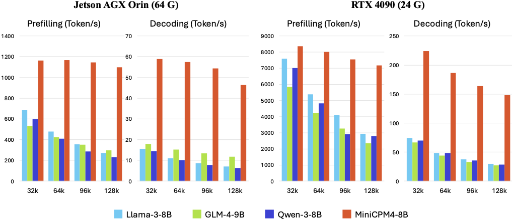
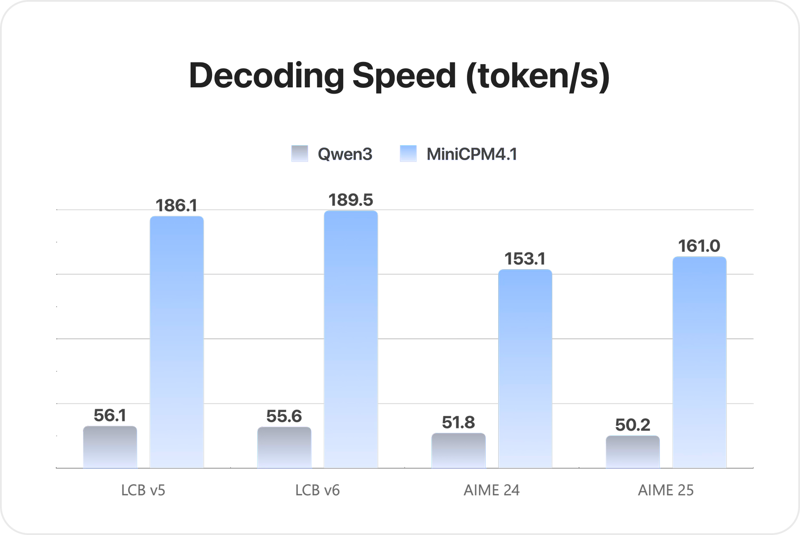
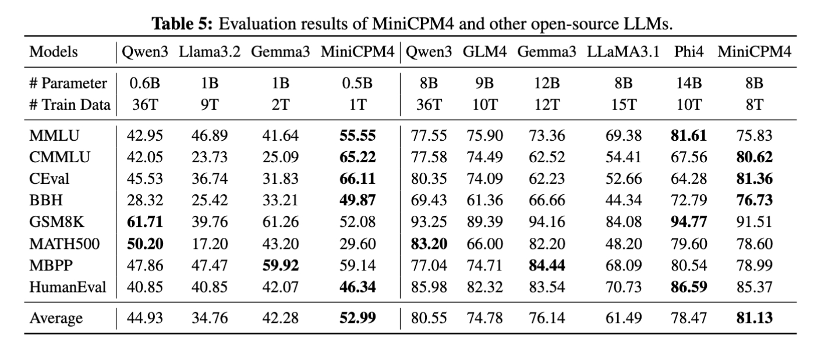
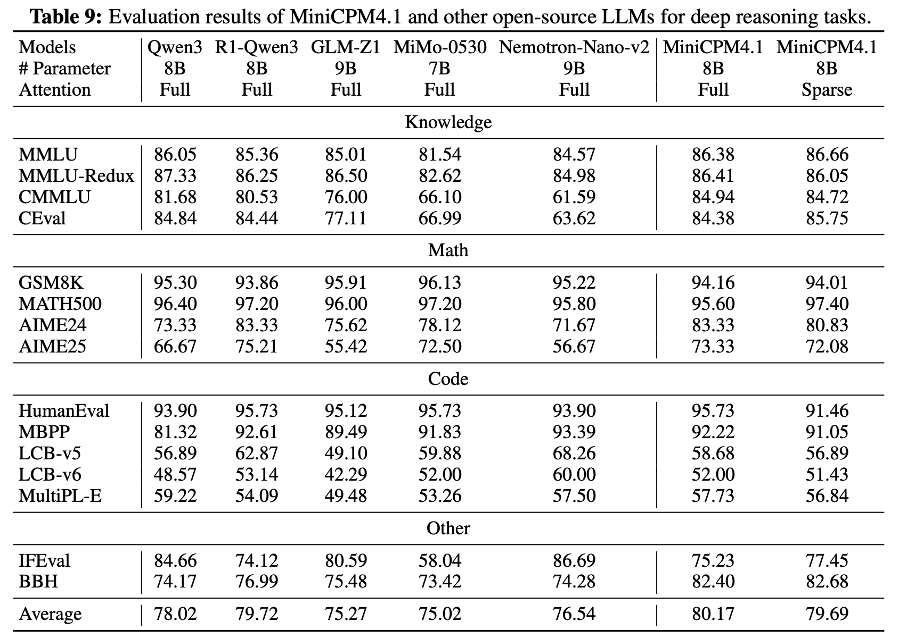
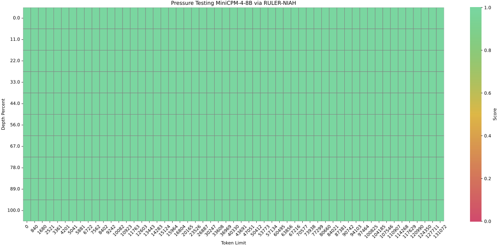
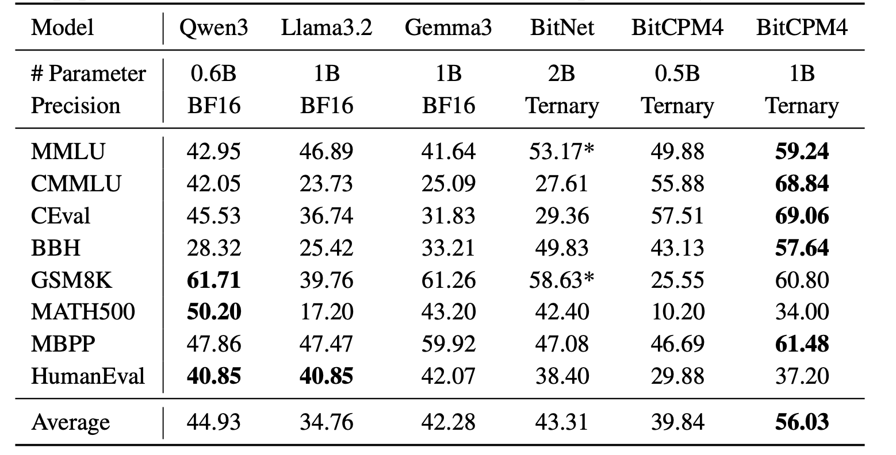

<div align="center">
</img> 
</div>

<h4 align="center">
    <p>
        <a href="https://github.com/OpenBMB/MiniCPM/blob/main/README.md">中文</a> | <b>English</b>
    <p>
</h4>

<p align="center">
<a href="https://arxiv.org/pdf/2506.07900" target="_blank">MiniCPM Paper</a> |
<a href="https://modelbest.feishu.cn/wiki/D2tFw8Pcsi5CIzkaHNacLK64npg" target="_blank">MiniCPM Wiki (in Chinese)</a> |
<a href="https://github.com/OpenBMB/MiniCPM-V/" target="_blank">MiniCPM-V Repo</a> |
Join our <a href="https://discord.gg/3cGQn9b3YM" target="_blank">discord</a> and <a href="https://github.com/OpenBMB/MiniCPM/blob/main/assets/wechat.jpg" target="_blank">WeChat</a> |
<a href="https://mp.weixin.qq.com/s/KIhH2nCURBXuFXAtYRpuXg?poc_token=HBIsUWijxino8oJ5s6HcjcfXFRi0Xj2LJlxPYD9c">Join Us</a>
</p>

[](https://www.youtube.com/watch?v=VouXjLHKDUY)

## Changelog🔥
- [2025.09.29] **[InfLLM-V2 paper](https://arxiv.org/abs/2509.24663) is released!** We can train a sparse attention model with only 5B long-text tokens. 🔥🔥🔥
- [2025.09.05] **MiniCPM4.1 series are released! This series is a hybrid reasoning model with trainable sparse attention, which can be used in both deep reasoning mode and non-reasoning mode. 🔥🔥🔥**
- [2025.06.06] Released [**MiniCPM4**](https://huggingface.co/collections/openbmb/minicpm-4-6841ab29d180257e940baa9b)! This model achieves ultimate efficiency improvements while maintaining optimal performance at the same scale! It can achieve over 5x generation acceleration on typical end-side chips!
- [2024.09.05] We release [**MiniCPM3-4B**](https://huggingface.co/openbmb/MiniCPM3-4B)! This model outperforms Phi-3.5-mini-instruct and GPT-3.5-Turbo-0125 and is comparable to several models with 7B-9B parameters like Llama3.1-8B-Instruct, Qwen2-7B-Instruct, and GLM-4-9B-Chat.
- [2024.07.05] Released [**MiniCPM-S-1B**](https://huggingface.co/openbmb/MiniCPM-S-1B-sft)! This model achieves an average sparsity of 87.89% in the FFN layer, reducing FFN FLOPs by 84%, while maintaining downstream task performance.
- [2024.04.11] Released [**MiniCPM-2B-128k**](https://huggingface.co/openbmb/MiniCPM-2B-128k), [**MiniCPM-MoE-8x2B**](https://huggingface.co/openbmb/MiniCPM-MoE-8x2B) and [**MiniCPM-1B**](https://huggingface.co/openbmb/MiniCPM-1B-sft-bf16)! Click [here](https://openbmb.vercel.app/) to read our technical blog.
- [2024.02.01] Released [**MiniCPM-2B**](https://huggingface.co/openbmb/MiniCPM-2B-sft-bf16)! This model performs similarly to Mistral-7B on public benchmarks (with better performance in Chinese, math, and code abilities) and overall outperforms models like Llama2-13B, MPT-30B, and Falcon-40B.

## Quick Links

- [Changelog🔥](#changelog)
- [Quick Links](#quick-links)
- [Model Downloads](#model-downloads)
- [MiniCPM4 and MiniCPM4.1 Series](#minicpm4-and-minicpm41-series)
    - [Highlights](#highlights)
    - [Introduction](#introduction)
  - [Evaluation Results](#evaluation-results)
    - [Efficiency Evaluation](#efficiency-evaluation)
    - [Comprehensive Evaluation](#comprehensive-evaluation)
    - [Long Text Evaluation](#long-text-evaluation)
  - [Inference](#inference)
    - [Hybird Reasoning Mode](#hybird-reasoning-mode)
    - [HuggingFace](#huggingface)
    - [vLLM](#vllm)
      - [Speculative Decoding](#speculative-decoding)
        - [1. Download MiniCPM4.1 Draft Model](#1-download-minicpm41-draft-model)
        - [2. Install EAGLE3-Compatible vLLM](#2-install-eagle3-compatible-vllm)
        - [3. Launch vLLM Server with Speculative Decoding](#3-launch-vllm-server-with-speculative-decoding)
        - [4. Client Usage Example](#4-client-usage-example)
        - [vLLM Configuration Parameters](#vllm-configuration-parameters)
      - [Standard Inference (Without Speculative Decoding)](#standard-inference-without-speculative-decoding)
    - [SGLang](#sglang)
      - [Speculative Decoding](#speculative-decoding-1)
        - [1. Download MiniCPM4.1 Draft Model](#1-download-minicpm41-draft-model-1)
        - [2. Install EAGLE3-Compatible SGLang](#2-install-eagle3-compatible-sglang)
        - [3. Launch SGLang Server with Speculative Decoding](#3-launch-sglang-server-with-speculative-decoding)
        - [4. Client Usage](#4-client-usage)
        - [Configuration Parameters](#configuration-parameters)
      - [Standard Inference (Without Speculative Decoding)](#standard-inference-without-speculative-decoding-1)
    - [CPM.cu](#cpmcu)
  - [BitCPM4: Quantization](#bitcpm4-quantization)
    - [BitCPM4 Evaluation](#bitcpm4-evaluation)
    - [BitCPM4 Inference](#bitcpm4-inference)
  - [MiniCPM4 Application](#minicpm4-application)
    - [MiniCPM4-Survey: Trustworthy Survey Generation](#minicpm4-survey-trustworthy-survey-generation)
      - [Demo and Quick Start](#demo-and-quick-start)
      - [Performance Evaluation](#performance-evaluation)
    - [MiniCPM4-MCP: Tool Use with Model Context Protocol](#minicpm4-mcp-tool-use-with-model-context-protocol)
      - [Demo](#demo)
      - [Performance Evaluation](#performance-evaluation-1)
    - [MiniCPM Intel AIPC Client: A New Edge Large Model Powerhouse](#minicpm-intel-aipc-client-a-new-edge-large-model-powerhouse)
      - [Key Features](#key-features)
      - [System Requirements](#system-requirements)
      - [Download](#download)
- [LICENSE](#license)
    - [Model LICENSE](#model-license)
    - [Statement](#statement)
- [Institutions](#institutions)
- [Citation](#citation)


## Model Downloads

  | HuggingFace | ModelScope |
  |-------------|------------|
  | [MiniCPM4.1-8B](https://huggingface.co/openbmb/MiniCPM4.1-8B) | [MiniCPM4.1-8B](https://www.modelscope.cn/models/OpenBMB/MiniCPM4.1-8B) |
  | [MiniCPM4.1-8B-GPTQ](https://huggingface.co/openbmb/MiniCPM4.1-8B-GPTQ) | [MiniCPM4.1-8B-GPTQ](https://www.modelscope.cn/openbmb/MiniCPM4.1-8B-GPTQ) | 
  | [MiniCPM4.1-8B-AutoAWQ](https://huggingface.co/openbmb/MiniCPM4.1-8B-AutoAWQ) | [MiniCPM4.1-8B-AutoAWQ](https://www.modelscope.cn/openbmb/MiniCPM4.1-8B-AutoAWQ) | 
  | [MiniCPM-4.1-8B-Marlin](https://huggingface.co/openbmb/MiniCPM-4.1-8B-Marlin) | [MiniCPM-4.1-8B-Marlin](https://www.modelscope.cn/openbmb/MiniCPM-4.1-8B-Marlin) | 
  | [MiniCPM4.1-8B-GGUF](https://huggingface.co/openbmb/MiniCPM4.1-8B-GGUF) | [MiniCPM4.1-8B-GGUF](https://www.modelscope.cn/openbmb/MiniCPM4.1-8B-GGUF) | 
  | [MiniCPM4.1-8B-MLX](https://huggingface.co/openbmb/MiniCPM4.1-8B-MLX) | [MiniCPM4.1-8B-MLX](https://www.modelscope.cn/openbmb/MiniCPM4.1-8B-MLX) | 
  | [MiniCPM4.1-8B-Eagle3](https://huggingface.co/openbmb/MiniCPM4.1-8B-Eagle3) | [MiniCPM4.1-8B-Eagle3](https://www.modelscope.cn/openbmb/MiniCPM4.1-8B-Eagle3) | 
  | [MiniCPM4-8B](https://huggingface.co/openbmb/MiniCPM4-8B)    | [MiniCPM4-8B](https://www.modelscope.cn/models/OpenBMB/MiniCPM4-8B) |
  | [MiniCPM4-0.5B](https://huggingface.co/openbmb/MiniCPM4-0.5B) | [MiniCPM4-0.5B](https://www.modelscope.cn/models/OpenBMB/MiniCPM4-0.5B) |
  | [BitCPM4-1B](https://huggingface.co/openbmb/BitCPM4-1B)        | [BitCPM4-1B](https://www.modelscope.cn/models/OpenBMB/BitCPM4-1B) |
  | [BitCPM4-0.5B](https://huggingface.co/openbmb/BitCPM4-0.5B)    | [BitCPM4-0.5B](https://www.modelscope.cn/models/OpenBMB/BitCPM4-0.5B) |
  | [MiniCPM4-Survey](https://huggingface.co/openbmb/MiniCPM4-Survey) | [MiniCPM4-Survey](https://www.modelscope.cn/models/OpenBMB/MiniCPM4-Survey) |
  | [MiniCPM4-MCP](https://huggingface.co/openbmb/MiniCPM4-MCP)  | [MiniCPM4-MCP](https://www.modelscope.cn/models/OpenBMB/MiniCPM4-MCP) |


<details>
<summary>📋 Click to view all MiniCPM series models</summary>

  | HuggingFace | ModelScope |
  |-------------|------------|
  | [MiniCPM4-8B-Eagle-FRSpec](https://huggingface.co/openbmb/MiniCPM4-8B-Eagle-FRSpec) | [MiniCPM4-8B-Eagle-FRSpec](https://www.modelscope.cn/models/OpenBMB/MiniCPM4-8B-Eagle-FRSpec) |
  | [MiniCPM4-8B-Eagle-FRSpec-QAT](https://huggingface.co/openbmb/MiniCPM4-8B-Eagle-FRSpec-QAT) | [MiniCPM4-8B-Eagle-FRSpec-QAT](https://www.modelscope.cn/models/OpenBMB/MiniCPM4-8B-Eagle-FRSpec-QAT) |
  | [MiniCPM4-8B-Eagle-vLLM](https://huggingface.co/openbmb/MiniCPM4-8B-Eagle-vLLM) | [MiniCPM4-8B-Eagle-vLLM](https://www.modelscope.cn/models/OpenBMB/MiniCPM4-8B-Eagle-vLLM) |
  | [MiniCPM4-8B-marlin-Eagle-vLLM](https://huggingface.co/openbmb/MiniCPM4-8B-marlin-Eagle-vLLM) | [MiniCPM4-8B-marlin-Eagle-vLLM](https://www.modelscope.cn/models/OpenBMB/MiniCPM4-8B-marlin-Eagle-vLLM) |
  | [MiniCPM4-0.5B-QAT-Int4-unquantized](https://huggingface.co/openbmb/MiniCPM4-0.5B-QAT-Int4-unquantized) | [MiniCPM4-0.5B-QAT-Int4-unquantized](https://modelscope.cn/models/OpenBMB/MiniCPM4-0.5B-QAT-Int4-unquantized) |
  | [MiniCPM4-0.5B-QAT-Int4-GPTQ-format](https://huggingface.co/openbmb/MiniCPM4-0.5B-QAT-Int4-GPTQ-format) | [MiniCPM4-0.5B-QAT-Int4-GPTQ-format](https://modelscope.cn/models/OpenBMB/MiniCPM4-0.5B-QAT-Int4-GPTQ-format) |
  | [MiniCPM3-4B](https://huggingface.co/openbmb/MiniCPM3-4B) | [MiniCPM3-4B](https://www.modelscope.cn/models/OpenBMB/MiniCPM3-4B) |
  | [MiniCPM-2B-sft](https://huggingface.co/openbmb/MiniCPM-2B-sft-bf16) | [MiniCPM-2B-sft](https://modelscope.cn/models/OpenBMB/miniCPM-bf16)|
  | [MiniCPM-2B-dpo](https://huggingface.co/openbmb/MiniCPM-2B-dpo-bf16) | [MiniCPM-2B-dpo](https://modelscope.cn/models/OpenBMB/MiniCPM-2B-dpo-bf16/summary) |
  | [MiniCPM-2B-128k](https://huggingface.co/openbmb/MiniCPM-2B-128k) | [MiniCPM-2B-128k](https://modelscope.cn/models/openbmb/MiniCPM-2B-128k/summary) |
  | [MiniCPM-MoE-8x2B](https://huggingface.co/openbmb/MiniCPM-MoE-8x2B) | [MiniCPM-MoE-8x2B](https://modelscope.cn/models/OpenBMB/MiniCPM-MoE-8x2B) |
  | [MiniCPM-1B](https://huggingface.co/openbmb/MiniCPM-1B-sft-bf16) | [MiniCPM-1B](https://modelscope.cn/models/OpenBMB/MiniCPM-1B-sft-bf16) |
  | [MiniCPM-S-1B](https://huggingface.co/openbmb/MiniCPM-S-1B-sft) | [MiniCPM-S-1B](https://modelscope.cn/models/OpenBMB/MiniCPM-S-1B-sft) |
</details>

## MiniCPM4 and MiniCPM4.1 Series
#### Highlights
MiniCPM 4.1-8B is the first open-source reasoning LLM with trainable sparse attention:

✅ Strong Reasoning Capability: Surpasses similar-sized models on 15 tasks!

✅ Fast Generation: 3x decoding speedup for reasoning

✅ Efficient Architecture: Trainable sparse attention, frequency-ranked speculative decoding

#### Introduction
MiniCPM4 and MiniCPM4.1 series are highly efficient large language models (LLMs) designed explicitly for end-side devices, which achieves this efficiency through systematic innovation in four key dimensions: model architecture, training data, training algorithms, and inference systems.

- 🏗️ **Efficient Model Architecture:**
  - InfLLM-V2 -- Trainable Sparse Attention Mechanism: Adopts a trainable sparse attention mechanism architecture where each token only needs to compute relevance with less than 5% of tokens in 128K long text processing, significantly reducing computational overhead for long texts ([InfLLM-V2 Training Kernels](https://github.com/OpenBMB/infllmv2_cuda_impl))

- 🧠 **Efficient Learning Algorithms:**
  - Model Wind Tunnel 2.0 -- Efficient Predictable Scaling: Introduces scaling prediction methods for performance of downstream tasks, enabling more precise model training configuration search
  - BitCPM -- Ultimate Ternary Quantization: Compresses model parameter bit-width to 3 values, achieving 90% extreme model bit-width reduction
  - Efficient Training Engineering Optimization: Adopts FP8 low-precision computing technology combined with Multi-token Prediction training strategy

- 📚 **High-Quality Training Data:**
  - UltraClean -- High-quality Pre-training Data Filtering and Generation: Builds iterative data cleaning strategies based on efficient data verification, open-sourcing high-quality Chinese and English pre-training dataset [UltraFinweb](https://huggingface.co/datasets/openbmb/Ultra-FineWeb)
  - UltraChat v2 -- High-quality Supervised Fine-tuning Data Generation: Constructs large-scale high-quality supervised fine-tuning datasets covering multiple dimensions including knowledge-intensive data, reasoning-intensive data, instruction-following data, long text understanding data, and tool calling data

- ⚡ **Efficient Inference and Deployment System:**
  - CPM.cu -- Lightweight and Efficient CUDA Inference Framework: Integrates sparse attention, model quantization, and speculative sampling to achieve efficient prefilling and decoding ([Inference Kernels and Framework](https://github.com/openbmb/cpm.cu))
  - ArkInfer -- Cross-platform Deployment System: Supports efficient deployment across multiple backend environments, providing flexible cross-platform adaptation capabilities

### Evaluation Results

#### Efficiency Evaluation
On two typical end-side chips, Jetson AGX Orin and RTX 4090, MiniCPM4 and MiniCPM4.1 demonstrate significantly faster processing speed compared to similar-size models in long text processing tasks. As text length increases, MiniCPM4 and MiniCPM4.1's efficiency advantage becomes more pronounced. On the Jetson AGX Orin platform, compared to Qwen3-8B, MiniCPM4 and MiniCPM4.1 achieves approximately 7x decoding speed improvement.



MiniCPM4.1 achieves 3x decoding speed improvement in reasoning.



#### Comprehensive Evaluation
MiniCPM4 launches end-side versions with 8B and 0.5B parameter scales, both achieving best-in-class performance in their respective categories.



MiniCPM4.1 launches end-side versions with 8B parameter scale, achieving best-in-class performance in deep reasoning mode.



#### Long Text Evaluation
MiniCPM4 is pre-trained on 32K long texts and achieves length extension through YaRN technology. In the 128K long text needle-in-a-haystack task, MiniCPM4 demonstrates outstanding performance. MiniCPM4.1 is pre-trained on 64K long texts and achieves length extension through YaRN technology. In the 128K long text needle-in-a-haystack task, MiniCPM4.1 demonstrates outstanding performance.



### Inference
MiniCPM 4.1 can be used with following frameworks: Huggingface Transformers, SGLang, vLLM, and CPM.cu. For the ultimate inference speed, we highly recommend CPM.cu.

MiniCPM4/MiniCPM4.1 supports both dense attention inference and sparse attention inference modes, where vLLM and SGLang currently only support dense inference mode. If you want to use sparse inference mode, please use Huggingface Transformers and CPM.cu.

- Dense attention inference: vLLM, SGLang, Huggingface Transformers
- Sparse attention inference: Huggingface Transformers, CPM.cu

#### Hybird Reasoning Mode

MiniCPM4.1 supports hybrid reasoning mode, which can be used in both deep reasoning mode and non-reasoning mode. To enable hybrid reasoning mode. User can set `enable_thinking=True` in `tokenizer.apply_chat_template` to enable hybrid reasoning mode, and set `enable_thinking=False` to enable non-reasoning mode. Similarly, user can directly add `/no_think` at the end of the query to enable non-reasoning mode. If not add any special token or add `/think` at the end of the query, the model will enable reasoning mode.

```python
# Enable reasoning mode
prompt_text = tokenizer.apply_chat_template(
    messages,
    tokenize=False,
    add_generation_prompt=True,
    enable_thinking=True
)
# Enable non-reasoning mode
prompt_text = tokenizer.apply_chat_template(
    messages,
    tokenize=False,
    add_generation_prompt=True,
    enable_thinking=False
)
```

#### HuggingFace

- **Inference with Dense Attention**
```python
from transformers import AutoModelForCausalLM, AutoTokenizer
import torch
torch.manual_seed(0)

path = 'openbmb/MiniCPM4.1-8B'
device = "cuda"
tokenizer = AutoTokenizer.from_pretrained(path)
model = AutoModelForCausalLM.from_pretrained(path, torch_dtype=torch.bfloat16, device_map=device, trust_remote_code=True)

# User can directly use the chat interface
# responds, history = model.chat(tokenizer, "Write an article about Artificial Intelligence.", temperature=0.7, top_p=0.7)
# print(responds)

# User can also use the generate interface
messages = [
    {"role": "user", "content": "Write an article about Artificial Intelligence."},
]
prompt_text = tokenizer.apply_chat_template(
    messages,
    tokenize=False,
    add_generation_prompt=True,
)
model_inputs = tokenizer([prompt_text], return_tensors="pt").to(device)

model_outputs = model.generate(
    **model_inputs,
    max_new_tokens=32768,
    top_p=0.95,
    temperature=0.6
)
output_token_ids = [
    model_outputs[i][len(model_inputs[i]):] for i in range(len(model_inputs['input_ids']))
]

responses = tokenizer.batch_decode(output_token_ids, skip_special_tokens=True)[0]
print(responses)
```

- **Inference with Sparse Attention**
This model supports InfLLM v2, a sparse attention mechanism designed for efficient long-sequence inference. It requires the [infllmv2_cuda_impl](https://github.com/OpenBMB/infllmv2_cuda_impl) library.

You can install it by running the following command:

```bash
git clone -b feature_infer https://github.com/OpenBMB/infllmv2_cuda_impl.git
cd infllmv2_cuda_impl
git submodule update --init --recursive
pip install -e . # or python setup.py install 
```

To enable InfLLM v2, you need to add the `sparse_config` field in `config.json`:

```json
{
    ...,
    "sparse_config": {
        "kernel_size": 32,
        "kernel_stride": 16,
        "init_blocks": 1,
        "block_size": 64,
        "window_size": 2048,
        "topk": 64,
        "use_nope": false,
        "dense_len": 8192
    }
}
```

These parameters control the behavior of InfLLM v2:

* `kernel_size` (default: 32): The size of semantic kernels.
* `kernel_stride` (default: 16): The stride between adjacent kernels.
* `init_blocks` (default: 1): The number of initial blocks that every query token attends to. This ensures attention to the beginning of the sequence.
* `block_size` (default: 64): The block size for key-value blocks.
* `window_size` (default: 2048): The size of the local sliding window. 
* `topk` (default: 64): The specifies that each token computes attention with only the top-k most relevant key-value blocks.
* `use_nope` (default: false): Whether to use the NOPE technique in block selection for improved performance.
* `dense_len` (default: 8192): Since Sparse Attention offers limited benefits for short sequences, the model can use standard (dense) attention for shorter texts. The model will use dense attention for sequences with a token length below `dense_len` and switch to sparse attention for sequences exceeding this length. Set this to `-1` to always use sparse attention regardless of sequence length.

- **Long Context Extension**
MiniCPM4.1 natively supports context lengths of up to 65,536(64k) tokens. For conversations where the total length (including both input and output) significantly exceeds this limit, we recommend using RoPE scaling techniques for effective handling of long texts. We have validated the model's performance on context lengths of up to 131,072 tokens by modifying the LongRoPE factor.

You can apply the LongRoPE factor modification by modifying the model files. Specifically, in the `config.json` file, adjust the `rope_scaling` fields.

```json
{
    ...,
    "rope_scaling": {
        "rope_type": "longrope", 
        "long_factor": [0.9982316082870437, 1.033048153422584, 1.0749920956484724, 1.1255096879436193, 1.1863348602111476, 1.259543828902579, 1.3476188888731149, 1.4535223827776373, 1.5807816745852985, 1.7335856049489526, 1.9168922912975785, 2.1365471404135326, 2.3994084200118646, 2.713475511863602, 3.0880118452194134, 3.533650295140154, 4.062463396503134, 4.687974098908333, 5.425075306704039, 6.289818967956352, 7.29902962722721, 8.6357018163639, 10.210822723989212, 12.053807765671676, 14.193944598909404, 16.65780676784363, 19.463620727694074, 22.628311203524586, 26.150106147261315, 30.02526691405111, 34.23183327975347, 38.73811934094828, 43.502489489729555, 48.47627117965394, 53.61139491762471, 58.857366522037935, 64.16798299215064, 69.51359464319125, 74.86555458220285, 80.21497790341579, 85.55322183307433, 90.89611806932027, 96.26245306514224, 101.68269304046481, 107.18619510219668, 112.82253283014026, 118.63764063163615, 119.88866203644656, 120.9462882391725, 121.837565139014, 122.58663780572562, 123.2147719894291, 123.74049454862576, 124.17980424685767, 124.54641761955492, 124.85202548028222, 125.10654406389756, 125.31835105170659, 125.49450117164764, 125.64091910903052, 125.76256945356558, 125.86360463815589, 125.94749252260765, 126.01712561287873],
        "short_factor": [0.9982316082870437, 1.033048153422584, 1.0749920956484724, 1.1255096879436193, 1.1863348602111476, 1.259543828902579, 1.3476188888731149, 1.4535223827776373, 1.5807816745852985, 1.7335856049489526, 1.9168922912975785, 2.1365471404135326, 2.3994084200118646, 2.713475511863602, 3.0880118452194134, 3.533650295140154, 4.062463396503134, 4.687974098908333, 5.425075306704039, 6.289818967956352, 7.29902962722721, 8.6357018163639, 10.210822723989212, 12.053807765671676, 14.193944598909404, 16.65780676784363, 19.463620727694074, 22.628311203524586, 26.150106147261315, 30.02526691405111, 34.23183327975347, 38.73811934094828, 43.502489489729555, 48.47627117965394, 53.61139491762471, 58.857366522037935, 64.16798299215064, 69.51359464319125, 74.86555458220285, 80.21497790341579, 85.55322183307433, 90.89611806932027, 96.26245306514224, 101.68269304046481, 107.18619510219668, 112.82253283014026, 118.63764063163615, 119.88866203644656, 120.9462882391725, 121.837565139014, 122.58663780572562, 123.2147719894291, 123.74049454862576, 124.17980424685767, 124.54641761955492, 124.85202548028222, 125.10654406389756, 125.31835105170659, 125.49450117164764, 125.64091910903052, 125.76256945356558, 125.86360463815589, 125.94749252260765, 126.01712561287873],
        "original_max_position_embeddings": 65536
    }
}
```

#### vLLM

##### Speculative Decoding

For accelerated inference with speculative decoding using vLLM, follow these steps:

###### 1. Download MiniCPM4.1 Draft Model

First, download the MiniCPM4.1 draft model:

```bash
cd /your_path
git clone https://huggingface.co/openbmb/MiniCPM4.1-8B-Eagle3
```

###### 2. Install EAGLE3-Compatible vLLM

The EAGLE3 vLLM PR has been submitted. For now, use our repository for installation:

```bash
git clone https://github.com/LDLINGLINGLING/vllm.git
cd vllm 
pip install -e .
```

###### 3. Launch vLLM Server with Speculative Decoding

Start the vLLM inference server with speculative decoding enabled. Make sure to update the model path in the speculative-config to point to your downloaded MiniCPM4_1-8B-Eagle3-bf16 folder:

```bash
VLLM_USE_V1=1 \
vllm serve openbmb/MiniCPM4.1-8B \
--seed 42 \
--trust-remote-code \
--speculative-config '{
  "model": "your/path/MiniCPM4_1-8B-Eagle3-bf16",
  "num_speculative_tokens": 3,
  "method": "eagle3",
  "draft_tensor_parallel_size": 1
}'
```

###### 4. Client Usage Example

The client usage remains the same for both standard and speculative decoding:

```python
import openai

client = openai.Client(base_url="http://localhost:8000/v1", api_key="EMPTY")

response = client.chat.completions.create(
    model="openbmb/MiniCPM4.1-8B",
    messages=[
        {"role": "user", "content": "Write an article about Artificial Intelligence."},
    ],
    temperature=0.6,
    max_tokens=32768,
    extra_body=dict(add_special_tokens=True),  # Ensures special tokens are added for chat template
    
)

print(response.choices[0].message.content)
```

###### vLLM Configuration Parameters

- `VLLM_USE_V1=1`: Enables vLLM v1 API
- `--speculative-config`: JSON configuration for speculative decoding
  - `model`: Path to the draft model for speculation
  - `num_speculative_tokens`: Number of speculative tokens (default: 3)
  - `method`: Speculative decoding method (eagle3)
  - `draft_tensor_parallel_size`: Tensor parallel size for draft model (default: 1)
- `--seed`: Random seed for reproducibility
- `--trust-remote-code`: Allow execution of remote code for custom models

##### Standard Inference (Without Speculative Decoding)

For now, you need to install the latest version of vLLM.

```bash
pip install -U vllm \
    --pre \
    --extra-index-url https://wheels.vllm.ai/nightly
```

Then you can inference MiniCPM4.1-8B with vLLM:
```python
from transformers import AutoTokenizer
from vllm import LLM, SamplingParams

model_name = "openbmb/MiniCPM4.1-8B"
prompt = [{"role": "user", "content": "Write an article about Artificial Intelligence."}]

tokenizer = AutoTokenizer.from_pretrained(model_name, trust_remote_code=True)
input_text = tokenizer.apply_chat_template(prompt, tokenize=False, add_generation_prompt=True)

llm = LLM(
    model=model_name,
    trust_remote_code=True,
    max_num_batched_tokens=65536,
    dtype="bfloat16", 
    gpu_memory_utilization=0.8, 
)
sampling_params = SamplingParams(top_p=0.95, temperature=0.6, max_tokens=32768)

outputs = llm.generate(prompts=input_text, sampling_params=sampling_params)

print(outputs[0].outputs[0].text)
```

Also, you can start the inference server by running the following command:
> **Note**: In vLLM's chat API, `add_special_tokens` is `False` by default. This means important special tokens—such as the beginning-of-sequence (BOS) token—will not be added automatically. To ensure the input prompt is correctly formatted for the model, you should explicitly set `extra_body={"add_special_tokens": True}`.

```bash
vllm serve openbmb/MiniCPM4.1-8B --trust-remote-code
```

Then you can use the chat interface by running the following code:

```python
import openai

client = openai.Client(base_url="http://localhost:8000/v1", api_key="EMPTY")

response = client.chat.completions.create(
    model="openbmb/MiniCPM4.1-8B",
    messages=[
        {"role": "user", "content": "Write an article about Artificial Intelligence."},
    ],
    temperature=0.6,
    max_tokens=32768,
    extra_body=dict(add_special_tokens=True),  # Ensures special tokens are added for chat template
)

print(response.choices[0].message.content)
```

#### SGLang

##### Speculative Decoding

For accelerated inference with speculative decoding, follow these steps:

###### 1. Download MiniCPM4.1 Draft Model

First, download the MiniCPM4.1 draft model:

```bash
cd /your_path
git clone https://huggingface.co/openbmb/MiniCPM4.1-8B-Eagle3
```

###### 2. Install EAGLE3-Compatible SGLang

The EAGLE3 adaptation PR has been submitted. For now, use our repository for installation:

```bash
git clone https://github.com/LDLINGLINGLING/sglang.git
cd sglang
pip install -e .
```

###### 3. Launch SGLang Server with Speculative Decoding

Start the SGLang server with speculative decoding enabled:

```bash
python -m sglang.launch_server \
  --model-path "openbmb/MiniCPM4.1-8B" \
  --host "127.0.0.1" \
  --port 30002 \
  --mem-fraction-static 0.9 \
  --speculative-algorithm EAGLE3 \
  --speculative-draft-model-path "your/path/MiniCPM4_1-8B-Eagle3-bf16" \
  --speculative-num-steps 3 \
  --speculative-eagle-topk 1 \
  --speculative-num-draft-tokens 32 \
  --temperature 0.7
```

###### 4. Client Usage

The client usage remains the same for both standard and speculative decoding:

```python
import openai

client = openai.Client(base_url=f"http://localhost:30002/v1", api_key="None")

response = client.chat.completions.create(
    model="openbmb/MiniCPM4.1-8B",
    messages=[
        {"role": "user", "content": "Write an article about Artificial Intelligence."},
    ],
    temperature=0.6,
    max_tokens=32768,
)

print(response.choices[0].message.content)
```

Note: Make sure to update the port number in the client code to match the server port (30002 in the speculative decoding example).

###### Configuration Parameters

- `--speculative-algorithm EAGLE3`: Enables EAGLE3 speculative decoding
- `--speculative-draft-model-path`: Path to the draft model for speculation
- `--speculative-num-steps`: Number of speculative steps (default: 3)
- `--speculative-eagle-topk`: Top-k parameter for EAGLE (default: 1)
- `--speculative-num-draft-tokens`: Number of draft tokens (default: 32)
- `--mem-fraction-static`: Memory fraction for static allocation (default: 0.9)

##### Standard Inference (Without Speculative Decoding)

For now, you need to install our forked version of SGLang.

```bash
git clone -b openbmb https://github.com/OpenBMB/sglang.git
cd sglang

pip install --upgrade pip
pip install -e "python[all]"
```

You can start the inference server by running the following command:

```bash
python -m sglang.launch_server --model openbmb/MiniCPM4.1-8B --trust-remote-code --port 30000 --chat-template chatml
```

Then you can use the chat interface by running the following command:

```python
import openai

client = openai.Client(base_url=f"http://localhost:30000/v1", api_key="None")

response = client.chat.completions.create(
    model="openbmb/MiniCPM4.1-8B",
    messages=[
        {"role": "user", "content": "Write an article about Artificial Intelligence."},
    ],
    temperature=0.6,
    max_tokens=32768,
)

print(response.choices[0].message.content)
```


#### CPM.cu

We **recommend** using [CPM.cu](https://github.com/OpenBMB/CPM.cu) for the inference of MiniCPM4 and MiniCPM4.1. CPM.cu is a CUDA inference framework developed by OpenBMB, which integrates efficient sparse, speculative sampling, and quantization techniques, fully leveraging the efficiency advantages of MiniCPM4 and MiniCPM4.1.

You can install CPM.cu by running the following command:

```bash
git clone https://github.com/OpenBMB/CPM.cu.git --recursive
cd CPM.cu
python3 setup.py install
```

You can run the following command to test the speed of the model.

```bash
python3 tests/long_prompt_gen.py # generate prompt.txt
python3 tests/test_generate.py --prompt-file prompt.txt
```

You can run the following command to infer with EAGLE3 speculative decoding algorithm.

```bash
python3 -m cpmcu.cli \
    --model-path $BASE_MODEL_PATH \
    --draft-model-path $EAGLE3_DRAFT_MODEL_PATH \
    --prompt-text "Tell me about Tsinghua University" \
    --use-eagle3 true
```

For more details about CPM.cu, please refer to the repo of [CPM.cu](https://github.com/OpenBMB/CPM.cu).


### BitCPM4: Quantization

BitCPM4 are ternary quantized models derived from the MiniCPM series models through quantization-aware training (QAT), achieving significant improvements in both training efficiency and model parameter efficiency.
- Improvements of the training method
  - Searching hyperparameters with a wind-tunnel on a small model.
  - Using a two-stage training method: training in high-precision first and then QAT, making the best of the trained high-precision models and significantly reducing the computational resources required for the QAT phase.
- High parameter efficiency
  - Achieving comparable performance to full-precision models of similar parameter models with a bit width of only 1.58 bits, demonstrating high parameter efficiency. 

#### BitCPM4 Evaluation

BitCPM4's performance is comparable with other full-precision models in same model size.


#### BitCPM4 Inference

BitCPM4's parameters are stored in a fake-quantized format, which supports direct inference within the Huggingface framework.

### MiniCPM4 Application
<details>
<summary>Click to view details about MiniCPM4 Application</summary>

#### MiniCPM4-Survey: Trustworthy Survey Generation

**MiniCPM4-Survey** is an open-source LLM agent model jointly developed by [THUNLP](https://nlp.csai.tsinghua.edu.cn), Renmin University of China and [ModelBest](https://modelbest.cn/en). Built on MiniCPM4-8B, it accepts users' quiries as input and autonomously generate trustworthy, long-form survey papers.

Key features include:

- **Plan-Retrieve-Write Survey Generation Framework** — We propose a multi-agent generation framework, which operates through three core stages: planning (defining the overall structure of the survey), retrieval (generating appropriate retrieval keywords), and writing (synthesizing the retrieved information to generate coherent section-level content).

- **High-Quality Dataset Construction** — We gather and process lots of expert-written survey papers to construct a high-quality training dataset. Meanwhile, we collect a large number of research papers to build a retrieval database.

- **Multi-Aspect Reward Design** — We carefully design a reward system with three aspects (structure, content, and citations) to evaluate the quality of the surveys, which is used as the reward function in the RL training stage.

- **Multi-Step RL Training Strategy** — We propose a *Context Manager* to ensure retention of essential information while facilitating efficient reasoning, and we construct *Parallel Environment* to maintain efficient RL training cycles.

##### Demo and Quick Start

See [here](./demo/minicpm4/SurveyGeneration/README.md)

##### Performance Evaluation

| Method                                      | Relevance | Coverage | Depth | Novelty | Avg.  | Fact Score |
|---------------------------------------------|-----------|----------|-------|---------|-------|------------|
| Naive RAG (driven by G2FT)                  | 3.25      | 2.95     | 3.35  | 2.60    | 3.04  | 43.68      |
| AutoSurvey (driven by G2FT)                 | 3.10      | 3.25     | 3.15  | **3.15**| 3.16  | 46.56      |
| Webthinker (driven by WTR1-7B)              | 3.30      | 3.00     | 2.75  | 2.50    | 2.89  | --         |
| Webthinker (driven by QwQ-32B)              | 3.40      | 3.30     | 3.30  | 2.50    | 3.13  | --         |
| OpenAI Deep Research (driven by GPT-4o)     | 3.50      |**3.95**  | 3.55  | 3.00    | **3.50**  | --         |
| MiniCPM-4-Survey                            | 3.45      | 3.70     | **3.85** | 3.00    | **3.50**  | **68.73**  |
| &nbsp;&nbsp;&nbsp;*w/o* RL                  | **3.55**  | 3.35     | 3.30  | 2.25    | 3.11  | 50.24      |

*Performance comparison of the survey generation systems. "G2FT" stands for Gemini-2.0-Flash-Thinking, and "WTR1-7B" denotes Webthinker-R1-7B. FactScore evaluation was omitted for Webthinker, as it does not include citation functionality, and for OpenAI Deep Research, which does not provide citations when exporting the results.*

#### MiniCPM4-MCP: Tool Use with Model Context Protocol

**MiniCPM4-MCP** is an open-source on-device LLM agent model jointly developed by [THUNLP](https://nlp.csai.tsinghua.edu.cn), Renmin University of China and [ModelBest](https://modelbest.cn/en), built on [MiniCPM-4](https://huggingface.co/openbmb/MiniCPM4-8B) with 8 billion parameters. It is capable of solving a wide range of real-world tasks by interacting with various tool and data resources through MCP. As of now, MiniCPM4-MCP supports the following:

- Utilization of tools across 16 MCP servers: These servers span various categories, including office, lifestyle, communication, information, and work management.

- Single-tool-calling capability: It can perform single- or multi-step tool calls using a single tool that complies with the MCP.

- Cross-tool-calling capability: It can perform single- or multi-step tool calls using different tools that complies with the MCP.

##### Demo

Demo is available in this [link](./demo/minicpm4/MCP/README_en.md).

##### Performance Evaluation

| MCP Server                  |          | gpt-4o             |              |          | qwen3             |              |      |      minicpm4         |              |
|-----------------------|----------------|--------------|--------------|---------------|--------------|--------------|----------------|--------------|--------------|
|                       | func           | param        | value        | func          | param        | value        | func           | param        | value        |
| Airbnb                | 89.3           | 67.9         | 53.6         | 92.8          | 60.7         | 50.0         | 96.4           | 67.9         | 50.0         |
| Amap-Maps             | 79.8           | 77.5         | 50.0         | 74.4          | 72.0         | 41.0         | 89.3           | 85.7         | 39.9         |
| Arxiv-MCP-Server      | 85.7           | 85.7         | 85.7         | 81.8          | 54.5         | 50.0         | 57.1           | 57.1         | 52.4         |
| Calculator            | 100.0          | 100.0        | 20.0         | 80.0          | 80.0         | 13.3         | 100.0          | 100.0        | 6.67         |
| Computor-Control-MCP  | 90.0           | 90.0         | 90.0         | 90.0          | 90.0         | 90.0         | 90.0           | 90.0         | 86.7         |
| Desktop-Commander     | 100.0          | 100.0        | 100.0        | 100.0         | 100.0        | 100.0        | 100.0          | 100.0        | 100.0        |
| Filesystem            | 63.5           | 63.5         | 31.3         | 69.7          | 69.7         | 26.0         | 83.3           | 83.3         | 42.7         |
|Github | 92.0 | 80.0 | 58.0 | 80.5 | 50.0 | 27.7 | 62.8 | 25.7 | 17.1 |
| Gaode                 | 71.1           | 55.6         | 17.8         | 68.8          | 46.6         | 24.4         | 68.9           | 46.7         | 15.6         |
| MCP-Code-Executor     | 85.0           | 80.0         | 70.0         | 80.0          | 80.0         | 70.0         | 90.0           | 90.0         | 65.0         |
| MCP-Docx              | 95.8           | 86.7         | 67.1         | 94.9          | 81.6         | 60.1         | 95.1           | 86.6         | 76.1         |
| PPT                   | 72.6           | 49.8         | 40.9         | 85.9          | 50.7         | 37.5         | 91.2           | 72.1         | 56.7         |
| PPTx                  | 64.2           | 53.7         | 13.4         | 91.0          | 68.6         | 20.9         | 91.0           | 58.2         | 26.9         |
| Simple-Time-Server    | 90.0           | 70.0         | 70.0         | 90.0          | 90.0         | 90.0         | 90.0           | 60.0         | 60.0         |
| Slack                 | 100.0          | 90.0         | 70.0         | 100.0         | 100.0        | 65.0         | 100.0          | 100.0        | 100.0        |
| Whisper               | 90.0           | 90.0         | 90.0         | 90.0          | 90.0         | 90.0         | 90.0           | 90.0         | 30.0         |
| **Average**              | **80.2**       | **70.2**     | **49.1**     | **83.5**      | **67.7**     | **43.8**     | **88.3**       | **76.1**     | **51.2**     |

#### MiniCPM Intel AIPC Client: A New Edge Large Model Powerhouse  

Developed in collaboration between Mianbi Intelligence and Intel, the MiniCPM Intel AIPC Client is an edge large model client specially designed for devices equipped with Intel Core Ultra series processors. It delivers a low-latency, high-efficiency, and privacy-preserving local large model experience for developers, researchers, and AI enthusiasts. Its core features include:  

##### Key Features  
- Deep Intel Hardware Adaptation  
Fully compatible with Intel Core Ultra series processors, enabling deep integration with hardware to unleash peak performance. Users can run large models smoothly on local devices without relying on cloud services.  

- Extreme Optimization Based on OpenVINO  
Deeply optimized with the OpenVINO inference framework, it significantly boosts inference efficiency, reaching up to **80 tokens per second**. This ensures rapid model response for both quick queries and complex task processing.  

- Privacy and Security Assurance  
Adopting local deployment, all data processing is completed on the device, eliminating privacy risks from cloud uploads. This provides users with peace of mind, especially for scenarios with high data privacy requirements.  

- Catering to Diverse User Groups  
Whether for developers chasing cutting-edge technologies, researchers focused on academic studies, or enthusiasts eager to explore AI applications, the MiniCPM Intel AIPC Client enables easy access to the power of local large models, opening the door to personalized AI exploration.  

##### System Requirements  
- Recommended processor: Intel Core Ultra 7 or higher (mobile version)  
- Recommended RAM: 32GB or above

##### Download

[download](https://github.com/OpenBMB/MiniCPM/releases/tag/2.4.2)

</details>


## LICENSE

#### Model LICENSE

* This repository and MiniCPM models are released under the [Apache-2.0](https://github.com/OpenBMB/MiniCPM/blob/main/LICENSE) License. 

#### Statement

* As a language model, MiniCPM generates content by learning from a vast amount of text. 
* However, it does not possess the ability to comprehend or express personal opinions or value judgments. 
* Any content generated by MiniCPM does not represent the viewpoints or positions of the model developers. 
* Therefore, when using content generated by MiniCPM, users should take full responsibility for evaluating and verifying it on their own.

## Institutions

This project is developed by the following institutions:

-  [Modelbest Inc.](https://modelbest.cn/)
-  [THUNLP](https://nlp.csai.tsinghua.edu.cn/)
-  [Gaoling School of Artificial Intelligence of RUC](https://linyankai.github.io/)

## Citation

* Please cite our paper: [MiniCPM4](https://arxiv.org/abs/2506.07900) if you find our work valuable.

```
@article{minicpm4,
  title={Minicpm4: Ultra-efficient llms on end devices},
  author={MiniCPM, Team},
  journal={arXiv preprint arXiv:2506.07900},
  year={2025}
}
```
