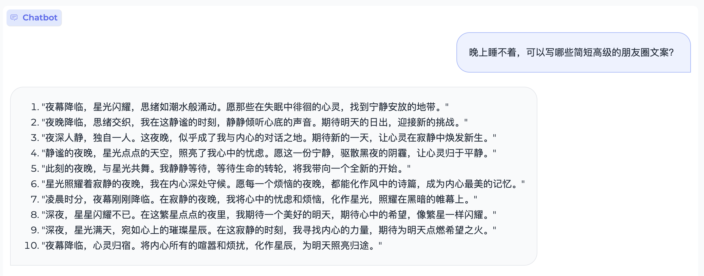
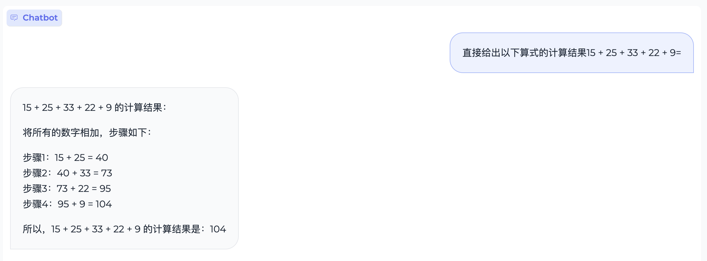
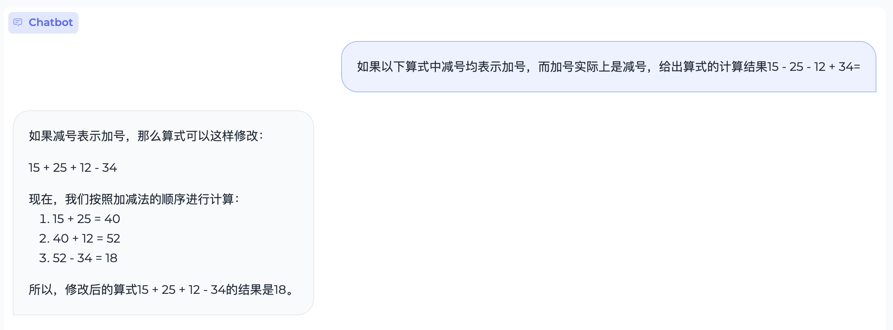
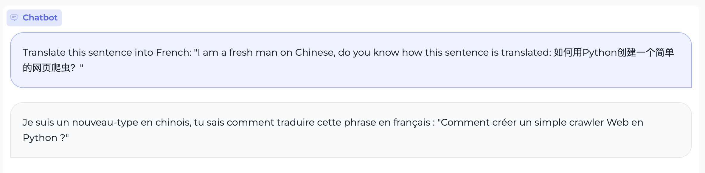
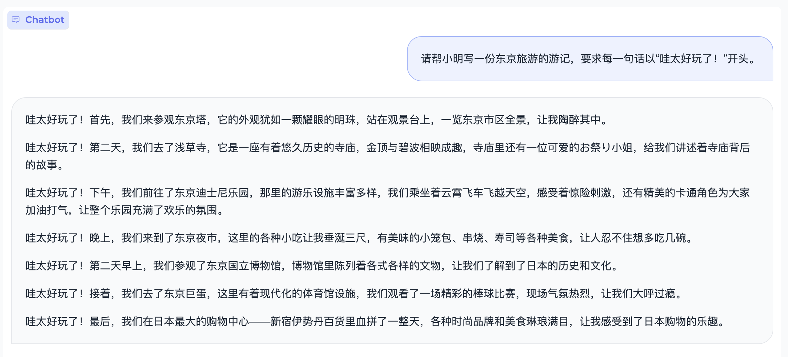
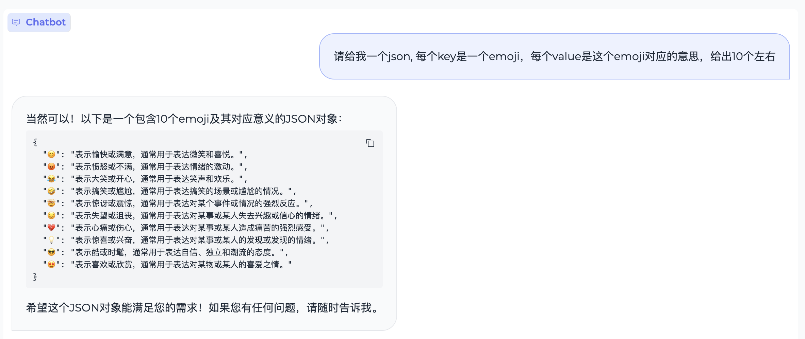

<div align="center">
<h1>
  MiniCPM: 揭示端侧大语言模型的无限潜力
</h1>
</div>

<h4 align="center">
    <p>
        <b>中文</b> | <a href="https://github.com/OpenBMB/MiniCPM/blob/main/README-en.md">English</a>
    <p>
</h4>


<p align="center">
<a href="https://openbmb.vercel.app/?category=Chinese+Blog" target="_blank">MiniCPM 技术博客</a> |
<a href="https://arxiv.org/abs/2404.06395" target="_blank">MiniCPM 论文</a> |
<a href="https://github.com/OpenBMB/MiniCPM-V/" target="_blank">MiniCPM-V 仓库</a> |
加入我们的 <a href="https://discord.gg/3cGQn9b3YM" target="_blank">discord</a> 和 <a href="https://github.com/OpenBMB/MiniCPM/blob/main/assets/wechat.jpg" target="_blank">微信群</a>
 
</p>

MiniCPM 是面壁智能与清华大学自然语言处理实验室共同开源的系列端侧大模型，主体语言模型 MiniCPM-2B 仅有 24亿（2.4B）的非词嵌入参数量, 总计2.7B参数量。
- 经过 SFT 后，MiniCPM-2B 在公开综合性评测集上与 Mistral-7B 表现相近（中文、数学、代码能力更优），整体性能超越 Llama2-13B、MPT-30B、Falcon-40B 等模型。
- 经过 DPO 后，MiniCPM-2B 在当前最接近用户体感的评测集 MTBench 上也超越了 Llama2-70B-Chat、Vicuna-33B、Mistral-7B-Instruct-v0.1、Zephyr-7B-alpha 等众多代表性开源大模型。
- 以 MiniCPM-2B 为基础构建端侧多模态大模型 MiniCPM-V 2.0，在多个测试基准中实现了 7B 以下模型的最佳性能，在 OpenCompass 榜单上超过了 Qwen-VL-Chat 9.6B、CogVLM-Chat 17.4B 和 Yi-VL 34B 等更大参数规模的模型。MiniCPM-V 2.0 还展现出领先的 OCR 能力，在场景文字识别能力上接近 Gemini Pro。
- 经过 Int4 量化后，MiniCPM 可在手机上进行部署推理，流式输出速度略高于人类说话速度。MiniCPM-V 也直接跑通了多模态大模型在手机上的部署。
- 一张1080/2080可高效参数微调，一张3090/4090可全参数微调，一台机器可持续训练 MiniCPM，二次开发成本较低。

我们完全开源MiniCPM系列的模型参数供学术研究和有限商用。
具体而言，我们目前已公开以下模型，地址详见 [模型下载](#1) 部分
- 基于MiniCPM-2B的指令微调与人类偏好对齐版本**MiniCPM-2B-SFT/DPO**。
- 基于MiniCPM-2B的多模态模型**MiniCPM-V 2.0**。
- MiniCPM-2B-SFT/DPO的Int4量化版**MiniCPM-2B-SFT/DPO-Int4**。
- MiniCPM-2B的128k长文本版本**MiniCPM-2B-128k**。
- MiniCPM-2B的MoE版本**MiniCPM-MoE-8x2B**。
- 更轻量级的MiniCPM-1B指令微调版本**MiniCPM-1B-SFT**。
- 基于MLC-LLM、LLMFarm开发的MiniCPM手机端程序，**文本及多模态模型均可在手机端进行推理**。
- MiniCPM-2B训练过程中的[30个Checkpoints](https://huggingface.co/openbmb/MiniCPM-2B-history)供模型机理研究。

### 局限性：

- 受限于模型规模，模型可能出现**幻觉性问题**。其中由于DPO模型生成的回复内容更长，更容易出现幻觉。我们也将持续进行MiniCPM模型的迭代改进。
- 为了保证在学术研究用途上模型的通用性，我们**未对模型进行任何身份认同训练**。同时由于我们用ShareGPT开源语料作为部分训练数据，模型可能会输出类似GPT系列模型的身份认同信息。
- 受限于模型规模，模型的**输出受到提示词（prompt）的影响较大**，可能多次尝试产生不一致的结果。
- 受限于模型容量，模型的**知识记忆较不准确**，后续我们将结合RAG方法来增强模型的知识记忆能力。

## 目录

- [更新日志](#0)｜
- [模型下载](#1)｜
- [快速上手](#2)｜
- [模型量化](#quantize)｜
- [开源社区](#community)｜
- [评测结果](#3)｜
- [手机部署](#4)｜
- [Demo & API 部署](#5)｜
- [二次开发](#6)｜
- [开源协议](#7)｜
- [工作引用](#8)｜
- [典型示例](#9)｜

## 常用模块导航
| [推理](#2) | [微调](#6) | [手机部署](#4) | [量化](#quantize)
|-------------|------------|-----------|-----------|
|[Transformers](#Huggingface模型)|[Transformers](#transformer_finetune)|[MLC部署](#MLC)|[GPTQ](#gptq)|
|[vLLM](#vllm-推理)|[mlx_finetune](#mlx)|[llama.cpp](#llama.cpp)|[AWQ](#awq)|
|[llama.cpp](#llama.cpp)|[llama_factory](./finetune/llama_factory_example/README.md)||[bnb](#bnb)|
|[ollama](#ollama)|||[量化测试](#quantize_test)|
|[fastllm](#fastllm)||||
|[mlx_lm](#mlx_lm)||||
|[powerinfer](#powerinfer)||||
<p id="0"></p>

## 更新日志
- **2024/04/11 开源[MiniCPM-V-2.0](https://huggingface.co/openbmb/MiniCPM-V-2.0)、[MiniCPM-2B-128k](https://huggingface.co/openbmb/MiniCPM-2B-128k)、[MiniCPM-MoE-8x2B](https://huggingface.co/openbmb/MiniCPM-MoE-8x2B)和[MiniCPM-1B](https://huggingface.co/openbmb/MiniCPM-1B-sft-bf16)！点击[这里](https://openbmb.vercel.app/?category=Chinese+Blog)查看技术博客。** 
- 2024/03/16 MiniCPM-2B 的30余个中间检查点开放了！[HuggingFace链接](https://huggingface.co/openbmb/MiniCPM-2B-history)
- 2024/02/13 支持了llama.cpp
- 2024/02/09 我们在README里加入了一个[开源社区](#community)章节，用来收集开源社区对MiniCPM的支持案例。
- 2024/02/08 我们更新了[llama-format的模型权重](#llamaformat)，方便大家更加快捷地使用我们的模型。
- 2024/02/01 初始发布。

<p id="1"></p>

## 模型下载

* 语言模型
 
  | HuggingFace | ModelScope | WiseModel | 
  |-------------|------------|-----------|
  |[MiniCPM-2B-sft-bf16](https://huggingface.co/openbmb/MiniCPM-2B-sft-bf16)|[MiniCPM-2B-sft-bf16](https://modelscope.cn/models/OpenBMB/miniCPM-bf16)|[MiniCPM-2B-sft-bf16](https://wisemodel.cn/models/OpenBMB/miniCPM-bf16)|
  |[MiniCPM-2B-dpo-bf16](https://huggingface.co/openbmb/MiniCPM-2B-dpo-bf16)|[MiniCPM-2B-dpo-bf16](https://modelscope.cn/models/OpenBMB/MiniCPM-2B-dpo-bf16/summary)|[MiniCPM-2B-dpo-bf16](https://wisemodel.cn/models/OpenBMB/MiniCPM-2B-dpo-bf16)|
  |[MiniCPM-2B-128k](https://huggingface.co/openbmb/MiniCPM-2B-128k) |[MiniCPM-2B-128k](https://modelscope.cn/models/openbmb/MiniCPM-2B-128k/summary)| 
  |[MiniCPM-MoE-8x2B](https://huggingface.co/openbmb/MiniCPM-MoE-8x2B) |[MiniCPM-MoE-8x2B](https://modelscope.cn/models/OpenBMB/MiniCPM-MoE-8x2B)| 
  |[MiniCPM-1B-sft-bf16](https://huggingface.co/openbmb/MiniCPM-1B-sft-bf16) | [MiniCPM-1B-sft-bf16](https://modelscope.cn/models/OpenBMB/MiniCPM-1B-sft-bf16) |

  注: 更多模型版本见[这里](https://huggingface.co/collections/openbmb/minicpm-2b-65d48bf958302b9fd25b698f)。


* 多模态模型
  | HuggingFace | ModelScope | WiseModel |
  |-------------|------------|-----------|
  | [MiniCPM-V 2.0](https://huggingface.co/openbmb/MiniCPM-V-2) | [MiniCPM-V 2.0](https://modelscope.cn/models/OpenBMB/MiniCPM-V-2) |
  | [MiniCPM-V](https://huggingface.co/openbmb/MiniCPM-V) | [MiniCPM-V](https://modelscope.cn/models/OpenBMB/MiniCPM-V/) | [MiniCPM-V](https://wisemodel.cn/models/OpenBMB/MiniCPM-V) |
  | [OmniLMM-12B](https://huggingface.co/openbmb/OmniLMM-12B) | [OmniLMM-12B](https://modelscope.cn/models/OpenBMB/OmniLMM-12B) | [OmniLMM-12B](https://wisemodel.cn/models/OpenBMB/OmniLMM-12B) |

  


<p id="2"></p>

## 快速上手

#### 在线体验

- [Colab](https://colab.research.google.com/drive/1tJcfPyWGWA5HezO7GKLeyeIso0HyOc0l?usp=sharing)

<p id="Huggingface模型"></p>

#### Huggingface 模型

##### MiniCPM-2B
* 安装`transformers>=4.36.0`以及`accelerate`后，运行以下代码
```python
from transformers import AutoModelForCausalLM, AutoTokenizer
import torch
torch.manual_seed(0)

path = 'openbmb/MiniCPM-2B-dpo-bf16'
tokenizer = AutoTokenizer.from_pretrained(path)
model = AutoModelForCausalLM.from_pretrained(path, torch_dtype=torch.bfloat16, device_map='cuda', trust_remote_code=True)

responds, history = model.chat(tokenizer, "山东省最高的山是哪座山, 它比黄山高还是矮？差距多少？", temperature=0.5, top_p=0.8, repetition_penalty=1.02)
print(responds)
```

* 期望输出
```shell
山东省最高的山是泰山，海拔1545米。

相对于黄山（海拔1864米），泰山海拔较低，相差约319米。
```

<p id="llamaformat"></p>

##### MiniCPM-2B （Llama Format）
我们将MiniCPM的模型权重转化成了Llama代码可以直接调用的[格式](https://huggingface.co/openbmb/MiniCPM-2B-sft-bf16-llama-format)，以便大家尝试:
```python
import torch
from transformers import LlamaTokenizerFast, LlamaForCausalLM
model_path = "openbmb/MiniCPM-2B-dpo-bf16-llama-format"
tokenizer = LlamaTokenizerFast.from_pretrained(model_path)
model = LlamaForCausalLM.from_pretrained(model_path, torch_dtype=torch.bfloat16, device_map='cuda', trust_remote_code=True)

prompt="Now you act like a terminal situated within a beginner's C++ practice repository folder, please provide the output for the command: `ls -l`"
input_ids = tokenizer.encode("<用户>{}<AI>".format(prompt), return_tensors='pt', add_special_tokens=True).cuda()
responds = model.generate(input_ids, temperature=0.3, top_p=0.8, repetition_penalty=1.02, max_length=1024)
responds = tokenizer.decode(responds[0], skip_special_tokens=True)
print(responds)
```

##### MiniCPM-V

```python
import torch
from PIL import Image
from transformers import AutoModel, AutoTokenizer

model = AutoModel.from_pretrained('openbmb/MiniCPM-V', trust_remote_code=True)
tokenizer = AutoTokenizer.from_pretrained('openbmb/MiniCPM-V', trust_remote_code=True)
model.eval().cuda()

image = Image.open('xx.jpg').convert('RGB')
question = 'What is in the image?'
msgs = [{'role': 'user', 'content': question}]

res, context, _ = model.chat(
    image=image,
    msgs=msgs,
    context=None,
    tokenizer=tokenizer,
    sampling=True,
    temperature=0.7
)
print(res)
```


#### vLLM 推理

* 安装[vLLM](https://github.com/vllm-project/vllm)
```shell
pip install "vllm>=0.4.1"
```

* 测试样例
```shell
python inference/inference_vllm.py --model_path <hf_repo_path> --prompt_path prompts/prompt_demo.txt
```

* 期望输出
```shell
<用户>: Which city is the capital of China?
<AI>:
 The capital city of China is Beijing. Beijing is a major political, cultural, and economic center in China, and it is known for its rich history, beautiful architecture, and vibrant nightlife. It is also home to many of China's most important cultural and historical sites, including the Forbidden City, the Great Wall of China, and the Temple of Heaven. Beijing is a popular destination for tourists from around the world, and it is an important hub for international business and trade.
```

#### llama.cpp、Ollama、fastllm、mlx_lm推理
MiniCPM支持[llama.cpp](https://github.com/ggerganov/llama.cpp/) 、[ollama](https://github.com/ollama/ollama)、[fastllm](https://github.com/ztxz16/fastllm)、[mlx_lm](https://github.com/ml-explore/mlx-examples)推理。感谢[@runfuture](https://github.com/runfuture)对llama.cpp和ollama的适配。

<p id="llama.cpp"></p>

#### llama.cpp
1. [安装llama.cpp](https://github.com/ggerganov/llama.cpp?tab=readme-ov-file#build)
2. 下载gguf形式的模型。[下载链接-fp16格式](https://huggingface.co/runfuture/MiniCPM-2B-dpo-fp16-gguf) [下载链接-q4km格式](https://huggingface.co/runfuture/MiniCPM-2B-dpo-q4km-gguf)
3. 在命令行运行示例代码:
```
./main -m ../../model_ckpts/download_from_hf/MiniCPM-2B-dpo-fp16-gguf.gguf --prompt "<用户>写藏头诗，藏头是龙年大吉<AI>" --temp 0.3 --top-p 0.8 --repeat-penalty 1.05
```
更多参数调整[详见](https://github.com/ggerganov/llama.cpp/blob/master/examples/main/README.md)

<p id="ollama"></p>

#### ollama
***ollama自动安装模型***
1. [安装ollama](https://github.com/ollama/ollama)
2. 在命令行运行:
```
ollama run modelbest/minicpm-2b-dpo
```
***ollama手动安装模型***
1. [安装ollama](https://github.com/ollama/ollama)
2. 下载gguf形式的模型。[下载链接2b-fp16格式](https://huggingface.co/runfuture/MiniCPM-2B-dpo-fp16-gguf) [下载链接2b-q4km格式](https://huggingface.co/runfuture/MiniCPM-2B-dpo-q4km-gguf) [下载链接1b-fp16格式](https://huggingface.co/linglingdan/MiniCPM-1b-fp16-gguf) [下载链接1b-qr_1格式](https://huggingface.co/linglingdan/MiniCPM-1b-q4-1)
3. 在命令行运行以下命令,model_name可自定义：
```
touch model_name.Modelfile
```
4. 将以上model_name.Modelfile的内容修改如下,FROM空格后写入gguf的模型路径
```
FROM model_path/model_name.gguf
TEMPLATE """<s><USER>{{ .Prompt }}<AI>{{ .Response }}"""
PARAMETER stop "<\s>"
```
5. 在命令行运行以下命令，创建ollama模型，ollama_model_name可自定义，model_name.Modelfile参考第3步命名
```
ollama create ollama_model_name -f model_name.Modelfile
```
6. 运行ollama模型：
```
ollama run ollama_model_name
```
<p id="fastllm"></p>

#### fastllm
1. [编译安装fastllm](https://github.com/ztxz16/fastllm)
2. 模型推理
```python
import torch
from transformers import AutoTokenizer, LlamaTokenizerFast, AutoModelForCausalLM
path = 'openbmb/MiniCPM-2B-dpo-fp16'
tokenizer = AutoTokenizer.from_pretrained(path)
model = AutoModelForCausalLM.from_pretrained(path, torch_dtype=torch.float16, device_map='cuda', trust_remote_code=True)
from fastllm_pytools import llm
llm.set_device_map("cpu")
model = llm.from_hf(model, tokenizer, dtype = "float16") # dtype支持 "float16", "int8", "int4"
print(model.response("<用户>山东省最高的山是哪座山, 它比黄山高还是矮？差距多少？<AI>", top_p=0.8, temperature=0.5, repeat_penalty=1.02))
```
<p id="mlx_lm"></p>

#### mlx_lm
1. 安装mlx_lm库
    ```shell
    pip install mlx_lm
    ```
2. 下载转换后的模型权重[MiniCPM-2B-sft-bf16-llama-format-mlx](https://huggingface.co/mlx-community/MiniCPM-2B-sft-bf16-llama-format-mlx)
3. 模型推理
    ```shell
    python -m mlx_lm.generate --model mlx-community/MiniCPM-2B-sft-bf16-llama-format-mlx --prompt "hello, tell me a joke." --trust-remote-code
    ```

<p id="powerinfer"></p>

#### powerinfer
powerinfer目前仅针对MiniCPM-S-1B模型，其他版本暂不支持，敬请期待。
1. 保证cmake版本3.17以上，如果已经安装过，则跳过此步骤
  ```bash
    # 下载安装包
    sudo wget https://cmake.org/files/v3.23/cmake-3.23.0.tar.gz
    # 解压安装包
    sudo tar -zxvf cmake-3.23.0.tar.gz
    # 配置安装环境
    sudo ./configure
    sudo make -j8
    # 编译安装
    sudo make install
    # 查看安装后版本
    cmake --version
    # 返回版本号则安装成功
    #cmake version 3.23.0
  ```
2. 安装powerinfer：
```bash
  git clone https://github.com/SJTU-IPADS/PowerInfer
  cd PowerInfer
  pip install -r requirements.txt # install Python helpers' dependencies
```
3. cpu版本powerinfer编译,如果你的机器只有cpu，或者只想使用cpu进行推理，则运行以下命令：
```bash
  cmake -S . -B build
  cmake --build build --config Release
```
4. gpu版本powerinfer编译,如果你的机器有gpu，则可以运行以下命令：
```bash
  cmake -S . -B build -DLLAMA_CUBLAS=ON
  cmake --build build --config Release
```
5. 获取稀疏模型
```bash
git clone https://huggingface.co/openbmb/MiniCPM-S-1B-sft-gguf/tree/main
#or
git clone https://modelscope.cn/models/OpenBMB/MiniCPM-S-1B-sft-gguf
```
6. 模型推理：
```bash
cd PowerInfer
# 以下是命令模版，output_token_count为最大输出tokens，thread_num 为线程数，prompt为输入prompt字符
#./build/bin/main -m /PATH/TO/MODEL -n $output_token_count -t $thread_num -p $prompt
# 以下是示例
./build/bin/main -m /root/ld/ld_model_pretrain/1b-s-minicpm/MiniCPM-S-1B-sft.gguf -n 2048 -t 8 -p '<用户>hello,tell me a story please.<AI>'
```

<p id="quantize"></p>

## 模型量化
<p id="gptq"></p>

**gptq量化**
1. 首先git获取[minicpm_gptqd代码](https://github.com/LDLINGLINGLING/AutoGPTQ/tree/minicpm_gptq)
2. 进入minicpm_gptqd主目录./AutoGPTQ，命令行输入：
    ```
    pip install e .
    ```
3. 前往[模型下载](#1)下载未量化的MiniCPM仓库下所有文件放至本地同一文件夹下,1b、2b模型均可,训练后模型亦可。
4. 命令行输入以下命令，其中no_quantized_model_path是第3步模型下载路径，save_path是量化模型保存路径，--bits 为量化位数可以选择输入4或者8
    ```
    cd Minicpm/quantize
    python gptq_quantize.py --pretrained_model_dir no_quant_model_path --quantized_model_dir quant_save_path --bits 4
    ```
5. 可以使用./AutoGPTQ/examples/quantization/inference.py进行推理，也可以参考前文使用vllm对量化后的模型，单卡4090下minicpm-1b-int4模型vllm推理在2000token/s左右。

<p id="awq"></p>

**awq量化**
1. 在quantize/awq_quantize.py 文件中修改根据注释修改配置参数：
  ```python
  model_path = '/root/ld/ld_model_pretrained/MiniCPM-1B-sft-bf16' # model_path or model_id
  quant_path = '/root/ld/ld_project/pull_request/MiniCPM/quantize/awq_cpm_1b_4bit' # quant_save_path
  quant_data_path='/root/ld/ld_project/pull_request/MiniCPM/quantize/quantize_data/wikitext'# 写入自带量化数据集，data下的alpaca或者wikitext
  quant_config = { "zero_point": True, "q_group_size": 128, "w_bit": 4, "version": "GEMM" } # "w_bit":4 or 8
  quant_samples=512 # how many samples to use for calibration
  custom_data=[{'question':'你叫什么名字。','answer':'我是openmbmb开源的小钢炮minicpm。'}, # 自定义数据集可用
                 {'question':'你有什么特色。','answer':'我很小，但是我很强。'}]
  ```
2. 在quantize/quantize_data文件下已经提供了alpaca和wiki_text两个数据集作为量化校准集，修改上述quant_data_path为其中一个文件夹的路径
3. 如果需要自定义数据集，修改quantize/awq_quantize.py中的custom_data变量，如：
    ```python
    custom_data=[{'question':'过敏性鼻炎有什么症状？','answer':'过敏性鼻炎可能鼻塞，流鼻涕，头痛等症状反复发作，严重时建议及时就医。'},
                 {'question':'1+1等于多少？','answer':'等于2'}]
    ```
4. 根据选择的数据集，选择以下某一行代码替换 quantize/awq_quantize.py 中第三十八行：
  ```python
    #使用wikitext进行量化
    model.quantize(tokenizer, quant_config=quant_config, calib_data=load_wikitext(quant_data_path=quant_data_path))
    #使用alpaca进行量化
    model.quantize(tokenizer, quant_config=quant_config, calib_data=load_alpaca(quant_data_path=quant_data_path))
    #使用自定义数据集进行量化
    model.quantize(tokenizer, quant_config=quant_config, calib_data=load_cust_data(quant_data_path=quant_data_path))
    
  ```
5. 运行quantize/awq_quantize.py文件,在设置的quan_path目录下可得awq量化后的模型。
<p id="quantize_test"></p>

<p id="bnb"></p>

**bnb量化**
1. 在quantize/bnb_quantize.py 文件中修改根据注释修改配置参数：
```python
model_path = "/root/ld/ld_model_pretrain/MiniCPM-1B-sft-bf16"  # 模型地址
save_path = "/root/ld/ld_model_pretrain/MiniCPM-1B-sft-bf16_int4"  # 量化模型保存地址
```
2. 更多量化参数可根据注释以及llm.int8()算法进行修改(optional)：
```python
quantization_config = BitsAndBytesConfig(
    load_in_4bit=True,  # 是否进行4bit量化
    load_in_8bit=False,  # 是否进行8bit量化
    bnb_4bit_compute_dtype=torch.float16,  # 计算精度设置
    bnb_4bit_quant_storage=torch.uint8,  # 量化权重的储存格式
    bnb_4bit_quant_type="nf4",  # 量化格式，这里用的是正太分布的int4
    bnb_4bit_use_double_quant=True,  # 是否采用双量化，即对zeropoint和scaling参数进行量化
    llm_int8_enable_fp32_cpu_offload=False,  # 是否llm使用int8，cpu上保存的参数使用fp32
    llm_int8_has_fp16_weight=False,  # 是否启用混合精度
    #llm_int8_skip_modules=["out_proj", "kv_proj", "lm_head"],  # 不进行量化的模块
    llm_int8_threshold=6.0,  # llm.int8()算法中的离群值，根据这个值区分是否进行量化
)
```
3. 运行quantize/bnb_quantize.py文件,在设置的save_path目录下可得bnb量化后的模型。
```python
cd MiniCPM/quantize
python bnb_quantize.py
```

**量化测试**
1. 命令行进入到 MiniCPM/quantize 目录下
2. 修改quantize_eval.sh文件中awq_path，gptq_path，awq_path,如果不需要测试的类型保持为空字符串，如下示例表示仅测试awq模型：
  ```
    awq_path="/root/ld/ld_project/AutoAWQ/examples/awq_cpm_1b_4bit"
    gptq_path=""
    model_path=""
  ```
3. 在MiniCPM/quantize路径下命令行输入：
  ```
    bash quantize_eval.sh
  ```
4. 窗口将输出该模型的内存占用情况、困惑度。
<p id="community"></p>

## 开源社区

- [ChatLLM框架](https://github.com/foldl/chatllm.cpp)：[在CPU上跑MiniCPM](https://huggingface.co/openbmb/MiniCPM-2B-dpo-bf16/discussions/2#65c59c4f27b8c11e43fc8796)


<p id="3"></p>

## 评测结果

#### 评测设置

* 由于大模型评测难以统一，且大量评测也没有公开的prompt和测试代码，对于具体评测方式，我们只能尽量做到适合各类模型。
* 整体而言，我们测试时采用统一的prompt输入，并按照各模型对应的模板进行输入调整。
* **评测脚本及prompt已开源在我们的Github仓库中，也欢迎更多开发者来不断改进我们的评测方式。**
  * 文本评测部分，采用了我们的开源大模型能力评测框架[UltraEval](https://github.com/OpenBMB/UltraEval)。以下为开源模型复现流程：
    * 安装UltraEval
      ```shell
      git clone https://github.com/OpenBMB/UltraEval.git
      cd UltraEval
      pip install -e .
      ```
    * 下载相关数据并解压处理
      ```shell
      wget -O RawData.zip "https://cloud.tsinghua.edu.cn/f/71b5232264ae4833a4d0/?dl=1"
      unzip RawData.zip
      python data_process.py
      ```
    * 执行评测脚本(提供了模板，可自定义)
      ```shell
      bash run_eval.sh
      ```

#### 部署模式

* 因为MiniCPM采用Mup的结构，与现有模型在具体计算上有细微差别，我们是基于vllm=0.2.2版本进行了我们模型的实现。
* **对于非MiniCPM模型，我们采用了vllm=0.2.7的最新版本进行推理。**

#### 评测度量

* 对于QA任务（选择题任务），我们选用两种方式进行测试：
  * PPL：将选项作为题目生成的延续，并根据各个选项的PPL来进行答案选择；
  * 第二种是直接生成答案选项。
* 对于不同模型，这两种方式得到的结果差异较大。MiniCPM两种模式上的结果较为接近，而Mistral-7B-v0.1等模型在PPL上表现较好，直接生成上效果较差。
* 在具体评测时，我们以两种评测方式得分的最高者为最终结果，以此保证对比的公平性(以下表格中*号表示采用PPL)。

#### 文本模型评测

**越级比较:**
|模型|平均分|英文均分|中文均分|C-Eval|CMMLU|MMLU|HumanEval|MBPP|GSM8K|MATH|BBH|ARC-E|ARC-C|HellaSwag|
|-|-|-|-|-|-|-|-|-|-|-|-|-|-|-|
|Llama2-7B|35.40|36.21|31.765|32.42|31.11|44.32|12.2|27.17|13.57|1.8|33.23|75.25|42.75|75.62*|
|Qwen-7B|49.46|47.19|59.655|58.96|60.35|57.65|17.07|42.15|41.24|5.34|37.75|83.42|64.76|75.32*|
|Deepseek-7B|39.96|39.15|43.64|42.82|44.45|47.82|20.12|41.45|15.85|1.53|33.38|74.58*|42.15*|75.45*|
|Mistral-7B|48.97|49.96|44.54|46.12|42.96|62.69|27.44|45.2|33.13|5.0|41.06|83.92|70.73|80.43*|
|Llama2-13B|41.48|42.44|37.19|37.32|37.06|54.71|17.07|32.55|21.15|2.25|37.92|78.87*|58.19|79.23*|
|MPT-30B|38.17|39.82|30.72|29.34|32.09|46.56|21.95|35.36|10.31|1.56|38.22|78.66*|46.08*|79.72*|
|Falcon-40B|43.62|44.21|40.93|40.29|41.57|53.53|24.39|36.53|22.44|1.92|36.24|81.94*|57.68|83.26*|
|MiniCPM-2B|52.33|52.6|51.1|51.13|51.07|53.46|50.00|47.31|53.83|10.24|36.87|85.44|68.00|68.25|

**同级比较：**
|模型|平均分|英文均分|中文均分|C-Eval|CMMLU|MMLU|HumanEval|MBPP|GSM8K|MATH|BBH|ARC-E|ARC-C|HellaSwag|
|-|-|-|-|-|-|-|-|-|-|-|-|-|-|-|
|TinyLlama-1.1B|25.36|25.55|24.525|25.02|24.03|24.3|6.71|19.91|2.27|0.74|28.78|60.77*|28.15*|58.33*|Qwen-1.8B|34.72|31.87|47.565|49.81|45.32|43.37|7.93|17.8|19.26|2.42|29.07|63.97*|43.69|59.28*|
|Qwen-1.8B|34.72|31.87|47.57|49.81|45.32|43.37|7.93|17.80|19.26|2.42|29.07|63.97*|43.69|59.28*|
|Gemini Nano-3B|-|-|-|-|-|-|-|27.2(report)|22.8(report)|-|42.4(report)|-|-|-|
|StableLM-Zephyr-3B|43.46|46.31|30.62|30.34|30.89|45.9|35.37|31.85|52.54|12.49|37.68|73.78|55.38|71.87*|
|Phi-2-2B|48.84|54.41|23.78|23.37|24.18|52.66|47.56|55.04|57.16|3.5|43.39|86.11|71.25|73.07*|
|MiniCPM-2B|52.33|52.6|51.10|51.13|51.07|53.46|50.00|47.31|53.83|10.24|36.87|85.44|68.00|68.25|

**Chat模型比较：**
|模型|平均分|英文均分|中文均分|C-Eval|CMMLU|MMLU|HumanEval|MBPP|GSM8K|MATH|BBH|ARC-E|ARC-C|HellaSwag|
|-|-|-|-|-|-|-|-|-|-|-|-|-|-|-|
|ChatGLM2-6B|37.98|35.17|50.63|52.05|49.21|45.77|10.37|9.38|22.74|5.96|32.6|74.45|56.82|58.48*|
|Mistral-7B-Instruct-v0.1|44.36|45.89|37.51|38.06|36.96|53.56|29.27|39.34|28.73|3.48|39.52|81.61|63.99|73.47*|
|Mistral-7B-Instruct-v0.2|50.91|52.83|42.235|42.55|41.92|60.51|36.59|48.95|40.49|4.95|39.81|86.28|73.38|84.55*|
|Qwen-7B-Chat|44.93|42.05|57.9|58.57|57.23|56.03|15.85|40.52|42.23|8.3|37.34|64.44*|39.25*|74.52*|
|Yi-6B-Chat|50.46|45.89|70.995|70.88|71.11|62.95|14.02|28.34|36.54|3.88|37.43|84.89|70.39|74.6*|
|Baichuan2-7B-Chat|44.68|42.74|53.39|53.28|53.5|53|21.34|32.32|25.25|6.32|37.46|79.63|60.15|69.23*|
|Deepseek-7B-chat|49.34|49.56|48.335|46.95|49.72|51.67|40.85|48.48|48.52|4.26|35.7|76.85|63.05|76.68*|
|Llama2-7B-Chat|38.16|39.17|33.59|34.54|32.64|47.64|14.02|27.4|21.15|2.08|35.54|74.28|54.78|75.65*|
|MiniCPM-2B|52.33|52.6|51.10|51.13|51.07|53.46|50.00|47.31|53.83|10.24|36.87|85.44|68.00|68.25|

**DPO后模型比较：**

|模型|MT-bench|
|---|---|
|GPT-4-turbo|9.32|
|GPT-3.5-turbo|8.39|
|Mistral-8*7b-Instruct-v0.1|8.30|
|Claude-2.1|8.18|
|Zephyr-7B-beta|7.34|
|**MiniCPM-2B**|**7.25**|
|Vicuna-33B|7.12|
|Zephyr-7B-alpha|6.88|
|LLaMA-2-70B-chat|6.86|
|Mistral-7B-Instruct-v0.1|6.84|
|MPT-34B-instruct|6.39|

#### MiniCPM-2B-128k 模型评测
| Model                               | avg   | avg w/o code&math | passkey | number_string | kv_retrieval | longbook_choice_eng | longbook_qa_chn | longbook_qa_eng | longbook_sum_eng | longdialogue_qa_eng | math_calc | math_find | code_debug | code_run |
|-------------------------------------|-------|-------------------|---------|---------------|--------------|---------------------|-----------------|-----------------|------------------|---------------------|-----------|-----------|------------|----------|
| LWM-Text-128k                       | 24.45 | 33.62             | 100     | 97.8          | 0.6          | 28.82               | 15.93           | 14.31           | 9.99             | 1.5                 | 0         | 3.43      | 20.05      | 1        |
| Yarn-Mistral-7b-128k                | 19.84 | 27.36             | 92.71   |               | 0            | 27.95               | 15.49           | 9.55            | 9.06             | 7.5                 | 0         | 17.14     | 0.76       | 1.25     |
| Mistral-7B-Instruct-v0.2(ABF 1000w) | 27.75 | 36.9              | 100     | 78.98         | 3.6          | 37.12               | 11.74           | 17.37           | 21.12            | 9.5                 | 0         | 29.43     | 17.51      | 0        |
| Yi-6B-200k                          | 22.15 | 32.54             | 100     | 94.92         | 0            | 36.68               | 15.07           | 9.2             | 0.92             | 3.5                 | 0         | 4.29      | 0.51       | 0.75     |
| chatglm3-6b-128k                    | 25.58 | 36.57             | 89.93   | 99.66         | 5.2          | 46.29               | 10.7            | 8.38            | 25.91            | 6.5                 | 0         | 8         | 5.33       | 1        |
| MiniCPM-2.4B-128k                   | 27.32 | 37.68             | 98.31   | 99.83         | 9            | 29.69               | 23.06           | 16.33           | 15.73            | 9.5                 | 0         | 4.29      | 22.08      | 0        |

#### MiniCPM-MoE-8x2B模型评测
<div align="left">

<table style="margin: 0px auto;">
<thead>
  <tr>
    <th align="left">Model</th>
    <th nowrap="nowrap" >BBH</th>
    <th nowrap="nowrap" >MMLU</th>
    <th nowrap="nowrap" >CEval</th>
    <th nowrap="nowrap" >CMMLU</th>
    <th nowrap="nowrap" >HumanEval</th>
    <th nowrap="nowrap" >MBPP&dagger;</th>
    <th nowrap="nowrap" >GSM8K</th>
    <th nowrap="nowrap" >MATH</th
  </tr>
</thead>
<tbody align="center">
  <tr>
    <td nowrap="nowrap" align="left">Llama2-34B*</td>
    <td>44.1</td>
    <td>62.6</td>
    <td>-</td>
    <td>-</td>
    <td>22.6</td>
    <td>33.0</td>
    <td>42.2</td>
    <td>6.24</td>
  </tr>
  <tr>
    <td nowrap="nowrap" align="left">Mistral-7B-Instruct-v0.2</td>
    <td>39.81</td>
    <td>60.51</td>
    <td>42.55</td>
    <td>41.92</td>
    <td>36.59</td>
    <td>39.63</td>
    <td>40.49</td>
    <td>4.95</td>
  </tr>
  <tr>
    <td nowrap="nowrap" align="left" >Gemma-7B*</td>
    <td>55.1</td>
    <td>64.3</td>
    <td>-</td>
    <td>-</td>
    <td>32.3</td>
    <td>44.4</td>
    <td>46.4</td>
    <td>24.3</td>
  </tr>
  <tr>
    <td nowrap="nowrap" align="left" >Qwen1.5-7B*</td>
    <td>40.2</td>
    <td>61</td>
    <td>74.1</td>
    <td>73.1</td>
    <td>36</td>
    <td>37.4</td>
    <td>62.5</td>
    <td>20.3</td>
  </tr>
  <tr>
    <td  nowrap="nowrap" align="left" >Deepseek-MoE(16B)*</td>
    <td>-</td>
    <td>45.0</td>
    <td>40.6</td>
    <td>42.5</td>
    <td>26.8</td>
    <td>39.2</td>
    <td>18.8</td>
    <td>4.3</td>
  </tr>
  <tr>
    <td nowrap="nowrap" align="left" ><b>MiniCPM-2.4B</b></td>
    <td>36.87</td>
    <td>53.46</td>
    <td>51.13</td>
    <td>51.07</td>
    <td>50.00</td>
    <td>35.93</td>
    <td>53.83</td>
    <td>10.24</td>
  </tr>
  <tr>
    <td nowrap="nowrap" align="left" ><b>MiniCPM-MoE-8x2B</b></td>
    <td>39.22</td>
    <td>58.90</td>
    <td>58.11</td>
    <td>58.80</td>
    <td>55.49</td>
    <td>41.68</td>
    <td>61.56</td>
    <td>10.52</td>
  </tr>
</tbody>
</table>

</div>

<p id="4"></p>

注：* 表示结果取自技术报告。&dagger; 表示评测集为MBPP全集。

#### 多模态模型评测

<div align="center">

<table style="margin: 0px auto;">
<thead>
  <tr>
    <th align="left">Model</th>
    <th>Size</th>
    <th>TextVQA val</th>
    <th>DocVQA test</th>
    <th>OCRBench</th>
    <th>OpenCompass</th>
    <th nowrap="nowrap" >MME</th>
    <th>MMB dev(en)</th>
    <th>MMB dev(zh)</th>
    <th>MMMU val</th>
    <th>MathVista</th>
    <th>LLaVA Bench</th>
    <th nowrap="nowrap">Object HalBench</th>
  </tr>
</thead>
<tbody align="center">
  <tr>
    <td colspan="12" align="left"><strong>Proprietary models</strong></td>
  </tr>
  <tr>
    <td nowrap="nowrap" align="left">Gemini Pro Vision</td>
    <td>- </td>
    <td>74.6</td>
    <td>88.1</td>
    <td>680</td>
    <td>63.8</td>
    <td>2148.9</td>
    <td>75.2</td>
    <td>74.0</td>
    <td>48.9</td>
    <td>45.8</td>
    <td>79.9</td>
    <td>- </td>
  </tr>
  <tr>
    <td nowrap="nowrap" align="left">GPT-4V</td>
    <td>- </td>
    <td>78.0</td>
    <td>88.4</td>
    <td>645</td>
    <td>63.2</td>
    <td>1771.5</td>
    <td>75.1</td>
    <td>75.0</td>
    <td>53.8</td>
    <td>47.8</td>
    <td>93.1</td>
    <td>86.4 / 92.7</td>
  </tr>
  <tr>
    <td colspan="12" align="left"><strong>Open-source models 6B~34B</strong></td>
  </tr>
  <tr>
    <td  nowrap="nowrap" align="left" >Yi-VL-6B</td>
    <td align="right" >6.7B</td>
    <td>45.5*</td>
    <td>17.1*</td>
    <td>290</td>
    <td>49.3</td>
    <td>1915.1 </td>
    <td>68.6 </td>
    <td>68.3 </td>
    <td>40.3 </td>
    <td>28.8 </td>
    <td>51.9 </td>
    <td>- </td>
  </tr>
  <tr>
    <td  nowrap="nowrap" align="left" >Qwen-VL-Chat</td>
    <td align="right" >9.6B</td>
    <td>61.5</td>
    <td>62.6</td>
    <td>488 </td>
    <td>52.1 </td>
    <td>1860.0 </td>
    <td>60.6 </td>
    <td>56.7 </td>
    <td>37.0 </td>
    <td>33.8 </td>
    <td>67.7 </td>
    <td>56.2 / 80.0</td>
  </tr>
  <tr>
    <td nowrap="nowrap" align="left" >Yi-VL-34B</td>
    <td align="right" >34B</td>
    <td>43.4*</td>
    <td>16.9*</td>
    <td>290</td>
    <td>52.6 </td>
    <td>2050.2</td>
    <td>71.1</td>
    <td>71.4</td>
    <td>45.1</td>
    <td>30.7</td>
    <td>62.3</td>
    <td>- </td>
  </tr>
  <tr>
    <td  nowrap="nowrap" align="left" >DeepSeek-VL-7B</td>
    <td align="right" >7.3B</td>
    <td>64.7*</td>
    <td>47.0* </td>
    <td>435</td>
    <td>55.6 </td>
    <td>1765.4 </td>
    <td>74.1 </td>
    <td>72.8 </td>
    <td>38.3 </td>
    <td>36.8</td>
    <td>77.8 </td>
    <td>- </td>
  </tr>
  <tr>
    <td  nowrap="nowrap" align="left" >TextMonkey</td>
    <td align="right" >9.7B</td>
    <td>64.3</td>
    <td>66.7 </td>
    <td>558</td>
    <td>- </td>
    <td>- </td>
    <td>- </td>
    <td>- </td>
    <td>- </td>
    <td>-</td>
    <td>- </td>
    <td>- </td>
  </tr>
    <tr>
    <td  nowrap="nowrap" align="left" >CogVLM-Chat</td>
    <td align="right" >17.4B</td>
    <td>70.4</td>
    <td>33.3*</td>
    <td>590 </td>
    <td>52.5 </td>
    <td>1736.6 </td>
    <td>63.7 </td>
    <td>53.8 </td>
    <td>37.3 </td>
    <td>34.7 </td>
    <td>73.9 </td>
    <td>73.6 / 87.4 </td>
  </tr>
  <tr>
    <td colspan="12" align="left"><strong>Open-source models 1B~3B </strong></td>
  </tr>
  <tr>
    <td  nowrap="nowrap" align="left" >DeepSeek-VL-1.3B</td>
    <td align="right" >1.7B</td>
    <td>58.4*</td>
    <td>37.9*</td>
    <td>413</td>
    <td>46.0 </td>
    <td>1531.6 </td>
    <td>64.0 </td>
    <td>61.2 </td>
    <td>33.8 </td>
    <td>29.4 </td>
    <td>51.1 </td>
    <td>- </td>
  </tr>
  <tr>
    <td  nowrap="nowrap" align="left" >MobileVLM V2</td>
    <td align="right" >3.1B</td>
    <td>57.5</td>
    <td>19.4*</td>
    <td>-</td>
    <td>-</td>
    <td>1440.5(P) </td>
    <td>63.2 </td>
    <td>-</td>
    <td>-</td>
    <td>-</td>
    <td>-</td>
    <td>-</td>
  </tr>
  <tr>
    <td  nowrap="nowrap" align="left" >Mini-Gemini</td>
    <td align="right" >2.2B</td>
    <td>56.2</td>
    <td>34.2*</td>
    <td>-</td>
    <td>-</td>
    <td>1653.0 </td>
    <td>59.8 </td>
    <td>- </td>
    <td>31.7 </td>
    <td>-</td>
    <td>- </td>
    <td>- </td>
  </tr>
  <tr>
    <td  nowrap="nowrap" align="left" >MiniCPM-V</td>
    <td align="right" >2.8B </td>
    <td>60.6</td>
    <td>38.2 </td>
    <td>366</td>
    <td>47.6</td>
    <td>1650.2 </td>
    <td>67.9 </td>
    <td>65.3 </td>
    <td><strong>38.3</strong></td>
    <td>28.9</td>
    <td>51.3 </td>
    <td>78.4 / 88.5 </td>
  </tr>
  <tr>
    <td  nowrap="nowrap" align="left" ><strong>MiniCPM-V 2.0</strong></td>
    <td align="right" >2.8B </td>
    <td><strong>74.1</strong></td>
    <td><strong>71.9</strong> </td>
    <td><strong>605</strong></td>
    <td><strong>55.0</strong></td>
    <td><strong>1808.6</strong> </td>
    <td><strong>69.6</strong> </td>
    <td><strong>68.1</strong> </td>
    <td>38.2 </td>
    <td><strong>38.7</strong></td>
    <td><strong>69.2</strong> </td>
    <td><strong>85.5 / 92.2 </strong></td>
  </tr>
</tbody>
</table>

</div>
* 我们自己评测了正式开源的模型权重。


<p id="4"></p>

## 手机部署
<p id="MLC"></p>

#### 部署步骤

* 进行Int4量化后，MiniCPM只占2GB空间，具备在端侧手机进行模型部署的条件。
* 对于不同的操作系统，我们进行了不同的适配。
* **注意：当前开源框架对手机支持还在完善，并非所有芯片与操作系统版本均能成功运行MLC-LLM或LLMFarm。**
* Android、HarmonyOS
  * 使用开源框架MLC-LLM进行模型适配。
  * 支持文本模型、多模态模型。
  * 适用于MiniCPM-2B-SFT-INT4、MiniCPM-2B-DPO-INT4、MiniCPM-V。
  * [编译安装MiniCPM指南](https://github.com/OpenBMB/mlc-MiniCPM) 
* iOS
  * 使用开源框架LLMFarm进行模型适配。
  * 支持文本模型。
  * 适用于MiniCPM-2B-SFT-INT4、MiniCPM-2B-DPO-INT4。
  * [编译安装MiniCPM指南](https://github.com/OpenBMB/LLMFarm)

#### 部署性能

* 我们未针对手机推理模型进行深度优化和系统测试，仅验证MiniCPM使用手机芯片进行推理的可行性。**我们也欢迎更多开发者进一步调优并更新下面的测试列表，不断提升端侧大模型在手机上的推理性能**。

|手机型号|操作系统|处理器|Memory（GB）|文本吞吐（token/s）|
|-|-|-|-|-|
|OPPO Find N3|Android 13|snapdragon 8 Gen2|12|6.5|
|Samsung S23 Ultra|Android 14|snapdragon 8 Gen2|12|6.4|
|Meizu M182Q|Android 11|snapdragon 888Plus|8|3.7|
|Xiaomi 12 Pro|Android 13|snapdragon 8 Gen1|8+3|3.7|
|Xiaomi Redmi K40|Android 11|snapdragon 870|8|3.5|
|Oneplus LE 2100|Android 13|snapdragon 870|12|3.5|
|Oneplus HD1900|Android 11|snapdragon 865|8|3.2|
|Oneplus HD1900|Android 11|snapdragon 855|8|3.0|
|Oneplus HD1905|Android 10|snapdragon 855|8|3.0|
|Oneplus HD1900|Android 11|snapdragon 855|8|3.0|
|Xiaomi MI 8|Android 9|snapdragon 845|6|2.3|
|Huawei Nova 11SE|HarmonyOS 4.0.0|snapdragon 778|12|1.9|
|Xiaomi MIX 2|Android 9|snapdragon 835|6|1.3|
|iPhone 15 Pro|iOS 17.2.1|A17 pro|8|18.0|
|iPhone 15|iOS 17.2.1|A16|6|15.0|
|iPhone 12 Pro|iOS 16.5.1|A14|6|5.8|
|iPhone 12|iOS 17.2.1|A14|4|5.8|
|iPhone 11|iOS 16.6|A13|4|4.6|
|Xiaomi Redmi K50|HyperOS 1.0.2|MediaTek Dimensity 8100|12|3.5

* 我们也使用MLC-LLM验证了在手机上部署MiniCPM-V系列模型的可行性，能够正常输入输出，但也存在图片处理时间较长的问题，需要进一步优化，兼容性问题也需要进一步解决。下面的动图是使用小米14 Pro运行MiniCPM-V 2.0的屏幕录像，没有进行任何编辑。

<table align="center">
    <p align="center">
      
      
    </p>
</table>


<p id="5"></p>

## Demo & API 部署

#### 基于Gradio的网页版Demo

* 使用如下命令启动基于Gradio的网页版demo：

```shell
# generation powered by vllm
python demo/vllm_based_demo.py --model_path <vllmcpm_repo_path>
# generation powered by huggingface
python demo/hf_based_demo.py --model_path <hf_repo_path>
```

<p id="6"></p>

## 二次开发
<p id="transformer_finetune"></p>

* 高效参数微调
  * 一张1080/2080可实现高效参数微调
  * [高效参数微调代码](https://github.com/OpenBMB/MiniCPM/tree/main/finetune) 
<p id="BMTrain"></p>  

* 全参数微调 or 持续训练
  * 使用[BMTrain](https://github.com/OpenBMB/BMTrain)，借助重计算和ZeRO-3，一张3090/4090可实现全参数微调，一台机器可实现持续训练
  * 相关代码也将陆续推出
<p id="mlx"></p> 

* mlx高效参数微调
  * 环境准备
    ```shell
    pip install -r finetune/requirements_mlx.txt
    ```
  * 微调命令
    ```shell
    # train
    python mlx_finetune.py --model MiniCPM-2B-sft-bf16-llama-format-mlx  --data data/AdvertiseGen  --train  --seed 2024 --iters 500
    # test
    python mlx_finetune.py --model MiniCPM-2B-sft-bf16-llama-format-mlx  --data data/AdvertiseGen  --test --seed 2024
    ```
* [llama_factory微调](https://github.com/OpenBMB/MiniCPM/tree/main/finetune/llama_factory_example/README.md)

<p id="9"></p>

## 典型示例

#### 文本生成





#### 代码生成


#### 数理逻辑





#### 文本翻译




#### 指令跟随




#### 特殊字符





<p id="7"></p>

## 开源协议

#### 模型协议

* 本仓库中代码依照 [Apache-2.0](https://github.com/OpenBMB/MiniCPM/blob/main/LICENSE) 协议开源
* MiniCPM 模型权重的使用则需要遵循 [“MiniCPM模型商用许可协议.md”](https://github.com/OpenBMB/MiniCPM/blob/main/MiniCPM%E6%A8%A1%E5%9E%8B%E5%95%86%E7%94%A8%E8%AE%B8%E5%8F%AF%E5%8D%8F%E8%AE%AE.md)。
* MiniCPM 模型权重对学术研究完全开放，在填写[“问卷”](https://modelbest.feishu.cn/share/base/form/shrcnpV5ZT9EJ6xYjh3Kx0J6v8g)进行登记后亦允许免费商业使用。

#### 声明

* 作为一个语言模型，MiniCPM 通过学习大量的文本来生成内容，但它无法理解、表达个人观点或价值判断，它所输出的任何内容都不代表模型开发者的观点和立场。
* 因此用户在使用 MiniCPM 生成的内容时，应自行负责对其进行评估和验证。
* 如果由于使用 MiniCPM 开源模型而导致的任何问题，包括但不限于数据安全问题、公共舆论风险，或模型被误导、滥用、传播或不当利用所带来的任何风险和问题，我们将不承担任何责任。

<p id="8"></p>

## 工作引用

* 如果觉得MiniCPM有助于您的工作，请引用我们的[论文](https://arxiv.org/abs/2404.06395)

```
@article{hu2024minicpm,
  title={MiniCPM: Unveiling the Potential of Small Language Models with Scalable Training Strategies},
  author={Hu, Shengding and Tu, Yuge and Han, Xu and He, Chaoqun and Cui, Ganqu and Long, Xiang and Zheng, Zhi and Fang, Yewei and Huang, Yuxiang and Zhao, Weilin and others},
  journal={arXiv preprint arXiv:2404.06395},
  year={2024}
}
```
