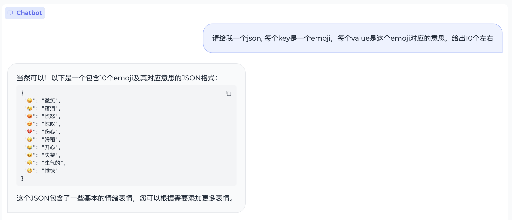

<div align="center">
<h1>
  MiniCPM
</h1>
</div>

<p align="center">
<a href="XXXX" target="_blank">Hugging Face</a> |
<a href="XXXX" target="_blank">ModelScope</a> |
<a href="XXXX" target="_blank">Hugging Face</a> |
<a href="XXXX" target="_blank">技术报告</a> 
</p>

<div align="center">

XXXXXX
XXXXXX

在[面壁露卡](https://luca.cn/)体验更大规模的模型。

<h4 align="center">
    <p>
        <b>中文</b> |
        <a href="XXXX">English</a>
    <p>
</h4>

</div>

# 目录

- [模型介绍](#1)
- [模型下载](#2)
- [评测结果](#3)
- [手机部署](#4)
- [Demo & API 部署](#5)
- [高效参数微调](#6)
- [开源协议](#7)
- [工作引用](#8)
- [典型示例](#9)

<p id="1"></p>

# 模型介绍


<p id="2"></p>

# 模型下载

  [HuggingFace仓库]()
  [ModelScope仓库]()
  [XX仓库]()


<p id="3"></p>

## 评测结果

#### 评测设置

* 由于大模型评测难以统一，且大量评测也没有公开的prompt和测试代码，对于具体评测方式，我们只能尽量做到适合各类模型。
* 整体而言，我们测试时采用统一的prompt输入，并按照各模型对应的模板进行输入调整。
* **评测脚本及prompt已开源在我们的Github仓库中，也欢迎更多开发者来不断改进我们的评测方式。**

#### 部署模式

* 因为MiniCPM采用Mup的结构，与现有模型在具体计算上有细微差别，我们是基于vllm=0.2.2版本进行了我们模型的实现。
* **对于非MiniCPM模型，我们直接采样了vllm=0.2.7的最新版本进行推理。**

#### 评测度量

* 对于QA任务（选择题任务），我们选用两种方式进行测试：
  * PPL：将选项作为题目生成的延续，并根据各个选项的PPL来进行答案选择；
  * 第二种是直接生成答案选项。
* 对于不同模型，这两种方式得到的结果差异较大。MiniCPM两种模式上的结果较为接近，而Mistral-7B-v0.1等模型在PPL上表现较好，直接生成上效果较差。
* 在具体评测时，我们以两种评测方式得分的最高者为最终结果，以此保证对比的公平性。

#### 文本评测

|模型|英文均分|中文均分|CEval|CMMLU|MMLU|HumanEval|MBPP|GSM8K|MATH|BBH|Arc-e|ARC-c|HellaSwag|
|-|-|-|-|-|-|-|-|-|-|-|-|-|-|
|Llama2-7B|35.40|36.21|31.765|32.42|31.11|44.32|12.2|27.17|13.57|1.8|33.23|75.25|42.75|75.62*|
|Qwen-7B|53.87|52.42|59.655|58.96|60.35|57.65|17.07|42.15|41.24|37.75|83.42|64.76|75.32*|
|Deepseek-7B|39.96|39.15|43.635|42.82|44.45|47.82|20.12|41.45|15.85|1.53|33.38|74.58*|42.15*|75.45*|
|Mistral-7B|48.97|49.96|44.54|46.12|42.96|62.69|27.44|45.2|33.13|5.0|41.06|83.92|70.73|80.43*|
|Llama2-13B|41.48|42.44|37.19|37.32|37.06|54.71|17.07|32.55|21.15|2.25|37.92|78.87*|58.19|79.23*|
|MPT-30B|38.17|39.82|30.715|29.34|32.09|46.56|21.95|35.36|10.31|1.56|38.22|78.66*|46.08*|79.72*|
|Falcon-40B|43.62|44.21|40.93|40.29|41.57|53.53|24.39|36.53|22.44|1.92|36.24|81.94*|57.68|83.26*|
|MiniCPM-2B|52.33|52.6|51.1|51.13|51.07|53.46|50.00|47.31|53.83|10.24|36.87|85.44|68.00|68.25|

|模型|英文均分|中文均分|CEval|CMMLU|MMLU|HumanEval|MBPP|GSM8K|MATH|BBH|Arc-e|ARC-c|HellaSwag|
|-|-|-|-|-|-|-|-|-|-|-|-|-|-|
|TinyLlama-1.1B|25.36|25.55|24.525|25.02|24.03|24.3|6.71|19.91|2.27|0.74|28.78|60.77*|28.15*|58.33*|Qwen-1.8B|34.72|31.87|47.565|49.81|45.32|43.37|7.93|17.8|19.26|2.42|29.07|63.97*|43.69|59.28*|
|Gemini Nano-3B|-|-|-|-|-|-|-|27.2(report)|22.8(report)|-|42.4(report)|-|-|-|
|StableLM-Zephyr-3B|43.43|46.28|30.615|30.34|30.89|45.9|35.37|31.85|52.54|12.12|37.68|73.78|55.38|71.87*|
|Phi-2-2B|48.84|54.41|23.775|23.37|24.18|52.66|47.56|55.04|57.16|3.5|43.39|86.11|71.25|73.07*|
|MiniCPM-2B|52.33|52.6|51.1|51.13|51.07|53.46|50.00|47.31|53.83|10.24|36.87|85.44|68.00|68.25|

#### 多模态评测

|模型|MME(P)|MMB-dev(en)|MMB-dev(zh)|MMMU-val|CMMMU-val|
|-|-|-|-|-|-|
|LLaVA-Phi|1335.1|59.8|/|/|/|
|MobileVLM|1288.9|59.6|/|/|/|
|Imp-v1|1434.0|66.5|/|/|/|
|Qwen-VL-Chat|**1487**|60.6|56.7|**35.9**|30.7
|**MiniCPM-V**|1446|**67.3**|**61.9**|34.7|**32.1**|

#### DPO评测

|模型|MT-bench|
|---|---|
|GPT-4-turbo|9.32|
|GPT-3.5-turbo|8.39|
|Mistral-8*7b-Instruct-v0.1|8.30|
|Claude-2.1|8.18|
|Zephyr-7B-beta|7.34|
|**MiniCPM-2B**|**7.25**|
|Vicuna-33B|7.12|
|Zephyr-7B-alpha|6.88|
|LLaMA-2-70B-chat|6.86|
|Mistral-7B-Instruct-v0.1|6.84|
|MPT-34B-instruct|6.39|

<p id="4"></p>

## 手机部署

#### 部署步骤

* 进行Int4量化后，MiniCPM只占2GB空间，具备在端侧手机进行模型部署的条件。
* 对于不同的操作系统，我们进行了不同的适配。
* **注意：当前开源框架对手机支持还在完善，并非所有芯片与操作系统版本均能成功运行MLC-LLM或LLMFarm。**
* Android、Harmony
  * 使用开源框架MLC-LLM进行模型适配。
  * 支持文本模型、多模态模型。
  * 适用于MiniCPM-2B-SFT-INT4、MiniCPM-2B-DPO-INT4、MiniCPM-V。
  * [编译安装MiniCPM指南](https://github.com/OpenBMB/mlc-MiniCPM/blob/main/README.md) 
* iOS
  * 使用开源框架LLMFarm进行模型适配。
  * 支持文本模型。
  * 适用于MiniCPM-2B-SFT-INT4、MiniCPM-2B-DPO-INT4
  * [编译安装MiniCPM指南](https://github.com/OpenBMB/LLMFarm)

#### 部署性能

* 我们未针对手机推理模型进行深度优化和系统测试，仅验证MiniCPM使用手机芯片进行推理的可行性。
* 此前尚未有工作尝试在手机上部署多模态大模型。我们此次在MLC-LLM上验证了手机部署MiniCPM-V的可行性，能够正常输入输出，但也存在图片处理时间较长的问题，需要进一步优化。
* **我们也欢迎更多开发者进一步调优并更新下面的测试列表，不断提升端侧大模型在手机上的推理性能。**

|手机型号|操作系统|处理器|Memory（GB）|推理吞吐（token/s）|
|-|-|-|-|-|
|OPPO Find N3|Android 13|snapdragon 8 Gen2|12|6.5|
|Samsung S23 Ultra|Android 14|snapdragon 8 Gen2|12|6.4|
|Meizu M182Q|Android 11|snapdragon 888Plus|8|3.7|
|Xiaomi 12 Pro|Android 13|snapdragon 8 Gen1|8+3|3.7|
|Xiaomi Redmi K40|Android 11|snapdragon 870|8|3.5|
|Oneplus LE 2100|Android 13|snapdragon 870|12|3.5|
|Oneplus HD1900|Android 11|snapdragon 865|8|3.2|
|Oneplus HD1900|Android 11|snapdragon 855|8|3.0|
|Oneplus HD1905|Android 10|snapdragon 855|8|3.0|
|Oneplus HD1900|Android 11|snapdragon 855|8|3.0|
|Xiaomi MI 8|Android 9|snapdragon 845|6|2.3|
|Huawei Nova 11SE|Harmony 4.0.0|snapdragon 778|12|1.9|
|Xiaomi MIX 2|Android 9|snapdragon 835|6|1.3|
|iPhone 15 Pro|iOS 17.2.1|A16|8|18.0|
|iPhone 15|iOS 17.2.1|A16|6|15.0|
|iPhone 12 Pro|iOS 16.5.1|A14|6|5.8|
|iPhone 12|iOS 17.2.1|A14|4|5.8|
|iPhone 11|iOS 16.6|A13|4|4.6|

todo

<p id="5"></p>

## Demo & API 部署

#### 基于Gradio的网页版Demo

* 使用如下命令启动基于Gradio的网页版demo：

```shell
python demo/gradio_based_demo.py
```


<p id="6"></p>

## 高效参数微调


<p id="7"></p>

## 开源协议

#### 模型协议

* 本仓库中代码依照 [Apache-2.0](https://github.com/OpenBMB/MiniCPM/blob/main/LICENSE) 协议开源
* MiniCPM 模型权重的使用则需要遵循 [“通用模型许可协议-来源说明-宣传限制-商业授权”](https://github.com/OpenBMB/General-Model-License/blob/main/%E9%80%9A%E7%94%A8%E6%A8%A1%E5%9E%8B%E8%AE%B8%E5%8F%AF%E5%8D%8F%E8%AE%AE-%E6%9D%A5%E6%BA%90%E8%AF%B4%E6%98%8E-%E5%AE%A3%E4%BC%A0%E9%99%90%E5%88%B6-%E5%95%86%E4%B8%9A%E6%8E%88%E6%9D%83.md)。
* MiniCPM 模型权重对学术研究完全开放。
* 如需将模型用于商业用途，请联系cpm@modelbest.cn来获取书面授权，在登记后亦允许免费商业使用。

#### 声明

* 作为一个语言模型，MiniCPM 通过学习大量的文本来生成内容，但它无法理解、表达个人观点或价值判断，它所输出的任何内容都不代表模型开发者的观点和立场。
* 因此用户在使用 MiniCPM 生成的内容时，应自行负责对其进行评估和验证。
* 如果由于使用 MinCPM 开源模型而导致的任何问题，包括但不限于数据安全问题、公共舆论风险，或模型被误导、滥用、传播或不当利用所带来的任何风险和问题，我们将不承担任何责任。

<p id="8"></p>

## 工作引用

* 如果觉得MiniCPM有助于您的工作，请考虑引用下列[技术报告](todo)

```
@inproceedings{minicpm2024,
	title={MiniCPM: todo},
	booktitle={OpenBMB Blog},
	year={2024}
}
```

<p id="9"></p>

## 典型示例

#### 文本生成


#### 代码生成


#### 数理逻辑


#### 文本翻译


#### 指令跟随


#### 特殊字符



