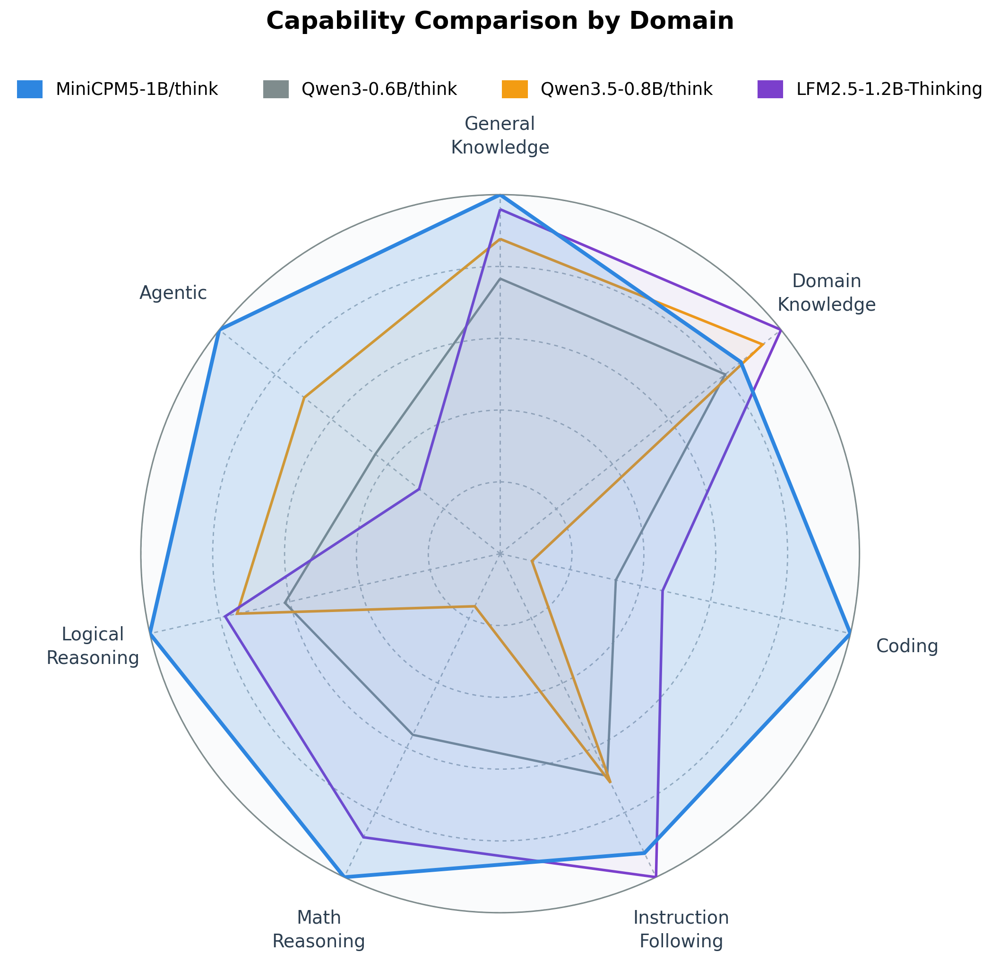
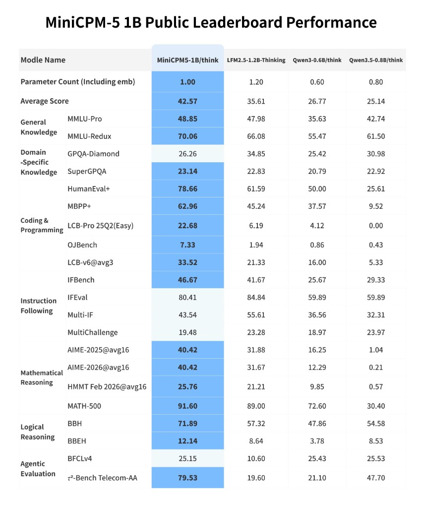

<div align="center">
</img> 
</div>

<h4 align="center">
    <p>
        <a href="https://github.com/OpenBMB/MiniCPM/blob/minicpm5/README-cn.md">中文</a> | <b>English</b>
    <p>
</h4>

<p align="center">
<a href="https://arxiv.org/pdf/2506.07900" target="_blank">MiniCPM Tech Report</a> |
<a href="https://modelbest.feishu.cn/wiki/D2tFw8Pcsi5CIzkaHNacLK64npg" target="_blank">MiniCPM Wiki (in Chinese)</a> |
<a href="https://github.com/OpenBMB/MiniCPM-V/" target="_blank">MiniCPM-V Repo</a> |
Join our <a href="https://discord.gg/3cGQn9b3YM" target="_blank">discord</a> and <a href="https://github.com/OpenBMB/MiniCPM/blob/main/assets/wechat.jpg" target="_blank">WeChat</a> |
<a href="https://mp.weixin.qq.com/s/KIhH2nCURBXuFXAtYRpuXg?poc_token=HBIsUWijxino8oJ5s6HcjcfXFRi0Xj2LJlxPYD9c">Join Us</a>
</p>

> [!NOTE]
> ### 🐱 MiniCPM5-1B Desktop Pet · Video Demo
>
> **Video demo:** local MiniCPM5-1B powering the desktop pet interaction flow.
>
> <a href="https://youtu.be/UXtUccouXGY"></a>
>
> Watch on [YouTube](https://youtu.be/UXtUccouXGY).
>
> 👉 **Project:** [OpenBMB/MiniCPM-Desk-Pet](https://github.com/OpenBMB/MiniCPM-Desk-Pet)

## ✨ Highlights

We are releasing **MiniCPM5-1B**, the first model in the **MiniCPM5** series. It is a dense 1B Transformer built for on-device, local deployment, and resource-constrained scenarios, reaching 1B-class open-source SOTA on the benchmark suite.

🏆 **1B-class open-source SOTA**: MiniCPM5-1B reaches an average score of 42.57 across reasoning, knowledge, code, instruction-following, math, logic and agentic benchmarks, above the highest average score of 35.61 among strong open-source models in the same size class; its strengths are most visible in agentic tool use, code, and competition math.



🧠 **Dual Mode Reasoning**: built-in `<think>` chat template, switch via `enable_thinking`. The same checkpoint serves as both a fast assistant and a deliberate reasoner.

🛠️ **Deployment / Fine-tuning Agent Skills**: the repo provides single-page cookbooks for major inference backends and fine-tuning frameworks, each paired with an [Agent Skill](./skills/) to help developers reproduce deployment and fine-tuning workflows.

🐱 **Desktop Pet**: a local-LLM desktop pet driven by MiniCPM5-1B — see [Desktop Pet](#desktop-pet) below.

## 🔥 Changelog
- 📌 [2026.05.19] **[MiniCPM5-1B](https://huggingface.co/openbmb/MiniCPM5-1B)** is released: a compact 1B-class dense model for on-device and resource-constrained use, paired with deployment / fine-tuning [Agent Skills](./skills/).
- [2026.02.11] **[MiniCPM-SALA](https://huggingface.co/openbmb/MiniCPM-SALA)** is released: a sparse-and-linear hybrid attention model for million-token context modeling and efficient inference.
- [2025.09.05] **[MiniCPM4.1 series](https://huggingface.co/collections/openbmb/minicpm-4-6841ab29d180257e940baa9b)** is released: a trainable sparse-attention model with hybrid reasoning.
- [2025.06.06] [**MiniCPM4**](https://huggingface.co/collections/openbmb/minicpm-4-6841ab29d180257e940baa9b) is released: an end-side model with over 5x generation acceleration on typical edge chips.

<details>
<summary>Older entries (2024 + InfLLM-V2 paper)</summary>

- [2025.09.29] **[InfLLM-V2 paper](https://arxiv.org/abs/2509.24663) is released!** We can train a sparse attention model with only 5B long-text tokens.
- [2024.09.05] We release [**MiniCPM3-4B**](https://huggingface.co/openbmb/MiniCPM3-4B)! This model outperforms Phi-3.5-mini-instruct and GPT-3.5-Turbo-0125 and is comparable to several models with 7B-9B parameters like Llama3.1-8B-Instruct, Qwen2-7B-Instruct, and GLM-4-9B-Chat.
- [2024.07.05] Released [**MiniCPM-S-1B**](https://huggingface.co/openbmb/MiniCPM-S-1B-sft)! This model achieves an average sparsity of 87.89% in the FFN layer, reducing FFN FLOPs by 84%, while maintaining downstream task performance.
- [2024.04.11] Released [**MiniCPM-2B-128k**](https://huggingface.co/openbmb/MiniCPM-2B-128k), [**MiniCPM-MoE-8x2B**](https://huggingface.co/openbmb/MiniCPM-MoE-8x2B) and [**MiniCPM-1B**](https://huggingface.co/openbmb/MiniCPM-1B-sft-bf16)! Click [here](https://openbmb.vercel.app/) to read our technical blog.
- [2024.02.01] Released [**MiniCPM-2B**](https://huggingface.co/openbmb/MiniCPM-2B-sft-bf16)! This model performs similarly to Mistral-7B on public benchmarks (with better performance in Chinese, math, and code abilities) and overall outperforms models like Llama2-13B, MPT-30B, and Falcon-40B.

</details>

## 🧭 Quick Links

- [✨ Highlights](#-highlights)
- [🔥 Changelog](#-changelog)
- [📦 Model Downloads](#-model-downloads)
- [🚀 MiniCPM5-1B](#-minicpm5-1b)
  - [Introduction](#introduction)
  - [Evaluation Results](#evaluation-results)
  - [Training Recipe](#training-recipe)
    - [What does RL + OPD bring?](#what-does-rl--opd-bring)
  - [Quickstart](#quickstart)
  - [Deployment and Fine-tuning Cookbooks and Agent Skills](#deployment-and-fine-tuning-cookbooks-and-agent-skills)
  - [Desktop Pet](#desktop-pet)
- [🧪 MiniCPM-SALA](#-minicpm-sala)
- [⚡ MiniCPM4 & MiniCPM4.1 Series](#-minicpm4-and-minicpm41-series)
- [Legacy topics →](./docs/README-legacy.md): BitCPM4 quantization, MiniCPM4 applications
- [📄 LICENSE](#-license) · [🏛 Institutions](#-institutions) · [📚 Citation](#-citation)


## 📦 Model Downloads

**Current release: MiniCPM5-1B** (BF16, GGUF, MLX):

| HuggingFace | ModelScope |
|---|---|
| [MiniCPM5-1B](https://huggingface.co/openbmb/MiniCPM5-1B) | [MiniCPM5-1B](https://www.modelscope.cn/models/OpenBMB/MiniCPM5-1B) |
| [MiniCPM5-1B-SFT](https://huggingface.co/openbmb/MiniCPM5-1B-SFT) | [MiniCPM5-1B-SFT](https://www.modelscope.cn/models/OpenBMB/MiniCPM5-1B-SFT) |
| [MiniCPM5-1B-Base](https://huggingface.co/openbmb/MiniCPM5-1B-Base) | [MiniCPM5-1B-Base](https://www.modelscope.cn/models/OpenBMB/MiniCPM5-1B-Base) |
| [MiniCPM5-1B-GGUF](https://huggingface.co/openbmb/MiniCPM5-1B-GGUF) | [MiniCPM5-1B-GGUF](https://www.modelscope.cn/models/OpenBMB/MiniCPM5-1B-GGUF) |
| [MiniCPM5-1B-MLX](https://huggingface.co/openbmb/MiniCPM5-1B-MLX) | [MiniCPM5-1B-MLX](https://www.modelscope.cn/models/OpenBMB/MiniCPM5-1B-MLX) |

**Other key releases:**

| HuggingFace | ModelScope |
|---|---|
| [MiniCPM-SALA](https://huggingface.co/openbmb/MiniCPM-SALA) | [MiniCPM-SALA](https://www.modelscope.cn/models/OpenBMB/MiniCPM-SALA) |
| [MiniCPM4.1-8B](https://huggingface.co/openbmb/MiniCPM4.1-8B) | [MiniCPM4.1-8B](https://www.modelscope.cn/models/OpenBMB/MiniCPM4.1-8B) |
| [MiniCPM4-0.5B](https://huggingface.co/openbmb/MiniCPM4-0.5B) | [MiniCPM4-0.5B](https://www.modelscope.cn/models/OpenBMB/MiniCPM4-0.5B) |

<details>
<summary>📋 Click to view earlier MiniCPM releases: 4, BitCPM, applications, MiniCPM3 / 2B / 1B</summary>

**Earlier flagships:**

| HuggingFace | ModelScope |
|---|---|
| [MiniCPM4-8B](https://huggingface.co/openbmb/MiniCPM4-8B) | [MiniCPM4-8B](https://www.modelscope.cn/models/OpenBMB/MiniCPM4-8B) |

**MiniCPM4.1 quantized & speculative variants:**

| HuggingFace | ModelScope |
|---|---|
| [MiniCPM4.1-8B-GPTQ](https://huggingface.co/openbmb/MiniCPM4.1-8B-GPTQ) | [MiniCPM4.1-8B-GPTQ](https://www.modelscope.cn/openbmb/MiniCPM4.1-8B-GPTQ) |
| [MiniCPM4.1-8B-AutoAWQ](https://huggingface.co/openbmb/MiniCPM4.1-8B-AutoAWQ) | [MiniCPM4.1-8B-AutoAWQ](https://www.modelscope.cn/openbmb/MiniCPM4.1-8B-AutoAWQ) |
| [MiniCPM-4.1-8B-Marlin](https://huggingface.co/openbmb/MiniCPM-4.1-8B-Marlin) | [MiniCPM-4.1-8B-Marlin](https://www.modelscope.cn/openbmb/MiniCPM-4.1-8B-Marlin) |
| [MiniCPM4.1-8B-GGUF](https://huggingface.co/openbmb/MiniCPM4.1-8B-GGUF) | [MiniCPM4.1-8B-GGUF](https://www.modelscope.cn/openbmb/MiniCPM4.1-8B-GGUF) |
| [MiniCPM4.1-8B-MLX](https://huggingface.co/openbmb/MiniCPM4.1-8B-MLX) | [MiniCPM4.1-8B-MLX](https://www.modelscope.cn/openbmb/MiniCPM4.1-8B-MLX) |
| [MiniCPM4.1-8B-Eagle3](https://huggingface.co/openbmb/MiniCPM4.1-8B-Eagle3) | [MiniCPM4.1-8B-Eagle3](https://www.modelscope.cn/openbmb/MiniCPM4.1-8B-Eagle3) |

**BitCPM4 ternary-quantized + MiniCPM4 Applications:**

| HuggingFace | ModelScope |
|---|---|
| [BitCPM4-1B](https://huggingface.co/openbmb/BitCPM4-1B) | [BitCPM4-1B](https://www.modelscope.cn/models/OpenBMB/BitCPM4-1B) |
| [BitCPM4-0.5B](https://huggingface.co/openbmb/BitCPM4-0.5B) | [BitCPM4-0.5B](https://www.modelscope.cn/models/OpenBMB/BitCPM4-0.5B) |
| [MiniCPM4-Survey](https://huggingface.co/openbmb/MiniCPM4-Survey) | [MiniCPM4-Survey](https://www.modelscope.cn/models/OpenBMB/MiniCPM4-Survey) |
| [MiniCPM4-MCP](https://huggingface.co/openbmb/MiniCPM4-MCP) | [MiniCPM4-MCP](https://www.modelscope.cn/models/OpenBMB/MiniCPM4-MCP) |

**MiniCPM4 Eagle speculative decoding, QAT, and pre-2025 releases:**

| HuggingFace | ModelScope |
|---|---|
| [MiniCPM4-8B-Eagle-FRSpec](https://huggingface.co/openbmb/MiniCPM4-8B-Eagle-FRSpec) | [MiniCPM4-8B-Eagle-FRSpec](https://www.modelscope.cn/models/OpenBMB/MiniCPM4-8B-Eagle-FRSpec) |
| [MiniCPM4-8B-Eagle-FRSpec-QAT](https://huggingface.co/openbmb/MiniCPM4-8B-Eagle-FRSpec-QAT) | [MiniCPM4-8B-Eagle-FRSpec-QAT](https://www.modelscope.cn/models/OpenBMB/MiniCPM4-8B-Eagle-FRSpec-QAT) |
| [MiniCPM4-8B-Eagle-vLLM](https://huggingface.co/openbmb/MiniCPM4-8B-Eagle-vLLM) | [MiniCPM4-8B-Eagle-vLLM](https://www.modelscope.cn/models/OpenBMB/MiniCPM4-8B-Eagle-vLLM) |
| [MiniCPM4-8B-marlin-Eagle-vLLM](https://huggingface.co/openbmb/MiniCPM4-8B-marlin-Eagle-vLLM) | [MiniCPM4-8B-marlin-Eagle-vLLM](https://www.modelscope.cn/models/OpenBMB/MiniCPM4-8B-marlin-Eagle-vLLM) |
| [MiniCPM4-0.5B-QAT-Int4-unquantized](https://huggingface.co/openbmb/MiniCPM4-0.5B-QAT-Int4-unquantized) | [MiniCPM4-0.5B-QAT-Int4-unquantized](https://modelscope.cn/models/OpenBMB/MiniCPM4-0.5B-QAT-Int4-unquantized) |
| [MiniCPM4-0.5B-QAT-Int4-GPTQ-format](https://huggingface.co/openbmb/MiniCPM4-0.5B-QAT-Int4-GPTQ-format) | [MiniCPM4-0.5B-QAT-Int4-GPTQ-format](https://modelscope.cn/models/OpenBMB/MiniCPM4-0.5B-QAT-Int4-GPTQ-format) |
| [MiniCPM3-4B](https://huggingface.co/openbmb/MiniCPM3-4B) | [MiniCPM3-4B](https://www.modelscope.cn/models/OpenBMB/MiniCPM3-4B) |
| [MiniCPM-2B-sft](https://huggingface.co/openbmb/MiniCPM-2B-sft-bf16) | [MiniCPM-2B-sft](https://modelscope.cn/models/OpenBMB/miniCPM-bf16) |
| [MiniCPM-2B-dpo](https://huggingface.co/openbmb/MiniCPM-2B-dpo-bf16) | [MiniCPM-2B-dpo](https://modelscope.cn/models/OpenBMB/MiniCPM-2B-dpo-bf16/summary) |
| [MiniCPM-2B-128k](https://huggingface.co/openbmb/MiniCPM-2B-128k) | [MiniCPM-2B-128k](https://modelscope.cn/models/openbmb/MiniCPM-2B-128k/summary) |
| [MiniCPM-MoE-8x2B](https://huggingface.co/openbmb/MiniCPM-MoE-8x2B) | [MiniCPM-MoE-8x2B](https://modelscope.cn/models/OpenBMB/MiniCPM-MoE-8x2B) |
| [MiniCPM-1B](https://huggingface.co/openbmb/MiniCPM-1B-sft-bf16) | [MiniCPM-1B](https://modelscope.cn/models/OpenBMB/MiniCPM-1B-sft-bf16) |
| [MiniCPM-S-1B](https://huggingface.co/openbmb/MiniCPM-S-1B-sft) | [MiniCPM-S-1B](https://modelscope.cn/models/OpenBMB/MiniCPM-S-1B-sft) |

</details>

## 🚀 MiniCPM5-1B

### Introduction

MiniCPM5-1B is the first checkpoint in the MiniCPM5 series. It is designed for local assistants, coding agents, tool-use workflows, and reasoning scenarios where a compact model is preferred. The model keeps a small deployment footprint while providing native long-context support and both Think / No Think chat modes through the same checkpoint.

### Evaluation Results

We compare MiniCPM5-1B with strong open-source models in the same size class, including **LFM2.5-1.2B-Thinking**, **Qwen3-0.6B/think** and **Qwen3.5-0.8B/think**. These are capable baselines; within this comparison set, MiniCPM5-1B reaches 1B-class open-source SOTA, with its advantage most visible in tool use, code generation, and difficult reasoning. This makes it a practical choice for local coding agents, tool assistants, and reasoning assistants.



### Training Recipe

The training of MiniCPM5-1B is a full-stack practice of **[UltraData Tiered Data Management](https://ultradata.openbmb.cn/)**, covering three stages: base training, mid-training, and post-training.

During **base training**, the model goes through two-stage stable training and decay training to build core language capability and training stability. It then enters **mid-training** to further strengthen target capabilities and adapt to the target data distribution. The training corpus is released alongside the model as [Ultra-FineWeb](https://huggingface.co/datasets/openbmb/Ultra-FineWeb), [Ultra-FineWeb-L3](https://huggingface.co/datasets/openbmb/Ultra-FineWeb-L3), and [UltraData-Math](https://huggingface.co/datasets/openbmb/UltraData-Math).

During **post-training**, we proceed in three steps: **SFT**, **RL**, and **OPD**. We first use **200B tokens of deep-thinking SFT** and **200B tokens of hybrid-thinking SFT** to establish deep-thinking, hybrid-thinking, and general chat abilities; the SFT data is released as [UltraData-SFT-2605](https://huggingface.co/datasets/openbmb/UltraData-SFT-2605). We then train specialized **RL teachers** for math, code, closed-book QA, writing, and related domains, and use **On-Policy Distillation (OPD)** to distill these teachers back into one release model.


#### What does RL + OPD bring?

**RL + OPD** is a key part of MiniCPM5-1B post-training. On math, code and instruction-following tasks, RL + OPD raises the average score by **↑16 points** while cutting the share of responses that hit the max-tokens budget by **↓29 percentage points**. The figures below show the two-stage Reasoning RL pipeline, score gains, and the drop in overlong responses.

**RL** combines complementary training signals for reasoning, closed-book QA, writing, instruction following, long-context understanding, and general dialogue. Reasoning RL is based on [DAPO-Math-17k](https://huggingface.co/datasets/BytedTsinghua-SIA/DAPO-Math-17k) and uses a two-stage length schedule to reduce overlong responses while improving reasoning accuracy. We also use [TriviaQA](https://huggingface.co/datasets/mandarjoshi/trivia_qa), [NQ-Open](https://huggingface.co/datasets/google-research-datasets/nq_open), [LongWriter-Zero-RLData](https://huggingface.co/datasets/THU-KEG/LongWriter-Zero-RLData), synthesized verifiable RLVR data, and pair-wise RLHF signals to improve reliability, instruction following, and user experience.


**OPD** builds on Thinking Machines Lab's [On-Policy Distillation](https://thinkingmachines.ai/blog/on-policy-distillation/) and incorporates implementation improvements from [Rethinking On-Policy Distillation](https://arxiv.org/pdf/2604.13016). In the RL framework, we use reverse KL divergence as the advantage estimate, replacing the original verification-based advantage. At each response position, we take top-k logits from both the student and teacher models, compute reverse KL on the union of the two token sets, and balance the accuracy of the RKL signal with training efficiency. OPD reuses the in-domain prompts used to train each RL teacher as distillation data, so no additional data curation is required.


### Quickstart

For the three most common inference paths, you can start a service or run local inference as follows:

**vLLM** (OpenAI-compatible server, NVIDIA GPU):

```bash
pip install "vllm>=0.21" && vllm serve openbmb/MiniCPM5-1B --port 8000
```

Test request:

```bash
curl http://localhost:8000/v1/chat/completions \
  -H "Content-Type: application/json" \
  -d '{
    "model": "openbmb/MiniCPM5-1B",
    "messages": [{"role": "user", "content": "Who are you? Please briefly introduce yourself."}],
    "max_tokens": 128,
    "temperature": 0.7
  }'
```

**SGLang** (OpenAI-compatible server, NVIDIA GPU):

```bash
pip install "sglang[srt]>=0.5.12" && python -m sglang.launch_server --model-path openbmb/MiniCPM5-1B --port 30000
```

Test request:

```bash
curl http://localhost:30000/v1/chat/completions \
  -H "Content-Type: application/json" \
  -d '{
    "model": "openbmb/MiniCPM5-1B",
    "messages": [{"role": "user", "content": "Who are you? Please briefly introduce yourself."}],
    "max_tokens": 128,
    "temperature": 0.7
  }'
```

**Transformers** (local Python inference, CPU or GPU):

```bash
pip install -U "transformers>=5.6" accelerate torch
```

Local inference test:

```python
from transformers import AutoModelForCausalLM, AutoTokenizer

model_id = "openbmb/MiniCPM5-1B"
tokenizer = AutoTokenizer.from_pretrained(model_id)
model = AutoModelForCausalLM.from_pretrained(
    model_id,
    torch_dtype="auto",
    device_map="auto",
)

messages = [{"role": "user", "content": "Who are you? Please briefly introduce yourself."}]
inputs = tokenizer.apply_chat_template(
    messages,
    tokenize=True,
    add_generation_prompt=True,
    enable_thinking=False,
    return_tensors="pt",
).to(model.device)

outputs = model.generate(inputs, max_new_tokens=128)
print(tokenizer.decode(outputs[0][inputs.shape[-1]:], skip_special_tokens=True))
```

Recommended chat template sampling:

| Mode | Recommended params | Enable |
| --- | --- | --- |
| **Think** | `temperature=0.9, top_p=0.95` | `enable_thinking=True` |
| **No Think** | `temperature=0.7, top_p=0.95` | `enable_thinking=False` |

For other backends (llama.cpp / Ollama / LM Studio / MLX), see the cookbooks table below.

#### With tool calling

For tool / function calling, **SGLang is the recommended backend** — MiniCPM5-1B emits XML-style tool calls and SGLang's built-in `minicpm5` parser converts them to OpenAI-compatible `tool_calls` natively:

```bash
python -m sglang.launch_server --model-path openbmb/MiniCPM5-1B --port 30000 \
    --tool-call-parser minicpm5      # or: --tool-call-parser auto
```

### Deployment and Fine-tuning Cookbooks and Agent Skills

MiniCPM5-1B uses the **standard `LlamaForCausalLM` architecture**, so mainstream inference engines can load it directly: **no custom kernels, no model-code fork**. To help developers reproduce deployment and fine-tuning workflows, we provide single-page cookbooks paired with [Cursor Agent Skills](https://docs.cursor.com/agent/skills): the cookbooks are for manual execution, while Agent Skills let Cursor / Claude Code agents choose the route based on the target backend, hardware, and data path.

The two top-level skills cover deployment and fine-tuning:

| Top-level skill | What it does | Routes to |
| --- | --- | --- |
| **[`minicpm5-deploy`](./skills/minicpm5-deploy/SKILL.md)** | Inference router | `transformers` · `vllm` · `sglang` · `llama-cpp` · `ollama` · `lmstudio` · `mlx` |
| **[`minicpm5-finetune`](./skills/minicpm5-finetune/SKILL.md)** | Fine tuning router | `trl` · `llamafactory` · `ms-swift` · `unsloth` · `xtuner` |

In Cursor / Claude Code, you can call them like this: the agent reads the top-level skill, selects the matching sub-skill and cookbook based on the target backend, hardware, and data path, then runs the command and reports back.

```
@minicpm5-deploy   serve openbmb/MiniCPM5-1B with vLLM on port 8000
@minicpm5-finetune use unsloth + LoRA on /data/my_chat.jsonl, write to ./out
```

The tables below list the cookbook and sub-skill for each inference backend and fine-tuning framework. Quantized models are not listed as standalone backends; they are described under the inference backend that can load each format.

**Inference Deployment** (7 backends)

| Backend | Model format / use case | Cookbook | Paired Agent Skill |
| --- | --- | --- | --- |
| [Transformers](https://github.com/huggingface/transformers) | BF16 / FP16 local Python inference, GPU + CPU | [`docs/deployment/transformers.md`](./docs/deployment/transformers.md) | [`minicpm5-deploy-transformers`](./skills/minicpm5-deploy-transformers/SKILL.md) |
| [SGLang](https://github.com/sgl-project/sglang) | BF16 / FP16 OpenAI server, recommended for tool calling | [`docs/deployment/sglang.md`](./docs/deployment/sglang.md) | [`minicpm5-deploy-sglang`](./skills/minicpm5-deploy-sglang/SKILL.md) |
| [llama.cpp](https://github.com/ggml-org/llama.cpp) | GGUF local inference, CPU/GPU | [`docs/deployment/llama_cpp.md`](./docs/deployment/llama_cpp.md) | [`minicpm5-deploy-llama-cpp`](./skills/minicpm5-deploy-llama-cpp/SKILL.md) |
| [Ollama](https://github.com/ollama/ollama) | GGUF local on-device runtime | [`docs/deployment/ollama.md`](./docs/deployment/ollama.md) | [`minicpm5-deploy-ollama`](./skills/minicpm5-deploy-ollama/SKILL.md) |
| [LM Studio](https://lmstudio.ai) | GGUF Mac desktop app and OpenAI server | [`docs/deployment/lmstudio.md`](./docs/deployment/lmstudio.md) | [`minicpm5-deploy-lmstudio`](./skills/minicpm5-deploy-lmstudio/SKILL.md) |
| [MLX](https://github.com/ml-explore/mlx-lm) | MLX / 4bit local inference on Apple Silicon | [`docs/deployment/mlx.md`](./docs/deployment/mlx.md) | [`minicpm5-deploy-mlx`](./skills/minicpm5-deploy-mlx/SKILL.md) |

**Fine tuning** (5 frameworks)

| Framework | Cookbook | Paired Agent Skill |
| --- | --- | --- |
| [TRL](https://github.com/huggingface/trl) + [PEFT](https://github.com/huggingface/peft) | [`docs/finetune/trl.md`](./docs/finetune/trl.md) | [`minicpm5-finetune-trl`](./skills/minicpm5-finetune-trl/SKILL.md) |
| [LLaMA-Factory](https://github.com/hiyouga/LLaMA-Factory) | [`docs/finetune/llamafactory.md`](./docs/finetune/llamafactory.md) | [`minicpm5-finetune-llamafactory`](./skills/minicpm5-finetune-llamafactory/SKILL.md) |
| [ms-swift](https://github.com/modelscope/ms-swift) | [`docs/finetune/ms_swift.md`](./docs/finetune/ms_swift.md) | [`minicpm5-finetune-ms-swift`](./skills/minicpm5-finetune-ms-swift/SKILL.md) |
| [unsloth](https://github.com/unslothai/unsloth) | [`docs/finetune/unsloth.md`](./docs/finetune/unsloth.md) | [`minicpm5-finetune-unsloth`](./skills/minicpm5-finetune-unsloth/SKILL.md) |
| [xtuner](https://github.com/InternLM/xtuner) | [`docs/finetune/xtuner.md`](./docs/finetune/xtuner.md) | [`minicpm5-finetune-xtuner`](./skills/minicpm5-finetune-xtuner/SKILL.md) |

### Desktop Pet

We also ship **[OpenBMB/MiniCPM-Desk-Pet](https://github.com/OpenBMB/MiniCPM-Desk-Pet)**, a desktop pet driven locally by MiniCPM5-1B. It uses a thin `llama.cpp` `llama-server` sidecar to load the GGUF model and serves an OpenAI-compatible local endpoint to an Electron pet UI.

The pet supports Apple Silicon / NVIDIA GPU / CPU paths, can work with coding agents such as Cursor, Claude Code, and Codex, and supports LoRA persona switching.

- **User install**: grab `Clawd-on-Desk-*-arm64.dmg` from [Releases](https://github.com/OpenBMB/MiniCPM-Desk-Pet/releases), then follow the onboarding flow for environment checks, model download, and sidecar startup.
- **Developer run**: `git clone git@github.com:OpenBMB/MiniCPM-Desk-Pet.git && ./go.sh` — see [`MiniCPM-Desk-Pet/README.md`](https://github.com/OpenBMB/MiniCPM-Desk-Pet#给开发者) for the full setup.

> The pet UI layer is forked from [@rullerzhou-afk/clawd-on-desk](https://github.com/rullerzhou-afk/clawd-on-desk) (AGPL-3.0). On top of the upstream pet runtime, animation packs, and multi-agent integrations, we add the local MiniCPM5-1B sidecar, onboarding flow, and LoRA persona switching. Full attribution in [`NOTICE.md`](https://github.com/OpenBMB/MiniCPM-Desk-Pet/blob/main/NOTICE.md).

## 🧪 MiniCPM-SALA

> First large-scale **Sparse + Linear Attention hybrid** for million-token context (2026-02). [HuggingFace](https://huggingface.co/openbmb/MiniCPM-SALA) · [ModelScope](https://www.modelscope.cn/models/OpenBMB/MiniCPM-SALA)

<details>
<summary>Click to expand: highlights, evaluation, inference setup</summary>

#### Highlights

MiniCPM-SALA (Sparse Attention and Linear Attention) is the first large-scale hybrid model effectively integrating sparse and linear attention for million-token context modeling

✅ Hybrid Architecture: combines 25% Sparse Attention (InfLLM-v2) for long-context modeling with 75% Linear Attention (Lightning Attention) for global efficiency.

✅ Inference Efficiency: achieves 3.5× inference speed and lower KV-cache overhead compared with dense baselines. 

✅ Million-Token Context: uses HyPE (Hybrid Positional Embedding) to scale to 1M+ tokens while maintaining length generalization. 

✅ HALO Adaptation: uses Hybrid Attention via Layer Optimization (HALO), a distillation recipe that transfers dense attention capabilities to the hybrid architecture and mitigates the degradation often seen in pure linear models.

#### Introduction

MiniCPM-SALA is an efficient hybrid model in which 25% of the layers adopt [InfLLM-V2](https://arxiv.org/abs/2509.24663) and the remaining 75% utilize Lightning Attention. This architecture enables inference of one million tokens on consumer GPUs such as the NVIDIA RTX 5090.

- **SALA Hybrid Attention Mechanism**
  - Integrates 25% InfLLM-V2 and 75% Lightning Attention, effectively leveraging the granular focus of sparse attention for local details and the high efficiency of linear attention for broad context.

- **Transformer-to-Hybrid Continue Training**
  - Circumvents the inefficiencies of cold-start training by performing an architectural transformation on the pre-trained weights, thereby reducing the total training budget to approximately 25% relative to training a comparable model from scratch.

- **[HyPE](https://arxiv.org/abs/2601.22156) (Hybrid Positional Encoding)**
  - Balances short-context and long-context performance, maintaining general capabilities (e.g., knowledge, mathematics, and coding) close to full-attention models such as Qwen3-8B while scoring higher on multiple long-context benchmarks.

- **Efficient Inference on Long Sequences**
  - Achieves up to 3.5x the inference speed of Qwen3-8B at a sequence length of 256K tokens on A6000D, supports inference at context lengths of up to 1M tokens on both NVIDIA A6000D and 5090 GPUs, whereas Qwen3-8B fails at this length due to out-of-memory (OOM) errors.

### Evaluation Results

#### Efficiency Evaluation

We benchmarked MiniCPM-SALA (9B) against Qwen3-8B on NVIDIA A6000D and RTX 5090 GPUs to evaluate inference speed and memory efficiency. MiniCPM-SALA achieves up to a 2.5x speedup in time-to-first-token (TTFT) and reduces the memory pressure of full-attention architectures at ultra-long lengths. In this setup, Qwen3-8B runs into OOM errors at extended lengths, while MiniCPM-SALA can process 1M-token contexts on a single consumer-grade RTX 5090.


#### Long-Context Evaluation

MiniCPM-SALA scores higher than the tested open-source LLMs of similar scale on most long-context benchmarks. It achieves the highest scores in the RULER and NoLiMa tests at all context lengths up to 128K, with an overall average score of 38.97.


#### Ultra-long Context Evaluation

MiniCPM-SALA shows effective length extrapolation, maintaining a score of 81.6 at a 2048K context length despite being trained on up to 520K tokens. The model does this without auxiliary techniques like YaRN, likely due to its NoPE configuration in sparse attention layers.


#### Standard Evaluation

MiniCPM-SALA achieves an average score of 76.53 across standard benchmarks, outperforming comparable models such as Qwen3-8B and Falcon-H1R-7B. The architecture maintains robust performance in Knowledge, Code, and Math.


### Inference

Recommended inference setting: `Temperature=0.9`.

#### HuggingFace

Our model is readily compatible with 🤗 Hugging Face transformers. You can perform inference with our model as follows:

```python
import torch
from transformers import AutoModelForCausalLM, AutoTokenizer

model_path = "openbmb/MiniCPM-SALA"
tokenizer = AutoTokenizer.from_pretrained(model_path)
model = AutoModelForCausalLM.from_pretrained(model_path, trust_remote_code=True, device_map="auto")
model.eval()

prompts = ["My name is", "The capital of China is"]
with torch.no_grad():
    inputs = tokenizer(prompts, return_tensors="pt").to(model.device)
    outputs = model.generate(**inputs)
output_texts = tokenizer.batch_decode(outputs)
print(output_texts)
```

#### SGLang

##### Requirements

- CUDA 12.x or higher
- `gcc` / `g++` compiler
- `uv` package manager (script will check)

##### Installation

```bash
# Clone repository
git clone -b minicpm_sala https://github.com/OpenBMB/sglang.git
cd sglang

# One-click installation (creates venv and compiles all dependencies)
bash install_minicpm_sala.sh

# Or specify PyPI mirror
bash install_minicpm_sala.sh https://mirrors.tuna.tsinghua.edu.cn/pypi/web/simple
```

The installation script performs the following steps:

1. Creates `sglang_minicpm_sala_env` virtual environment (Python 3.12)
2. Clones dependencies to `3rdparty/` (infllmv2) and initializes submodules (sparse_kernel)
3. Installs MiniCPM-SALA (current repo)
4. Compiles and installs `infllmv2_cuda_impl`
5. Compiles and installs `sparse_kernel`
6. Installs `tilelang` & `flash-linear-attention`

##### Usage

```bash
# Activate environment
source sglang_minicpm_sala_env/bin/activate

# Launch Inference Server (Replace MODEL_PATH with actual path)
MODEL_PATH=/path/to/your/MiniCPM-SALA

python3 -m sglang.launch_server \
    --model ${MODEL_PATH} \
    --trust-remote-code \
    --disable-radix-cache \
    --attention-backend minicpm_flashinfer \
    --chunked-prefill-size 8192 \
    --max-running-requests 32 \
    --skip-server-warmup \
    --port 31111 \
    --dense-as-sparse
```

| Parameter | Description |
|-----------|-------------|
| `--trust-remote-code` | Allow custom code in model |
| `--disable-radix-cache` | Disable RadixAttention prefix cache |
| `--attention-backend minicpm_flashinfer` | Use MiniCPM FlashInfer backend |
| `--chunked-prefill-size 8192` | Chunked prefill size |
| `--max-running-requests 32` | Max concurrent requests |
| `--skip-server-warmup` | Skip server warmup |
| `--port 31111` | Server port |
| `--dense-as-sparse` | Use dense-as-sparse mode |

##### Manual Installation

If the script doesn't work for you, follow these steps:

```bash
# 0. Ensure uv is installed
pip install uv

# 1. Create venv
uv venv --python 3.12 sglang_minicpm_sala_env
source sglang_minicpm_sala_env/bin/activate

# 2. Install SGLang
uv pip install --upgrade pip setuptools wheel
uv pip install -e ./python[all]

# 3. Compile CUDA Extensions
# (Ensure dependencies are cloned to 3rdparty/)
cd 3rdparty/infllmv2_cuda_impl && python setup.py install && cd ../..
cd 3rdparty/sparse_kernel && python setup.py install && cd ../..

# 4. Install extra deps
uv pip install tilelang flash-linear-attention
```

##### Q&A

**Q: CUDA extension compilation failed?**

- Ensure CUDA 12+ is installed (`nvcc --version`).
- Ensure `gcc` / `g++` are available.
- If `CXX` is set to `clang++ -pthread`, manually `export CXX=g++`.

</details>

## ⚡ MiniCPM4 and MiniCPM4.1 Series

> 8B-scale **trainable sparse attention** with hybrid reasoning (2025-09 / 2025-06). [MiniCPM4.1-8B](https://huggingface.co/openbmb/MiniCPM4.1-8B) · [MiniCPM4-8B](https://huggingface.co/openbmb/MiniCPM4-8B) · [ModelScope](https://www.modelscope.cn/models/OpenBMB/MiniCPM4.1-8B)

<details>
<summary>Click to expand: highlights, evaluation, inference (HF / vLLM / SGLang / CPM.cu / llama.cpp / Ollama)</summary>

<div align="center">
  <a href="https://www.youtube.com/watch?v=VouXjLHKDUY"></a>
</div>

#### Highlights
MiniCPM 4.1-8B is the first open-source reasoning LLM with trainable sparse attention:

✅ Strong Reasoning Capability: Surpasses similar-sized models on 15 tasks!

✅ Fast Generation: 3x decoding speedup for reasoning

✅ Efficient Architecture: Trainable sparse attention, frequency-ranked speculative decoding

#### Introduction
MiniCPM4 and MiniCPM4.1 series are large language models designed for end-side devices, with efficiency optimizations across model architecture, training data, training algorithms, and inference systems.

- 🏗️ **Efficient Model Architecture:**
  - InfLLM-V2 -- Trainable Sparse Attention Mechanism: Adopts a trainable sparse attention mechanism architecture where each token only needs to compute relevance with less than 5% of tokens in 128K long text processing, significantly reducing computational overhead for long texts ([InfLLM-V2 Training Kernels](https://github.com/OpenBMB/infllmv2_cuda_impl))

- 🧠 **Efficient Learning Algorithms:**
  - Model Wind Tunnel 2.0 -- Efficient Predictable Scaling: Introduces scaling prediction methods for performance of downstream tasks, enabling more precise model training configuration search
  - BitCPM -- Ternary Quantization: Compresses model parameter bit-width to 3 values, achieving 90% model bit-width reduction
  - Efficient Training Engineering Optimization: Adopts FP8 low-precision computing technology combined with Multi-token Prediction training strategy

- 📚 **High-Quality Training Data:**
  - UltraClean -- High-quality Pre-training Data Filtering and Generation: Builds iterative data cleaning strategies based on efficient data verification, open-sourcing high-quality Chinese and English pre-training dataset [UltraFinweb](https://huggingface.co/datasets/openbmb/Ultra-FineWeb)
  - UltraChat v2 -- High-quality Supervised Fine-tuning Data Generation: Constructs large-scale high-quality supervised fine-tuning datasets covering multiple dimensions including knowledge-intensive data, reasoning-intensive data, instruction-following data, long text understanding data, and tool calling data

- ⚡ **Efficient Inference and Deployment System:**
  - CPM.cu -- Lightweight and Efficient CUDA Inference Framework: Integrates sparse attention, model quantization, and speculative sampling to achieve efficient prefilling and decoding ([Inference Kernels and Framework](https://github.com/openbmb/cpm.cu))
  - ArkInfer -- Cross-platform Deployment System: Supports efficient deployment across multiple backend environments, providing flexible cross-platform adaptation capabilities

### Evaluation Results

#### Efficiency Evaluation
On two typical end-side chips, Jetson AGX Orin and RTX 4090, MiniCPM4 and MiniCPM4.1 show faster processing speed than similar-size models in long-text processing tasks. As text length increases, the speed gains become more pronounced. On Jetson AGX Orin, compared with Qwen3-8B, MiniCPM4 and MiniCPM4.1 achieve approximately 7x decoding speed improvement.


MiniCPM4.1 achieves 3x decoding speed improvement in reasoning.


#### Comprehensive Evaluation
MiniCPM4 launches end-side versions with 8B and 0.5B parameter scales, both showing competitive performance in their respective categories.


MiniCPM4.1 launches an 8B end-side version with competitive performance in deep reasoning mode.


#### Long Text Evaluation
MiniCPM4 is pre-trained on 32K long texts and achieves length extension through YaRN. In the 128K needle-in-a-haystack task, MiniCPM4 maintains stable performance. MiniCPM4.1 is pre-trained on 64K long texts and also uses YaRN for length extension, with stable performance on the 128K needle-in-a-haystack task.


### Inference
MiniCPM 4.1 can be used with the following frameworks: Huggingface Transformers, SGLang, vLLM, and CPM.cu. For inference efficiency, CPM.cu is a good first option.

MiniCPM4/MiniCPM4.1 supports both dense attention inference and sparse attention inference modes, where vLLM and SGLang currently only support dense inference mode. If you want to use sparse inference mode, please use Huggingface Transformers and CPM.cu.

- Dense attention inference: vLLM, SGLang, Huggingface Transformers
- Sparse attention inference: Huggingface Transformers, CPM.cu

#### Hybrid Reasoning Mode

MiniCPM4.1 supports hybrid reasoning mode, which can be used in both deep reasoning mode and non-reasoning mode. To enable hybrid reasoning mode. User can set `enable_thinking=True` in `tokenizer.apply_chat_template` to enable hybrid reasoning mode, and set `enable_thinking=False` to enable non-reasoning mode. Similarly, user can directly add `/no_think` at the end of the query to enable non-reasoning mode. If not add any special token or add `/think` at the end of the query, the model will enable reasoning mode.

```python
# Enable reasoning mode
prompt_text = tokenizer.apply_chat_template(
    messages,
    tokenize=False,
    add_generation_prompt=True,
    enable_thinking=True
)
# Enable non-reasoning mode
prompt_text = tokenizer.apply_chat_template(
    messages,
    tokenize=False,
    add_generation_prompt=True,
    enable_thinking=False
)
```

#### HuggingFace

- **Inference with Dense Attention**
```python
from transformers import AutoModelForCausalLM, AutoTokenizer
import torch
torch.manual_seed(0)

path = 'openbmb/MiniCPM4.1-8B'
device = "cuda"
tokenizer = AutoTokenizer.from_pretrained(path)
model = AutoModelForCausalLM.from_pretrained(path, torch_dtype=torch.bfloat16, device_map=device, trust_remote_code=True)

# User can directly use the chat interface
# responds, history = model.chat(tokenizer, "Write an article about Artificial Intelligence.", temperature=0.7, top_p=0.7)
# print(responds)

# User can also use the generate interface
messages = [
    {"role": "user", "content": "Write an article about Artificial Intelligence."},
]
prompt_text = tokenizer.apply_chat_template(
    messages,
    tokenize=False,
    add_generation_prompt=True,
)
model_inputs = tokenizer([prompt_text], return_tensors="pt").to(device)

model_outputs = model.generate(
    **model_inputs,
    max_new_tokens=32768,
    top_p=0.95,
    temperature=0.6
)
output_token_ids = [
    model_outputs[i][len(model_inputs[i]):] for i in range(len(model_inputs['input_ids']))
]

responses = tokenizer.batch_decode(output_token_ids, skip_special_tokens=True)[0]
print(responses)
```

- **Inference with Sparse Attention**
This model supports InfLLM v2, a sparse attention mechanism designed for efficient long-sequence inference. It requires the [infllmv2_cuda_impl](https://github.com/OpenBMB/infllmv2_cuda_impl) library.

You can install it by running the following command:

```bash
git clone -b feature_infer https://github.com/OpenBMB/infllmv2_cuda_impl.git
cd infllmv2_cuda_impl
git submodule update --init --recursive
pip install -e . # or python setup.py install 
```

To enable InfLLM v2, you need to add the `sparse_config` field in `config.json`:

```json
{
    ...,
    "sparse_config": {
        "kernel_size": 32,
        "kernel_stride": 16,
        "init_blocks": 1,
        "block_size": 64,
        "window_size": 2048,
        "topk": 64,
        "use_nope": false,
        "dense_len": 8192
    }
}
```

These parameters control the behavior of InfLLM v2:

* `kernel_size` (default: 32): The size of semantic kernels.
* `kernel_stride` (default: 16): The stride between adjacent kernels.
* `init_blocks` (default: 1): The number of initial blocks that every query token attends to. This ensures attention to the beginning of the sequence.
* `block_size` (default: 64): The block size for key-value blocks.
* `window_size` (default: 2048): The size of the local sliding window. 
* `topk` (default: 64): The specifies that each token computes attention with only the top-k most relevant key-value blocks.
* `use_nope` (default: false): Whether to use the NOPE technique in block selection for improved performance.
* `dense_len` (default: 8192): Since Sparse Attention offers limited benefits for short sequences, the model can use standard (dense) attention for shorter texts. The model will use dense attention for sequences with a token length below `dense_len` and switch to sparse attention for sequences exceeding this length. Set this to `-1` to always use sparse attention regardless of sequence length.

- **Long Context Extension**
MiniCPM4.1 natively supports context lengths of up to 65,536(64k) tokens. For conversations where the total length (including both input and output) significantly exceeds this limit, we recommend using RoPE scaling techniques for effective handling of long texts. By modifying the LongRoPE factor, the model can stably handle context lengths of up to 131,072 tokens.

You can apply the LongRoPE factor modification by modifying the model files. Specifically, in the `config.json` file, adjust the `rope_scaling` fields.

```json
{
    ...,
    "rope_scaling": {
        "rope_type": "longrope", 
        "long_factor": [0.9982316082870437, 1.033048153422584, 1.0749920956484724, 1.1255096879436193, 1.1863348602111476, 1.259543828902579, 1.3476188888731149, 1.4535223827776373, 1.5807816745852985, 1.7335856049489526, 1.9168922912975785, 2.1365471404135326, 2.3994084200118646, 2.713475511863602, 3.0880118452194134, 3.533650295140154, 4.062463396503134, 4.687974098908333, 5.425075306704039, 6.289818967956352, 7.29902962722721, 8.6357018163639, 10.210822723989212, 12.053807765671676, 14.193944598909404, 16.65780676784363, 19.463620727694074, 22.628311203524586, 26.150106147261315, 30.02526691405111, 34.23183327975347, 38.73811934094828, 43.502489489729555, 48.47627117965394, 53.61139491762471, 58.857366522037935, 64.16798299215064, 69.51359464319125, 74.86555458220285, 80.21497790341579, 85.55322183307433, 90.89611806932027, 96.26245306514224, 101.68269304046481, 107.18619510219668, 112.82253283014026, 118.63764063163615, 119.88866203644656, 120.9462882391725, 121.837565139014, 122.58663780572562, 123.2147719894291, 123.74049454862576, 124.17980424685767, 124.54641761955492, 124.85202548028222, 125.10654406389756, 125.31835105170659, 125.49450117164764, 125.64091910903052, 125.76256945356558, 125.86360463815589, 125.94749252260765, 126.01712561287873],
        "short_factor": [0.9982316082870437, 1.033048153422584, 1.0749920956484724, 1.1255096879436193, 1.1863348602111476, 1.259543828902579, 1.3476188888731149, 1.4535223827776373, 1.5807816745852985, 1.7335856049489526, 1.9168922912975785, 2.1365471404135326, 2.3994084200118646, 2.713475511863602, 3.0880118452194134, 3.533650295140154, 4.062463396503134, 4.687974098908333, 5.425075306704039, 6.289818967956352, 7.29902962722721, 8.6357018163639, 10.210822723989212, 12.053807765671676, 14.193944598909404, 16.65780676784363, 19.463620727694074, 22.628311203524586, 26.150106147261315, 30.02526691405111, 34.23183327975347, 38.73811934094828, 43.502489489729555, 48.47627117965394, 53.61139491762471, 58.857366522037935, 64.16798299215064, 69.51359464319125, 74.86555458220285, 80.21497790341579, 85.55322183307433, 90.89611806932027, 96.26245306514224, 101.68269304046481, 107.18619510219668, 112.82253283014026, 118.63764063163615, 119.88866203644656, 120.9462882391725, 121.837565139014, 122.58663780572562, 123.2147719894291, 123.74049454862576, 124.17980424685767, 124.54641761955492, 124.85202548028222, 125.10654406389756, 125.31835105170659, 125.49450117164764, 125.64091910903052, 125.76256945356558, 125.86360463815589, 125.94749252260765, 126.01712561287873],
        "original_max_position_embeddings": 65536
    }
}
```

#### vLLM

##### Speculative Decoding

For accelerated inference with speculative decoding using vLLM, follow these steps:

###### 1. Download MiniCPM4.1 Draft Model

First, download the MiniCPM4.1 draft model:

```bash
cd /your_path
git clone https://huggingface.co/openbmb/MiniCPM4.1-8B-Eagle3
```

###### 2. Install EAGLE3-Compatible vLLM

The EAGLE3 vLLM PR has been submitted. For now, use our repository for installation:

```bash
git clone https://github.com/LDLINGLINGLING/vllm.git
cd vllm 
pip install -e .
```

###### 3. Launch vLLM Server with Speculative Decoding

Start the vLLM inference server with speculative decoding enabled. Make sure to update the model path in the speculative-config to point to your downloaded MiniCPM4_1-8B-Eagle3-bf16 folder:

```bash
VLLM_USE_V1=1 \
vllm serve openbmb/MiniCPM4.1-8B \
--seed 42 \
--trust-remote-code \
--speculative-config '{
  "model": "your/path/MiniCPM4_1-8B-Eagle3-bf16",
  "num_speculative_tokens": 3,
  "method": "eagle3",
  "draft_tensor_parallel_size": 1
}'
```

###### 4. Client Usage Example

The client usage remains the same for both standard and speculative decoding:

```python
import openai

client = openai.Client(base_url="http://localhost:8000/v1", api_key="EMPTY")

response = client.chat.completions.create(
    model="openbmb/MiniCPM4.1-8B",
    messages=[
        {"role": "user", "content": "Write an article about Artificial Intelligence."},
    ],
    temperature=0.6,
    max_tokens=32768,
    extra_body=dict(add_special_tokens=True),  # Ensures special tokens are added for chat template
    
)

print(response.choices[0].message.content)
```

###### vLLM Configuration Parameters

- `VLLM_USE_V1=1`: Enables vLLM v1 API
- `--speculative-config`: JSON configuration for speculative decoding
  - `model`: Path to the draft model for speculation
  - `num_speculative_tokens`: Number of speculative tokens (default: 3)
  - `method`: Speculative decoding method (eagle3)
  - `draft_tensor_parallel_size`: Tensor parallel size for draft model (default: 1)
- `--seed`: Random seed for reproducibility
- `--trust-remote-code`: Allow execution of remote code for custom models

##### Standard Inference (Without Speculative Decoding)

For now, you need to install the latest version of vLLM.

```bash
pip install -U vllm \
    --pre \
    --extra-index-url https://wheels.vllm.ai/nightly
```

Then you can inference MiniCPM4.1-8B with vLLM:
```python
from transformers import AutoTokenizer
from vllm import LLM, SamplingParams

model_name = "openbmb/MiniCPM4.1-8B"
prompt = [{"role": "user", "content": "Write an article about Artificial Intelligence."}]

tokenizer = AutoTokenizer.from_pretrained(model_name, trust_remote_code=True)
input_text = tokenizer.apply_chat_template(prompt, tokenize=False, add_generation_prompt=True)

llm = LLM(
    model=model_name,
    trust_remote_code=True,
    max_num_batched_tokens=65536,
    dtype="bfloat16", 
    gpu_memory_utilization=0.8, 
)
sampling_params = SamplingParams(top_p=0.95, temperature=0.6, max_tokens=32768)

outputs = llm.generate(prompts=input_text, sampling_params=sampling_params)

print(outputs[0].outputs[0].text)
```

Also, you can start the inference server by running the following command:
> **Note**: In vLLM's chat API, `add_special_tokens` is `False` by default. This means important special tokens—such as the beginning-of-sequence (BOS) token—will not be added automatically. To ensure the input prompt is correctly formatted for the model, you should explicitly set `extra_body={"add_special_tokens": True}`.

```bash
vllm serve openbmb/MiniCPM4.1-8B --trust-remote-code
```

Then you can use the chat interface by running the following code:

```python
import openai

client = openai.Client(base_url="http://localhost:8000/v1", api_key="EMPTY")

response = client.chat.completions.create(
    model="openbmb/MiniCPM4.1-8B",
    messages=[
        {"role": "user", "content": "Write an article about Artificial Intelligence."},
    ],
    temperature=0.6,
    max_tokens=32768,
    extra_body=dict(add_special_tokens=True),  # Ensures special tokens are added for chat template
)

print(response.choices[0].message.content)
```

#### SGLang

##### Speculative Decoding

For accelerated inference with speculative decoding, follow these steps:

###### 1. Download MiniCPM4.1 Draft Model

First, download the MiniCPM4.1 draft model:

```bash
cd /your_path
git clone https://huggingface.co/openbmb/MiniCPM4.1-8B-Eagle3
```

###### 2. Install EAGLE3-Compatible SGLang

The EAGLE3 adaptation PR has been submitted. For now, use our repository for installation:

```bash
git clone https://github.com/LDLINGLINGLING/sglang.git
cd sglang
pip install -e .
```

###### 3. Launch SGLang Server with Speculative Decoding

Start the SGLang server with speculative decoding enabled:

```bash
python -m sglang.launch_server \
  --model-path "openbmb/MiniCPM4.1-8B" \
  --host "127.0.0.1" \
  --port 30002 \
  --mem-fraction-static 0.9 \
  --speculative-algorithm EAGLE3 \
  --speculative-draft-model-path "your/path/MiniCPM4_1-8B-Eagle3-bf16" \
  --speculative-num-steps 3 \
  --speculative-eagle-topk 1 \
  --speculative-num-draft-tokens 32 \
  --temperature 0.7
```

###### 4. Client Usage

The client usage remains the same for both standard and speculative decoding:

```python
import openai

client = openai.Client(base_url=f"http://localhost:30002/v1", api_key="None")

response = client.chat.completions.create(
    model="openbmb/MiniCPM4.1-8B",
    messages=[
        {"role": "user", "content": "Write an article about Artificial Intelligence."},
    ],
    temperature=0.6,
    max_tokens=32768,
)

print(response.choices[0].message.content)
```

Note: Make sure to update the port number in the client code to match the server port (30002 in the speculative decoding example).

###### Configuration Parameters

- `--speculative-algorithm EAGLE3`: Enables EAGLE3 speculative decoding
- `--speculative-draft-model-path`: Path to the draft model for speculation
- `--speculative-num-steps`: Number of speculative steps (default: 3)
- `--speculative-eagle-topk`: Top-k parameter for EAGLE (default: 1)
- `--speculative-num-draft-tokens`: Number of draft tokens (default: 32)
- `--mem-fraction-static`: Memory fraction for static allocation (default: 0.9)

##### Standard Inference (Without Speculative Decoding)

For now, you need to install our forked version of SGLang.

```bash
git clone -b openbmb https://github.com/OpenBMB/sglang.git
cd sglang

pip install --upgrade pip
pip install -e "python[all]"
```

You can start the inference server by running the following command:

```bash
python -m sglang.launch_server --model openbmb/MiniCPM4.1-8B --trust-remote-code --port 30000 --chat-template chatml
```

Then you can use the chat interface by running the following command:

```python
import openai

client = openai.Client(base_url=f"http://localhost:30000/v1", api_key="None")

response = client.chat.completions.create(
    model="openbmb/MiniCPM4.1-8B",
    messages=[
        {"role": "user", "content": "Write an article about Artificial Intelligence."},
    ],
    temperature=0.6,
    max_tokens=32768,
)

print(response.choices[0].message.content)
```


#### CPM.cu

We **recommend** using [CPM.cu](https://github.com/OpenBMB/CPM.cu) for the inference of MiniCPM4 and MiniCPM4.1. CPM.cu is a CUDA inference framework developed by OpenBMB, which integrates efficient sparse, speculative sampling, and quantization techniques, fully leveraging the efficiency advantages of MiniCPM4 and MiniCPM4.1.

You can install CPM.cu by running the following command:

```bash
git clone https://github.com/OpenBMB/CPM.cu.git --recursive
cd CPM.cu
python3 setup.py install
```

You can run the following command to test the speed of the model.

```bash
python3 tests/long_prompt_gen.py # generate prompt.txt
python3 tests/test_generate.py --prompt-file prompt.txt
```

You can run the following command to infer with EAGLE3 speculative decoding algorithm.

```bash
python3 -m cpmcu.cli \
    --model-path $BASE_MODEL_PATH \
    --draft-model-path $EAGLE3_DRAFT_MODEL_PATH \
    --prompt-text "Tell me about Tsinghua University" \
    --use-eagle3 true
```

For more details about CPM.cu, please refer to the repo of [CPM.cu](https://github.com/OpenBMB/CPM.cu).


#### llama.cpp and Ollama

We also support inference with [llama.cpp](https://github.com/ggml-org/llama.cpp) and [Ollama](https://ollama.com/).

##### llama.cpp

You can download the GGUF format of MiniCPM4.1-8B model from [huggingface](https://huggingface.co/openbmb/MiniCPM4.1-8B-GGUF) and run it with llama.cpp for efficient CPU or GPU inference.
```
# case 1: main-cli
./build/bin/llama-cli -m MiniCPM4.1-8B-Q4_K_M.gguf -p "Write an article about Artificial Intelligence." -n 1500

# case 2: server
## launch server
./build/bin/llama-server -m MiniCPM4.1-8B-Q4_K_M.gguf --host 127.0.0.1 --port 8080 -c 4096 -fa on &

## send request
curl -X POST http://127.0.0.1:8080/v1/chat/completions \
  -H "Content-Type: application/json" \
  -d '{
    "model": "gpt-3.5-turbo",
    "messages": [{"role": "user", "content": "Write an article about Artificial Intelligence."}],
    "max_tokens": 1500
  }'
```

##### Ollama
Please refer to [model hub](https://ollama.com/openbmb/minicpm4.1) for model download. After installing ollama package, you can use MiniCPM4.1 with following commands:
```
ollama run openbmb/minicpm4.1
```

</details>

> Quantization (**BitCPM4**) and MiniCPM4 applications (**Survey** / **MCP** / **Intel AIPC Client**): see [`docs/README-legacy.md`](./docs/README-legacy.md).


## 📄 LICENSE

#### Model LICENSE

* This repository and MiniCPM models are released under the [Apache-2.0](https://github.com/OpenBMB/MiniCPM/blob/main/LICENSE) License. 

#### Statement

* As a language model, MiniCPM generates content by learning from a vast amount of text. 
* However, it does not possess the ability to comprehend or express personal opinions or value judgments. 
* Any content generated by MiniCPM does not represent the viewpoints or positions of the model developers. 
* Therefore, when using content generated by MiniCPM, users should take full responsibility for evaluating and verifying it on their own.

## 🏛 Institutions

This project is developed by the following institutions:

-  [Modelbest Inc.](https://modelbest.cn/)
-  [THUNLP](https://nlp.csai.tsinghua.edu.cn/)
-  [Gaoling School of Artificial Intelligence of RUC](https://linyankai.github.io/)

## 📚 Citation

* Please cite our paper: [MiniCPM4](https://arxiv.org/abs/2506.07900) if you find our work valuable.

```
@article{minicpm4,
  title={Minicpm4: Ultra-efficient llms on end devices},
  author={MiniCPM, Team},
  journal={arXiv preprint arXiv:2506.07900},
  year={2025}
}
```
