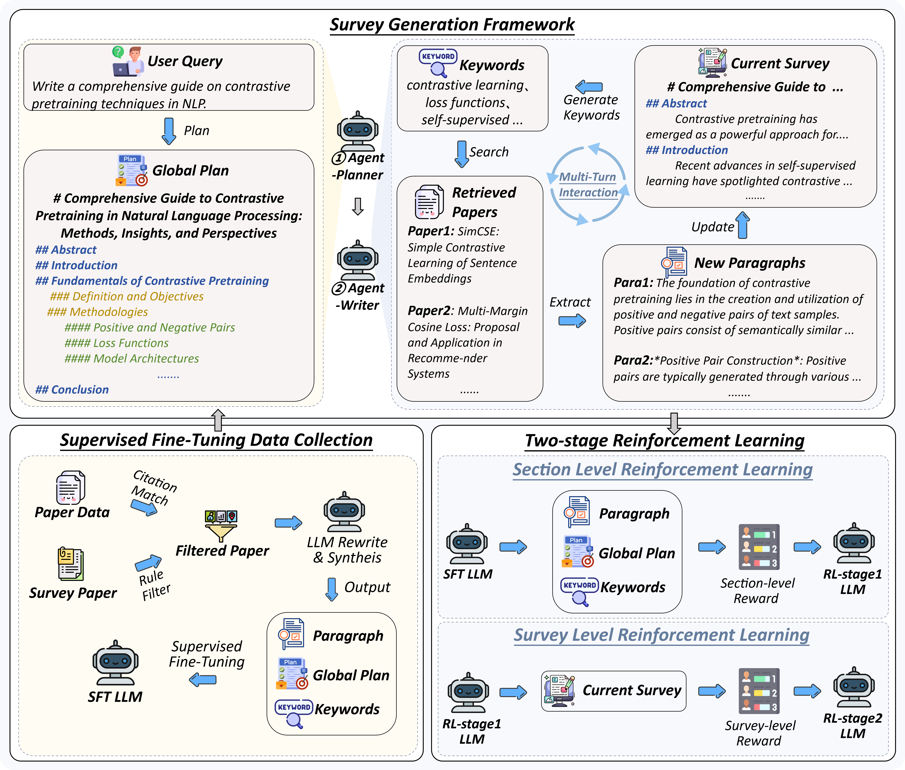

<div align="center">
  </img>
</div>
<p align="center">
    【English | <a href="README.md">中文</a>】
</p>

<p align="center">
  <a href="https://huggingface.co/openbmb/MiniCPM4-Survey">Model</a> •
  <a href="https://arxiv.org/abs/????">Technical Report</a>
</p>

## News

* [2025-06-05] 🚀🚀🚀 We have open-sourced **MiniCPM4-Survey**, a model built upon MiniCPM4-8B that is capable of generating trustworthy, long-form survey papers while maintaining competitive performance relative to significantly larger models.

## Overview

**MiniCPM4-Survey** is an open-source LLM agent model jointly developed by [THUNLP](https://nlp.csai.tsinghua.edu.cn), Renmin University of China and [ModelBest](https://modelbest.cn/en). Built on [MiniCPM4](https://github.com/OpenBMB/MiniCPM4) with 8 billion parameters, it accepts users' quiries as input and autonomously generate trustworthy, long-form survey papers.

Key features include:

- **Plan-Retrieve-Write Survey Generation Framework** — We propose a multi-agent generation framework, which operates through three core stages: planning (defining the overall structure of the survey), retrieval (generating appropriate retrieval keywords), and writing (synthesizing the retrieved information to generate coherent section-level content).

- **High-Quality Dataset Construction** — We gather and process lots of expert-written survey papers to construct a high-quality training dataset. Meanwhile, we collect a large number of research papers to build a retrieval database.

- **Multi-Aspect Reward Design** — We carefully design a reward system with three aspects (structure, content, and citations) to evaluate the quality of the surveys, which is used as the reward function in the RL training stage.

- **Multi-Step RL Training Strategy** — We propose a *Context Manager* to ensure retention of essential information while facilitating efficient reasoning, and we construct *Parallel Environment* to maintain efficient RL training cycles.  

**Demo Case**:


## Quick Start

### Download the model

Download [MiniCPM4-Survey](https://huggingface.co/openbmb/MiniCPM4-Survey) from Hugging Face and place it in `model/MiniCPM4-Survey`.
We recommend using [MiniCPM-Embedding-Light](https://huggingface.co/openbmb/MiniCPM-Embedding-Light) as the embedding model, which can be downloaded from Hugging Face and placed in `model/MiniCPM-Embedding-Light`.
### Perpare the environment

You can download the [paper data](https://www.kaggle.com/datasets/Cornell-University/arxiv) from Kaggle, then extract it. You can run `python dataset_process.py` to process the data and generate the retrieval database. Then you can run `python build_index.py` to build the retrieval database.

```
curl -L -o ~/Downloads/arxiv.zip\
   https://www.kaggle.com/api/v1/datasets/download/Cornell-University/arxiv
unzip ~/Downloads/arxiv.zip -d .
mkdir data
python ./src/preprocess/dataset_process.py
mkdir index
python ./src/preprocess/build_index.py
```

### Model Inference

You can run the following command to build the retrieval environment and start the inference:

```bash
python ./src/retriever.py
bash ./scripts/run.sh
```

If you want to run with the frontend, you can run the following command:

```bash
python ./src/retriever.py
bash ./scripts/run_with_frontend.sh
cd frontend/minicpm4-survey
npm install
npm run dev
```

Then you can visit `http://localhost:5173` in your browser to use the model.

## Performance Evaluation

| Method                                      | Relevance | Coverage | Depth | Novelty | Avg.  | Fact Score |
|---------------------------------------------|-----------|----------|-------|---------|-------|------------|
| Naive RAG (driven by G2FT)                  | 3.25      | 2.95     | 3.35  | 2.60    | 3.04  | 43.68      |
| AutoSurvey (driven by G2FT)                 | 3.10      | 3.25     | 3.15  | **3.15**| 3.16  | 46.56      |
| Webthinker (driven by WTR1-7B)              | 3.30      | 3.00     | 2.75  | 2.50    | 2.89  | --         |
| Webthinker (driven by QwQ-32B)              | 3.40      | 3.30     | 3.30  | 2.50    | 3.13  | --         |
| OpenAI Deep Research (driven by GPT-4o)     | 3.50      |**3.95**  | 3.55  | 3.00    | **3.50**  | --         |
| MiniCPM4-Survey                            | 3.45      | 3.70     | **3.85** | 3.00    | **3.50**  | **68.73**  |
| &nbsp;&nbsp;&nbsp;*w/o* RL                  | **3.55**  | 3.35     | 3.30  | 2.25    | 3.11  | 50.24      |

*Performance comparison of the survey generation systems. "G2FT" stands for Gemini-2.0-Flash-Thinking, and "WTR1-7B" denotes Webthinker-R1-7B. FactScore evaluation was omitted for Webthinker, as it does not include citation functionality, and for OpenAI Deep Research, which does not provide citations when exporting the results.*
