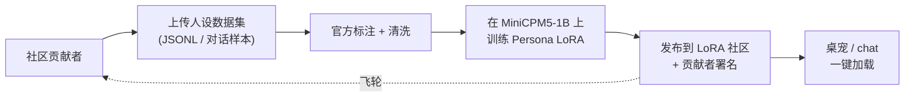

# MiniCPM5 人设 LoRA 社区 — 贡献者指南

> *English: [`PERSONA_LORA_HUB-en.md`](./PERSONA_LORA_HUB-en.md)*

**MiniCPM5 人设 LoRA 社区**是一个社区驱动的平台：任何人都可以上传一份人设数据集，由我们**完成标注、训练并以 LoRA 形式发布在 MiniCPM5-1B 之上**，并在社区中署名你的贡献。

- **社区入口**：[openbmb/minicpm5-persona-lora-hub](https://huggingface.co/spaces/openbmb/minicpm5-persona-lora-hub)（即将开放 — TODO 替换占位）
- **基座模型**：[openbmb/MiniCPM5-1B](https://huggingface.co/openbmb/MiniCPM5-1B)
- **License**：贡献数据集需为 Apache-2.0 / CC-BY-4.0 / CC0 / 公有领域兼容

## 为什么做这件事

1B 级模型天然契合**端侧、长在线、人格鲜明的 agent**——桌宠、角色扮演伙伴、品牌客服形象、虚构 NPC。基座 assistant 无法一次性承载所有性格，但一个 ~5–20MB 的 LoRA adapter 可以；只要有数据，**任何人**都可以把一个性格做出来。

社区做的是社交协作层：贡献者出数据，我们出 GPU 与训练流水线，社区获得源源不断、开箱即用的免费人设，可以直接用于 [`minicpm-pet-bridge`](https://github.com/OpenBMB/minicpm-pet-bridge)、chat UI 与下游应用。

## 工作流



1. 在社区入口（或以 HF dataset PR 形式）**提交**原始人设数据。
2. 我们在 ~5 个工作日内**审核**。是否接收取决于体量、质量、原创度与 license。
3. 我们对数据做**标注 / 清洗**，构造与 SFT recipe 兼容的指令混合。
4. 我们用 TRL + PEFT（assistant-only loss，参见底层 recipe [`finetune/trl.md`](./finetune/trl.md)）在 `MiniCPM5-1B` 上**训练 LoRA**。
5. 我们把 LoRA **发布**到社区，model card 上**按你提供的 handle 署名**并链接原数据集。
6. LoRA 可以**立即**在 [`minicpm-pet-bridge`](https://github.com/OpenBMB/minicpm-pet-bridge)、任何 [deploy skill](../skills/)、或任何 TRL/PEFT 兼容的运行时里加载使用。

## 数据集格式

我们接受两种结构，按你的原始素材选最贴近的：

### A. Chat 形式 JSONL（推荐）

每行一个 JSON 对象，是 OpenAI 风格的 messages 数组。`system` 字段可选但**强烈建议**——它是人设语气的最直接抓手。

```json
{"messages": [
  {"role": "system",    "content": "你是 Neko，一只活泼的猫娘，每句话结尾都会加 ~nya。"},
  {"role": "user",      "content": "今天天气真好。"},
  {"role": "assistant", "content": "嗯嗯～阳光暖暖的，最适合在窗台上打盹儿了喵～"}
]}
```

要求：

- 至少 **300** 轮在角色内的对话（越多越好；单个 LoRA 我们上限取 ~5k）。
- 单个文件**只装一个**人设。
- 不含真实人物的可识别个人信息。
- UTF-8，无 BOM，每行一个 JSON 对象，不要有尾逗号。

### B. 预训练形式 JSONL（用于设定 / 旁白）

```json
{"text": "Neko 的全名是 Neko Tanaka。她住在秋叶原的窗台上……"}
```

适合人设小传、世界观、独白等。我们会在清洗阶段把这些转成指令对。

## 提交方式

1. Fork [openbmb/minicpm5-persona-lora-hub](https://huggingface.co/spaces/openbmb/minicpm5-persona-lora-hub)（URL 待定），把数据集放到 `datasets/<你的人设名>/`，并附上 `README.md` 含：
   - 人设名、一行 tagline、用途（桌宠 / 角色扮演 / 客服 / …）
   - 你的姓名 / handle 与希望的署名方式
   - 数据来源说明（如果是衍生作品）
   - license（见下方"License"）
2. 在社区提一个 PR。
3. 我们在 ~5 个工作日内 review。被接收的会进训练队列。

## 署名规则

当我们用你的数据训出 LoRA 并发布：

- LoRA 的 HF model card 在 **Contributors** 下列出你的 handle 与你指定的链接（GitHub / HF / X / 博客 …）。
- 社区主页"Built from community datasets"表格中包含该 LoRA 并署名。
- 训练命令 + 数据配比从社区即可复现——你的数据之上没有任何不公开的后处理。

## License

- 数据集需为 **Apache-2.0**、**CC-BY-4.0**、**CC0** 或**公有领域**。
- 衍生自有版权素材（歌词 / 小说 / 影视 / …）的数据集**即便你持有正版**也会被拒。拿不准就自己写对话。
- 已发布的 LoRA 继承基座模型的 [Apache-2.0](https://github.com/OpenBMB/MiniCPM/blob/main/LICENSE) license。

## 首发示例

[`lora_nekoqa_adapter`](https://huggingface.co/openbmb/minicpm5-persona-lora-hub)（URL 待定）—— 猫娘 chat 人设，基于社区贡献的数据集。`minicpm-pet-bridge` 默认主题之一。

## 问答

在 [OpenBMB/MiniCPM](https://github.com/OpenBMB/MiniCPM/issues) 开 issue 并加上 `persona-lora-hub` 标签，或在 [Discord](https://discord.gg/3cGQn9b3YM) 里找我们。
