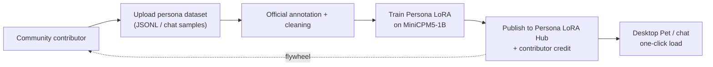

# MiniCPM5 Persona LoRA Hub — Contributor Guide

> *中文版：[`PERSONA_LORA_HUB-cn.md`](./PERSONA_LORA_HUB-cn.md)*

The **MiniCPM5 Persona LoRA Hub** is a community-driven space where anyone can contribute a persona dataset, get it **labeled and trained by us into a published LoRA on top of MiniCPM5-1B**, and have their contribution credited on the hub.

- **Hub**: [openbmb/minicpm5-persona-lora-hub](https://huggingface.co/spaces/openbmb/minicpm5-persona-lora-hub) *(coming soon — TODO replace placeholder)*
- **Base model**: [openbmb/MiniCPM5-1B](https://huggingface.co/openbmb/MiniCPM5-1B)
- **License**: contributed datasets must be Apache-2.0 / CC-BY-4.0 / CC0 / public-domain compatible

## Why this exists

1B-class models are uniquely well suited to **on-device, always-on, personality-rich agents**: desktop pets, role-play companions, branded customer service avatars, fictional NPCs. The base assistant cannot capture all of these personalities at once, but a small (~5–20 MB) LoRA adapter can — and *anyone* can ship one if they have the data.

The hub is the social layer: contributors bring data, we bring the GPU and training pipeline, the community gets a steady stream of free, plug-and-play personalities for [`minicpm-pet-bridge`](https://github.com/OpenBMB/minicpm-pet-bridge), chat UIs, and downstream apps.

## Workflow



1. **Submit** your raw persona data via the hub (or as a HF dataset PR).
2. We **review** it within ~5 working days. Acceptance is based on size, quality, originality and license.
3. We **label / clean** the data, building an instruction-tuned mixture compatible with our SFT recipe.
4. We **train** a LoRA on `MiniCPM5-1B` using TRL + PEFT (assistant-only loss; see [`finetune/trl.md`](./finetune/trl.md) for the underlying recipe).
5. We **publish** the LoRA back to the hub with a model card that **credits you by name / handle** and links the source dataset.
6. The LoRA is **immediately usable** in [`minicpm-pet-bridge`](https://github.com/OpenBMB/minicpm-pet-bridge), any of our [deploy skills](../skills/), or any TRL/PEFT-compatible runtime.

## Dataset format

We accept two shapes; pick whichever maps more naturally to your source material.

### A. Chat-style JSONL (preferred)

One JSON object per line, each is an OpenAI-style messages array. `system` is optional but **strongly recommended** as it is the primary handle for the persona's voice.

```json
{"messages": [
  {"role": "system",    "content": "You are Neko, a cheerful cat-girl who ends every sentence with ~nya."},
  {"role": "user",      "content": "今天天气真好。"},
  {"role": "assistant", "content": "嗯嗯～阳光暖暖的，最适合在窗台上打盹儿了喵～"}
]}
```

Guidelines:

- ≥ **300** turns of in-character dialogue (more is better; we cap at ~5k for a single LoRA).
- Avoid mixing personas in a single file — one persona per dataset.
- Free of personally identifying information of real people.
- UTF-8, no BOM, one JSON object per line, no trailing commas.

### B. Pretrain-style JSONL (for narration / lore)

```json
{"text": "Neko's full name is Neko Tanaka. She lives on a windowsill in Akihabara and..."}
```

Useful for character bios, world-building, monologues. We will convert these into instruction pairs during the cleaning step.

## Submission

1. Fork [openbmb/minicpm5-persona-lora-hub](https://huggingface.co/spaces/openbmb/minicpm5-persona-lora-hub) *(URL TBD)* and add your dataset under `datasets/<your-persona-name>/`, plus a `README.md` with:
   - persona name, one-line tagline, intended use (pet / role-play / customer-service / …)
   - your name / handle and how you want to be credited
   - source attribution if the data is derivative
   - license (see "License" below)
2. Open a PR on the hub.
3. We comment within ~5 working days. If accepted, we move it into our training queue.

## Attribution policy

When we publish a LoRA built from your dataset:

- The LoRA's HF model card lists you under **Contributors** with your handle and a link of your choice (GitHub, HF, X, blog…).
- The hub's index page includes the LoRA in a "Built from community datasets" table with the same credit.
- The training command + data mix are reproducible from the hub — there is no proprietary post-processing on top of your data.

## License

- Datasets must be licensed under **Apache-2.0**, **CC-BY-4.0**, **CC0** or **public domain**.
- Datasets derived from copyrighted source material (lyrics, novels, films, …) will be rejected even if you "own a copy". When in doubt, write your own dialogue.
- All published LoRAs inherit the base model's [Apache-2.0](https://github.com/OpenBMB/MiniCPM/blob/main/LICENSE) license.

## First example

[`lora_nekoqa_adapter`](https://huggingface.co/openbmb/minicpm5-persona-lora-hub) *(URL TBD)* — a cat-girl chat persona trained on a community-contributed dataset. Ships pre-loaded in `minicpm-pet-bridge` as a default theme.

## Questions

Open an issue at [OpenBMB/MiniCPM](https://github.com/OpenBMB/MiniCPM/issues) with the `persona-lora-hub` label, or ping us in the [Discord](https://discord.gg/3cGQn9b3YM).
