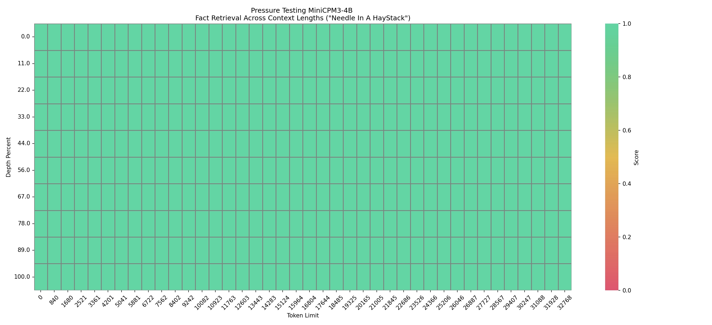

<div align="center">
</img> 
</div>

<h4 align="center">
    <p>
        <b>中文</b> | <a href="README-minicpm3-en.md">English</a>
    <p>
</h4>

# MiniCPM 3.0

MiniCPM 3.0 是一个 4B 参数量的语言模型，相比 MiniCPM1.0/2.0，功能更加全面，综合能力大幅提升，多数评测集上的效果比肩甚至超越众多 7B-9B 模型。

* **支持工具调用🛠️（Function Calling）和代码解释器💻（Code Interpreter）**：[Berkeley Function Calling Leaderboard (BFCL)](https://gorilla.cs.berkeley.edu/leaderboard.html) 上取得 9B 规模以下 SOTA，超越 GLM-4-9B-Chat、Qwen2-7B-Instruct。
* **超强的推理能力🧮**：数学能力方面，[MathBench](https://open-compass.github.io/MathBench/) 上的效果超越 GPT-3.5-Turbo 以及多个 7B-9B 模型。在非常具有挑战性的 [LiveCodeBench](https://livecodebench.github.io/) 上，效果超越 Llama3.1-8B-Instruct。
* **出色的中英文指令遵循能力🤖**：英文指令遵循 [IFEval](https://huggingface.co/datasets/google/IFEval)、中文指令遵循 [FollowBench-zh](https://huggingface.co/datasets/YuxinJiang/FollowBench) 效果超越 GLM-4-9B-Chat、Qwen2-7B-Instruct。
* **长文本能力**：原生支持 32k 上下文长度，32k 长度内大海捞针全绿。提出 [LLMxMapReduce](https://github.com/thunlp/LLMxMapReduce) ，理论可处理的上下文长度达到 +∞，在综合性长文本评测基准 [InfiniteBench](https://github.com/OpenBMB/InfiniteBench) 平均得分超越GPT-4、KimiChat等标杆模型。
* **RAG能力**：我们发布了 [MiniCPM RAG 套件](https://huggingface.co/collections/openbmb/minicpm-rag-suite-66d976b4204cd0a4f8beaabb)。基于 MiniCPM 系列模型的 [MiniCPM-Embedding](https://huggingface.co/openbmb/MiniCPM-Embedding)、[MiniCPM-Reranker](https://huggingface.co/openbmb/MiniCPM-Reranker) 在中文、中英跨语言检索测试中取得 SOTA 表现；针对 RAG 场景的 [MiniCPM3-RAG-LoRA](https://huggingface.co/openbmb/MiniCPM3-RAG-LoRA) 在开放域问答等多项任务上超越 Llama3-8B、Baichuan2-13B 等模型。

## 评测结果

### 综合评测

<table>
    <tr>
        <td>评测集</td>
        <td>Qwen2-7B-Instruct</td>
        <td>GLM-4-9B-Chat</td>
        <td>Gemma2-9B-it</td>
        <td>Llama3.1-8B-Instruct</td>
        <td>GPT-3.5-Turbo-0125</td>
        <td>Phi-3.5-mini-Instruct(3.8B)</td>
        <td>MiniCPM3-4B </td>
    </tr>
    <tr>
        <td colspan="15" align="left"><strong>英文能力</strong></td>
    </tr>
    <tr>
        <td>MMLU</td>
        <td>70.5</td>
        <td>72.4</td>
        <td>72.6</td>
        <td>69.4</td>
        <td>69.2</td>
        <td>68.4</td>
        <td>67.2 </td>
    </tr>
    <tr>
        <td>BBH</td>
        <td>64.9</td>
        <td>76.3</td>
        <td>65.2</td>
        <td>67.8</td>
        <td>70.3</td>
        <td>68.6</td>
        <td>70.2 </td>
    </tr>
    <tr>
        <td>MT-Bench</td>
        <td>8.41</td>
        <td>8.35</td>
        <td>7.88</td>
        <td>8.28</td>
        <td>8.17</td>
        <td>8.60</td>
        <td>8.41 </td>
    </tr>
    <tr>
        <td>IFEVAL (Prompt Strict-Acc.)</td>
        <td>51.0</td>
        <td>64.5</td>
        <td>71.9</td>
        <td>71.5</td>
        <td>58.8</td>
        <td>49.4</td>
        <td>68.4 </td>
    </tr>
    <tr>
        <td colspan="15" align="left"><strong>中文能力</strong></td>
    </tr>
    <tr>
        <td>CMMLU</td>
        <td>80.9</td>
        <td>71.5</td>
        <td>59.5</td>
        <td>55.8</td>
        <td>54.5</td>
        <td>46.9</td>
        <td>73.3 </td>
    </tr>
    <tr>
        <td>CEVAL</td>
        <td>77.2</td>
        <td>75.6</td>
        <td>56.7</td>
        <td>55.2</td>
        <td>52.8</td>
        <td>46.1</td>
        <td>73.6 </td>
    </tr>
    <tr>
        <td>AlignBench v1.1</td>
        <td>7.10</td>
        <td>6.61</td>
        <td>7.10</td>
        <td>5.68</td>
        <td>5.82</td>
        <td>5.73</td>
        <td>6.74 </td>
    </tr>
    <tr>
        <td>FollowBench-zh (SSR)</td>
        <td>63.0</td>
        <td>56.4</td>
        <td>57.0</td>
        <td>50.6</td>
        <td>64.6</td>
        <td>58.1</td>
        <td>66.8 </td>
    </tr>
    <tr>
        <td colspan="15" align="left"><strong>数学能力</strong></td>
    </tr>
    <tr>
        <td>MATH</td>
        <td>49.6</td>
        <td>50.6</td>
        <td>46.0</td>
        <td>51.9</td>
        <td>41.8</td>
        <td>46.4</td>
        <td>46.6 </td>
    </tr>
    <tr>
        <td>GSM8K</td>
        <td>82.3</td>
        <td>79.6</td>
        <td>79.7</td>
        <td>84.5</td>
        <td>76.4</td>
        <td>82.7</td>
        <td>81.1 </td>
    </tr>
    <tr>
        <td>MathBench</td>
        <td>63.4</td>
        <td>59.4</td>
        <td>45.8</td>
        <td>54.3</td>
        <td>48.9</td>
        <td>54.9</td>
        <td>65.6 </td>
    </tr>
    <tr>
        <td colspan="15" align="left"><strong>代码能力</strong></td>
    </tr>
    <tr>
        <td>HumanEval+</td>
        <td>70.1</td>
        <td>67.1</td>
        <td>61.6</td>
        <td>62.8</td>
        <td>66.5</td>
        <td>68.9</td>
        <td>68.3 </td>
    </tr>
    <tr>
        <td>MBPP+</td>
        <td>57.1</td>
        <td>62.2</td>
        <td>64.3</td>
        <td>55.3</td>
        <td>71.4</td>
        <td>55.8</td>
        <td>63.2 </td>
    </tr>
    <tr>
        <td>LiveCodeBench v3</td>
        <td>22.2</td>
        <td>20.2</td>
        <td>19.2</td>
        <td>20.4</td>
        <td>24.0</td>
        <td>19.6</td>
        <td>22.6 </td>
    </tr>
    <tr>
        <td colspan="15" align="left"><strong>工具调用能力</strong></td>
    </tr>
    <tr>
        <td>BFCL v2</td>
        <td>71.6</td>
        <td>70.1</td>
        <td>19.2</td>
        <td>73.3</td>
        <td>75.4</td>
        <td>48.4</td>
        <td>76.0 </td>
    </tr>
    <tr>
        <td colspan="15" align="left"><strong>综合能力</strong></td>
    </tr>
    <tr>
        <td>平均分</td>
        <td>65.3</td>
        <td>65.0</td>
        <td>57.9</td>
        <td>60.8</td>
        <td>61.0</td>
        <td>57.2</td>
        <td><strong>66.3</strong></td>
    </tr>
</table>

### 工具调用能力

我们在 [Berkeley Function Calling Leaderboard (BFCL)](https://gorilla.cs.berkeley.edu/leaderboard.html) 上测试了模型的工具调用能力，MiniCPM3-4B 在该榜单上的表现超越了多个 7B-9B 参数量的模型，优于 GPT-3.5-Turbo-0125。

<table>
    <tr>
        <td>模型</td>
        <td>总体准确率</td>
        <td>AST Summary</td>
        <td>Exec Summary</td>
        <td>Irrelevance Detection</td>
        <td>Relevance Detection </td>
    </tr>
    <tr>
        <td>MiniCPM3-4B</td>
        <td>76.03%</td>
        <td>68.55%</td>
        <td>85.54%</td>
        <td>53.71%</td>
        <td>90.24% </td>
    </tr>
    <tr>
        <td>Llama3.1-8B-Instruct</td>
        <td>73.28%</td>
        <td>64.61%</td>
        <td>86.48%</td>
        <td>43.12%</td>
        <td>85.37% </td>
    </tr>
    <tr>
        <td>Qwen2-7B-Instruct</td>
        <td>71.61%</td>
        <td>65.71%</td>
        <td>79.57%</td>
        <td>44.70%</td>
        <td>90.24% </td>
    </tr>
    <tr>
        <td>GLM-4-9B-Chat</td>
        <td>70.08%</td>
        <td>60.69%</td>
        <td>80.02%</td>
        <td>55.02%</td>
        <td>82.93% </td>
    </tr>
    <tr>
        <td>Phi-3.5-mini-instruct</td>
        <td>48.44%</td>
        <td>38.89%</td>
        <td>54.04%</td>
        <td>46.78%</td>
        <td>65.85% </td>
    </tr>
    <tr>
        <td>Gemma2-9B-it</td>
        <td>19.18%</td>
        <td>5.41%</td>
        <td>18.50%</td>
        <td>88.88%</td>
        <td>7.32%</td>
    </tr>
</table>

### 长文本能力

在 32k 的上下文长度进行[大海捞针](https://github.com/gkamradt/LLMTest_NeedleInAHaystack)测试，结果如下图：



同时我们提出[LLMxMapReduce](https://github.com/thunlp/LLMxMapReduce)，利用分治的策略，理论上可以处理无限长度的文本。我们在[InfiniteBench](https://github.com/OpenBMB/InfiniteBench)上测试了模型的长文本处理能力，在LLMxMapReduce框架的加持下，MiniCPM3-4B在这个榜单的平均得分能够超越 GPT-4、KimiChat 等标杆模型。

|                               | Context length| Qwen2-70b | Kimi-Chat(2024.06) | GPT-4 (From InfiniteBench) | MiniCPM 3.0 x MR | Qwen2-70b x MR | Llama3-70bx MR |
| ----------------------------- | ---------- | --------- | ------------------ | -------------------------- | --------------- | ------------ | ------------- |
| Math.Find                     | 87.9k      | 59.71%    | 18.57%             | 60.00%                     | 83.43%          | 54.29%       | **91.43%**        |
| Retrieve.KV                   | 89.9k      | 29.00%    | 69.20%             | 89.00%                     | 93.80%          | 98.80%       | **98.89%**        |
| En.Dia                        | 103.6K     | 23.00%    | 23.00%             | 7.50%                      | 12.50%          | **46.50%**       | 17.50%        |
| Code.Debug                    | 114.7k     | 45.43%    | 38.32%             | 54.31%                     | 25.63%          | 54.82%       | **62.94%**       |
| Retrieve.Number               | 122.4k     | **100.00%**  | 97.45%             | **100.00%**                   | 99.32%          | **100.00%**     | 99.79%        |
| Retrieve.PassKey              | 122.4k     | **100.00%**   | 99.32%             | **100.00%**                   | 98.81%          | **100.00%**     | **100.00%**      |
| En.Sum                        | 171.5K     | 31.85%    | 29.94%             | 14.73%                     | 25.89%          | **32.39%**       | 30.63%        |
| En.MC                         | 184.4k     | 81.66%    | 79.91%             | 68.12%                     | 66.38%          |**83.84%**      | 82.10%        |
| En.QA        | 192.6k     | 21.97%    | 18.80%             | 22.44%                     | 28.39%          | 23.13%       | **34.70%**      |
| Zh.QA        | 2068.6k    | 21.40%    | 19.84%             | **25.96%**                    | 23.66%          | 19.10%       | N/A           |
| avg w/o Zh.QA | /          | 51.92%    | 52.96%             | 55.33%                     | 59.29%          | 64.98%       | **68.64%**        |
| avg                           | /          | 48.86%    | 49.65%             | 52.39%                     | 55.55%          | **60.39%**       | N/A           |

## 模型推理

### Huggingface
```python
from transformers import AutoModelForCausalLM, AutoTokenizer
import torch
torch.manual_seed(0)

path = 'openbmb/MiniCPM3-4B'
tokenizer = AutoTokenizer.from_pretrained(path)
model = AutoModelForCausalLM.from_pretrained(path, torch_dtype=torch.bfloat16, device_map='cuda', trust_remote_code=True)

responds, history = model.chat(tokenizer, "请写一篇关于人工智能的文章，详细介绍人工智能的未来发展和隐患。", temperature=0.7, top_p=0.7)
print(responds)
```

### SGLang（推荐）
* 安装

参考 SGLang [官方仓库](ttps://github.com/sgl-project/sglang)，通过*源码*安装最新版本。

* 启动推理服务
```shell
python -m sglang.launch_server --model openbmb/MiniCPM3-4B --trust-remote-code --port 30000 --chat-template chatml
```

* 使用示例
```python
from sglang import function, system, user, assistant, gen, set_default_backend, RuntimeEndpoint

@function
def multi_turn_question(s, question_1, question_2):
    s += user(question_1)
    s += assistant(gen("answer_1", max_tokens=1024))
    s += user(question_2)
    s += assistant(gen("answer_2", max_tokens=1024))

set_default_backend(RuntimeEndpoint("http://localhost:30000"))

state = multi_turn_question.run(
    question_1="介绍一下人工智能",
    question_2="写一篇关于它的文章",
)

for m in state.messages():
    print(m["role"], ":", m["content"])
```

### vLLM
* 安装 vllm
  ```shell
  pip install "vllm>=0.6.2"
  ```
* 推理
  ```python
  from transformers import AutoTokenizer
  from vllm import LLM, SamplingParams

  model_name = "openbmb/MiniCPM3-4B"
  prompt = [{"role": "user", "content": "请写一篇关于人工智能的文章，详细介绍人工智能的未来发展和隐患。"}]

  tokenizer = AutoTokenizer.from_pretrained(model_name, trust_remote_code=True)
  input_text = tokenizer.apply_chat_template(prompt, tokenize=False, add_generation_prompt=True)

  llm = LLM(model=model_name,
      trust_remote_code=True,
      tensor_parallel_size=1
  )
  sampling_params = SamplingParams(top_p=0.7, temperature=0.7, max_tokens=1024)

  outputs = llm.generate(prompts=input_text, sampling_params=sampling_params)

  print(outputs[0].outputs[0].text)
  ```

### llama.cpp

我们提供了 MiniCPM3 的 [GGUF 版本](https://huggingface.co/openbmb/MiniCPM3-4B-GGUF)，可以直接使用 llama.cpp 推理。

* 安装 llama.cpp
  ```shell
    git clone https://github.com/ggerganov/llama.cpp
    cd llama.cpp
    make 
  ```
* 推理
  ```shell
  ./llama-cli -c 1024 -m minicpm3-4b-fp16.gguf -n 1024 --top-p 0.7 --temp 0.7 --prompt "<|im_start|>user\n请写一篇关于人工智能的文章，详细介绍人工智能的未来发展和隐患。<|im_end|>\n<|im_start|>assistant\n"
  ```

## 模型微调
### LLaMA-Factory
目前模型微调支持 [LLaMA-Factory](https://github.com/hiyouga/LLaMA-Factory)，使用方法参考 [LLaMA-Factory 微调](https://modelbest.feishu.cn/docx/Z7USdW4lloZzkZxQ14icJ3senjb?from=from_copylink)。

## 进阶功能

对于以下进阶功能，我们的样例代码中使用 [vLLM](#vllm) 进行推理。

### 工具调用

我们提供了使用 MiniCPM3 调用工具的示例代码：

```bash
cd demo/minicpm3/function_call
python function_call.py
```

如果你想启动一个能够调用工具的推理服务，使用以下代码：

```bash
cd demo/minicpm3/function_call
pip install -r requirements.txt
python openai_api_server.py \
    --model openbmb/MiniCPM3-4B \
    --served-model-name MiniCPM3-4B \
    --chat-template chatml.jinja \
    --dtype auto \
    --api-key token-abc123 \
    --tensor-parallel-size 1 \
    --trust-remote-code
```

下面是一个调用搜索工具回答问题的演示：


### 代码解释器

我们提供了一个 MiniCPM3 使用代码解释器的示例代码：

```bash
cd demo/minicpm3/code_interpreter
pip install -r requirements.txt
python code_interpreter.py openbmb/MiniCPM3-4B
```

下面是一个使用代码解释器生成二维码的演示：


